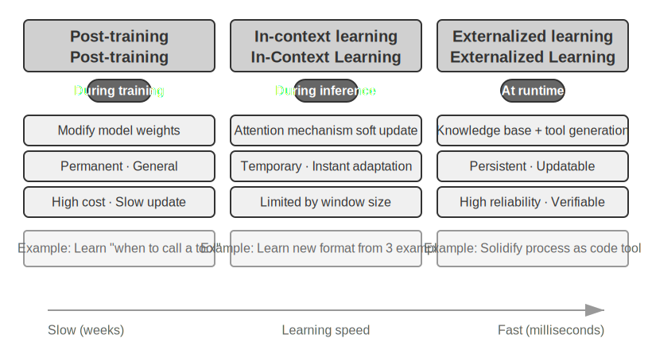
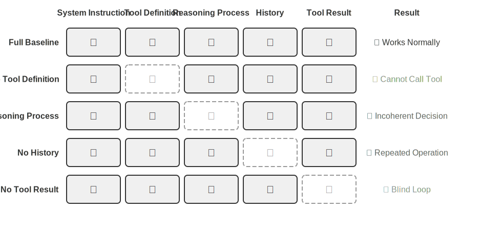
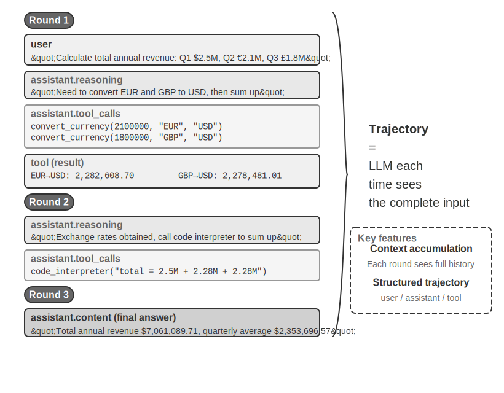
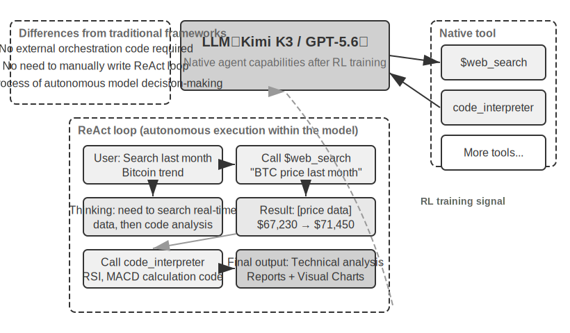
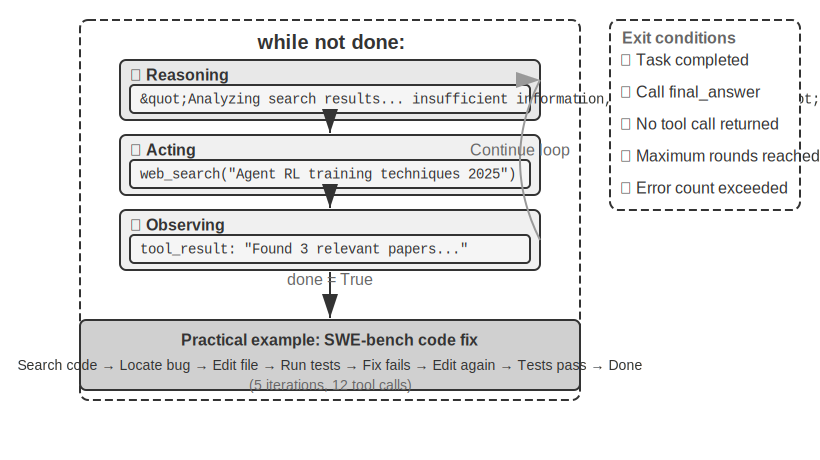

# Getting Started with AI Agents

If you've used Cursor to write code, watching it search your codebase, edit multiple files, and run tests until they pass; used Deep Research to investigate a topic, watching it repeatedly search, read, and synthesize a comprehensive report; used Manus to control a browser and complete online tasks for you; asked the Doubao phone assistant to book tickets or send messages on your phone; or had Pine AI call your telecom provider to negotiate a lower bill—you've already been using AI Agents.

These products come in various forms, but they share a common trait: they are no longer passive conversations where "you ask, it answers." Instead, they are intelligent systems that can autonomously plan execution steps, call various tools to complete tasks, and continuously adjust strategies based on results. AI Agents are becoming a new way for us to interact with computers.

This chapter will guide you from hands-on practice to understanding the core components of AI Agents. We'll directly experience the capabilities of modern Agents, understand the architectural principles behind them, and master the design patterns and best practices for building Agent systems.

> **Reading Tip**: This chapter serves as the conceptual map for the entire book—it quickly introduces the core formula, operational loop, engineering framework, and design patterns of Agents, providing a unified terminology and reference coordinate system for subsequent chapters. Don't try to memorize every concept on your first read; instead, build a general impression first. Each subsequent chapter will elaborate on one aspect mentioned here, and you can always come back to this chapter for reference.

## Modern Agent = LLM + Context + Tools

The essence of modern Agent systems can be expressed with a concise formula: **Agent = LLM (Large Language Model) + Context + Tools**. This formula is simple and practical, but each term needs to be understood broadly:

- **LLM is the Agent's brain**: It's not just a set of model parameters, but the entire decision-making core of the Agent—understanding intent, thinking, planning, and making judgments. Just as the human brain is more than a collection of neurons, including ways of thinking shaped by experience, the LLM's capabilities come from two parts: the world knowledge and language abilities accumulated through **pre-training**, and the decision-making strategies solidified through **post-training**—the specific techniques of the latter (such as supervised fine-tuning and reinforcement learning) will be expanded in Chapter 7.
- **Context is the Agent's eyes**: It's not just the text input to the model, but all the information the Agent can see at each decision point—environmental information, user memory, domain knowledge, its own state, and task progress. Just as humans need to see the current situation, recall relevant experiences, and consult reference materials when making decisions, the Agent's context window is everything it can see at that moment.
- **Tools are the Agent's hands and feet**: They're not just a few callable API functions, but the entire set of things the Agent can do—from predefined tool calls to on-demand loading of specialized skills (Skills), from dynamically generating code to create new capabilities to delegating to sub-agents for collaboration, from proactively communicating with users to responding to external events.

Put more intuitively: **Agent = Brain + Eyes + Hands and Feet**. The brain is responsible for thinking and decision-making, the eyes provide all the information needed for thinking, and the hands and feet translate decisions into changes in the real world.

These three components correspond exactly to three core concepts in RL (see Chapter 7). The following table is **optional reading**—if you don't have an RL background, feel free to skip it; it won't affect your understanding. It's only meant to help readers with RL backgrounds map their existing knowledge to the terminology of this book:

| Intuitive Understanding | Implementation Component | Academic Concept (Optional) | Meaning |
|---------|---------|---------|------|
| **Brain** | LLM | **Policy** | The decision-making logic that determines "what to do next"—given the current information, choose the most appropriate action from all available options |
| **Eyes** | Context | **Observation Space** | All the information the Agent can see—what it can see, read, remember, and which systems it can access |
| **Hands and Feet** | Tools | **Action Space** | The complete set of things the Agent can do—what "means" are available, from sending messages to executing code to controlling interfaces |

Understanding the roles of these three components and their interrelationships is the foundation for building effective Agent systems. We'll start with the most concrete component—tools (hands and feet)—and gradually delve into the brain (LLM) and eyes (context). Let's first look at how different types of Agents operate across these three dimensions:

| Agent Product | Eyes (Perception) | Hands and Feet (Action) | Strategy |
|---------|------|---------|------|
| **Coding Agents (e.g., Cursor)** | Requirements documents, codebase, terminal environment | Open-ended (internal reasoning, code search, file read/write, command execution, etc.) | Incremental development: understand requirements → search relevant code → edit code → test and verify → debug and fix |
| **Search Agents (e.g., Deep Research)** | Web resources, academic databases, local files | Open-ended (internal reasoning, search queries, web reading, summary generation) | Iterative deepening: adjust search direction based on existing information, gradually synthesize a complete report |
| **Computer Control Agents (e.g., Manus)** | Computer screen, browser pages, file system | Open-ended (internal reasoning, clicking, typing, scrolling, screenshots, code execution, etc.) | Visual perception + operation: observe screen → identify target elements → perform actions → verify results |
| **Phone Assistant Agents (e.g., Doubao)** | Phone screen, installed apps | Open-ended (internal reasoning, clicking, swiping, typing, opening apps, etc.) | Intent understanding + App control: understand user needs → locate target app → perform actions → confirm completion |
| **Personal Task Agents (e.g., Pine AI)** | User account information, historical bills, service provider knowledge base | Open-ended (internal reasoning, making calls, sending emails, filling forms, confirming with user) | Multi-step task execution: gather information → formulate negotiation strategy → contact service provider → negotiate → report results |

These Agent systems share several common features: they all use **open-ended action spaces**—not choosing from a limited set of buttons, but generating arbitrary natural language and code; they all can **think internally**—planning and reasoning before taking action; and they all can **interact continuously**—adjusting strategies based on environmental feedback. These capabilities come precisely from the synergy of the brain, eyes, and hands and feet—i.e., LLM, context, and tools.

### Tools: The Agent's Hands and Feet

Tools are the bridge for the Agent to interact with the external world, just like human hands and feet, allowing the Agent to transform from a passive observer into an active executor. Without tools, the Agent can only "talk on paper"; with tools, it can truly change the world.

To discuss tools systematically, we can categorize them into five types based on the direction of the Agent's interaction with the outside world. Let's quickly go through the representative scenarios for each type to build a general impression; subsequent chapters will elaborate on each one.

**Perception Tools** allow the Agent to access information: search engines provide real-time web data, file systems read local documents, and APIs and databases connect to external services and enterprise core data.

**Execution Tools** allow the Agent to change the world: code execution, file operations, system commands, external API calls—decisions are thus transformed into concrete actions.

**Collaboration Tools** allow the Agent to cooperate with other Agents: delegating sub-agents for specialized tasks, requesting human confirmation at key decision points, or coordinating actions in multi-agent systems.

**Event Trigger Tools** differ fundamentally from the first three categories in how they are invoked—they are not actively called by the Agent, but serve as external inputs that drive the Agent to start executing a task. For example, receiving a new email, reaching a scheduled time, or receiving a Webhook callback from another system—these events activate the Agent, prompting it to begin subsequent thinking and action. Although event triggers are not actively called by the Agent, they are one of the channels for the Agent to interact with the external world, so they are included in the broad tool system.

**User Communication Tools** are channels for the Agent to proactively connect with and convey information to the user. Unlike execution tools that change the external world, user communication tools focus on information transmission and interaction—conveying the Agent's execution progress or proactive care to the user through text messages, voice calls, emails, etc.

The complete classification system and design principles for the above five types of tools will be discussed in Chapter 4. The quality of tool design directly determines how far an Agent can go—if interface definitions are unclear, the model will misuse tools; if error handling is inadequate, tool failure can become a deadlock for the Agent; if permission controls are too broad, the consequences of an Agent error can be irreparable. The promotion of the MCP (Model Context Protocol) standard is making tool integration more like installing plugins—the ecosystem is expanding rapidly, but design principles remain timeless.

**Tool Calling** (also known as Function Calling) is a core capability of modern LLM Agents, allowing the model to call external tools in a structured way. This capability transforms the LLM from a pure text generator into an intelligent system capable of performing actual operations. This book will consistently use the term "tool calling" going forward.

The tool calling process consists of four steps: First, inform the model in the context about which tools are available (including their names, purposes, and parameters); then, the model autonomously decides whether to call a tool, which one to call, and what parameters to pass; next, after the tool executes, the result is appended to the context; finally, the model decides the next action based on the result. This loop is the foundation of ReAct, which will be introduced later.

Taking a weather query scenario as an example, the simplified representation of the four-step process at the API level is as follows:

```
Step 1: Declare tools                  Step 2: Model decides to call
tools: [{                             assistant: {
  name: "get_weather",                  tool_calls: [{
  parameters: {                           function: "get_weather",
    city: "string"                        arguments: {city: "Beijing"}
  }                                      }]
}]                                    }

Step 3: Result appended to context    Step 4: Model responds based on result
tool: {                               assistant: {
  tool_call_id: "call_1",               content: "Today in Beijing: 28°C, sunny."
  content: '{"temp":28,"sky":"clear"}'     }}
```

Developers only need to define tools and execute tool calls; the model autonomously completes the decision of "whether to call, which one to call, and what parameters to pass." Chapter 2 will elaborate on this API structure in detail.

When designing tools for an Agent, strive to keep them general-purpose, giving the LLM more room to operate. For example, instead of designing a dedicated calculator tool, provide a Python code interpreter and create a secure sandbox execution environment for the Agent. Instead of designing a tool for logging work notes, provide file read/write tools and create a virtual file system for the Agent. General-purpose tools allow the Agent to solve problems creatively by combining basic capabilities.

### LLM: The Agent's Brain

The Large Language Model (LLM) is the decision-making core of the Agent. Upon receiving a user request, it must first parse the true intent (what the user says is often not what they really want), then break down vague or complex tasks into executable steps. During execution, it must continuously make judgments: what to do next, whether to call a tool, which tool to call, and what parameters to pass. This "understand-plan-execute" capability comes from the knowledge accumulated during pre-training and is the foundation that both workflows and autonomous Agents rely on.

A unique capability of LLM Agents is **internal reasoning**—before taking actual action, the Agent can plan and reason. This process does not change the external environment but can significantly improve the quality of subsequent actions. The reason LLMs can perform effective internal reasoning is due to capabilities acquired during the pre-training phase (initial training on massive internet text, allowing the model to learn language patterns and world knowledge)—the reasoning the model follows is based on logical rules already embedded in human knowledge, including mathematical laws, causal relationships, problem decomposition strategies, etc. Therefore, the Agent's reasoning is not blind random exploration but unfolds on a structured knowledge system.
This structured reasoning capability allows LLM Agents to handle novel tasks directly—explained below through the concepts of zero-shot and few-shot. A direct manifestation of this capability is **Zero-shot Generalization**: even when faced with a task never seen before, the LLM Agent can handle it by combining existing knowledge, without needing any examples. For instance, you never taught it to write a poem about quantum physics, but it can generate a decent piece based on its existing language and physics knowledge.

Furthermore, LLM Agents can achieve **Few-shot Adaptation** with just a few examples—by providing two or three demonstration examples in the prompt, the model can master a new task pattern. For example, showing it a few "user comment -> sentiment label" examples allows it to learn sentiment classification for new comments. Simply put, zero-shot means "can do it without examples," and few-shot means "can learn it after seeing a few examples."

#### Model as Agent: When the Model Itself Becomes the Product

The "Model as Agent" paradigm represents the latest direction in AI Agent development. Advanced models internalize tool calling capabilities as native abilities through post-training (especially reinforcement learning): when to call a tool, which one to call, and what parameters to pass are all decided by the model itself, without manual orchestration. However, this does not mean the framework layer becomes less important. On the contrary, the more powerful the model, the more critical the Harness built around it becomes. The term Harness originally refers to the gear placed on a horse—the reins and tack—not to restrict the horse's running ability, but to guide that power in the right direction. In the Agent context, the model is the powerful but unpredictable horse, and the Harness is the engineering shell that channels its capabilities into reliable task execution. You can also think of it as the entire support system around a race car driver: seatbelt, track barriers, pit crew. The faster the driver (model), the more important this system becomes. In an Agent, the Harness includes infrastructure such as context management, tool interfaces, safety constraints, and verification and correction mechanisms (see the final section of this chapter).

The greater the model's autonomous decision-making space, the larger the potential impact of errors, thus requiring more refined constraints, verification, and correction mechanisms to ensure reliability. The true advantage of model vendors is not "making the framework thinner," but being able to co-optimize the model and the surrounding Harness, iterating continuously.

#### Agent Learning Mechanisms: Post-training, In-context Learning, and Externalized LearningEarlier we discussed how models can internalize tool calling as a native capability through reinforcement learning. However, an agent’s learning is not limited to the training phase—some readers, when thinking about agents learning from experience, immediately assume that the model must be trained. In fact, post-training is not the only way for an agent to learn from experience. The learning mechanisms of an agent can be summarized into three complementary paradigms (Figure 1-1):



- **Post-training**: Solidifies experience into the model’s parameters through reinforcement learning, providing the strongest cross-task generality, but with high update costs (see Chapter 7 for details).
- **In-Context Learning**: Achieves rapid adaptation through pattern retrieval in the context via the Attention Mechanism (the mechanism by which the model decides “which information to focus on” when processing input). For example, showing the model a few examples of customer service conversation handling in the prompt (e.g., “customer complaint → appeasement + compensation plan”) allows it to handle new customer service conversations in a similar way—this is in-context learning. It enables quick adaptation but is temporary, disappearing when the session ends. It should be noted that although it is called “learning,” its internal mechanism is closer to **pattern matching rather than true learning**. To draw an analogy: if you are shown three math problems of the same type along with their answers, and then a fourth one, you can probably solve it by following the pattern—this is what in-context learning does. But if the fourth problem requires a completely new approach, just looking at the answers to the first three is not enough. In other words, in-context learning allows the model to **apply patterns it has already seen**, but it cannot **discover entirely new rules**—this is fundamentally different from post-training (Chapter 2 will elaborate on this claim from the perspective of the attention mechanism).
- **Externalized Learning**: Externalizes knowledge and processes into knowledge bases and executable tool code, offering both persistence and interpretability.

These three paradigms complement each other on different time scales: post-training provides foundational capabilities, in-context learning enables rapid adaptation, and externalized learning ensures reliability and efficiency. Chapter 8 will systematically compare the synergistic relationships among the three paradigms.

To draw an analogy: post-training is like systematically studying a textbook—once learned, the ability is permanently improved, but the learning cost is high; in-context learning is like consulting reference materials on the spot—with the materials, you can do well, but you forget once you close them; externalized learning is like organizing a personal notebook—information is stored persistently and can be accessed anytime, but it requires dedicated organization.

### Context: The Eyes of the Agent

Context is all the information an agent can see at each decision point. Just as a person needs to see all the materials spread out on the table when making a decision—task instructions, reference manuals, previous communication records, the latest data—an agent’s context window is its “field of vision.” From an API perspective (see Chapter 2 for details), the context for each LLM call consists of the following five parts:

- **System Prompt**: Unlike the prompt input by the user each time, the system prompt is written by the developer and remains unchanged throughout the conversation. It acts as the agent’s “job description”—defining its identity, permissions, and behavioral guidelines. Through careful prompt engineering of the system prompt, we can shape how the agent works. The system prompt also includes **user memory** (personalized information such as user preferences, historical behavior, background settings, etc., see Chapter 3 for details) that persists across sessions, as well as dynamically injected environmental states.
- **Tool Definitions**: Declares the names, functional descriptions, and parameter formats of the tools available to the agent. Without tool definitions, the agent cannot recognize or call any tools—an ablation study (Experiment 1.1) will verify this. Tool definitions, together with the system prompt, form the **static prefix** that remains unchanged throughout the conversation.
- **User Messages**: Input from the user. User messages may also contain **external knowledge** dynamically retrieved via RAG (Retrieval-Augmented Generation, see Chapter 3 for details)—covering information beyond the training data cutoff or private domain knowledge.
- **Assistant Messages**: Responses previously generated by the model, which can contain up to three parts—reasoning (the internal chain of thought, maintaining coherence and decision interpretability), content (the response to the user), and tool calls (the way the agent takes action). In a specific response, these three parts may not all appear simultaneously: for example, when the agent decides to call a tool, it usually only has reasoning + tool_calls; when giving a final answer, it usually only has reasoning + content.
- **Tool Results**: The results returned after the agent framework executes a tool. These results serve as the direct basis for the agent’s next thought, and also allow it to learn from execution results and avoid repeating mistakes.

The first two items (system prompt + tool definitions) constitute the static prefix, while the last three items (user messages + assistant messages + tool results) form the dynamic message history that grows with each interaction. Together, these five parts constitute the context for each LLM inference.

To verify whether each component is indispensable, the most direct method is an **ablation study**: just as a doctor diagnoses by ruling out possible causes one by one—first remove component A to see if the system still works, then remove component B, and so on—to determine the contribution of each component. Experiment 1.1 follows this approach by systematically testing the five components mentioned above. The results show that: removing tool definitions renders the agent completely incapable of action; without tool results, the agent cannot see feedback from the previous step and repeatedly calls the same tool, falling into an infinite loop; if the reasoning process in the assistant messages is stripped away, consecutive decisions begin to contradict each other; and without message history, the agent loses its memory, restarts the entire task flow from the beginning, and repeats already completed steps. The role of each component is supported by experimental evidence, not just theoretical inference.

### Experiment 1.1 ★★: The Critical Role of Context

Through a systematic **ablation study**, we explored the impact of different context components on agent behavior. The experiment selected four components from the five mentioned above for testing—the system prompt, as the agent’s basic identity definition, was not ablated because without it, the agent lacks even a basic role awareness, making the test meaningless. As shown in Figure 1-2, the five groups of controlled experiments include: one complete baseline group retaining all components, plus four control groups each missing one component, to observe the impact of each component on agent performance.



The experimental results revealed the irreplaceable role of each context component. **Tool Definitions** (part of the static prefix) are the foundation of the agent’s action capability; without them, the agent cannot recognize or call any tools. **Tool Results** are key to closed-loop control; their absence causes the agent to act “blindly” and fall into an infinite loop. The **reasoning process** (the reasoning part of assistant messages) preserves the reasons for the agent’s previous decisions, making the thought process more coherent and preventing contradictory decisions. **Message history** (user messages, assistant messages, and tool results from previous rounds) prevents redundant operations, maintains task execution coherence, and avoids repeating the same mistakes.

The core insight of this experiment is: **Context determines what the agent can see, and the agent can only make decisions based on the information it sees**. Just as a person cannot make sound judgments with their eyes blindfolded, missing any context component severely degrades the agent’s decision-making ability—without tool definitions, it doesn’t know what tools are available; without previous execution results, it doesn’t know what has already been done.

### The ReAct Loop

Having understood the three major components of an agent, a natural question arises: how do they work together? The ReAct loop is the core mechanism that connects the LLM, context, and tools—let’s see how an agent thinks and acts step by step.

The core pattern of an agent executing a task is called **ReAct** (Reasoning + Acting). Although the name only reflects the two words “Reasoning” and “Acting,” the actual loop consists of three stages: the model first **reasons** about what to do next, then calls a tool to **act**, and then **observes** the result returned by the tool and continues reasoning about the next step. This “think → do → see → think → do → see” loop repeats until the task is complete.

Let’s understand an agent’s **trajectory** through a concrete example of multi-currency revenue aggregation. The trajectory is the message history that accumulates as the agent executes the task—user messages, assistant messages (including reasoning and tool calls), and tool results. Each time the LLM is called, the complete context it receives consists of the **static prefix** (system prompt + tool definitions) and the **trajectory** (dynamic message history) (Figure 1-3). This reveals a key fact: **Agent context = static prefix + trajectory**. Specifically, the static prefix corresponds to the first two of the five components mentioned earlier (system prompt + tool definitions), and the trajectory corresponds to the last three (user messages + assistant messages + tool results, which grow with each interaction). Based on this complete context, the LLM generates the next response, which is then appended to the trajectory for the next call.



Let’s understand the structure of an agent trajectory through pseudocode:

```
trajectory = [
  {role: "user", content: "Based on the company's quarterly revenue: Q1 2.5M USD, Q2 2.1M EUR, Q3 1.8M GBP, Q4 380M JPY, calculate the company's total annual revenue and average quarterly revenue"},
  
  # First iteration - LLM sees the above trajectory, generates a response
  {role: "assistant",
   reasoning: "Need to convert all currencies to USD...",
   content: "",  # No direct reply to the user
   tool_calls: [
     {name: "convert_currency", args: {amount: 2100000, from: "EUR", to: "USD"}},
     {name: "convert_currency", args: {amount: 1800000, from: "GBP", to: "USD"}},
     {name: "convert_currency", args: {amount: 380000000, from: "JPY", to: "USD"}}
   ]},
  
  # Agent framework executes tools, adds results to trajectory
  {role: "tool", content: "EUR->USD: 2282608.7"},
  {role: "tool", content: "GBP->USD: 2278481.01"},
  {role: "tool", content: "JPY->USD: 2541806.02"},
  
  # Second iteration - LLM sees the complete trajectory, including tool results
  {role: "assistant",
   reasoning: "Conversion results obtained, now need to aggregate and calculate...",
   content: "",
   tool_calls: [
     {name: "code_interpreter", args: {code: "total = 2500000 + 2282608.7 + ..."}}
   ]},
  
  {role: "tool", content: "Total: $9,602,895.73, Average: $2,400,723.93..."},
  
  # Third iteration - LLM sees the complete trajectory, generates the final answer
  {role: "assistant",
   reasoning: "All calculations complete, summarizing results...",
   content: "FINAL ANSWER: Total revenue $9,602,895.73..."}
]
```

Note that the system prompt and tool definitions are not shown in the trajectory—they serve as the static prefix and are automatically prepended to the trajectory before each LLM call.

In our experiments, this loop was demonstrated vividly. In the first round, the agent analyzed the task and called three currency conversion tools in parallel; in the second round, based on the conversion results, it called a code interpreter for complex calculations; in the third round, after confirming all calculations were complete, it generated the final answer. The entire process completed a complex multi-step task in just 3 iterations and 4 tool calls.

The brilliance of this design lies in the **accumulative nature of the context**. Each LLM call sees the complete trajectory, allowing it to understand which stage of the task it is in, what was attempted before, and what results were obtained. Just as humans constantly review and summarize when solving problems, the agent maintains a global awareness of the entire task through the trajectory. At the same time, the structured nature of the trajectory makes the system highly interpretable and debuggable: user messages, assistant messages (reasoning + tool calls), and tool results are all clearly separated.

The trajectory is not just a record of execution; it is also a reflection of the agent’s capabilities. By analyzing a large number of trajectories, we can discover agent behavior patterns, optimize decision paths, and improve tool design. Trajectory data can even be summarized into a knowledge base or used to train better agent models through reinforcement learning, achieving a closed-loop optimization of learning from experience.

### Experiment 1.2 ★: Kimi K3 Native Agent Capability

This experiment demonstrates the native agent capability of **Kimi K3**, embodying the new paradigm of “model as agent.” Kimi K3, released by Moonshot AI in 2026, is a Mixture of Experts (MoE) model with approximately 2.8 trillion parameters—you can think of MoE as an expert team: when faced with different types of problems, the system automatically selects the most suitable experts to answer, without requiring all experts to work simultaneously, thus ensuring both capability and efficiency. It features a 1 million token context window, native visual understanding capabilities, and an always-on “thinking mode”; the model, trained through reinforcement learning, has internalized tool calling as a native capability, enabling it to autonomously make decisions and execute tasks such as web searches.

Key observations include: the model naturally learned to use tools through RL training, without the need for an additional orchestration layer; the model decides for itself when to search and what to search for, demonstrating true autonomy; it can dynamically adjust its strategy based on search results and autonomously determine whether the information is sufficient; the ability to use tools is not “taught” to the model but learned through repeated interaction with the environment.Kimi K3 has a standout advantage in agent tasks: **the stability of long-chain tool calls**—it can perform 200–300 consecutive tool calls while maintaining coherent reasoning, far surpassing most models that begin to degrade after just a few dozen calls. K3 is optimized for long-cycle programming and agent workloads, and was released in two variants: K3 Max (for dialogue and agent tasks) and K3 Swarm Max (for large-scale parallel processing). As an open-source model, it achieves performance comparable to top-tier closed-source systems in software engineering and agent benchmarks, demonstrating the effectiveness of using reinforcement learning to endow models with native agent capabilities.

#### Experiment 1.3 ★: GPT-5.6 Native Deep Research Capability

The second experiment uses **OpenAI GPT-5.6** to showcase how advanced models internalize **Deep Research** as a native capability. GPT-5.6 comes in three variants—Sol (flagship frontier model), Terra (balanced model for everyday work), and Luna (fast, economical lightweight model)—all of which treat tool calling as a native model capability, requiring no external framework. Its most groundbreaking feature is **Freeform Tool Calling**—traditionally, when a model calls a tool, it must pack all parameters into a strict JSON format (a structured data format), which is like filling out a form with many formatting constraints. Freeform tool calling allows the model to send raw content directly to the tool (e.g., a snippet of Python code, a SQL query), eliminating the hassle of format conversion and offering greater flexibility and efficiency. GPT-5.6 also introduces the Verbosity parameter (controlling output detail) and the Reasoning Effort parameter (adjusting the depth of thinking; Sol adds a max level for the most thorough reasoning time), enabling developers to finely control model behavior based on task complexity.

GPT-5.6 possesses powerful native **web search and code interpreter** capabilities—the very core of Deep Research: the model can autonomously search the web for real-time information and write code for in-depth analysis, enabling an iterative research process of "search -> read -> analyze -> search again." For example, when faced with a question like "What is the shortest distance between the capitals of the 10 ASEAN countries?", GPT-5.6 automatically searches for the geographic coordinates of each capital, then writes Python code to calculate the great-circle distance between all pairs of capitals, ultimately identifying the closest pair. Similarly, in a task like "Search for Bitcoin's trend over the past month and perform technical analysis," it can fetch real-time price data from multiple financial data sources, use professional technical analysis libraries to calculate moving averages, RSI, MACD, and other technical indicators, generate visual charts, and provide trading recommendations.

More importantly, GPT-5.6 internalizes the design philosophy of the **OpenAI Deep Research** product at the model level, introducing an **intent clarification process**. When a user submits a research request, GPT-5.6 does not immediately execute it. Instead, it first clarifies the user's true intent through a series of questions. Taking "Search for Bitcoin's trend over the past month and perform technical analysis" as an example, it would first ask: "Which data source do you prefer? Which technical indicators would you like analyzed?" Through this interactive intent clarification, GPT-5.6 can generate more precise research reports that better meet user needs.

GPT-5.6 is a mature example of the "model as agent" concept—Deep Research capabilities are internalized at the model level, no longer relying on external orchestration frameworks. The most noteworthy aspect is the intent clarification mechanism: the model does not immediately execute a task upon receiving it; instead, it first confirms the user's true needs through questioning, then formulates a research strategy. This bridges the gap between "what the user said" and "what the user actually wants" before the task is even executed.

Figure 1-4 illustrates the complete architecture of native tool calling under the "model as agent" paradigm, along with the ReAct execution process of Kimi K3 / GPT-5.6 in real-world tasks.



## Harness Engineering: Competitiveness Beyond the Model

At this point, you understand the core working principle of an agent—the LLM uses the ReAct loop, aided by context, to complete tasks using tools. The preceding experiments have proven that this basic mechanism works, but they have also exposed clear vulnerabilities: the model may hallucinate (inventing non-existent tools or parameters), select the wrong tool, or fail to recover from errors. There is a vast gap between a demo that works and a reliable product, and these vulnerabilities are precisely what Harness Engineering aims to solve. The first half of this chapter answered what an agent is; the second half answers how an agent can operate reliably in a production environment.

The preceding sections established the core formula: **Agent = LLM + Context + Tools**. This formula describes the **internal composition** of an agent—what serves as the brain, eyes, hands, and feet. From the perspective of Harness Engineering, an **engineering implementation** viewpoint is also needed: treating the LLM as a core component (Model), and collectively referring to all the supporting code built around it as the Harness. These two perspectives are not replacements for each other but rather descriptions of the same system at different levels of abstraction. The reason for switching to the more general term "Model" is that the principles of Harness Engineering apply to any model capable of reasoning and tool calling, not just a specific type. The core of the Harness is the original formula's "Context + Tools," plus three layers of safeguards: **Constrain** (limiting what the agent can and cannot do), **Verify** (checking whether the agent did it correctly), and **Correct** (remedying mistakes).

The complete composition in a production setting can be expanded with an equation:

> **Agent = LLM + [Context + Tools + Constrain + Verify + Correct] = Model + Harness**

A minimal viable agent only needs the LLM, context, and tools to run. However, for it to operate reliably over the long term in a production environment, the three engineering shells of constrain, verify, and correct must be added—constrain prevents overstepping, verify detects errors, and correct recovers from anomalies. These three layers are not new "independent modules" but rather safeguard layers built around "Context + Tools." In other words, the minimal formula is the demo perspective, while the expanded formula is the production perspective; the latter fully contains the former and adds a safety net around it.

For example, embedding the refund policy in the context falls under "Context," while verifying that the refund amount does not exceed the order amount falls under "Constrain." Executing an API call is a "Tool" function, while automatically retrying after an API timeout falls under "Correct." The model provides the foundational understanding and reasoning capabilities, while the Harness guides, constrains, and amplifies these capabilities into reliable task execution. The engineering practice of designing and optimizing this infrastructure outside the model is **Harness Engineering**.

Consider a concrete example to understand the value of Harness. Suppose you ask an agent to help a user refund an order placed 3 days ago. **Without Harness**: The model cannot see the refund policy (lacks context), does not know which API to call (lacks tools), fabricates a refund result to tell the user (lacks verification), and the user finds the refund never happened (lacks correction). **With Harness**: The system prompt specifies a 7-day refund policy (context), the agent calls the `query_order` and `process_refund` tools to complete the operation (tools), the framework verifies the refund amount does not exceed the order amount (constrain), checks the database status to confirm the refund was successful (verify), and automatically retries if the API call times out (correct). The same model, with and without Harness, yields vastly different results.

Returning to the harness metaphor from earlier in this chapter: a model without a Harness is like a wild horse—immensely capable but unreliable for completing tasks.

More precisely, all infrastructure outside the model belongs to the Harness. The core of the Harness is Context and Tools, around which three types of engineering safeguards are built:

| Function | One-Sentence Responsibility | Relationship with Context/Tools |
|----------|-----------------------------|--------------------------------|
| **Context** | Provides the model with perceptual information | Core capability |
| **Tools** | Provides the model with means of action | Core capability |
| **Constrain** | Sets behavioral boundaries—what can and cannot be done | Safety boundary built around context and tools |
| **Verify** | Automatically judges the correctness of operation results | Checking mechanism built around tool execution results |
| **Correct** | Automatically fixes or rolls back when problems are found | Recovery mechanism built around tool call failures |

Context and Tools enable the agent to "get things done"—understand tasks and take action. Constrain, Verify, and Correct ensure the agent "doesn't do things wrong"—they are not separate from Context and Tools but are the engineering practices that ensure Context and Tools operate reliably in production. On the maturity curve of agent products, their importance is asymmetric.

Early agent frameworks primarily focused on Context and Tools: give the model tools, give the model context, and let it "get things done." The focus of production-grade agent systems has now shifted to Constrain, Verify, and Correct: ensuring tool calls are safe, context is managed, and errors are recoverable.

Take Claude Code as an example. The vast majority of its Harness code is for Constrain, Verify, and Correct, not Context and Tools—the tools themselves (file read/write, command execution, search) are only a small part, while the safeguards built around these tools are the true core. These mechanisms include:

- **Process State Management**: Tracks which step the agent is currently executing
- **Multi-Layer Context Compression**: Automatically prunes information when there is too much
- **Permission Classification**: Controls which operations require user confirmation
- **Circuit Breaker**: Automatically "trips" and stops retrying when errors occur consecutively—like a fuse blowing when a short circuit occurs in a home electrical system, preventing the entire system from crashing
- **Error Recovery Mechanisms**: Catches exceptions, rolls back to the last stable state, retries, or hands off to a human

**The industry is shifting from "getting things done" to "getting things done reliably," making Harness Engineering the core competitive advantage of agent systems.**

### From Prompt Engineering to Harness Engineering: The Evolution of Engineering Paradigms

Looking back at the development of AI application engineering, a clear evolutionary arc emerges:

**Software Engineering** is the foundation—traditional system design, architecture, testing, and deployment practices. **Prompt Engineering** was the first wave of innovation—improving output quality by optimizing the natural language instructions fed to the model. **Context Engineering** was the second wave—people realized that simply optimizing prompts was insufficient; they needed to systematically manage all the information the model could see (system instructions, tool definitions, conversation history, external knowledge). **Harness Engineering** is the current frontier—it expands the view from "what the model can see" to "what kind of system the model operates in," encompassing all infrastructure outside the model, including constraint mechanisms, verification methods, feedback loops, and error recovery.

These four stages are not replacements but layers of inclusion: Prompt Engineering is a subset of Context Engineering, and Context Engineering is a subset of Harness Engineering. Each layer expands the engineer's scope of concern and influence based on the previous one. **When model capabilities become increasingly similar and are no longer a decisive differentiator, the competitive advantage shifts to the engineering practices outside the model.** This judgment has been validated in recent engineering practice—LangChain's work on Terminal Bench 2.0 (a benchmark evaluating an agent's ability to complete complex tasks in a terminal environment) is a powerful example: their Coding Agent improved from 52.8% to 66.5% (jumping from outside the top 30 to the top 5 on the leaderboard). The change was not the model, but the Harness: engineering measures such as having the agent automatically check its own execution results, detect if it is stuck in a repetitive loop, and optimize its thinking strategy. OpenAI's engineering team has also publicly shared similar experiences—3 engineers completed approximately one million lines of code and nearly 1500 PRs in 5 months, achieving about 10 times the traditional development speed. The secret behind this efficiency was not the model's strength, but getting the Harness right.

### Core Principles of the Five Harness Functions

The table above lists the five functions of the Harness. The table below further elaborates on the core design principles for each function and their corresponding chapters in this book, helping readers build a mapping from concept to practice:

| Function | Core Principle | Practical Example | See Chapter |
|----------|----------------|-------------------|-------------|
| **Context** | Information Sufficiency: Ensure the agent makes decisions based on sufficient information at every decision point | System prompts, knowledge bases, agent status bars, Sidecar bypass queries | Chapters 2 & 3 |
| **Tools** | Clear Interface: Tool names are intuitive, parameters have examples, boundaries are explained | MCP tools, code interpreter, search tools | Chapter 4 |
| **Constrain** | Fail-Safe Defaults: All capabilities are off by default and must be explicitly enabled (similar to mobile app permission management) | In Claude Code, every tool requires user authorization by default before execution | Chapter 4 |
| **Verify** | Input Isolation: Security checks only look at structured data (e.g., JSON fields returned by tools), not free-form text generated by the model (because attackers might manipulate model output through prompt injection) | Linter checks, type systems, tool call result validation | Chapters 5 & 6 |
| **Correct** | Do Not Expose Intermediate States Before Confirming Irrecoverability (e.g., silently retry on tool call failure without showing partial results to the user) | Silent retries, continuation generation, fallback to human judgment upon consecutive failures (circuit breaker mechanism) | Chapters 2 & 5 |

The five functions form a closed loop: Context and Tools support decision-making, Constrain prevents errors, Verify detects deviations, and Correct closes the cycle. Missing any single link creates a reliability gap in the system. Before delving into specific orchestration patterns and guardrail designs, we first clarify the core principles for building effective agents and model selection strategies—they are the foundation for all subsequent design decisions.

### Core Principles for Building Effective Agents

Based on Anthropic's experience, successful agent systems follow three core principles.

**Keep it simple.** Start with the simplest solution and only add complexity when truly necessary. Direct API calls are better than complex frameworks; clear code is better than clever abstractions. Because every additional layer of abstraction becomes a new blind spot during debugging.

**Keep it transparent.** Clearly display the agent's planning steps, execution logs, and decision trajectory—this is not just for debugging convenience but also a prerequisite for building user trust. Because once an error occurs inside a black box, an external observer can neither locate nor correct it.**Design a Good Tool Interface (ACI, Agent-Computer Interface)**. ACI emphasizes designing interfaces from the agent's perspective (making them easy for the agent to understand and use), rather than from the programmer's perspective like traditional APIs. Tool names and parameters should be intuitive, and common misuse cases should be proactively prevented through design, making errors impossible—much like a USB connector that can only be inserted one way, preventing the user from plugging it in incorrectly. This approach of "eliminating errors through design" has a specific term in manufacturing called **Poka-yoke**, originating from the Toyota Production System. A poorly designed tool will cause even the most powerful model to make frequent errors—because the only communication channel between the model and the tool is the interface itself, and a vague interface will be amplified by the model into a systemic error.

The following three sections expand on three independent but important topics in Harness engineering: model selection, orchestration patterns, and guardrails & safety. None of them are part of the five core elements of Harness, but they are unavoidable decisions in engineering practice.

### How to Choose a Model

Before discussing orchestration patterns, let's first address a practical question: what kind of model should be chosen to drive an agent?

The model is the intelligent foundation of an agent, and choosing the right model is often more effective than optimizing prompts. Since models iterate very quickly, this section does not recommend specific model versions but instead provides directions for selection.

**Know the "Big Three."** The three most commonly used closed-source model providers in current agent development are OpenAI (GPT/o series), Anthropic (Claude series), and Google (Gemini series). Each has its strengths: Claude excels in complex reasoning, coding, and tool calling, making it a popular choice for agent development; Gemini boasts an ultra-long context window and powerful multimodal capabilities, suitable for long texts and multimedia scenarios like images and videos; the GPT/o series offers balanced capabilities across the board and has the largest user base. When selecting a model, don't just look at leaderboards; **evaluate it on your own tasks** (see Chapter 6).

**Domestic Models.** If your application is deployed domestically or has a strict budget, domestic models are a pragmatic choice. ByteDance's Doubao series offers extremely low latency domestically, suitable for real-time interaction; Moonshot AI's Kimi is a model with strong agent capabilities domestically; open-source models like Qwen and DeepSeek have advantages in cost and customizability. It's important to note that different models vary significantly in their tool-calling capabilities, so be sure to test them in your specific scenario before making a selection. Domestic models are typically accessed via APIs from platforms like Volcano Engine (Doubao) and SiliconFlow (open-source models), while overseas models can be accessed uniformly through OpenRouter.

**Open Source vs. Closed Source.** Closed-source models generally lead in capability but are more expensive and constrained by the vendor's API policies. Open-source models are low-cost, support private deployment, and allow fine-tuning customization, making them suitable for cost-sensitive scenarios or those with data compliance requirements.

**The Vast Majority of Agents Need a Model that Supports Reasoning.** Agents need to perform complex decisions like multi-step reasoning and tool selection. Models without reasoning capabilities often perform poorly on these tasks. There are only a few exceptions—such as executing a single, simple step, or simple GUI operations in Computer Use that only require clicking a fixed position—where a model without reasoning can suffice. However, as soon as multi-step reasoning or dynamic decision-making is involved, a model that supports reasoning is essential.

**Pay Attention to Output Speed and Multimodal Capabilities.** Besides cost, there are two other often-overlooked dimensions. First is **output token speed**: Agents often require multiple rounds of inference, and each round must wait for the model to finish outputting before proceeding to the next step. Therefore, output speed directly determines the end-to-end response latency—if an agent task requires 20 rounds of inference, and each round is 2 seconds slower, that means an extra 40 seconds of waiting. Second is **multimodal support**: If your agent needs to understand images, audio, or video, multimodal capability is a hard requirement, and different models vary greatly in this regard.

### Orchestration Patterns: Workflow vs. Autonomous

Orchestration patterns are the organizational method at the "context and tools" level within Harness—they determine how context flows between LLM calls, how tools are scheduled, and whether the agent's execution path is pre-defined or dynamically generated. The orchestration of agent systems has evolved from simple to complex, with each pattern having its applicable scenarios and trade-offs. Based on Anthropic's experience collaborating with dozens of teams building LLM agents, the most successful implementations often don't use complex frameworks but instead employ simple, composable patterns.

When building LLM applications, follow the principle of "starting simple and moving to complex": first consider a single LLM call—if optimizing prompts and in-context examples can solve the problem, don't introduce an agent system; when multi-step processing is needed, for scenarios that can be clearly decomposed into fixed sub-tasks, consider using a workflow; only use an autonomous agent when dynamic decision-making and flexible execution paths are required. It's important to remember: agent systems typically trade latency and cost for better task performance, so carefully weigh whether this trade-off is worthwhile.

#### Workflow Pattern: Deterministic Orchestration

A **workflow** is a system that orchestrates LLMs and tools through predefined code paths. Its execution path is deterministic, pre-designed by the developer—what each step does and where it goes next is hardcoded, with the LLM only responsible for understanding and generating within each node.

Taking a flight booking agent as an example, a workflow can be designed with four fixed nodes:

1.  **Verify User Identity**—Call the identity verification API to confirm who the user is.
2.  **Search for Available Flights**—Query the flight database based on user requirements.
3.  **Complete Payment**—Call the payment interface to deduct the amount.
4.  **Confirm Booking**—Call the booking API to lock the seat and send a confirmation to the user.

An LLM can be used within each node (e.g., using natural language to understand the user's travel needs), but the flow sequence between nodes is fixed by code—the system won't book a seat before payment is completed, nor will it start searching for flights before identity verification.

The workflow pattern has two core advantages. First is **strict process control**: the developer can ensure that critical steps are not skipped or executed out of order. For example, business rules like "cannot book before payment" are enforced by code, not reliant on the LLM's judgment. Second is **security**: because the execution path is deterministic, prompt injection or model errors can, at most, affect the processing within the current node, preventing the agent from jumping to an unintended branch—the attack surface is limited to a single node.

The main limitation of a workflow is its **lack of flexibility**. When situations not covered by the preset flow arise (e.g., the user wants to change their booking during payment, or a flight is suddenly canceled and an alternative needs to be recommended), the fixed node path cannot adapt flexibly, and it can only follow preset exception handling branches or hand control back to a human.

#### Autonomous Agent: Dynamic Autonomous Decision-Making

When the fixed path of a workflow is insufficient, we need an **autonomous agent**. The core difference between an autonomous agent and a workflow is that the execution path is not pre-defined but is determined in real-time by the agent based on **environmental feedback**.

Using the flight booking example again: an autonomous agent doesn't need four pre-defined fixed nodes. When the user says, "Help me book a flight to Shanghai next Wednesday," the agent will decide on its own to first search for flights, discover it needs to log in, then verify identity, return to search, find the cheapest flight requires a layover, proactively ask the user if that's acceptable, the user says no layovers, the agent adjusts the search criteria...

This means an autonomous agent needs the ability for autonomous planning—deciding its own execution steps—and also needs to recognize failure and adjust strategies, not just stop when an error occurs. However, autonomy is not unlimited; clear **stopping conditions** must be designed (task completion, reaching maximum iterations, or encountering an unrecoverable error), otherwise the agent can easily fall into an infinite loop or over-execute.

From an implementation perspective, an autonomous agent is essentially an LLM using tools in a loop, continuously obtaining environmental feedback to advance the task—this is the ReAct loop introduced earlier. Common exit conditions include: calling a final output tool, the model returning a response without any tool calls, or encountering an error or reaching the maximum number of rounds.



Autonomous agents are particularly suitable for open-ended problems—those where it's difficult or impossible to predict the number of steps required. Typical application scenarios include: Coding Agents solving SWE-bench (Software Engineering Benchmark, a benchmark for evaluating an agent's ability to automatically fix real GitHub issues) tasks, "Computer Use" agents operating computer interfaces like a human, and research tasks requiring iterative search and analysis.

However, autonomy also brings higher costs and the potential for compounding errors. Therefore, when deploying autonomous agents, thorough testing in a sandbox environment, setting appropriate guardrails and monitoring mechanisms, and considering human-in-the-loop checkpoints at critical decision points are essential.

#### Choosing and Mixing the Two Patterns

In practice, workflows and autonomous agents are not mutually exclusive—many systems use a mix of both: critical processes with strict compliance requirements use workflows to ensure reliability, while parts requiring flexible decision-making switch to autonomous mode. For example, n8n is a mature open-source workflow automation framework where developers build agents by dragging and dropping functional components in a visual interface, allowing the use of both workflow nodes and autonomous agent nodes within the same system.


#### Brief Comparison of Mainstream Agent Frameworks

The following table summarizes the current mainstream agent frameworks/platforms to help readers quickly identify the right one for their scenario:

| Framework/Platform | Core Positioning | Orchestration Pattern | Development Approach | Applicable Scenarios |
|---|---|---|---|---|
| **OpenAI Agents SDK** | Lightweight agent development library | Autonomous (tool loop) | Code-first | Rapid prototyping, single-agent applications |
| **Claude Agent SDK** | Production-grade agent development framework | Autonomous (tool loop + sub-agents) | Code-first | Complex autonomous tasks, Coding Agent |
| **LangChain / LangGraph** | General-purpose LLM application framework | Workflow + Autonomous | Code-first | Complex chain-of-thought, multi-step workflows |
| **n8n** | Visual workflow automation | Workflow + Autonomous | Low-code (visual drag-and-drop) | Business automation, non-technical teams |
| **Dify** | LLM application development platform | Workflow + Conversational | Low-code (visual + API) | Enterprise-grade RAG, knowledge base applications |
| **CrewAI** | Role-based multi-agent orchestration | Multi-Agent collaboration | Code-first | Team-based task decomposition and execution |
| **OpenClaw** | Open-source all-in-one personal agent | Autonomous + Event-driven | Configuration + Code (self-hosted) | Personal assistant, Deep Research, Computer Use, multi-platform message integration |

With the deepening trend of "model as agent," the core value of frameworks is no longer limited to "orchestrating LLM calls"—models are increasingly capable of autonomous decision-making. However, the Harness engineering around context management, tool ecosystems, security constraints, and error recovery built around the model has become even more important. When choosing a framework, the key consideration is not the complexity of the framework itself, but whether it allows you to focus on business logic with minimal abstraction layers.

The orchestration patterns discussed earlier address the organization of context and tools within Harness—how to connect LLM calls, tools, and data flows. But being able to do things is not enough; we also need to ensure things are done correctly and safely. Next, we discuss the most crucial practical implementation methods for constraints, validation, and correction mechanisms built around context and tools: guardrails.

### Guardrails and Safety

This section provides a high-level overview of guardrails to help readers build a holistic understanding. Specific implementation details and practical methods will be elaborated in Chapter 2 (Prompt Injection Protection), Chapter 4 (Tool Permission Control), and Chapter 5 (Code Execution Security). First-time readers don't need to delve into every detail.

Guardrails are the core implementation method for the "constraints, validation, and correction" layer within Harness—they form a layered defense ensuring the safe and controllable behavior of an agent. Well-designed **guardrails** help manage data privacy risks (e.g., preventing system prompt leakage) or reputational risks (e.g., ensuring model behavior aligns with brand image). You can start by setting guardrails for identified risks and then gradually add new ones as new vulnerabilities are discovered.

Think of guardrails as a layered defense mechanism. A single guardrail is unlikely to provide sufficient protection, but combining multiple specialized guardrails can build a more resilient agent system.

#### Types of Guardrails

Based on their protection location, they can be categorized into three types: input-side, execution-side, and output-side.

**Input-side** guardrails intercept requests before they reach the agent, typically including four mechanisms. **Relevance classifiers** flag off-topic queries, like a coding assistant receiving "How tall is the Empire State Building?". **Safety classifiers** detect jailbreaks (inducing the model to bypass safety restrictions) and prompt injections (embedding malicious instructions in input). The key difference is: jailbreaking is the user trying to bypass the model's safety restrictions, while prompt injection is an attacker indirectly manipulating model behavior through external data (e.g., web content, documents). **Content moderation** flags harmful or inappropriate input, such as violent or discriminatory content. **Rule-based protections** use deterministic measures, including blacklists, input length limits, and regular expression filters, to guard against known threats like SQL injection.

**Execution-side** guardrails validate tool calls. The core is **tool risk rating**: based on whether an operation is reversible, its permission level, and financial impact, each tool is assigned a risk level (low/medium/high). High-risk operations require additional review or human confirmation.

**Output-side** guardrails check the response before it is returned to the user. **PII filters** review the output for personally identifiable information (e.g., ID numbers, phone numbers) to prevent unnecessary exposure; **output validation** ensures the reply aligns with brand values through content checks.

Note that some mechanisms (e.g., rule-based regex filtering) can be used on both the input and output sides; the above categorization follows the most common deployment locations.

#### Human Intervention

**Human in the loop** is a crucial protective measure that allows an agent to improve actual performance without compromising user experience. This is especially important in the early stages of deployment, helping to identify failure modes, discover edge cases, and establish a robust evaluation cycle.

Implementing a human-in-the-loop mechanism allows an agent to gracefully transfer control when it cannot complete a task. In customer service, this means escalating the issue to a human agent; for a Coding Agent, this means handing control back to the developer.

There are typically two main situations that trigger human intervention:

**Exceeding Failure Thresholds**
Set limits on the number of retries or operations for the agent. If the agent exceeds these limits (e.g., failing to understand the customer's intent after multiple attempts), it should escalate to human intervention.

**High-Risk Operations**
Operations that are sensitive, irreversible, or high-risk should trigger human oversight, at least until the team has built sufficient confidence in the agent's reliability. Typical examples include canceling a user's order, authorizing a large refund, or processing a payment.Returning to the main thread of the five elements of Harness—let's see how the chapters of this book unfold within this framework.

### This Book as a Practical Guide to Harness Engineering

Re-examining the structure of this book from the perspective of Harness engineering reveals that each chapter systematically builds a specific component of the Harness. At the same time, security is not an isolated topic in any single chapter but a cross-cutting concern throughout the entire book (a cross-cutting concern is an issue that affects multiple parts of a system, much like how logging in software engineering must permeate every module). The table below presents the Harness functions, security aspects, and corresponding chapters in a unified view:

| Harness Focus | Corresponding Chapter | Core Content | Security Concerns |
|-------------|---------|---------|-----------|
| Context Design | Chapter 2 (Context Engineering) | Prompt engineering, Agent status bar, context compression, Agent Skills | Prompt injection and information leakage |
| Context Expansion (Knowledge Persistence) | Chapter 3 (Knowledge Base) | User memory, RAG, structured indexing, agentic RAG | Sensitive information exposure, privacy protection |
| Tool Design and Security Constraints | Chapter 4 (Tool Design) | Tool classification, permission control, MCP standard, asynchronous architecture | Misoperation, unauthorized access, irreversible operations |
| Tool Validation and Correction | Chapter 5 (Code Generation) | Coding Agent's Harness, test-driven development, codified rules | Identity impersonation, responsibility attribution |
| System-Level Validation | Chapter 6 (Evaluation) | Evaluation environment, datasets, automated evaluation, observability | — |
| Model-Level Correction | Chapter 7 (Post-Training) | SFT (Supervised Fine-Tuning), Reinforcement Learning—writing feedback signals accumulated in the Harness into model parameters, seen as an extension of Harness engineering | Goal misalignment, alignment and robustness |
| System-Level Correction | Chapter 8 (Self-Evolution) | Externalized learning, tool creation, experience accumulation | — |
| Multimodal Context and Tools | Chapter 9 (Multimodal and Real-Time Interaction) | Voice Agent, Computer Use, robotic operation | Security filtering of multimodal input, permission control in real-time interaction |
| Constraints and Corrections Among Multiple Agents | Chapter 10 (Multi-Agent Collaboration) | Collaboration architecture, failure modes, Agent society | Trust boundary violations between agents, shared resource conflicts |

Anthropic's practice in building long-running Agents demonstrates how Harness design can solve problems that the model itself cannot. They decompose complex tasks into an "Initialization Agent" (setting up the environment, decomposing the task list) and an "Execution Agent" (making incremental progress in each session and leaving clear handover artifacts), using a structured Harness to address the issues of "context exhaustion" and "premature task completion" in long tasks. Subsequent chapters will delve into each component of the Harness one by one—Chapter 2 starts with the most core aspect, context engineering, and Chapter 5 will specifically expand on the complete practice of Harness engineering in Coding Agents.

## Chapter Summary

This chapter establishes a foundational framework for understanding and building AI Agents from a practical perspective.

**Agent = Brain + Eyes + Hands**: The LLM is the brain (decision-making core), context is the eyes (determining what it can see), and tools are the hands (determining what it can do). All three are indispensable.

**Eyes (Context) Are the Decisive Factor**: Context consists of a static prefix (system prompt + tool definitions) and a dynamic trajectory (message history). Ablation experiments show that removing any component leads to significant system degradation. The essence of the ReAct loop is to continuously append trajectories to drive the model forward in its task.

**Harness Is the Competitive Advantage**: Model capabilities are becoming commoditized; the real differentiator lies in the Harness—the constraints, validation, and correction mechanisms built around context and tools, ensuring the Agent "reliably gets things done." In production-grade Agent systems, the vast majority of Harness code is dedicated to these safeguard mechanisms, not just the context and tools themselves.

**From Workflow to Autonomous Agent**: Optimize prompts first, then consider workflows, and only finally introduce autonomous Agents—this is the most practical order to reduce the risk of unexpected behavior. Each orchestration pattern has its applicable scenarios, and there is no universally optimal solution.

**Security Is an Architectural Issue**: Guardrails, human-in-the-loop intervention, alignment (ensuring the model's behavior aligns with human intent)—security must be considered from the first line of code, not patched in before deployment. Security issues span five levels: model, context, tools, collaboration, and society.

The next chapter will delve into the most core component of the Harness—context engineering. Regarding the academic origins of the Agent concept in reinforcement learning and an in-depth comparison between traditional RL and modern LLM Agents, we will systematically cover this in Chapter 7.

The following thought questions are designed to help readers explore the core concepts of this chapter in greater depth.

### Thought Questions

1. ★★ If you could only add one capability to an Agent system—a stronger model, richer context, or more tools—which would you choose? Under what conditions would your choice change?
2. ★★★ In the ReAct loop, every LLM call by the Agent sees the complete history trajectory. As the trajectory grows, the cost of this design grows quadratically. Is there a way to break this quadratic growth without losing critical information?
3. ★★ The "Model as Agent" paradigm means models are becoming more autonomous in tool-calling decisions. However, this chapter argues that the importance of Harness engineering is actually increasing. How can these two trends coexist? Where does the future core value of Agent frameworks lie?
4. ★★ In the ablation experiment, the absence of "tool result feedback" caused the Agent to fall into an infinite loop. In a production environment, besides missing tool results, what other situations could cause an Agent to loop? What detection and termination mechanisms would you design?
5. ★ This chapter analyzed five Agent products across three dimensions: perception, action, and strategy. Choose an AI product you use daily, analyze it using these three dimensions, and consider whether its architecture design is reasonable. If you were to design this AI product, what improvements could be made?
6. ★★ If you were to design a customer service system specifically for booking flights, would you choose a workflow pattern or an autonomous Agent pattern? Is it possible to mix both patterns in the same system?
7. ★★★ The guardrails section mentioned tool risk ratings. If a tool is generally low-risk but becomes high-risk with specific parameter combinations (e.g., `delete_file` deleting a normal file vs. deleting a system file), how would you design dynamic risk assessment?
8. ★★ In the Agent product table in this chapter, all Agents have an "open-ended" action space. In what scenarios would a constrained action space (e.g., only being able to choose from predefined options) be superior to an open-ended one?
9. ★★ The human-in-the-loop intervention mechanism requires the Agent to "gracefully hand over control." However, in practice, the user might be offline, respond slowly, or give vague instructions. What should the Agent do in such cases?
10. ★★★ The introduction states that "good design principles should transcend model iteration cycles." Try to give an example of a current Agent design principle that you believe might become obsolete as models improve, and explain your reasoning.
