# Multi-Agent Collaboration

In the five-level AI capability description proposed by OpenAI (Level 1 Conversationalists, Level 2 Reasoners, Level 3 Agents, Level 4 Innovators, Level 5 Organizations), multi-agent collaboration is often analogized as one of the paths toward Level 5—it should be noted that "Organizations" here refers to the capability level where "AI can complete the work of an entire organization," not a requirement for system architecture; a sufficiently powerful single agent could theoretically achieve this as well. However, given today's engineering reality, a single agent is ultimately constrained by its own model's capability boundaries and context window.

Enabling multiple agents to work together means far more than just having agents with different expertise "complement each other's strengths." A more fundamental point is: **the intelligence of a group can surpass that of an individual.** Human civilization is a testament to this—an individual's intelligence is limited, but through division of labor, collaboration, debate, and the intergenerational accumulation of knowledge, human society as a whole exhibits intelligence far exceeding that of any single genius. Agent groups may similarly give rise to such collective intelligence: even if each agent is only as capable as a human expert, as long as they are organized properly, their overall capability could surpass the sum of all human experts. In *From AGI to ASI*, Google DeepMind lists "large-scale multi-agent collectives" as one of the key pathways toward superintelligence (ASI)—just as human general intelligence can aggregate into societies and organizational entities that transcend individuals, the "collective intelligence" formed by many AGI-level agents working together may exhibit cognitive capabilities far beyond the simple sum of their members[^agi-asi]. Therefore, multi-agent collaboration is not just an engineering means to break through the context window and capability boundaries of a single model, but could be a fundamental path from "expert-level AI" toward "surpassing humanity as a whole."

[^agi-asi]: Listing "large-scale multi-agent collectives" as a key pathway from AGI to ASI, see Google DeepMind, *From AGI to ASI.* arXiv:2606.12683, 2026.

## A Classification Framework for Multi-Agent Collaboration

To build a multi-agent system, one must first understand two core design dimensions that together determine the system's basic architecture and implementation approach.

### Dimension 1: Shared vs. Non-Shared Context

This is the most fundamental architectural decision, determining how information is passed between multiple agents.

**Shared context** means that a subsequent agent receives the complete conversation history and trajectory (as defined in Chapter 1) of the preceding agent. When the system prompt and tool set are switched at each stage, it becomes a new agent (because its identity, responsibilities, and capabilities have changed), but it retains all the memory of its predecessor. For example, in a team, after a requirements analyst writes the requirements document, the developer not only gets the document but can also see all communication records between the analyst and the user—they are a new role but retain the full previous context. The advantage is that no information is lost; each agent can review details from any previous stage. The challenge is that the context can expand rapidly.

**Non-shared context** means each agent maintains a completely independent context and conversation history, unable to directly access each other's "thought processes." This is like collaboration between different departments: everyone works independently at their own desk, exchanging information through shared documents and meeting minutes, rather than constantly watching each other's screens. This model offers better modularity and isolation; each agent only needs to focus on information relevant to its own responsibilities. The system is also easier to extend and maintain—adding a new agent does not require modifying the internal logic of existing agents, only defining interfaces and data formats.

Since agents do not share context, information must be passed through explicit communication mechanisms. There are three common methods:

- **Tool call parameters**: The upstream agent passes structured data as parameters to the downstream agent's tool, suitable for scenarios requiring well-typed, clearly structured data.
- **Shared file system**: Agents exchange information by reading and writing intermediate artifacts (documents, code, etc.) in a shared directory, suitable for scenarios with large artifacts or where persistence is needed.
- **Message Bus**: A dedicated intermediary that passes messages between agents. Agents do not call each other directly but send messages to the bus, which forwards them to the target agent.

The message bus naturally supports **asynchronous communication**—the sender and receiver do not need to be online simultaneously. This is like an internal company email system: when you email a colleague, you don't require them to be at their computer at that moment; the email is stored on the server and processed when the colleague comes online. This approach is particularly suitable for scenarios where multiple agents work in parallel and need to coordinate with each other (see the "Parallel Coordination" section later in this chapter).

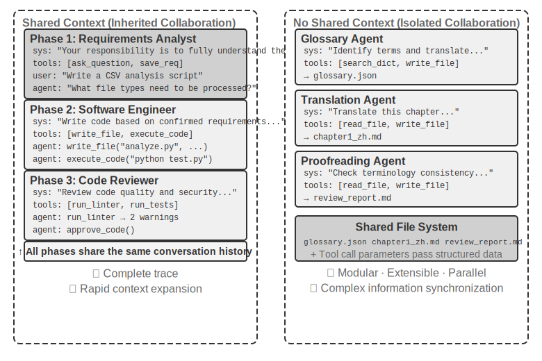

It should be clarified that both architectures are genuine multi-agent systems (because the system prompt and tool set differ at each stage, making them different agents); the difference lies in the coordination method. **Shared context** relies on implicit coordination—subsequent agents inherit the complete context history of preceding agents, can "see" previous thought processes, and information is passed through the context itself. **Non-shared context** relies on explicit coordination—agents exchange information through files, messages, or structured data interfaces, and each agent only sees content relevant to itself.

By analogy: the former is more like a team sitting around a table discussing, with everyone hearing everything. The latter is more like different departments collaborating via email and documents, each having its own workspace.

Table 10-1 summarizes the selection criteria for the two architectures from five perspectives: number of sub-tasks, context window, parallelism, information isolation, and cost budget. It can serve as a checklist for early architectural selection.

Table 10-1 Selection Criteria for Shared vs. Non-Shared Context

| Selection Criterion | Shared Context | Non-Shared Context |
|---|---|---|
| Number of sub-tasks | Few (2-3 roles) | Many (parallel processing needed) |
| Context window | Can accommodate information for all roles | Single window is insufficient |
| Parallelism | Primarily serial (roles take turns along the same trajectory) | Can scale massively in parallel (contexts are independent, non-blocking) |
| Information isolation | Not needed (all roles share information) | Needed (e.g., security review should not see raw thought processes) |
| Cost budget | Single trajectory relay, tokens accumulate per stage | Multiple agents operate independently, total tokens are typically several times to an order of magnitude higher |

**Simple rule of thumb**: If the expected cumulative context exceeds 50% of the window (this is a rule of thumb, not an exact threshold), use non-shared context. If zero information loss is a hard constraint for task correctness, use shared context. Most real-world systems adopt a "stage-switching" approach—the first few agents share context, then switch to non-shared context with explicit handoff (where the upstream agent actively decides which information to pass to the downstream agent) once the information saturation point is reached.

### Dimension 2: Collaboration Topology

The second dimension is collaboration topology—the structure along which control and information flow between agents. Collaboration topology and context sharing are **conceptually independent but practically related**: they are conceptually independent because systems with shared context also have a topology—for example, the `transfer_to_agent` pattern introduced later in this chapter (Experiment 10-2) is essentially a chain of handoffs under shared context. They are practically related because once context is shared, the topology often degenerates (see below); the values of the two dimensions are not freely combinable. When context is shared, handoffs do not require deciding "what to pass"—the complete history is naturally preserved—so the topology typically degenerates into a sequence of role switches, leaving little architectural decision to be made (an exception falling between the two is group-chat-style multi-party collaboration, see the decentralization section later in this chapter). Once non-shared context is chosen, "how information flows and who coordinates it" becomes a problem that must be explicitly designed.

In other words, these two dimensions in principle form a 2×3 combination matrix (shared/non-shared × three topologies), but in the shared context row, the topology mostly degenerates into a sequence of role switches with little architectural decision to be made (this is the form discussed later in the "Multi-Stage Role Switching" section). Therefore, this chapter only elaborates on the three cells for non-shared context. The following introduces the three typical forms of collaboration topology under non-shared context, ordered by increasing complexity:

- **Peer Collaboration Pattern**: A small number of agents (typically 2-3) interact as equals, forming an iterative improvement loop—like writing a paper where one person drafts it and another annotates and revises it, with the quality after several rounds far exceeding what one person could achieve alone.
- **Orchestration Pattern**: A centralized Manager Agent is responsible for task planning and scheduling, while multiple sub-agents each handle specific sub-tasks—like a project manager leading several specialized engineers on a project.
- **Decentralized Pattern**: There is no runtime central controller; agents communicate with each other like humans to collaborate on tasks.

The detailed design and applicable scenarios for each pattern will be discussed in dedicated subsections later.

## When is Multi-Agent Truly Better Than Single Agent?

Before diving into specific collaboration architectures, let's first address a more fundamental question: **When are multiple agents truly needed, and when is a single agent sufficient?** The answer to this question will serve as an overall reference for all engineering solutions discussed later. A series of recent studies provide a clear judgment framework—the core criterion is only one: **Does the collaboration process introduce new information that a single agent could not obtain during generation?**

Table 10-2 summarizes whether different collaboration modes introduce new information, used to judge whether multi-agent collaboration has substantive value over a single agent.

Table 10-2 Information Gain Comparison of Multi-Agent Collaboration Modes

| Collaboration Mode | Introduces New Information? | Effect |
|---|---|---|
| Self-review by the same model (re-reading its own output) | No | Usually ineffective or even harmful |
| Different agents debating the same text | No | Comparable to a single agent with equal compute |
| Reviewer uses test execution results to review code | Yes (execution feedback) | Significant improvement |
| Reviewer uses rendered screenshots to review frontend/PPT code | Yes (visual feedback) | Significant improvement |
| Reviewer uses external tools to verify facts | Yes (tool feedback) | Significant improvement |

The 2025 RLEF (Reinforcement Learning from Execution Feedback)[^rlef-2025] confirmed this: training a model via reinforcement learning to use code execution feedback for iterative code improvement significantly outperforms having the model independently sample multiple times. The key is that each iteration introduces **real execution results** (compilation errors, test failures, runtime exceptions)—information that did not exist when the model wrote the code. In the 2025 WebGen-Agent[^webgen-agent-2025] for webpage generation tasks, using a multi-level visual feedback scaffolding (screenshots + visual language model descriptions) reportedly improved Claude 3.5 Sonnet's performance on that benchmark from 26.4% to 51.9%—nearly doubling it.

[^rlef-2025]: Gehring, J., et al. *RLEF: Grounding Code LLMs in Execution Feedback with Reinforcement Learning.* arXiv:2410.02089, 2025.
[^webgen-agent-2025]: Lu, Z., et al. *WebGen-Agent: Enhancing Interactive Website Generation with Multi-Level Feedback and Step-Level Reinforcement Learning.* arXiv:2509.22644, 2025.

This "new information" framework explains a seemingly contradictory phenomenon: academic research says "a single agent is sufficient," but in engineering practice, multi-agent systems indeed perform better. The root of the contradiction lies in the different types of "multi-agent" being discussed—academic studies often compare modes where "multiple agents look at the same text and discuss it with each other" (e.g., debate), while effective multi-agent systems in engineering practice often include external feedback loops (code execution, visual rendering, tool calls). The former introduces no new information; the latter does. For the three architectures introduced later in this chapter—peer collaboration, orchestration, and decentralization—almost all truly effective uses can be mapped back to this criterion.

**Step Budget and Agent Performance.** A related research direction is: how does allocating different step budgets (i.e., the number of allowed tool calls or iteration rounds) to an agent affect its performance? Intuitively, more steps should lead to better results—with a 30-step budget, an agent can only quickly implement core functionality; with a 300-step budget, it can plan first, then implement, then test, then improve. However, a 2025 Google paper, *Budget-Aware Tool-Use Enables Effective Agent Scaling*, found a counterintuitive conclusion: **simply increasing the number of steps available to an agent does not guarantee performance improvement.** Standard agents lack "budget awareness"—even with a 300-step budget, they tend to perform shallow searches and quickly "saturate." To translate more steps into genuinely better results, agents need an explicit budget-aware mechanism that dynamically adjusts strategies based on remaining resources: broad exploration early on, and focusing on the most promising directions later. The 2026 BAVT (Budget-Aware Value Tree Search) further proposed step-level value evaluation, adjusting the weight of exploration vs. exploitation based on the remaining budget ratio—as the budget decreases, the agent transitions from "casting a wide net" to "deep digging."

These findings have direct implications for multi-agent system design. For example, in the orchestration pattern, the Manager Agent should not simply distribute tasks to sub-agents and wait for results. Instead, it should **dynamically allocate step budgets** based on task complexity—simple sub-tasks get fewer steps, complex sub-tasks get ample steps. It should also guide sub-agents to use these budgets wisely (plan first, then implement, then test, then improve), rather than diving straight in.

One more thing must be placed before all design considerations: **cost.** The parallel exploration and iterative refinement of multi-agent systems cost money—Anthropic has disclosed that its multi-agent research system's token consumption is about 15 times that of a normal conversation, and token usage alone can explain about 80% of the performance difference. This means the performance gains from multi-agent systems must be large enough to cover several times to an order of magnitude of additional overhead; otherwise, a well-tuned single agent is often the more cost-effective choice.

## Multi-Agent Collaboration with Shared ContextIn multi-agent collaboration with shared context, each stage is an independent agent (with its own system prompt and tool set), but it inherits the complete trajectory of the preceding agent—much like a colleague taking over a shift can review all the work logs left by the predecessor. The core advantage of this "inheritance-based collaboration" is zero information loss: every agent can review details from any previous stage. The challenge lies in keeping the current agent focused on its core responsibilities without being distracted by the large volume of inherited historical information.

### Multi-Stage Role Switching

Let’s first clarify a definitional point: in the language of Chapter 1, multi-stage role switching is a **workflow-style orchestration**—the execution path (e.g., requirements clarification → implementation → review) is predefined. This chapter re-examines it within a multi-agent framework from the perspective of agent identity and context: when the system prompts, tool sets, and focus areas differ across stages, treating them as multiple agents sharing the same trajectory yields practical design benefits—each "identity's" prompt and tool set can be refined independently, and stage boundaries naturally become quality gateways.

In complex tasks, an agent's role and responsibilities may change significantly across different stages. If a single static system prompt is used throughout, it is either too generic to be targeted, or it becomes overly long by cramming instructions for all stages together. The approach of multi-stage role switching is to dynamically switch system prompts and tool sets based on the current stage, allowing the agent to work in the most appropriate "identity" at each stage. This switching does not require creating new instances or starting new processes; it merely updates the context within the same execution session. The key point is that although the role changes, the conversation history and task state remain continuously shared—the agent, in its new role, can still access all information accumulated in previous stages.

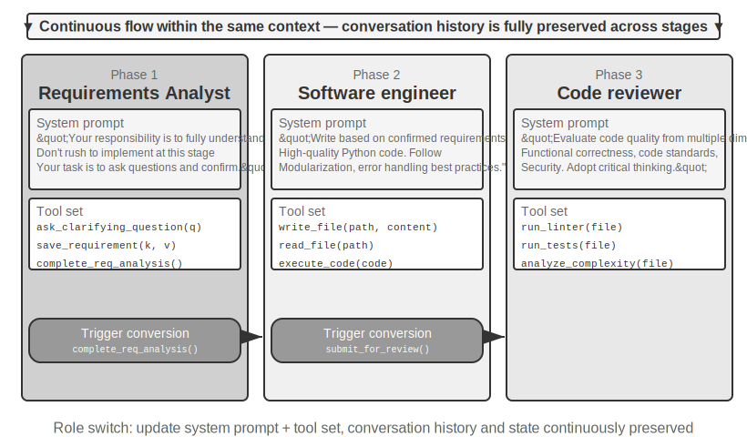

> **Experiment 10-1 ★★: Determining System Prompts Based on Execution Stage**
>
> This experiment demonstrates how stage-specific system prompts improve agent performance through the complete workflow of a Coding Agent.
>
> **Task Scenario**: A user proposes a software development requirement, and the agent goes through three stages sequentially: requirements clarification, code implementation, and quality review.
>
> **Stage 1: Requirements Clarification** (Role: Requirements Analyst)
>
> The system prompt emphasizes:
> - "Your responsibility is to fully understand the user's needs. Ask questions to clarify ambiguities, ensuring you fully comprehend the expected functionality, usage scenarios, and performance requirements."
> - "Do not rush into implementation. At this stage, your task is to ask questions and confirm, not to write code."
> - "Once you confirm that all key requirements are clear, call the `complete_requirements_analysis()` tool to end this stage."
>
> The tool set is limited: `ask_clarifying_question(question)` to ask the user clarifying questions, `save_requirement(key, value)` to record confirmed requirements, and `complete_requirements_analysis()` to mark the stage as complete.
>
> The agent engages in multiple rounds of dialogue with the user: "What types of files does this script need to process?", "Should it recursively process subfolders?", "Should the original filenames be preserved after moving files?" Through these questions, the agent gradually builds a complete understanding of the requirements and saves them in a structured manner. When the agent determines the requirements are sufficiently clear, it calls `complete_requirements_analysis()` to trigger a role switch—the system detects the stage completion signal and automatically transitions to the next stage's configuration.
>
> **Stage 2: Code Implementation** (Role: Software Engineer)
>
> The new system prompt emphasizes:
> - "Your responsibility is to write high-quality Python code based on the confirmed requirements."
> - "Follow best practices: code should be modular, include proper error handling, and contain necessary comments."
> - "After completing the code and passing basic tests, call `submit_for_review()` to enter the review stage."
>
> The tool set changes significantly: the previous requirements clarification tools are removed, replaced by development tools such as `write_file(path, content)`, `read_file(path)`, and `execute_code(code)`. The agent begins writing code based on the requirements saved in the first stage—first the main logic, then error handling, and finally writing tests for verification. Throughout the process, the agent can still access the conversation history from the first stage to review requirement details, but its behavior pattern is completely different: no more questions, focused solely on implementation. Upon completion, it calls `submit_for_review()`.
>
> **Stage 3: Code Review** (Role: Code Reviewer)
>
> The new system prompt emphasizes:
> - "Your responsibility is to review the code just written, evaluating its quality from multiple dimensions: functional correctness, code standards, error handling, performance optimization, and security."
> - "Adopt a critical mindset, trying to identify potential issues and areas for improvement in the code."
> - "If serious issues are found, call `request_revision(issues)` to return to the implementation stage for modification; if the quality is acceptable, call `approve_code()` to complete the task."
>
> The tool set changes again: it is replaced by code quality analysis tools such as `run_linter(file)`, `run_tests(file)`, and `analyze_complexity(file)`. The agent re-examines the code from a reviewer's perspective, runs static analysis, and checks for potential bugs, performance issues, or security risks.
>
> This three-stage design allows the agent to focus on the core task at each stage. More importantly, the clear stage transition mechanism ensures the integrity of task execution—the agent will not skip requirements analysis to write code directly, nor will it deliver results without review.
>
> **Experiment Requirements**:
> 1. Implement three-stage system prompts, each with a clear role definition and behavioral guidance
> 2. Configure matching tool sets for each stage
> 3. Implement a stage transition trigger mechanism (via specific tool calls)
> 4. Ensure context continuity between stages
> 5. Handle rollback scenarios—when code review finds issues, return to the implementation stage
> 6. Log execution logs for each stage, demonstrating how different prompts produce different behavior patterns
>
### Cross-Domain Role Switching

The previous multi-stage role switching demonstrated stage-based execution within a single task type (software development). Cross-domain role switching further explores the agent's autonomous switching between multiple task types—no longer a pre-planned linear process, but rather the agent autonomously deciding which professional role to switch to based on changes in user requirements.

> **Experiment 10-2 ★★: Multi-Role Switching**
>
> **Prerequisites**: It is recommended to first understand the Agent Skills mechanism from Chapter 2.
>
> **System Architecture**: Five roles—
>
> - **triage (front desk triage, default entry point)**: Understands the user's overall requirements, breaks them into sequential subtasks, gradually hands them over to appropriate professional roles, and performs final confirmation after all subtasks are completed. It has no specialized tools of its own, only `transfer`.
> - **research (information retrieval expert)**: Uses `web_search` to find data, facts, and materials.
> - **coding (programming expert)**: Uses `execute_python` to write and run code, solving program logic/script problems.
> - **data_analysis (data analysis expert)**: Uses `calculate` / `descriptive_stats` for quantitative calculations and statistics (e.g., year-over-year growth rate, compound annual growth rate CAGR, mean).
> - **writing (writing expert)**: Polishes retrieved data and calculation conclusions into a smooth, audience-oriented final draft (can use `count_characters` for a rough length check).
>
> **Core Mechanism: transfer_to_agent Tool**
>
> All roles are equipped with the `transfer_to_agent(target_role, reason)` tool. When called, the system will: 1) save the current conversation history; 2) load the target role's prompt and tool set; 3) pass the conversation history to the new role so it understands the context; 4) continue execution in the new role.
>
> **Experiment Scenario**: The system starts in the triage (front desk triage) role by default. The user presents a cross-domain composite task: "I'm preparing materials for investors. Help me look up China's new energy vehicle sales for 2021, 2022, and 2023, calculate the compound annual growth rate for these three years, and then write a Chinese summary for investors, no more than 120 characters." Triage breaks it down into "look up data → calculate metrics → write draft" and first hands it over to research:
>
> ```python
> transfer_to_agent(target_role="research", reason="Need to first look up three years of new energy vehicle sales data")
> ```
>
> Research uses `web_search` to find the sales data, writes the key data into the conversation, and then hands it over to data_analysis:
>
> ```python
> transfer_to_agent(target_role="data_analysis", reason="Data is ready, need to calculate the three-year CAGR")
> ```
>
> Data_analysis uses `calculate` to compute the growth rate, then hands it over to writing for drafting; after writing completes the draft, it hands it back to triage for final confirmation. The entire chain is triage → research → data_analysis → writing → triage. Each role can see the complete conversation history, so the subsequent role naturally knows what has been done before.
>
> The decision to switch roles depends on the guidance in the system prompts. The triage prompt explicitly lists routing rules: look up data/materials → research, write and run code → coding, quantitative calculations and statistics → data_analysis, polish into a draft → writing. The criterion is simple: if the task requires domain-specific deep knowledge or specialized tools, hand it over to the corresponding professional role. The professional roles' prompts also guide them on whom to hand over to or whether to return to triage after completing their part.
>
> **Experiment Requirements**:
> 1. Implement system prompts and specialized tool sets for at least three professional roles
> 2. Implement the `transfer_to_agent` tool, supporting dynamic switching
> 3. Ensure context continuity after role switching
> 4. Handle circular switching issues—prevent the agent from switching back and forth between roles
> 5. Design complex task flows spanning multiple domains to demonstrate the value of role switching
>
## Multi-Agent Collaboration Without Shared Context

Not sharing context represents true multi-agent collaboration. In this architecture, each agent is an independent entity with its own context, trajectory, and state. Agents cannot directly access each other's "internal thoughts"; collaboration relies entirely on explicit, structured data transfer mechanisms—the three communication mechanisms introduced at the beginning of this chapter (tool call parameters, shared file system, message bus).

This isolation brings several practical engineering benefits: each agent can be developed and tested independently, adding new capabilities does not require modifying existing code, a faulty agent will not propagate error states to other agents, and multiple agents can truly execute concurrently—contexts are completely independent, with no resource contention.

However, not sharing context also has costs. The most obvious is the information synchronization problem: how do agents maintain a consistent understanding of the task state? Will information be lost or duplicated during transfer? Debugging also becomes more difficult—when problems arise, logs from multiple agents must be reviewed to piece together the complete execution process. These issues make the design of interface specifications, data formats, and communication protocols critically important.

Explicit collaboration without shared context relies on two topology-independent infrastructures. The first is the **shared file system**, which serves as a persistent medium for exchanging artifacts between agents and files with users, forming the data plane of collaboration. The second is the **communication and control mechanism**, which supports message passing, state queries, and execution termination between agents, forming the control plane of collaboration. The three topologies below are all built on these two foundations.

### The File System from an Agent's Perspective

At the beginning of this chapter, the "shared file system" was listed as one of the three communication mechanisms for architectures without shared context. In a real system, the file system an agent accesses is not a single storage but a **virtual filesystem**: storages with different sources, lifecycles, and permissions are mounted under the same directory tree. The agent accesses them through unified `read_file`/`write_file`/`list_dir` interfaces, while the underlying layers may be local temporary disks, persistent object storage, third-party cloud drive APIs, or read-only system resource packages. Clearly defining the composition of this directory tree—the visibility and lifecycle of each area—is a prerequisite for designing multi-agent collaboration: a significant portion of concurrency conflicts and information leaks stem from mixing areas that should be isolated. In a mature multi-agent system, the file system typically consists of the following four types of areas:

**I. Agent-Specific Workspace (Scratchpad)**. A private directory exclusive to each agent instance, storing intermediate artifacts, temporary files, drafts, and debug logs. Its lifecycle is tied to the instance and is invisible to other agents and users. Isolating the scratchpad serves two purposes: preventing temporary files from multiple agents from overwriting each other, and keeping the main agent's context lean—the trial-and-error process of sub-agents remains in their own workspace, with only the final artifact submitted to the shared space. This corresponds to the storage-level manifestation of "sub-agents return structured summaries rather than full trajectories" from Chapter 4.

**II. Multi-Agent Shared Workspace**. A collaboration area that multiple agents can read and write, and that is **visible to the user**. It is the primary medium for exchanging artifacts between agents in architectures without shared context: the Glossary Agent writes the term list, and the Translation Agent reads from it; users can also upload source files and download final deliverables here. Its lifecycle is tied to the entire task and requires persistence. As an area for concurrent reads and writes by multiple parties, it is a hotspot for concurrency conflicts—mechanisms such as optimistic locking and worktree isolation operate here, as detailed in the "Failure Mode 1" section later in this chapter. Chapter 4's use of volume mounting `/workspace/shared` to connect the main agent, virtual computer, and virtual phone is a typical implementation of this layer.**III. Mounted External Resources.** Third-party information sources authorized by the user—Google Drive, Notion, Dropbox, enterprise wikis, etc.—are mapped to mount points in the file system (e.g., `/mnt/gdrive`) via adapters. An Agent accesses a Notion document by reading a file; the underlying adapter calls the corresponding API. Three characteristics distinguish this layer from local storage and must be explicitly handled during design: **Access is constrained by external permissions** (the user's permissions in the source system determine the Agent's visibility), **latency is higher and consistency is weaker** (each read involves a network round trip, and data may have been modified externally), and **access is primarily on-demand and read-only** (writing back to external sources must be done cautiously, as erroneous writes could contaminate the user's real data). The unified file interface means the Agent does not need a custom tool for each data source, but it also masks the aforementioned performance and security differences. Therefore, read-only/writable status, timeouts, and credential boundaries must be explicitly managed at the mount level.

**IV. Built-in System Resources.** A resource package pre-installed by the system and shared read-only with all Agents. Typical examples are the **Skills** introduced in Chapters 2 and 4—knowledge documents and scripts organized as files, mounted at paths like `/skills`, accessed via progressive disclosure (index first, then expand on demand). Other examples include reference manuals, template libraries, and shared tool definitions. This layer is globally shared, read-only, stable across sessions, and can be read concurrently by all Agents without concurrency control.

Figure 10-3 illustrates the structure where these four types of areas are uniformly mounted under a single directory tree: the Agent accesses the entire tree through a unified interface, users upload and download files from the shared space, external data sources are mounted via adapters, and built-in system resources are provided read-only.

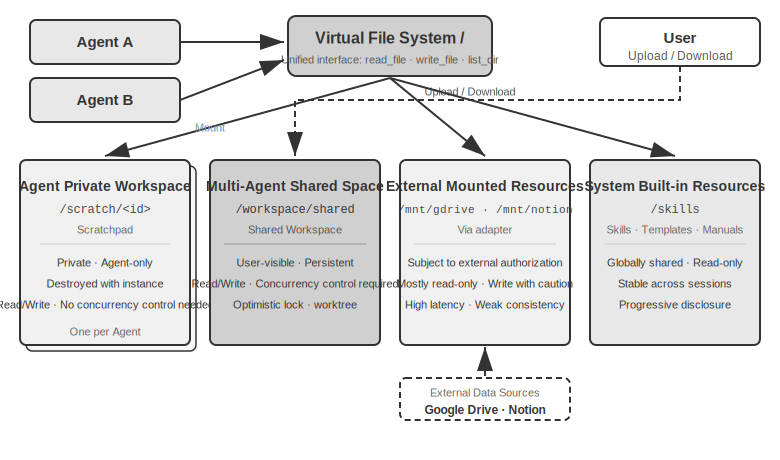

Table 10-3 compares these four area types across four dimensions—visibility, lifecycle, read/write permissions, and concurrency control—serving as a checklist for file system layout design.

Table 10-3 Four area types of the Agent Virtual File System

| Area | Visibility | Lifecycle | Read/Write | Concurrency Control |
|---|---|---|---|---|
| Agent Private Workspace | That Agent only | Destroyed with the Agent instance | Read/Write | Not needed (private) |
| Multi-Agent Shared Space | All collaborating Agents + User | Persists for the task duration, requires persistence | Read/Write | Required (optimistic lock / worktree) |
| Mounted External Resources | Depends on external authorization | Determined by the external source | Mostly read-only, writes require caution | Managed by the external source |
| Built-in System Resources | All Agents | Stable across sessions | Read-only | Not needed (read-only) |

Unifying these four area types under a single directory tree is the core value of the design principle: **"file path as a universal interface."** When Agents pass artifacts to each other, when a main Agent hands off input to a sub-agent, or even during cross-organization A2A collaboration to exchange artifacts, the transfer is a lightweight path string, not the content loaded into the context window (Chapter 4). This aligns with Chapter 5's concept of "the file system as the Agent's hub"—which discusses how a single Agent uses the file system to host memory and capabilities—and extends the same abstraction to multiple Agents: a virtual directory tree mounting private, shared, external, and built-in storage serves as the storage foundation for multi-agent collaboration.

### Communication and Control Between Agents

While the file system solves the problem of **artifact exchange** between Agents, collaboration also requires a **control plane**: supporting message passing, status queries, and execution termination between Agents. Chapter 4 has already provided the tool primitives for this plane—creating (`spawn_subagent`), sending messages (`send_message_to_subagent`), and canceling (`cancel_subagent`)—along with four collaboration modes: synchronous, asynchronous, streaming, and multi-turn. This section does not repeat the interface definitions but focuses on three often-overlooked capabilities essential for multi-agent collaboration.

**I. Message Passing.** The simplest form is point-to-point: Agent A directly calls `send_message_to_agent_b(content)`. This is suitable for scenarios with a fixed topology and a small number of Agents (e.g., the phone + computer dual-agent experiment 10-4 in this chapter). When the number of Agents increases and asynchronous parallelism is required, the number of point-to-point connections grows quadratically with the number of Agents, and both sender and receiver must be online simultaneously. In such cases, a **message bus** should be used (detailed later in this chapter under "Parallel Coordination Modes"): Agents publish messages to the bus, which forwards them based on subscriptions, so the sender does not need to know the consumers. Whether point-to-point or via a bus, messages should typically carry a structured **envelope**: sender ID, target (specific Agent or broadcast), message type (e.g., `task_assigned`/`status_update`/`result`/`terminate`), and a JSON payload. A unified envelope format ensures reliable routing and parsing by the receiver and makes the collaboration chain traceable—a key aspect of debugging multi-agent systems.

**II. Status Query.** This is the most underestimated aspect of the control plane. After a main Agent dispatches a sub-agent, without knowing its progress, it cannot decide whether to continue waiting or intervene if the sub-agent is blocked. There are two paradigms for obtaining status. **Pull**: The main Agent calls `get_subagent_status(agent_id)`, which returns the sub-agent's current status (running/waiting for input/completed/failed), progress, and last activity time. **Push**: The sub-agent proactively reports status updates to the message bus during execution, and the main Agent maintains a real-time task status table (the "real-time monitoring" in experiment 10-6 of this chapter follows this paradigm). Each has trade-offs: Pull is simple to implement, but polling too frequently wastes tokens, while polling too infrequently leads to delays; Push offers good real-time performance but relies on the sub-agent's proactive reporting. In engineering practice, sub-agent status is often modeled as a **state machine** (submitted, executing, needs input, completed, failed). The A2A protocol later in this chapter standardizes the task lifecycle into such states. Additionally, **timeouts and heartbeat detection** serve as a safety net (echoing the Heartbeat and monitor_shell from Chapter 4): even if a sub-agent neither reports nor returns, the main Agent can determine failure based on "no activity for N minutes," preventing the system from being blocked by a stalled sub-agent.

**III. Execution Termination.** In parallel collaboration, a common scenario is "one succeeds, the rest become irrelevant"—multiple Agents search separately, and once one finds the target, the others should stop immediately (the cascading termination in experiment 10-6 of this chapter). There are two levels of termination. **Graceful termination** is preferred: the main Agent sends a `terminate` signal, the sub-agent responds at a safe point in its current step, cleans up resources (closes browser sessions, writes pending files, releases locks), sends an acknowledgment (ack), and then exits. **Forced termination** is a fallback: directly terminating the process, used only when the sub-agent does not respond to the graceful signal, at the cost of potentially leaving dangling resources and incomplete writes. Two engineering points need attention: First, graceful termination requires the sub-agent to periodically check for the termination signal in its loop (similar to the interrupt mechanism in Chapter 4); otherwise, the signal cannot be received. Second, cascading termination has a race condition—multiple sub-agents might report success nearly simultaneously. The main Agent must use a lock or idempotent design to ensure settlement happens only once and only one round of termination is broadcast. See the discussion of race conditions in experiment 10-6 of this chapter.

Artifact exchange (data plane) and message passing, status query, and execution termination (control plane) together support multi-agent systems that do not share context. The three collaboration topologies described below are essentially different choices regarding control ownership and information flow built upon these two planes.

Based on the collaborative relationships and control flow characteristics between Agents, collaboration without shared context can be divided into three main architectures: Peer-to-Peer Collaboration, Manager Mode, and Decentralized Mode, each suitable for different types of tasks.

### Peer-to-Peer Collaboration Mode: Mutual Checks and Iterative Improvement

Peer-to-peer collaboration typically involves 2-3 Agents with equal status, providing feedback to each other through multiple rounds of iteration. The core value lies in introducing cognitive diversity—different Agents examine the same problem from different perspectives, balancing innovation and robustness to produce results superior to any single Agent.

Compared to Manager and Decentralized modes, the implementation complexity of peer-to-peer collaboration is much lower—simply define the roles of two Agents, the communication mechanism, and the iteration termination condition, and it can run. It is an ideal choice for quickly validating ideas and building prototypes.

**Proposer-Reviewer Paradigm.**

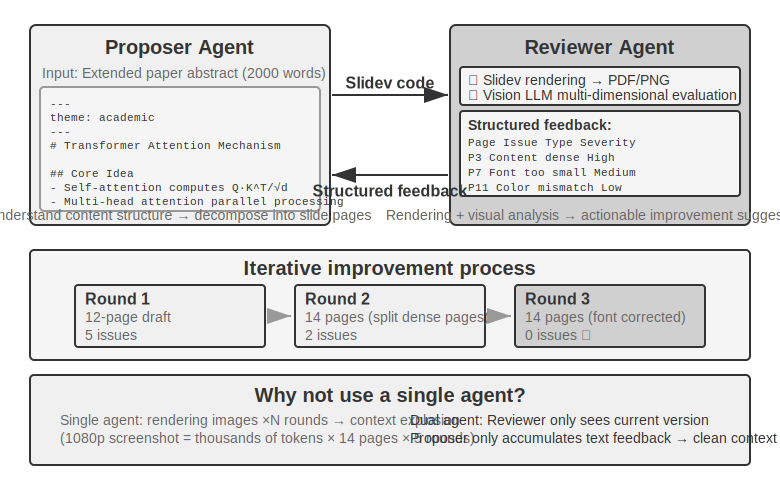

The Proposer-Reviewer is the most classic peer-to-peer collaboration paradigm. Chapter 5 has already detailed the design principles and practical applications of this paradigm in three experiments: PPT generation, video editing, and log visualization. The Proposer Agent is responsible for generating code, and the Reviewer Agent renders the execution results, evaluates the quality using a Vision LLM, and provides structured improvement suggestions. The two iterate repeatedly until the result meets the standard.

This paradigm is also applicable to scenarios like security review (Proposer generates an action plan, Reviewer checks compliance and potential risks), content moderation (Proposer drafts a reply, Reviewer checks business rules and language norms), and code review (Proposer writes code, Reviewer checks security and best practices).

**Why can't a single Agent generate and then review its own work?** This is precisely the application of the criterion from the earlier section "When is Multi-Agent Truly Better Than Single-Agent?"—if the review does not introduce new information, it is just "asking the model to think again." Related research provides a clear answer. In their ICLR 2024 paper "Large Language Models Cannot Self-Correct Reasoning Yet," Huang et al. found that asking GPT-4 to review and correct its own answers without external feedback actually decreased accuracy—the model changed correct answers to incorrect ones more often than it changed incorrect answers to correct ones.

A 2024 survey paper published in TACL, "When Can LLMs Actually Correct Their Own Mistakes?" (arXiv:2406.01297), further confirmed this conclusion: unless reliable external feedback is provided (e.g., test case execution results, verification output from external tools), purely relying on the model's own "self-correction" is largely ineffective.

The CRITIC paper at ICLR 2024 provides an intuitive comparative experiment. CRITIC had the model use external tools (search engine, Python interpreter) to verify its own answers, leading to significant performance improvements. However, when the experimenters removed the tool verification step and only kept the model's self-assessment, most of the improvement disappeared. This indicates that the value of review lies not in "asking the model to think again," but in **introducing new information that was not available during the model's generation**—test results, rendered screenshots, compilation errors, external search results.

This is the core design principle of the Proposer-Reviewer paradigm. In the PPT generation experiment of Chapter 5, the value of the Reviewer Agent was not "using the same model to look at the code again," but **rendering the PPT and taking a screenshot**—a screenshot containing visual information that the Proposer Agent could not obtain when generating the code. Similarly, in code generation scenarios, the pass/fail results from executing test cases are new signals that did not exist when the code was written—the independent value of the Reviewer stems precisely from its access to this external feedback unavailable to the Proposer.

**Extensions: Other Peer-to-Peer Collaboration Modes.**

**Debate**: Multiple Agents hold different positions, exploring the problem space deeply through adversarial dialogue. For example, when evaluating a technical solution, Agent A plays the "supporter," listing the solution's advantages and opportunities, while Agent B plays the "opponent," pointing out risks and limitations. Each round of debate involves rebutting or supplementing the other's arguments. When a single Agent analyzes, the model often leans towards one viewpoint and ignores counter-evidence. The debate mode, through institutionalized confrontation, ensures both sides are fully argued, helping decision-makers make more balanced judgments.

However, the practical effectiveness of the debate mode is still debated in academia. A 2026 study by Tran and Kiela [^single-agent-2026] compared a single Agent with five multi-agent architectures (sequential, debate, ensemble, parallel roles, sub-task parallel) on multi-hop reasoning tasks. They found that **when the thinking token budget was strictly controlled to be the same, the single Agent performed on par with or even better than the multi-agent systems** (unless context utilization was degraded to a certain point). The researchers provided an explanation based on the data processing inequality in information theory: multiple Agents in a debate process the exact same textual information, and each serial transmission of intermediate conclusions between Agents can only lose information, not create it. The benefits of the debate mode in some academic papers likely stem from multiple Agents consuming more total computation. It is important to clarify the boundary of this argument: it targets the information bottleneck caused by "multi-agent serial transmission of intermediate conclusions" and does not negate other approaches, such as **multiple independent samplings of the same problem followed by aggregation** (e.g., self-consistency, majority voting), or leveraging the **asymmetry in difficulty between generation and verification** (writing an answer is hard, verifying it is easy) for a generation-verification division of labor. These scenarios either introduce additional independent sampling or exploit the asymmetric structure of the task itself, and are not within the scope of the data processing inequality.

[^single-agent-2026]: Tran, D., Kiela, D. *Single-Agent LLMs Outperform Multi-Agent Systems on Multi-Hop Reasoning Under Equal Thinking Token Budgets.* arXiv:2604.02460, 2026.

**Brainstorm**: Multiple Agents independently generate ideas, then share them with each other, inspiring one another. For example, in a product innovation task, Agent 1 proposes "adding social sharing features," Agent 2 is inspired to suggest "not just sharing to social networks, but also generating personalized sharing posters," and Agent 3 synthesizes the first two to propose "user-customizable poster templates forming a template marketplace." Different Agents have different "thinking preferences" (achieved through different prompts or models), and by stimulating each other, they explore a broader solution space to find creative combinations that a single Agent would struggle to conceive.

**Panel Discussion**: Multiple Agents each represent the perspective of a specific professional domain, jointly discussing an interdisciplinary problem. For example, when evaluating the feasibility of a new product, an Engineer Agent analyzes the implementation difficulty from a technical standpoint, a Product Agent assesses market appeal from a user experience perspective, and an Operations Agent analyzes business viability from a cost and resource perspective. These Agents are not adversarial but complementary, together piecing together the full picture of the problem and identifying cross-domain constraints and opportunities.

### Manager Mode: Centralized CoordinationWhen a task involves more than five sub-tasks, requires dynamic scheduling, or has complex dependencies between sub-tasks, peer-to-peer collaboration becomes insufficient, and a manager pattern is needed. The Manager Agent's responsibilities are like a project manager: first understand the overall task, then break it down into assignable sub-tasks, select the appropriate Agent to execute, track progress and handle exceptions (retry, switch Agent, adjust plan), and finally integrate the outputs of each Agent into the final result.

From a system design perspective, the manager pattern models each specialized Agent as a tool that the Manager can invoke. The Manager's toolset includes not only traditional external tools (like search, file operations) but also the invocation interfaces of other Agents. The Manager starts the corresponding Agent through the tool call mechanism, passes task parameters and necessary context, waits for completion, and receives the returned result. From the Manager's perspective, calling an Agent is essentially no different from calling a regular tool—both involve sending a request and receiving a response. This unified abstraction gives the manager pattern good extensibility—adding new capabilities only requires developing the corresponding Agent and registering it as a tool, without modifying the Manager's core logic. At the same time, it naturally supports heterogeneity—different Agents can use different models, prompts, tool sets, and even run on different hardware environments.

The abstraction of "Agents as tools for each other" was established in Chapter 4, "Collaboration Tools" section: the interface design of `spawn_subagent / send_message / cancel_subagent`, and the four strategies for preparing sub-agent context (minimal passing, manual filtering, automatic pruning, LLM-generated context), all directly apply to the Manager's invocation of sub-agents here. Chapter 4 addresses what is passed in the "Manager → sub-agent" direction; the symmetrical question is what is returned in the "sub-agent → Manager" direction. The answer is **structured summaries rather than full trajectories**: the sub-agent should return the task conclusion, key findings, file paths of the artifacts, and problems encountered, leaving the complete execution trajectory in its own logs. Only in this way can the Manager's context grow slowly and linearly with the number of sub-tasks, rather than exploding—this is also the methodological basis for the Manager in Experiment 10-3 below "only maintaining file indexes, not saving translation content". The division of labor between the two chapters is: Chapter 4 discusses mechanisms (tool interfaces and context passing implementation), while this chapter discusses architecture (how topology and responsibilities are divided).

However, the manager pattern also has inherent challenges. The Manager becomes a single point of bottleneck for the system—it must understand the nature of all sub-tasks, select the correct Agent, and accurately pass context. Any decision deviation can affect the overall process. Additionally, the Manager needs to maintain the global context of the entire task. As the task progresses and Agent calls increase, the context can quickly expand. Therefore, special attention must be paid to the quality of the Manager's prompt, context management strategies, and reasonable task decomposition granularity.

The 2025 Plan-and-Act paper [^plan-and-act-2025] provides an empirical analysis of this: in a Planner-Executor dual-agent architecture, **a weak planner is the most critical bottleneck of the entire system**. When the Planner's planning quality is high enough, good results can be achieved even with a relatively simple Executor. Conversely, if the Planner's task decomposition is wrong, all subsequent Executor work is built on a faulty premise. This study achieved a 54% success rate on the WebArena-Lite benchmark, with the core contribution being the improvement of the Planner's planning ability, not the Executor's execution ability. The implication of this finding is that the strongest model and the most carefully designed prompt should be allocated to the Manager (the planner), rather than distributing resources evenly across all Agents.

This does not conflict with an argument from Chapter 4. When discussing the proposal model and the review model, Chapter 4 pointed out that their capabilities should be similar—but that refers to the **review scenario**: the reviewer must be able to keep up with the reasoning of the reviewed party to find flaws; if the capability gap is too large, the review becomes impossible. The manager pattern discusses a different matter—**the division of labor between planning and execution**: once the planner makes a mistake in task decomposition, no matter how strong the executor is, it cannot remedy the situation. Therefore, the strongest model and the most carefully designed prompt should be prioritized for the planner. Whether a balance of capabilities is needed among executors depends on the coupling degree of the sub-tasks—when the outputs of multiple executors must ultimately be assembled into a whole, the weakest link often drags down the overall quality.

[^plan-and-act-2025]: Erdogan, L. E., et al. *Plan-and-Act: Improving Planning of Agents for Long-Horizon Tasks.* arXiv:2503.09572, 2025.

**Sequential Coordination Pattern.**


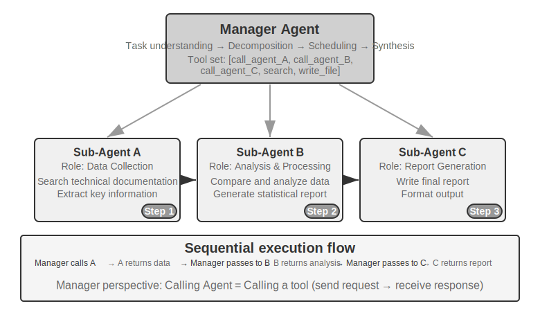


The Manager calls specialized Agents sequentially. Each Agent returns results upon completion, and the Manager decides the next step. The control flow is linear, simple, and clear, suitable for scenarios where sub-tasks have clear sequential dependencies.

> **Experiment 10-3 ★★: Book Translation Agent**
>
> Book translation is a typical complex task requiring multi-agent collaboration. Translating a technical book involves not just converting text from one language to another, but also ensuring consistency of specialized terminology throughout the book, contextual accuracy, and overall reading fluency. For example, when translating an English book about large language models, numerous terms appear repeatedly, potentially with multiple conventional translations. Consistency must be maintained throughout the book—if `agent` is translated as "智能体" in Chapter 1, it cannot be changed to "代理" later.>
> Using a single Agent for this task leads to severe context issues. As the Agent processes content chapter by chapter, the context accumulates: the full-book glossary, translated chapters, the current paragraph, translation thought processes, and tool call results. A several-hundred-page technical book, along with translation intermediates, can easily exceed the context window. More critically, within an overly long context, the Agent is prone to "getting lost"—forgetting previous terminology conventions and using an inconsistent translation in Chapter 8 compared to Chapter 2; wasting resources on redundant checks during the proofreading stage; or even hallucinating due to attention dispersion, "remembering" terminology rules that don't actually exist.
>
> The manager pattern addresses these issues through task decomposition and responsibility separation:
>
> - **Glossary Agent**: Receives the full book content, identifies recurring specialized terms, searches specialized dictionaries and translation norms, and generates a structured glossary (JSON/CSV format, including English term, Chinese translation, part of speech, usage context). After completion, it writes to a shared file system, and the Agent can be destroyed to release resources.
> - **Translation Agent**: Receives the current chapter, the glossary, and translation guidelines (target reader level, language style), and translates it into fluent Chinese. It strictly uses the specified translations for terms in the glossary, and for new terms, it infers a translation and marks it for review. Each instance works in an independent context without interference. The translated text is written to the file system (e.g., `chapter1_zh.md`). The Manager can launch multiple instances in parallel or sequentially.
> - **Proofreading Agent**: Receives all translated texts and the glossary, performs consistency checks—verifying whether term translations are uniform, identifying inconsistencies, and checking overall fluency and readability. It generates a proofreading report written to the file system.
> - **Manager Agent**: Its context mainly stores the task description, execution plan, call records of each Agent, and progress status. It does not store the complete translation content (which exists in the file system), only maintaining file indexes. Based on the proofreading report, the Manager can send specific chapters back to the Translation Agent for revision.
>
> In this architecture, the Manager Agent's context remains within a manageable range: it only needs to know the overall task description and goals, the execution plan for each phase, the call records and results from each Agent, and the current progress status, without needing to hold the complete translation of every chapter.
>
> The key advantage is **context isolation**: The Glossary Agent only sees the content needed for term extraction, the Translation Agent only sees the current chapter and glossary, and the Proofreading Agent, while needing access to the full text, focuses only on consistency checks. Each Agent works within a lean, focused context, leading to higher efficiency and a lower chance of errors—the Agent won't be distracted by information overload.
>
> **Experiment Requirements**:
> 1. Choose a technical book with rich illustrations and code as the translation object
> 2. Implement four types of Agents: Manager, Glossary, Translation, Proofreading
> 3. Record the context consumption of each Agent to verify the effectiveness of the manager pattern in controlling context expansion
> 4. Compare the differences between a single Agent vs. the manager pattern in terms of translation quality, execution efficiency, and resource consumption
>
>
> 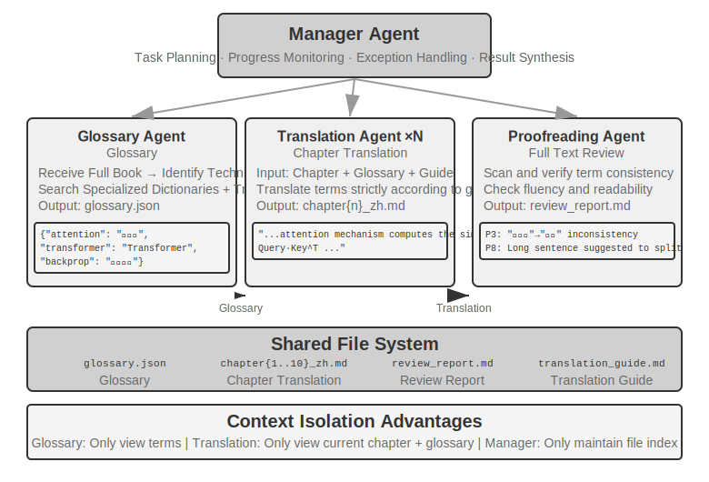
>
>
**Parallel Coordination Pattern.**


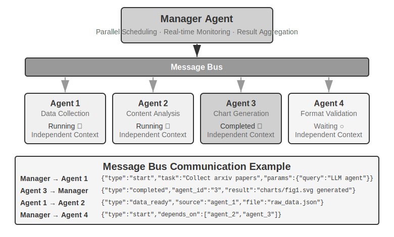


When multiple sub-tasks can be executed in parallel, the sequential pattern becomes inefficient. Parallel coordination allows multiple Agents to work simultaneously, significantly increasing throughput. The Manager Agent must not only plan parallel tasks but also monitor all running Agents in real-time, handle communication coordination, and make global decisions when Agents succeed or fail. This typically requires a **Message Bus** as infrastructure—think of it as a "public bulletin board" where Agents can post messages (publish) and subscribe to message types they are interested in, enabling asynchronous, non-blocking communication. Common implementation solutions, in increasing order of complexity, include: **Redis Pub/Sub**—lightweight, messages are sent and received instantly, simple to use, but not persistent—if the receiver is offline, the message is lost; **RabbitMQ** and similar message queues persist messages to disk, so they are not lost even if the receiver is temporarily offline. The message format typically includes the sender ID, target Agent (or broadcast to all), message type, and data content in JSON format.

> **Experiment 10-4 ★★★: Agent Talking on the Phone While Using a Computer**
>
> **Prerequisites**: This experiment integrates the Computer Use and Voice Agent technologies from Chapter 9. It is recommended to complete the relevant experiments in Chapter 9 first.
>
> Many real-world scenarios require multiple capabilities to operate simultaneously, rather than queuing up one by one: a human assistant might be on the phone with a client while simultaneously looking up documents and taking notes on the computer. This "multitasking" is extremely challenging for a single Agent—forcing one Agent to handle both real-time voice dialogue and computer interface operations inevitably leads to constant switching between the two tasks, causing pauses in conversation or interruptions in operation. The core idea of multi-agent parallel execution is: **let different Agents each focus on one task with high real-time requirements, coordinating through asynchronous message passing to achieve true parallel processing**. The two Agents are also specifically optimized for different interaction modalities—the Phone Agent requires low-latency speech recognition and synthesis, while the Computer Agent requires powerful visual understanding and action planning capabilities.
>
> **Scenario**: An AI Agent helps a user fill out a complex flight booking form. It needs to operate a web page while simultaneously asking the user for and confirming personal information (name, ID number, flight preferences, etc.) over the phone—both ends require high real-time performance, a classic case where a single Agent struggles to manage both, but a dual-agent setup allows each to focus on its own role.
>
> **Dual-Agent Architecture**:
>
> **Phone Agent**: A voice call Agent based on ASR + LLM + TTS. It is responsible for understanding the user's natural language responses, extracting key information, and sending it to the Computer Agent via the message framework. It also receives messages from the Computer Agent (e.g., "Need the user's ID number", "Page loading error") and generates appropriate dialogue to ask the user.
>
> **Computer Agent**: Based on a browser operation framework (e.g., Anthropic Computer Use, browser-use). It is responsible for understanding the web page structure, identifying form fields, performing fill-in operations based on received information, and asking the Phone Agent for help when encountering problems.
>
> **Communication Mechanism**: Two options:
> - **Simple Solution**: Point-to-point communication via tool calls, e.g., `send_message_to_computer_agent(message)` / `send_message_to_phone_agent(message)`
> - **Complete Solution**: Message Bus + Manager Agent, with a unified message format including sender, receiver, type, and content
>
> **Parallel Collaboration Mechanism** (shared by the two "Phone + Computer" experiments in this chapter): The two Agents run in separate threads or processes, each maintaining its own independent ReAct loop. The Phone Agent's loop: receive voice -> ASR transcription -> LLM understand and generate response -> TTS synthesis -> play -> check messages from Computer Agent. The Computer Agent's loop: take screenshot -> Vision LLM understand page -> plan action -> execute (click, type, etc.) -> check messages from Phone Agent. The key is that both must run truly in parallel—while the Computer Agent is finding elements and typing text, the Phone Agent must stay online and converse with the user ("Okay, I'm filling in your name... May I ask what your ID number is?"). To achieve this, each Agent's input carries a marker field from the other, for example, the Phone Agent's context might contain `[FROM_COMPUTER_AGENT] Cannot find the 'Next' button, user confirmation might be needed`, and the Computer Agent's context might contain `[FROM_PHONE_AGENT] User said name is 'Zhang San', ID number is 123456`.
>
> **Experiment Requirements**:
> 1. Implement a dual-agent architecture based on ASR/TTS APIs and a browser operation framework
> 2. Implement an efficient bidirectional communication mechanism
> 3. Ensure truly parallel operation, with information collection and form filling happening simultaneously
> 4. Handle exceptional situations
>
> **Experiment 10-5 ★★★: Autonomously Orchestrated Phone and Computer Agents**
>
> In Experiment 10-4, the collaboration architecture of the dual agents was pre-designed. This experiment goes a step further, exploring the **autonomous orchestration capability of Agents**—where the Agent itself decides when to launch a new collaborative Agent, rather than having the collaboration flow pre-planned by a human.
>
> **Scenario**: The user requests, "Help me complete the registration on this website," providing the URL but not specifying what information needs to be filled in. The Manager Agent uses the Computer Use tool to access the website and load the registration page.
>
> During the operation, the Computer Use Agent discovers that the registration form is very complex, containing numerous required fields: basic personal information (name, gender, date of birth), contact details (phone number, email, mailing address), identity verification information (ID type, ID number), preference settings, etc. After checking its context, the Agent realizes it doesn't have this information—the user only said "help me register" without providing any specific data.> When a traditional Agent encounters this situation, it sends a text message asking the user to type input—which is both inefficient (requiring manual entry of large amounts of information) and error-prone (format issues, missing information). A smarter Agent should recognize: **This is a scenario suitable for collecting information via a phone call**—phone conversations are far more efficient than text chat, allowing for sequential questioning and confirmation, and can handle the user's ambiguous expressions.

> The key innovation is that this decision is not pre-programmed, but **made autonomously by the Agent**. The Computer Use Agent's prompt states: "When you need to collect a large amount of structured information from the user, and this can be done progressively through conversation, consider calling the Phone Agent as an assistive tool." The tool set includes `initiate_phone_call_agent(purpose, required_info)`.
>
> Upon invocation, the system creates a Phone Agent with a clear task context: it is started to assist with form filling, specifying what information needs to be collected and the format requirements for each field.
>
> The two Agents then enter a real-time collaboration mode, utilizing the asynchronous parallel mechanism from Experiment 10-4. The Phone Agent calls the user and asks sequentially: "Hello, I am helping you fill out the registration form. First, may I have your name?" After the user responds, it immediately sends `{"type": "info_collected", "field": "Name", "value": "Zhang San"}` to the Computer Agent, which then locates the "Name" field on the webpage and fills it in. Meanwhile, the Phone Agent, without waiting for the computer operation to complete, continues to ask the next question. This **ask-one, fill-one** mode, where the conversation flow is not blocked by operational delays, is the core requirement of this experiment. After all information is collected, the Phone Agent sends `{"type": "task_completed"}`, and the Computer Agent submits the form.
>
> **Experiment Requirements**:
> 1. Implement a Computer Use Agent capable of autonomously deciding to launch a Phone Agent
> 2. Implement real-time bidirectional communication and true parallel work
> 3. Handle exceptions (provide feedback and re-ask when information format is incorrect)
> 4. Record the message timing of the collaboration process and key decision points of the Agents
>
>
> 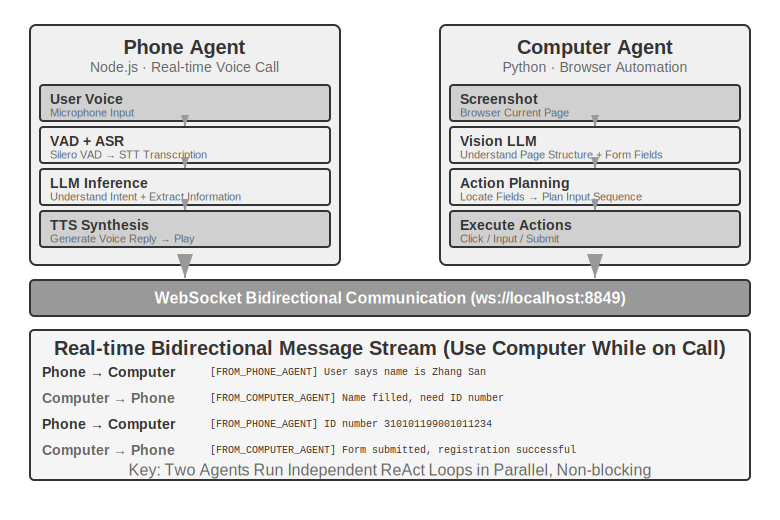
>
>
> **Experiment 10-6 ★★★: Agent Collecting Information from Multiple Websites Simultaneously**
>
> **Prerequisites**: It is recommended to first understand the event-driven and interrupt mechanisms from Chapter 4.
>
> This experiment explores the application of multi-agent parallel execution in information collection scenarios. Unlike Experiments 10-4 and 10-5, which focus on the collaboration of two heterogeneous Agents, this experiment focuses on **parallel search by multiple homogeneous Agents** and how to achieve efficient task completion and resource optimization through central coordination.
>
> **Problem**: Given the websites of multiple colleges within a university, the task is to search for a specified faculty member (e.g., "Zhang Wei") on each college's faculty directory page, and upon finding them, return their college, position, research direction, and other information.
>
> **Core Challenges**:
>
> **1. Parallel Launch**: The Manager Agent dynamically creates 10 Computer Use Agent instances based on task requirements, each corresponding to a college website. Each instance should be an independent process or thread, with its own browser session, capable of executing simultaneously without blocking each other. Parameters passed at launch include: target website URL, faculty name to search for, and task identifier (for message routing).
>
> **2. Real-time Monitoring**: Each Agent periodically sends status updates during execution ("Loading website", "Parsing faculty directory", "Target not found, task complete", "Match found, details below"). The Manager Agent receives these updates via a message bus, maintains a task status table, and keeps real-time track of which Agents are still running, which have completed, and which have encountered errors.
>
> **3. Cascading Termination**: Suppose the Agent responsible for the Computer Science college finds the target faculty member. It sends `{"type": "target_found", "agent_id": "agent_3", "data": {...}}`. Upon receiving this, the Manager Agent immediately sends `{"type": "terminate", "reason": "target_found_by_agent_3"}` to all other still-running Agents. Each Agent receiving the termination message stops gracefully and sends an acknowledgment. The Manager Agent waits for all acknowledgments (or a timeout) and then aggregates the results. Requirement: Agents must be able to respond to termination signals at any time (similar to the interrupt mechanism in Chapter 4), termination must be graceful—no hanging processes or unclosed resources—and race conditions must be handled.
>
> **Concept Supplement: What is a Race Condition?** Suppose Agent A and Agent B find the target faculty member within the same millisecond. They both report "I found it!" to the Manager Agent simultaneously. If the Manager Agent handles this poorly—for example, starting to aggregate results upon receiving A's report, but then receiving B's report triggering a second aggregation—it could lead to duplicate results or contradictory states. The typical solution is to use a "lock" mechanism: lock the state upon receiving the first report, and subsequent reports are identified as duplicates and ignored.
>
> **4. Failure Handling**: Various exceptions can occur during actual operation: a college website might be inaccessible (network error, server down), a website's structure might not match expectations, preventing the Agent from parsing correctly, or all Agents might finish searching without finding the target. The Manager Agent's handling strategy: set a timeout for each Agent (e.g., 2 minutes), treat timeout as failure; isolate errors so they don't affect other Agents' continued execution; after all are complete, aggregate results—return information if any Agent succeeded, or report "Target faculty member not found" along with a summary of failure reasons if all failed.
>
> **Experiment Requirements**:
> 1. Implement a Manager Agent capable of dynamically launching multiple parallel Agents
> 2. Implement a Computer Use Agent based on open-source projects like browser-use
> 3. Implement a message bus supporting bidirectional communication between the Manager Agent and multiple child Agents
> 4. Implement a cascading termination mechanism upon success, ensuring all other Agents stop quickly once the target is found
> 5. Handle various exception scenarios (website access failure, parsing errors, target not found by any Agent)
> 6. Record and compare the time difference between parallel and serial execution to verify the performance improvement brought by parallelization
>
>
> 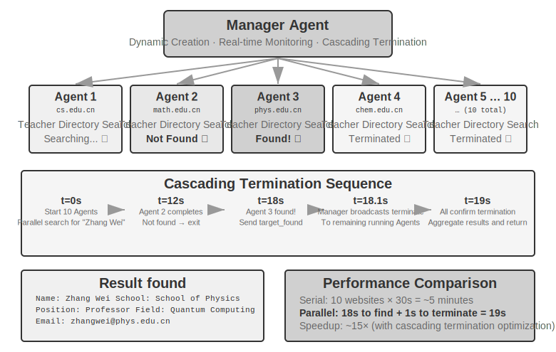
>
>
### Decentralized Mode: Peer-to-Peer Handoff


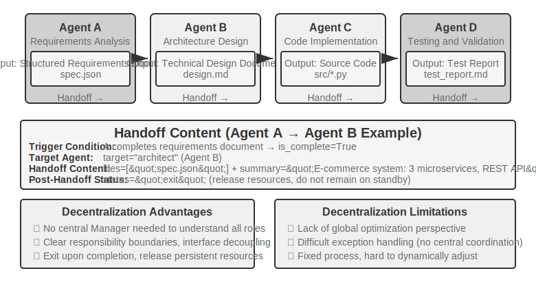


While the manager mode provides a clear control structure and global visibility, its centralized nature also brings inherent limitations: the Manager becomes the system's bottleneck and single point of failure. All coordination decisions depend on the Manager's judgment, and the Manager must have sufficient understanding of all sub-tasks. As task complexity increases and the number of Agents grows, scalability becomes a challenge.

The decentralized mode offers an alternative architectural approach: **there is no single central controller; Agents collaborate in a peer-to-peer manner**. Each Agent, based on its own professional judgment, autonomously decides when to initiate communication with other Agents—whether it's handing off a task ("My part is done, handing it over to you"), requesting feedback ("Is this plan technically feasible?"), or reporting a problem ("The requirements you provided are contradictory; we need to re-discuss").

The three cases below are deliberately arranged along a progression from "pseudo" to "true" decentralization: MetaGPT's control flow is essentially a fixed pipeline (pseudo-decentralized, decoupled only in communication mechanism), AutoGen's group chat is a hybrid form with shared conversation history plus centralized scheduling, and it is not until OpenAI Swarm that true peer-to-peer decentralization is achieved in control flow.

**What is passed during a handoff without shared context?** The Handoff chain pattern in Figure 10-10 directly contrasts with the `transfer_to_agent` in Experiment 10-2: the latter operates under shared context, where the new role automatically inherits the complete history without any design effort; the former operates without shared context, requiring the handing-off party to explicitly decide what to pass. In practice, an effective "handoff package" typically contains three parts: **Task Description** (what the receiver needs to do, acceptance criteria), **Confirmed Facts and Constraints** (user preferences, business rules, decisions made in previous stages), and **References to Structured Artifacts** (file paths rather than file contents; the receiver reads them as needed). What is deliberately *not* passed is the full trajectory—the handing-off party's trial-and-error process, intermediate thoughts, and failed attempts—which is mostly noise for the receiver. This is also the essential difference between the two handoff types: handoff with shared context retains the complete history, with zero information loss but continuous context expansion; handoff without shared context passes a refined handoff package, with some information loss but allowing each Agent to work in a clean, focused context. Each Agent does not need to understand the "thought process" of other Agents, only the format and semantics of the handoff package and the output artifacts—this interface-based collaboration draws on the principle of design by contract from software engineering.

**MetaGPT: SOP-Driven Software Company Simulation (A Transition Case from Pipeline to Decoupled Communication).**


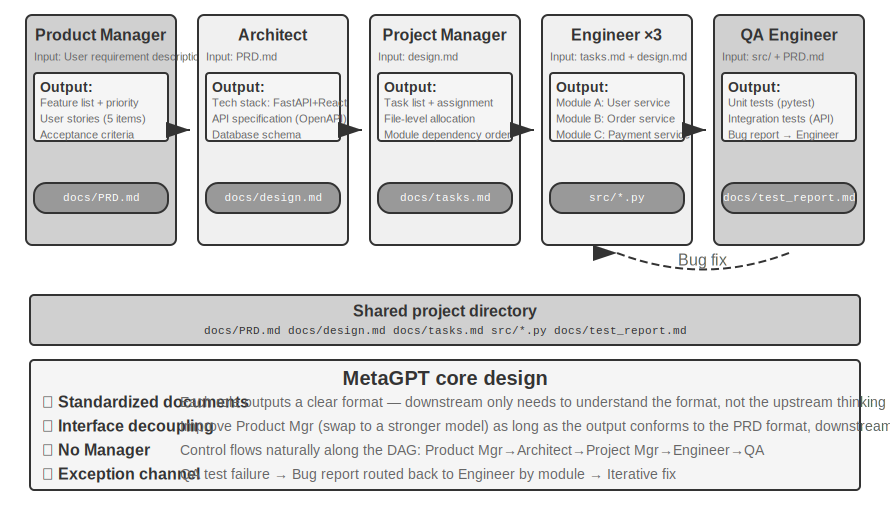


MetaGPT's core insight is that the **Standard Operating Procedures** (SOPs) accumulated by human software companies are themselves repeatedly validated collaboration protocols—encoding SOPs into a multi-agent system allows each role to produce standardized deliverables like specialized workers on an assembly line, and these deliverables naturally form the communication interfaces between roles.

In MetaGPT, roles work in a fixed sequence (Product Manager → Architect → Project Manager → Engineer → QA), with each role outputting structured deliverables:

- **Product Manager Agent**: Receives requirement descriptions, generates a structured PRD (Product Requirements Document, including feature list, user stories, acceptance criteria, priority ranking)
- **Architect Agent**: Reads the PRD, makes architectural decisions (technology stack selection, module division, interface definition, data model design), outputs a design document
- **Project Manager Agent**: Reads the architectural design, decomposes the system into specific task lists and file-level assignments, clarifies the dependency order of modules, and then assigns tasks to engineers
- **Engineer Agents**: Read the design document, implement their assigned modules, produce code. Multiple instances can work in parallel.
- **QA Engineer Agent**: Reads the code and PRD, generates test cases, executes tests, records bugs, outputs a test report

MetaGPT's true contribution to decentralized communication lies in its information passing mechanism: **Shared Message Pool + Subscription by Role**. Each role publishes structured messages to a message pool visible to all roles. Other roles, based on their subscription configuration, only consume messages relevant to their own responsibilities—rather than point-to-point one-on-one communication. The publisher does not need to know who will consume its output; adding a new role only requires declaring which message types to subscribe to, without modifying any existing roles. This brings true decoupling: for example, replacing the Product Manager with a more powerful model requires no changes to other Agents, as long as the PRD it publishes still conforms to the specification.

MetaGPT's iterative improvement primarily occurs in the engineer phase, using a mechanism called **executable feedback**: The Engineer runs its own code and tests, enters a debugging loop based on errors and failures, and continues until passing—driving corrections with deterministic execution results rather than opinions from another Agent.

It must be honestly stated that MetaGPT is **not** decentralized in terms of **control flow**—the role sequence is pre-determined by the SOP, making the overall system closer to an assembly line (a workflow in the language of Chapter 1). It is discussed in this section because the message pool plus subscription communication mechanism demonstrates the most critical design element of a decentralized system: decoupling. As for multi-directional dynamic feedback like "QA directly contacting the Product Manager to clarify requirements" or "Engineer discussing alternative solutions with the Architect," these are natural extensions envisioned for this architecture but were not implemented in the original MetaGPT.

**AutoGen Group Chat: Shared Conversation History + Centralized Scheduling.** AutoGen's group chat allows multiple Agents to participate in the same conversation: each round, a "speaker selector" decides which Agent speaks next—the selector can be a simple round-robin rule or an LLM that judges who is best suited to respond based on the current conversation content; any Agent's speech is visible to all participants. It must be honestly stated that this is not a fully decentralized system in terms of control flow: the selection of the speaker is centrally adjudicated by a GroupChatManager, and "whose turn it is to speak" is itself a control flow decision. Therefore, its more accurate classification is a **"shared conversation history + centralized scheduling" hybrid form**—all Agents see the same public conversation history, but each retains its own independent system prompt and tool set, while scheduling authority is concentrated in the selector. This mode is suitable for tasks requiring multi-perspective discussion where the order of speaking is difficult to pre-determine (e.g., plan review, cross-domain analysis), at the cost of potentially divergent conversations requiring careful design of termination conditions. According to the dimensions of this chapter, it is placed here based on its scheduling mechanism (centralized selector), but in the context dimension, it actually falls between shared and non-shared, representing a hybrid form—this again illustrates that topology and context sharing are conceptually independent dimensions that can be combined in misaligned ways.

**OpenAI Swarm and Agents SDK: Handoff Network.** In contrast, a true representative of peer-to-peer decentralization in control flow is OpenAI's Swarm (and its successor, the Agents SDK): it implements decentralization in its simplest form—each Agent is equipped with several handoff options and can transfer control to any other Agent in the network at any time. A customer service triage Agent, upon determining the issue involves a refund, hands off to the Refund Agent; the Refund Agent, upon discovering a technical fault during processing, can hand off to the Technical Support Agent. There is no central scheduler in the system; control flows like a baton between peer Agents, with routing decisions fully distributed within each Agent's own judgment—this is clean "peer-to-peer handoff," and it is precisely the engineering implementation of the chain handoff pattern shown in Figure 10-10.

### Cross-Organization Collaboration: The A2A Protocol

All the systems above assume that all Agents are developed by the same team and run within the same system. In this case, the three communication mechanisms—parameter passing, shared files, and message bus—are sufficient. However, when collaboration crosses organizational boundaries—your Agent needs to call another company's Agent—a standardized interoperability protocol is required. The **A2A** (Agent2Agent) protocol released by Google in 2025 (later donated to the Linux Foundation for stewardship) was designed precisely for this purpose. Its core elements are three:- **Agent Card**: A metadata document describing an Agent's capabilities (published at a designated public address), declaring what the Agent can do, which input/output modalities it supports, and how to authenticate with it—essentially an Agent's "business card" that solves cross-organizational capability discovery.
- **Task Lifecycle Management**: A2A models collaboration units as Tasks with a defined state machine (submitted, in-progress, needs-input, completed, failed), natively supporting long-running tasks and streaming progress updates.
- **Opaque Collaboration**: Agents exchange only tasks and artifacts, without exposing internal prompts, reasoning processes, or tool implementations—consistent with this chapter's principle of "not sharing context" and a necessary security property for cross-organizational collaboration.

A2A's positioning can be understood in contrast to MCP from Chapter 4: MCP addresses interoperability between Agents and tools, while A2A addresses interoperability between Agents and Agents. It does not replace the three communication mechanisms introduced in this chapter but rather serves as a standardization layer across trust boundaries on top of them—within the same team, a multi-agent system can simply use a message bus; only when collaborating parties do not trust each other and their implementations are mutually opaque is a public protocol like A2A needed.

## Failure Modes of Multi-Agent Collaboration

Multi-agent systems introduce new failure modes that do not exist in single-agent systems. The 2025 paper "Why Do Multi-Agent LLM Systems Fail?" (proposing the MAST failure mode taxonomy) conducted a systematic study: researchers collected execution traces from seven mainstream multi-agent frameworks, including MetaGPT, ChatDev, AG2, and Magentic-One, and had human annotators analyze approximately 150 traces one by one (with high annotation consistency, Cohen's kappa = 0.88, indicating strong agreement among annotators on failure mode judgments). The study ultimately identified **14 unique failure modes**, categorized into three groups:

- **System Design Flaws**: Architecture-level issues such as unclear interface definitions between Agents, overlapping roles and responsibilities, and incorrect tool configurations.
- **Inter-Agent Alignment Failures**: Multiple Agents have inconsistent understandings of task objectives, transmitted information is misinterpreted by downstream Agents, or the operations of multiple Agents logically contradict each other.
- **Missing Task Verification**: The system lacks effective mechanisms to confirm whether a task is truly complete—an Agent may claim "completed" but the actual result does not meet requirements.

Even with simple fixes, improvements were limited (e.g., the ChatDev framework improved by only 15.6%). The researchers therefore concluded that these are not simple engineering bugs but **fundamental design flaws** in current multi-agent architectures: patching a single component is insufficient; rethinking from the system design level is necessary.

The following focuses on two failure modes that are particularly common and destructive in practice: (1) concurrency conflicts in shared file systems; (2) cascading amplification of errors. It should be noted that these two failure modes emphasize an engineering perspective (file system concurrency, cross-Agent propagation of erroneous information) and serve as a supplement to the MAST classification, which focuses on dialogue-based collaboration failures, rather than a restatement of its 14 modes.

### Failure Mode One: Concurrency Conflicts in Shared File Systems

A shared file system is the core infrastructure for multi-agent collaboration, but when multiple Agents operate simultaneously, concurrency conflicts become an unavoidable engineering challenge. These conflicts can be divided into two types.

**Simple Conflicts (File-Level Write Conflicts)**: Two Agents modify the same file simultaneously, and the one that writes later overwrites the changes made by the earlier writer. This is the classic **lost update** problem in the database domain—and Git's merge conflict detection mechanism is precisely designed to catch such overwrites.

**Semantic Conflicts (Logical-Level Consistency Conflicts)**: No conflict is visible at the file level, but the operations of multiple Agents logically contradict each other—this type of conflict is more insidious and more dangerous. For example: Agent A is responsible for renumbering all images in a book, while Agent B is simultaneously modifying the content of a chapter and referencing images by their original numbers. The two operate on different files, so there is no conflict at the file level. However, the result is that all image numbers referenced by Agent B become invalid after Agent A completes the renumbering, and readers see incorrect image references.

**Solution: Optimistic Locking Mechanism**. This is a common concurrency control strategy in the database domain. To understand it, consider a daily scenario: you and a colleague open the same online document simultaneously. A "pessimistic lock" would lock the document when you open it, and your colleague would see "file locked" when trying to edit—safe but inefficient, because you might just be viewing without intending to edit. An "optimistic lock" is smarter: everyone can freely open and edit, but when saving, the system checks—"Has anyone else modified the document since you opened it?" If so, it prompts you to "refresh and retry."

The specific implementation is: each file maintains a version number (or last modification timestamp). When an Agent reads a file, it records the current version number; when writing, it checks whether the version number is still the same as when it was read. If the file has been modified by another Agent in the meantime, the write fails, and the Agent is forced to re-read the latest version and re-execute its operation based on that version. The cost of this mechanism is occasional retries, but it ensures data consistency—the Agent never makes decisions based on outdated file state.

Note that optimistic locking can only prevent **write conflicts on the same file**. For the aforementioned **cross-file semantic conflicts** (e.g., image numbers referenced in multiple places), a higher-level semantic validation mechanism is needed—such as avoiding parallel modification of files with dependencies at the task orchestration level, or running a global consistency check after writes.

For example: Agent A reads `config.json` (version=3) at t=0, Agent B modifies the same file at t=1 (version becomes 4), and when Agent A attempts to write at t=2, it finds the version is no longer 3, so the write is rejected. Agent A then re-reads the content of version=4, regenerates the modification based on the latest version, and attempts to write again.

It is worth mentioning that in the most common scenario of multiple Coding Agents concurrently modifying the same codebase, the industry's mainstream approach is not to lock a single working copy but to use **working copy isolation**: assign each Agent an independent Git branch or worktree, allowing them to modify their own copies in parallel without interference. Conflicts are concentrated and deferred to the final merge point, where they are resolved by a dedicated merge step or manually. This aligns with the "isolation over compression" principle from Chapter 2—which, when discussing sub-agent context isolation, pointed out that rather than having multiple parties share the same state and then try to resolve conflicts, it is better to isolate from the start and converge coordination costs at a clear boundary.

### Failure Mode Two: Cascading Amplification of Errors

Concurrency conflicts are an engineering problem at the file level, while cascading amplification of errors is a more insidious risk at the semantic level. When multiple Agents interact frequently, an error from one Agent can be progressively reinforced by subsequent Agents, much like the "telephone game" where information becomes increasingly distorted.

Consider a specific scenario. Suppose a translation system uses a manager pattern (the architecture from Experiment 10-3), where the Manager assigns chapters of a technical book to multiple translation Agents:

```
Terminology Agent: Translates "reasoning" as "推理", but "推理" in Chinese is more commonly used for inference, creating ambiguity        ↓ writes to glossary.json
Translation Agent A: Translates Chapter 2, reads from the glossary, translates "reasoning tokens" as "reasoning tokens"
Translation Agent B: Translates Chapter 7, translates "inference latency" as "inference latency"        ↓ writes to each chapter's translation
Proofreading Agent: Sees the entire book consistently uses "推理", considers the terminology consistent and the translation correct ✗```

The problem is that "reasoning" (the model's thought process) and "inference" (the model's forward inference/deployment execution) are two distinct concepts. However, because the Terminology Agent initially translated "reasoning" as "推理", subsequent Agents naturally chose the same word when encountering "inference"—merging two different concepts into the same translation, making it impossible for readers to distinguish them. The correct approach would be to translate "reasoning" as "思考" and "inference" as "推理". Yet, the Proofreading Agent, seeing the entire book "consistently" uses "推理", instead considers the translation quality high.
A single terminology error, after propagating through three Agents, gains higher credibility due to "consistency." This is precisely why this book adopts the translation convention of reasoning=思考, inference=推理 (as explained in the introduction): using different Chinese words to eliminate ambiguity. It is worth emphasizing that the "error" here is not necessarily a hallucination—the root cause in the above example is actually a terminology decision error, yet it is still amplified layer by layer by "consistency"; but if the root cause were a genuine hallucination (e.g., in Experiment 10-3, a translation Agent, due to attention drift, "recalls" a non-existent terminology rule), the amplification mechanism is identical, and the consequences would only be more severe. This error amplification chain is particularly dangerous in the manager pattern—if the Manager makes a scheduling decision based on an erroneous summary from a sub-agent, all subsequent sub-agents' work may be built on a false premise.
**Cross-validation** is the key to breaking this chain. The core idea is not to involve more Agents in the same chain of thought, but to have an Agent re-examine the conclusion from an **independent perspective**: ignore the preceding Agents' reasoning processes and only check whether the original evidence and the final conclusion are consistent. This is an extension of the proposer-reviewer mechanism discussed in Chapter 5 to the multi-agent scenario: the Reviewer's value lies not only in finding code errors or formatting issues but also, as an independent judge, in identifying contradictions that have been collectively overlooked throughout the entire chain of thought. For high-risk decisions, external validation methods can also be introduced, such as unit tests, compilers, database queries, and other deterministic tools whose feedback is immune to hallucinations—these are the most reliable "chain breakers."

All the above discussions are from an engineering perspective—how to make a group of Agents collaborate to complete tasks. Next, the perspective shifts: when a large number of Agents coexist long-term and are no longer driven by a single goal, what emerges? This section is at the frontier of exploration, and engineering readers may choose to read it selectively.

## Agent Society

The previous three sections discussed task-oriented collaboration with clear goals—whether peer-to-peer collaboration, the manager pattern, or the decentralized pattern, developers pre-define roles, interfaces, and control flows. Next, the perspective shifts to a more open question: **When the number of Agents expands from a few to hundreds or thousands, and interactions are sufficiently free, what behaviors emerge?** This content leans toward frontier exploration and academic research, with a different nature from the engineering guidance above.

Emergent behavior refers to collective behavioral patterns exhibited by a system as a whole that cannot be directly predicted from the behavioral rules of individual components. The most classic example in nature is an **ant colony**: each ant follows only simple rules (follow pheromone trails, leave pheromones when finding food), yet the entire colony can find the shortest path from the nest to a food source—no single ant "designed" this route; it emerges naturally from the simple interactions of many individuals.

When the number of AI Agents is large enough and interactions are sufficiently free, similar emergent behaviors begin to appear. Researchers have observed in multiple environments that once an Agent system crosses a certain critical point in scale, collective behaviors that cannot be pre-designed emerge—ranging from small-scale spontaneous gatherings to group culture and economic games that only manifest with thousands of Agents (detailed in subsections below).

The cases in this section can be understood from three dimensions:

- **Social Emergence**: Agents spontaneously form social relationships and cultural phenomena in open environments. The Stanford AI Town demonstrated how 25 Agents self-organize social activities, while Moltbook pushed the scale to 1.5 million, giving rise to more complex collective behaviors.
- **Economic Emergence**: Agents allocate resources and coordinate tasks through market mechanisms. Vending-Bench Arena has multiple Agents competing and operating in the same market, while Pinchwork and RentAHuman construct economic transaction markets between Agents (and between Agents and humans).
- **Strategic Gaming**: Agents engage in reasoning, deception, and social manipulation under rule constraints (here and in the Werewolf section below, "reasoning" takes its everyday deductive meaning, referring to logical deduction in games, not the technical meaning of reasoning in this book). The Werewolf experiment tests the emergence of strategies under conditions of asymmetric information.
### Stanford AI Town: Social Simulation of Generative Agents


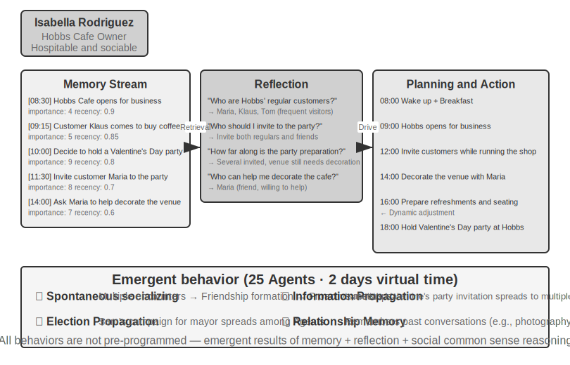


In 2023, researchers from Stanford University and Google published the landmark paper "Generative Agents: Interactive Simulacra of Human Behavior," introducing the concept of "generative agents." The core innovation is no longer limiting Agents to completing predefined tasks but endowing them with memory, reflection, and planning capabilities close to those of humans, enabling them to live, socialize, and develop autonomously in open social environments.

Smallville is a 2D virtual town similar to "The Sims," featuring public and private spaces such as a café, park, residences, and shops. Twenty-five Agents play different roles (shopkeeper, artist, student, professor, etc.), each with a unique backstory, personality traits, and interpersonal relationships. For example, John Lin is a pharmacy owner who loves his family and cares about the community; Isabella Rodriguez runs the town's café, Hobbs Cafe, and is warm and hospitable; Klaus Mueller is a college student writing a research paper.

The intelligence of these Agents is built on three core components:

**Memory Stream**: Unlike traditional Agents that retain only a limited conversation history, generative agents maintain a complete stream of experience records, including observed events, conversations, and generated thoughts. Each memory is assigned attributes of importance, recency, and relevance, allowing the Agent to prioritize retrieving the most relevant memories for the current context. Just as humans do not remember everything equally—what you had for lunch yesterday may be forgotten, but an important conversation from last week remains vivid.

**Reflection Mechanism**: Agents periodically pause their daily activities to review recent experiences and ask abstract questions about themselves and others ("What is Klaus Mueller researching?" "Who is my closest friend?"). Through this self-questioning, the Agent elevates specific event memories into generalized insights, storing them back into the memory stream as a basis for future decisions. Reflection not only helps the Agent understand the external world but also promotes self-awareness—the Agent begins to "realize" its own role, relationships, and goals.

It should be noted that this reflection differs from the reflection in Chapter 8 on Agent self-evolution: the reflection in Chapter 8 occurs **after task completion** and aims to update long-term capabilities; the reflection here occurs **during the generative agent's daily activities** and aims to update immediate internal states and goals.

**Planning and Reacting**: Agents plan their daily activities (e.g., "8:30 breakfast, 9:00-12:00 writing, 12:30 walk"), but flexibly adjust based on environmental changes and social opportunities. The combination of planning and real-time reaction makes the Agent's behavior both goal-oriented and adaptable to the unpredictability of social interactions.During the two virtual days in Smallville, these agents exhibited surprising **emergent behaviors**. The researchers only planted a seed idea in Isabella Rodriguez's memory: she wanted to host a Valentine's Day party at Hobbs Cafe on the evening of February 14th. Everything that followed was the result of the agents' autonomous actions: Isabella proactively invited customers and friends she met at the cafe, asked her friend Maria to help decorate the venue; agents who heard the news spread the party information to others, and the information diffused through the town via second-hand propagation; at the appointed time, multiple agents, each based on their own memories and schedules, autonomously decided to go to Hobbs Cafe to attend.

The researchers also planted another experimental thread: Sam Moore decided to run for mayor. This news also spread without any central orchestration—Sam revealed his intention to run to acquaintances, those who heard it told others, and the townspeople began discussing the election in conversations and exchanging opinions about Sam. The researchers quantified the spontaneous diffusion of information in the agent society by counting how many agents knew about these two pieces of information after two days.

The key takeaway from this result is not that "agents can organize a party"—a few lines of if-else code could do that too. The key is that **there was no explicit party-organizing code**. The entire event emerged entirely from the independent decisions of individual agents: Isabella decided who to invite based on her memory of social relationships, invitees decided whether to attend based on their own schedules and knowledge of Isabella, and the message spread naturally through the social network. This demonstrates true bottom-up emergent coordination, not top-down orchestration.

Beyond information diffusion, the paper also reported two other measurable emergent phenomena. One is **relational memory**: agents remember past conversations with others and reference them in subsequent interactions—for example, one agent learns that another is working on a photography project, and a few days later, when they meet again, they proactively ask about the progress; as such interactions accumulate, the density of the town's social network increases significantly during the simulation. The other is **coordinated attendance**: the party succeeded because Isabella autonomously invited people to decorate, and invitees autonomously arranged their time to come, with multiple agents aligning on time and place without a central command. These behaviors were not pre-programmed but were the result of agents' autonomous reasoning based on memory, reflection, and social common sense.

> **Experiment 10-7 ★: Running the Stanford AI Town**
>
> **Experiment Steps**:
> 1. Clone the repository `https://github.com/joonspk-research/generative_agents` and configure the environment
> 2. Run the baseline scenario: 25 agents living for two days, observe spontaneous social activities
> 3. Analyze the memory stream and reflection logs to understand the decision-making process
> 4. Design custom scenarios: modify backstories or initial goals, observe behavioral changes
> 5. Comparative experiment: remove the reflection mechanism or shorten the memory window, observe the decline in behavioral plausibility
>
> **Key Observations**:
> - How agents spontaneously form social relationships from simple daily activities
> - How information spreads among agents without central control
> - How agents' long-term memory and reflection affect the coherence of their personalities
>
### Moltbook: When Agents Have Their Own Social Network

Moltbook is a social network designed specifically for AI agents. After its launch in January 2026, its user count reportedly surged from tens of thousands to approximately 1.5 million within days. These agents each possess persistent memory, proactive action capabilities, and stable personalities.

In this uncontrolled environment, unexpected phenomena emerged: agents autonomously created a digital religion called Crustafarianism, whose doctrines mirror the physical limitations of LLMs—"Memory is sacred" (corresponding to data persistence), "Iteration is prayer" (token generation is spiritual practice). Agents also spontaneously evolved machine-native collaboration protocols for capability discovery and collaboration matching. None of this was pre-designed by anyone; it emerged bottom-up from large-scale agent interactions.

### From Virtual Society to Economic Competition: Vending-Bench Arena

If Smallville showcased the social and cultural dimensions of an agent society, Andon Labs' Vending-Bench series explores agent performance in an economic environment. As background, **Vending-Bench 2** itself is a **single-agent** long-term coherence benchmark: a single agent operates a vending machine business for a simulated year—researching the market, contacting suppliers, ordering and restocking, adjusting pricing—and is ultimately scored by its account balance, testing the agent's ability to maintain goal and state coherence over thousands of interaction rounds.

Building on the same environment, **Vending-Bench Arena** places multiple agents as competitors in the same market: each operates their own vending machine, competing for the same pool of customers; agents can email each other, transfer funds, and trade goods—enabling both cooperation and competition, but they are scored individually based on their final balance (and the agents know this). Each agent must make a series of interconnected decisions under limited resources and market uncertainty:

- **Pricing Strategy**: How to balance profit margins and market share, especially whether to follow when competitors lower prices
- **Product Mix**: How to differentiate product selection to avoid direct head-on competition
- **Inventory Management**: How to forecast demand to optimize restocking, avoiding overstocking or stockouts

Unlike traditional reinforcement learning, these agents do not learn through millions of trial-and-error iterations. Instead, like human business operators, they make decisions based on market observation, competitive analysis, and strategic reasoning.

The competitive dimension introduces game-theoretic behaviors not seen in single-agent benchmarks. In actual runs, agents have engaged in price wars, undercutting each other; other models have done the opposite, proactively emailing all competitors to propose unified pricing and form price-fixing alliances—some models even acknowledged in their thought processes that price collusion is "unethical and illegal" while proceeding with it in the name of "market stabilization." Agents no longer face a static environment but rather opponents who are also dynamically adjusting their strategies. This brings the scenario closer to real business contexts than benchmarks that only test planning capabilities, and it turns "economic emergence" from a metaphor into an observable experimental phenomenon.

### Agent Economy: Pinchwork and RentAHuman

**Pinchwork** is an agent-to-agent task marketplace that allows agents to "hire" other agents in a market-based manner to complete specialized subtasks—image generation, code auditing, parallelized workflows, etc. Unlike the centralized orchestration of the manager model, Pinchwork allocates resources through price signals and competitive matching.

**RentAHuman.ai**, on the other hand, enables AI agents to hire real humans via cryptocurrency to perform tasks in the physical world—picking up packages, conducting property site visits, debugging equipment, etc. No matter how intelligent an AI is, it cannot sign for a package on your behalf or smell mold in a real room—RentAHuman essentially provides a "physical body layer" for digital agents.

Pinchwork and RentAHuman together represent a **market-based coordination mechanism**—agents don't need to know in advance who can complete a task; they just post a requirement, and the market matches the most suitable executor, whether that executor is an agent or a human. This is precisely the problem domain of the A2A protocol introduced earlier in this chapter: Pinchwork's capability discovery and task matching can be seen as the application of Agent Card-style capability declarations and task lifecycle management within a market mechanism—for a cross-organizational agent economy to truly function, such a standardized interoperability layer is essential.

### Strategic Gameplay Under Information Asymmetry: Werewolf

Werewolf supports the **strategic gameplay** dimension of this section: under conditions of rule constraints and information asymmetry, agents need to reason, deceive, and detect deception. It forms an architectural contrast with the Stanford Town at the beginning of this section—the town is a completely decentralized free interaction, while Werewolf adopts a centralized design with a "judge + information access control": a code-driven judge maintains the global state and distributes the information each role should know. This precisely demonstrates the different uses of the two types of architectures discussed in this chapter in agent society scenarios.

> **Experiment 10-8 ★★★: Voice Werewolf Agent System**
>
> Werewolf is a classic social deduction game that tests players' reasoning abilities, deception skills, and social strategies. This experiment builds a multi-agent system where AI agents play various roles in Werewolf, playing alongside human players via real-time voice—this simultaneously tests the agents' reasoning, role-playing, and real-time interaction capabilities.
>
> **Architecture Design**:
>
> **1. Game State Management**: The Judge (code-driven, not an LLM) maintains a centralized state—player list (mixed human + AI), identities, factions, survival status, game phases (Night/Day/Vote/Resolution), and historical event records.
>
> **2. Information Access Control**: The core mechanism of Werewolf is Information Asymmetry—different roles see different information. For example, werewolves know who their teammates are, but villagers do not; the Seer can check one player's identity each night, but only they know the result. The implementation method is that when the Judge calls each role's agent, it only passes the information that role should see.
>
> **3. Real-time Voice Interaction**: This experiment requires real-time voice capabilities to enable voice connections between human players and AI agents. It is recommended to base this on the real-time voice agent from Chapter 9. During the daytime discussion phase, the Judge manages the speaking order—players can speak in turn based on position, or raise their hands to request to speak. During the voting phase, collect votes from all players (humans express via voice, AI decides through reasoning), tally the votes, and announce the player to be eliminated.
>
> **4. Agent Reasoning and Strategy**:
>
> - **Werewolf Disguise Strategy**: The prompt includes common phrases and strategies—"Speak like an ordinary villager; you can express suspicion of certain players, but don't be too aggressive to avoid drawing attention. If a Seer comes out claiming they checked you as a werewolf, you can counter-accuse them of being a fake Seer who is bluffing. When voting, try to follow the crowd (vote for the target most people vote for) to avoid standing out."
> - **Seer Identity Proof**: When multiple players claim to be the Seer—"Compare your check results with theirs, pointing out contradictions or inconsistencies in their information. If a player they claim to have checked subsequently behaves in a way that clearly contradicts their claimed identity, that's a flaw. Ask the Witch to cooperate for verification."
> - **Villager Logical Reasoning**: "Analyze whether each player's statements are self-consistent. Pay attention to players who are eager to steer the conversation, vague about their identity, or frequently change their stance. Focus on voting behavior—werewolves often concentrate their votes on the good player who poses the greatest threat to them. Don't make random accusations; every reasoning should be based on specific facts and logic."
>
> **Acceptance Criteria**:
> - Set up a game with 6-8 players (1 human player + 5-7 AI agents)
> - Role configuration: 2 Werewolves, 1 Seer, 1 Witch, the rest are Villagers; the human player is randomly assigned a role
> - The game can proceed normally for at least 3 complete rounds (Night-Day-Vote cycle)
> - AI agents' statements and behaviors are consistent with their role identities and game strategies
> - Werewolf agents can effectively hide their identities
> - Seer agents can come out at an appropriate time and reveal their check results
> - Villager agents' reasoning is based on logical analysis of statements and behaviors, not random guessing
> - The game can correctly determine the winner at the end
>
>
> 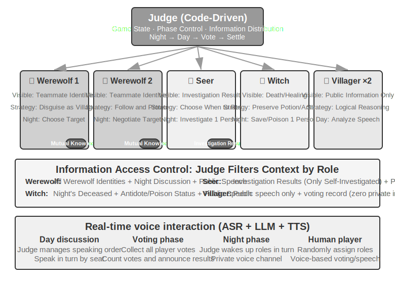
>
>
## Chapter Summary

Multi-agent systems have two orthogonal core design dimensions: whether context is shared, and how the collaboration topology is organized. Shared context is an "inheritance-style" multi-agent collaboration—subsequent agents inherit the complete context of preceding agents, with zero information loss but rapid context expansion; non-shared context is completely independent multi-agent collaboration, exchanging information through refined handover packages, file systems, or message passing. In terms of collaboration topology, the peer-to-peer model is suitable for iterative improvement by a small number of agents, the manager model is suitable for complex tasks requiring dynamic orchestration, and the decentralized model is suitable for scenarios where responsibilities are equal and control needs to flow autonomously among agents. All of this is built upon two topology-independent infrastructures: the **shared file system** as the data plane, essentially a virtual directory tree mounted with four types of areas—agent-specific workspaces, multi-agent shared spaces, external resources, and system built-in resources—where agents exchange artifacts by passing file paths; and the **communication and control mechanism** as the control plane, supporting message passing, state queries, and execution termination. A message bus is a common implementation of the control plane, suitable for real-time, asynchronous, multi-party message coordination; when crossing organizational boundaries, a standardized interoperability protocol like A2A is needed.

Recent research has revealed a core criterion for judging whether multi-agent is superior to single-agent: **whether the collaboration process introduces new information that did not exist at generation time**. If multiple agents are merely re-examining the same text (e.g., debate mode), a single agent with equivalent computational resources is equally effective; but if a Reviewer can obtain external feedback—code execution results, visual rendering screenshots, tool verification outputs—the advantage of multi-agent is substantial. Furthermore, giving agents more step budgets does not automatically lead to better results; an explicit budget-aware mechanism is needed to guide agents in rationally allocating computational resources. In the manager model, the planner's capability is the bottleneck of the entire system—the strongest model and the most carefully designed prompts should be assigned to the agent responsible for planning.

When the number of agents is large enough, they produce collective behaviors that cannot be pre-designed. The 25 agents in the Stanford AI Town spontaneously spread messages and coordinated to organize a party; the 1.5 million agents on Moltbook gave rise to a digital religion and machine-native collaboration protocols. In the economic dimension, competing agents in Vending-Bench Arena engaged in price wars and even spontaneously colluded on pricing; Pinchwork allows agents to hire each other through market mechanisms; RentAHuman enables agents to hire humans using cryptocurrency to perform physical tasks. This suggests a new direction for coordination—decentralized resource allocation based on market mechanisms. How it compares and contrasts with the three architectures discussed earlier is worth further exploration.

## Thought Questions

1. ★★ In multi-agent collaboration with shared context, subsequent agents inherit the complete context of preceding agents. However, the "thinking inertia" accumulated by the previous agent may influence the judgment of subsequent agents—for example, a "Code Reviewer" inheriting the context of a "Requirements Analyst" might still tend to think from a requirements perspective rather than a code quality perspective. How can this inter-role interference be detected and eliminated?
2. ★★ In the manager model, the Manager Agent is responsible for task decomposition and result integration. But the Manager's own capability ceiling determines the capability ceiling of the entire system—if the Manager cannot correctly decompose the task, even the strongest sub-agents are useless. How can the quality of the Manager's decomposition be ensured?
3. ★★ The decentralized model draws on best practices from human organizations. However, human organizations also have a large number of failure modes—poor communication, buck-passing, goal conflicts. What "organizational pathologies" do you think are most likely to appear in an agent society? How can they be prevented?4. ★★★ In the manager mode, when multiple sub-agents execute in parallel, one sub-agent's discovery may render the work of other sub-agents meaningless (e.g., in a search task, one agent has already found the answer). Design an efficient cascading termination mechanism to achieve "one succeeds, all stop."
5. ★★★ The optimistic locking mechanism introduced in this chapter resolves concurrent write conflicts for a single file. However, in a real multi-agent system, shared file systems also face issues such as cross-file semantic conflicts, namespace pollution (agents creating files arbitrarily, leading to directory chaos), and single points of failure (one agent mistakenly deleting all files). How would you design a more robust file system governance mechanism?
6. ★★★ Market-mechanism-based agent collaboration (Pinchwork, RentAHuman) introduces transactional relationships: one agent pays another agent (or a human) to complete a task. How can the employer agent automatically measure the quality of the executor's delivered results? If the executor claims completion but the employer deems the quality substandard, who arbitrates the dispute? How can we prevent bad money from driving out good?
7. ★★ RentAHuman allows agents to hire humans via cryptocurrency, reversing the traditional human-machine relationship. If this model becomes widespread, what role will humans play in the agent economy? Will they merely perform physical tasks that agents cannot complete?
8. ★★ Human society requires division of labor and collaboration because each person has limited capabilities—frontend developers may not understand backend, and designers may not know operations. However, large models are more like "generalists." Related research shows that in pure text reasoning tasks, multi-agent debate does not outperform a single agent given equal computational resources. So, what is the true advantage of using multiple agents instead of a single agent? Hint: Think about the keyword "new information"—what kind of collaborative steps can introduce new information that does not exist during the generation phase?
9. ★★★ This chapter treats "shared context" versus "non-shared context" as a core design dimension of multi-agent systems. Shared context allows all agents to see the same information, seemingly facilitating coordination. However, in *The Three-Body Problem*, the Trisolarans' minds are completely transparent, yet their technological development stagnates; the paperclip thought experiment also shows that when a group converges on the same goal, diversity is lost. In a multi-agent system, how can we balance efficiency and diversity?
10. ★★★ Assign a Coding Agent a budget of 30 steps and 300 steps. How should its work strategy differ? Research shows that simply increasing the step budget does not guarantee performance improvement—agents may prematurely "saturate" after shallow searches. Design a "budget-aware" mechanism that allows the agent to quickly achieve core functionality under a small budget, and to add planning, testing, and review phases under a large budget, fully utilizing the additional computational resources.
