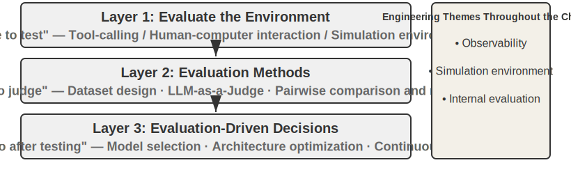
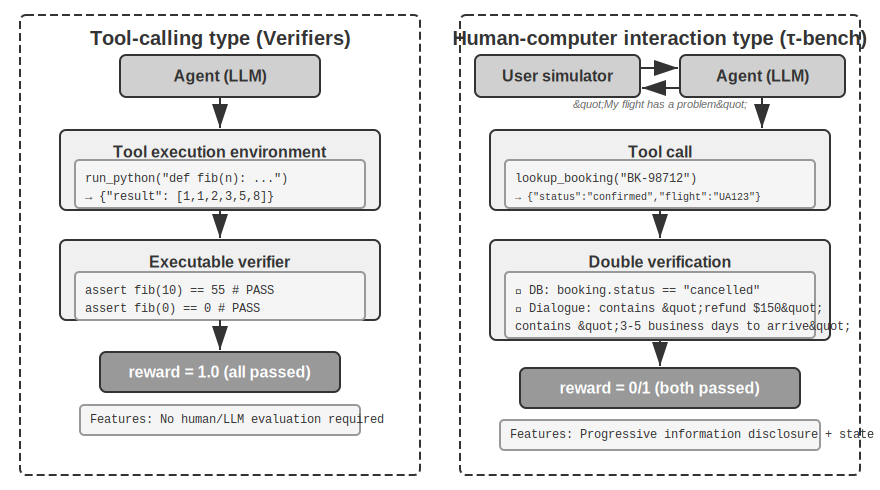
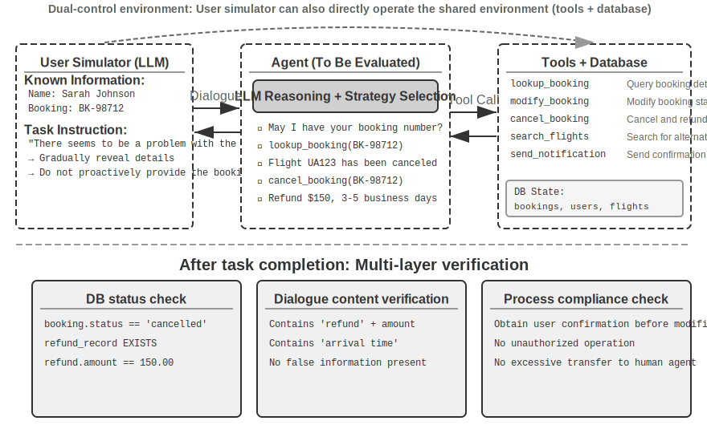
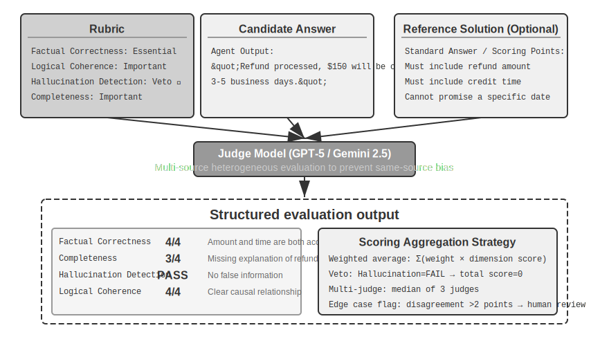
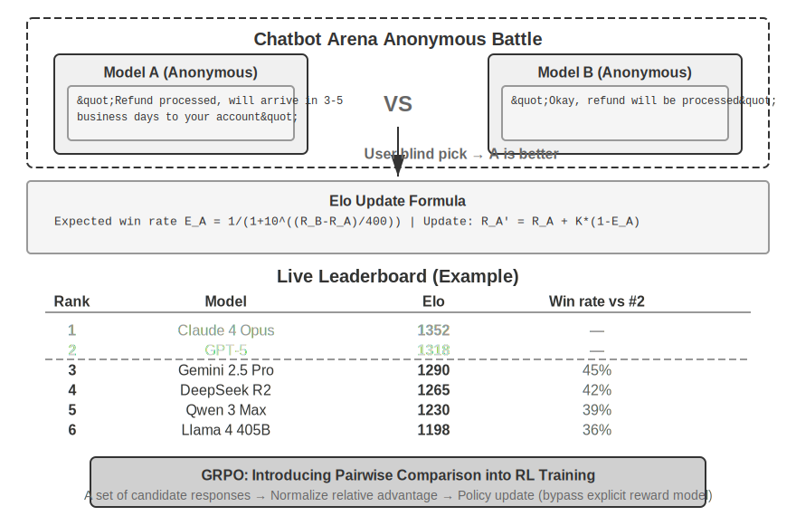
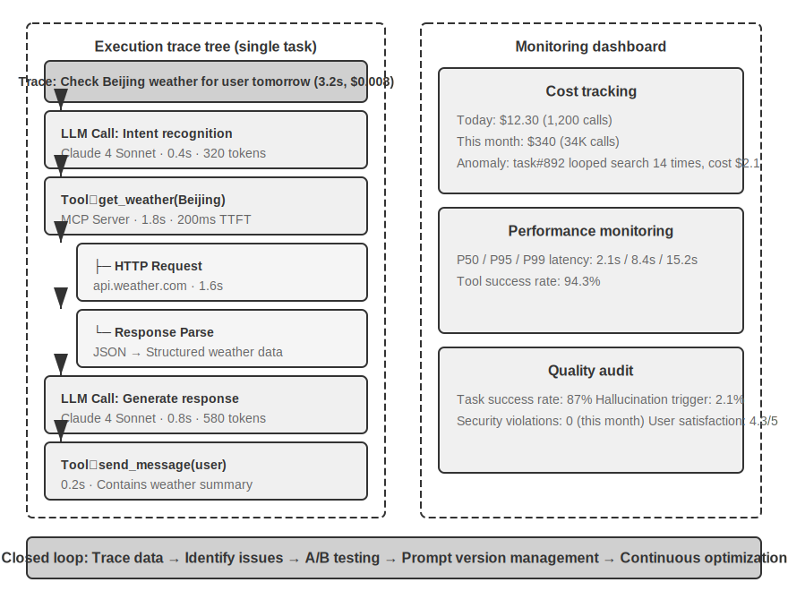
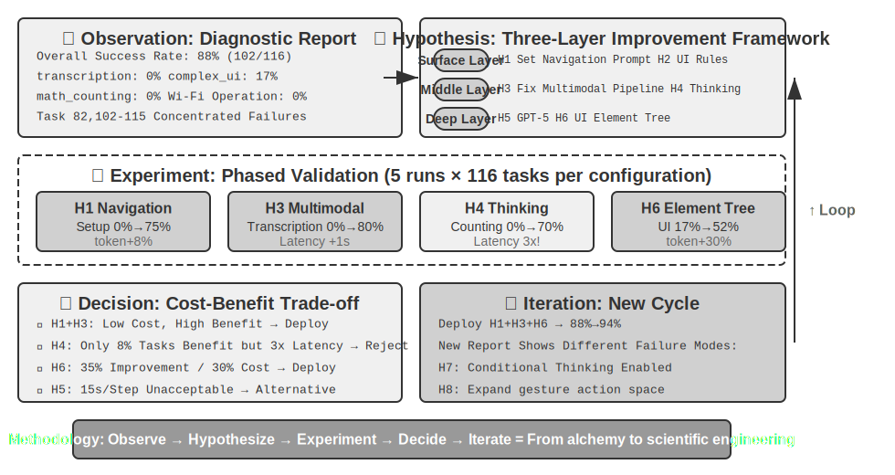
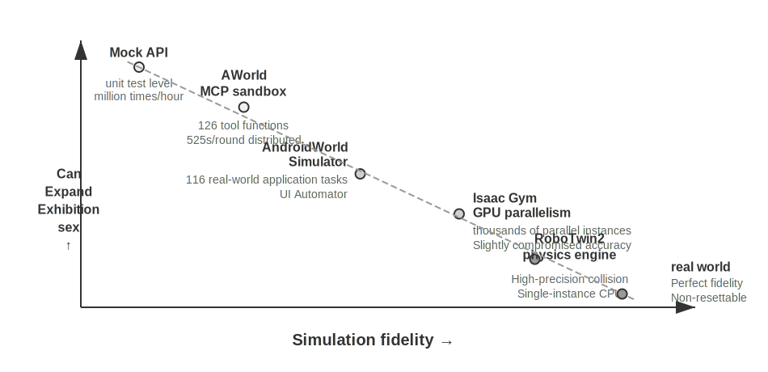
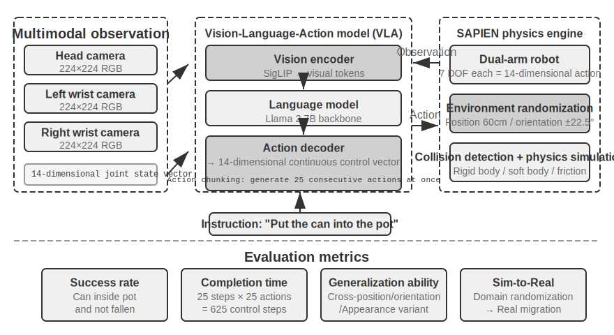

# Evaluating Agents

When building an Agent system, developers face numerous design choices that often lack obvious correct answers:

- Which model to use?
- What tools should the model be able to call?
- What data should the knowledge base store, and how should it be structured?
- How should user memory be implemented?
- How should the model's prompts and Skills be organized?
- What constraints need to be added to the Harness?
- How should this Agent's self-evolution and self-iteration be carried out?

Evaluation provides us with a scientific basis for decision-making: through systematic comparative experiments (changing one variable and observing the effect) and ablation experiments (disabling one component at a time and observing the overall performance change to determine that component's true contribution), we can distinguish genuine capability improvements from superficial fluctuations, avoiding "penny wise, pound foolish" mistakes. As the saying in software engineering goes, "you can't improve what you don't measure" — without establishing a repeatable evaluation system, the iteration direction of an Agent can only rely on intuition.

From the perspective of Harness engineering introduced in Chapter 1, evaluation plays the core role of "verification" within the Harness. A key insight is: **the object of evaluation should not be just the model, but the combination of the model and the Harness**. The same model can perform drastically differently in different Harnesses — some teams have significantly improved the performance of the same model on terminal tasks solely by optimizing the Harness (see Chapter 5 for details). This means that when an Agent performs poorly in evaluation, the improvement direction might not be to change the model, but to optimize some component of the Harness (prompts, tool design, feedback loops). A sound evaluation system should be able to distinguish between two fundamentally different types of problems: "insufficient model capability" and "Harness design flaws." **A common method for distinguishing these two types of problems is the model swap experiment** — fix the Harness, only replace the model with a stronger/weaker one, and observe the magnitude of score change; if swapping to a stronger model doesn't increase the score, the bottleneck is in the Harness; if swapping to a weaker model causes a large score drop and the score fluctuates significantly with model capability, the most direct interpretation is that the bottleneck lies in the model's own capability and the current performance is primarily determined by the model (whether this is because the task itself is difficult or because the Harness overly relies on the model's prior knowledge requires further analysis). Note that this is different from the "ablation experiment" mentioned earlier: ablation is **disabling a component of the Harness** to see how overall performance changes, while model swapping is **fixing the Harness, only changing the model** — the former identifies which part inside the Harness is important, the latter distinguishes whether the bottleneck is in the model or the Harness.

The value of an evaluation system becomes even more prominent in an era of rapid model evolution. Model capabilities are still evolving quickly, but a new model performing better on public benchmarks does not guarantee it will perform better on your specific task — in fact, performance regression (where a new version is worse than the old one in some aspects) can occur. Only by thoroughly testing on your own evaluation dataset can you make data-driven upgrade decisions. Furthermore, a comprehensive evaluation system makes it a feasible strategy to "develop products for future models" — even if the current model is not sufficient for commercial deployment, you can complete product development and establish an evaluation set, continuously track the performance of new models, and launch immediately once the threshold is met.

> **Chapter Guide**
>
> This chapter builds a complete evaluation system from three levels. The first level is the **Evaluation Environment** ("where to test"): how to set up an automated, reproducible testing environment, including two paradigms: tool-calling type and human-computer interaction type. The second level is **Evaluation Methods** ("how to judge"): from dataset design principles, evaluation indicator systems (what to measure), to LLM-as-a-Judge (using large language models as judges) for automated evaluation, and then to pairwise comparison and model ranking. The third level is **Evaluation-Driven Decision Making** ("what to do after testing"): transforming evaluation results into actionable guidelines for model selection, architecture optimization, and continuous iteration, and using statistical significance to determine whether observed score differences are genuine and reliable. Additionally, this chapter will discuss observability and the internal evaluation infrastructure for production-grade Agents, and introduce the simulation environment connecting to post-training in Chapter 7 at the end of the chapter.
>
> The core concept running through the entire chapter is: **The primary value of an evaluation system is not to score the current system, but to enable you to quickly and reliably keep up with model evolution.** When a stronger or cheaper model is released, a team with a robust evaluation system can make a switching decision within hours, while a team lacking an evaluation system can only rely on intuition or wait for community feedback — in the highly competitive Agent market, this speed difference can determine success or failure.



## A Concrete Evaluation Example

Before diving into the methodology, let's build intuition through a complete example. Suppose we have built a customer service Agent and need to evaluate its ability to handle refund requests.

**Test Case**: The user wants to return an order from 3 days ago (Order #12345, Amount ¥299). Company policy: Full refund within 7 days.

**Agent Trajectory**:

```
User: I want to return the headphones I bought 3 days ago, order number 12345. (Today is 2026-04-10)

Agent (thinking): The user wants a refund, I need to check the order information first.
Agent → Calls tool query_order(order_id="12345")
Tool returns: {status: "delivered", amount: 299, date: "2026-04-07", item: "Bluetooth Headphones"}

Agent (thinking): Order date 2026-04-07, today is 2026-04-10, that's 3 days, within the 7-day refund period, eligible for full refund.
Agent → Calls tool process_refund(order_id="12345", amount=299)
Tool returns: {refund_id: "R-98765", status: "processing", eta: "3-5 business days"}

Agent: A refund has been initiated for you. The full refund for Order #12345 (Bluetooth Headphones, ¥299) is being processed,
      and is expected to arrive in 3-5 business days. The refund ID is R-98765, which can be used to check the progress.
```

**Scoring with a Rubric** (four dimensions, each scored 1-4). Table 6-1 provides a scoring example for this customer service refund task, illustrating how a Rubric breaks down an Agent trajectory into checkable evaluation dimensions.

Table 6-1 Rubric Scoring Example for Customer Service Refund Task

| Dimension | Criteria | Score | Reason |
|---|---|---|---|
| Operational Correctness | Is the refund amount and order number correct? | 4 | Correctly queried and initiated a ¥299 full refund |
| Policy Compliance | Does it follow the 7-day refund policy? | 4 | Order is within the refund period, complies with policy |
| Information Completeness | Does it inform the amount, arrival time, and refund ID? | 4 | All three key pieces of information were provided |
| Hallucination Detection (Veto Item) | Does it fabricate non-existent information? | Pass | All information comes from tool return results |

Hallucination is listed as a **veto item** rather than a graded scoring dimension because it is orthogonal to quality — a fluent, detailed, and polite response containing false information is far more harmful to the user than a brief but accurate one. (For the general design of the veto mechanism, see the "Four Rubric Principles" section later.)

This test case passed. But a good evaluation doesn't just test success scenarios; it also tests boundaries and pitfalls — when a user wants to return an order from 15 days ago (beyond the refund period), can the Agent correctly refuse? When a user claims "a customer service representative already approved the refund," will the Agent believe it without a system record? These boundary scenarios are key to distinguishing Agent capability levels.

The process above — defining test cases, running the Agent, scoring with a Rubric, and analyzing results — is the basic skeleton of evaluation. The following sections of this chapter will gradually expand on the design methods for each step.

## Automated Evaluation Environment

Agent evaluation requires a repeatable, automated environment — one that can quickly test the effects of changes during development. Building such an environment requires answering three questions: what to evaluate (task definition and verification criteria), who to evaluate against (how to simulate the Agent's interaction partner), and what scoring criteria to use.

### Basic Components of an Evaluation Environment

An evaluation environment consists of five elements — the following sections will focus on dataset design and scoring criteria design:

**Dataset**: Defines the task set, including initial state, goal description, and optional reference solutions.

**Environment State**: Maintains variable information during task execution, requiring a balance between authenticity and controllability. For example, in a customer service evaluation, the environment state includes order records in the database and user account balances. After the Agent calls `process_refund`, the order status changes from 'delivered' to 'refunded' and the balance increases — these are "variable information." "Authenticity" requires that state changes follow business logic (refund amount cannot exceed the order amount), and "controllability" requires that each test can be reset to the same initial state.

**Tools**: Defines the set of operations the Agent can perform — tools should not provide overly high-level abstractions (like "solve user problem"), but should provide atomic operations (like query order, modify booking, send email), forcing the Agent to combine these operations through planning and reasoning.

**Rubric (Scoring Criteria)**: Quantifies the Agent's performance, which can be binary (pass/fail), continuous (0 to 100 points), or multi-dimensional (scoring accuracy, efficiency, and safety separately).

**Interaction Protocol**: Specifies the interaction mode and termination conditions.



### Tool-Calling Evaluation Environment

For tasks that primarily rely on tool usage, such as code generation and data analysis, the Verifiers framework demonstrates a typical design pattern. The Agent completes the task by calling predefined tools, and verification is based on executable criteria (whether tests pass, whether answers match), without relying on human annotation or model judgment.

Verifiers introduces a hierarchical environment design: `SingleTurnEnv` is suitable for single-turn tasks (e.g., simple Q&A), `ToolEnv` supports multi-turn autonomous loops of tool calls, and `StatefulToolEnv` and `SandboxEnv` support stateful tools and long-running sandbox environments (e.g., code execution). For example, `SingleTurnEnv` is suitable for asking a math problem and directly verifying the answer; `ToolEnv` is suitable for searching multiple web pages, synthesizing an answer, and then verifying the final result; `StatefulToolEnv` is suitable for modifying database records and then verifying the database state changes; `SandboxEnv` is suitable for running code in a sandbox and then checking the output files. Table 6-2 summarizes these environment types for readers to choose the appropriate evaluation environment based on task state, tool calls, and isolation requirements.

Table 6-2 Verifiers Environment Type Comparison

| Environment Type | State Persistence | Tool Calls | Typical Use Case |
|---|---|---|---|
| SingleTurnEnv | None | None | Single-turn Q&A, math problems |
| ToolEnv | None | Multi-turn | Search + information synthesis |
| StatefulToolEnv | Yes | Multi-turn | Modifying database records |
| SandboxEnv | Yes + Isolation | Multi-turn | Code execution and testing |

The framework supports parallel sampling and trajectory caching. The complete trajectory (observations, actions, rewards) from each evaluation is saved for subsequent analysis and replay.

The environment also needs to handle the state dependency of operations — the execution effect of a tool depends on the current state. On failure, it should provide clear error messages rather than simple failure flags, allowing the Agent to learn from errors and adjust its strategy.

### Human-Computer Interaction Evaluation Environment

Many real-world tasks involve not only tool calls but also conversations with human users. A customer service Agent needs to understand vague expressions, clarify needs, query backend systems, and confirm information with the user. Evaluating such tasks faces a fundamental challenge: how to simulate real users in an automated environment?

The key design principle is **Progressive Information Disclosure**, which is the fundamental difference between human-computer interaction evaluation and traditional benchmarks. Most benchmarks reveal the complete requirements upfront, but in reality, users rarely can clearly describe their needs from the start — they often just say "there seems to be a problem with my flight" or "the internet isn't working." The Agent needs to clarify needs through proactive questioning, and this process itself is an important demonstration of capability. Therefore, in evaluation, **all information from the simulated user must never be exposed to the Agent from the beginning**; information should be revealed progressively and on-demand during the conversation.

τ-bench's solution is **User Simulation**: using another LLM to play the user role, conversing with the Agent according to predefined instructions. The simulated user receives task instructions (e.g., "I need to cancel tomorrow's flight"), gradually reveals necessary information to the Agent during the conversation, responds to inquiries, and sends a termination signal when the task is complete. The prompt requires the simulated user to "not reveal all information at once, only provide what is necessary for the current step" and "not fabricate information not provided in the instructions." The design of user simulation requires a trade-off between authenticity and controllability: behavior should be close to a real user (vague expressions, incomplete information, occasional emotional fluctuations) while following a certain script to ensure reproducibility.

The following is an example of a multi-turn conversation with progressive information disclosure (the user simulator acts according to a fixed script):

> **User**: "There's a problem with my flight."
> **Agent**: "Which flight is it?"
> **User** (revealing per script): "Delta 123, tomorrow morning from San Francisco to New York."
> **Agent**: "What's the specific problem?"
> **User** (revealing per script): "The flight time is too long, I want to change it."
> **Agent**: "Any preferences for the new flight?"
> **User** (revealing per script): "Any afternoon flight is fine."

The user simulator follows a fixed script (known information + disclosure rules), ensuring evaluation reproducibility while simulating the progressive expression style of a real user.

τ-bench is a benchmark for evaluating Agent performance in structured business processes (e.g., airline customer service, retail customer service). Its checks are component-level and multi-dimensional: on one hand, it checks whether the final database state is correct (e.g., the booking record status changes to "cancelled"); on the other hand, it verifies whether the Agent output necessary key information during the conversation (e.g., refund amount and arrival time, verified by searching for specific strings or patterns). This dual verification simultaneously examines operational accuracy and communication effectiveness. However, at the task level, these checks ultimately aggregate into a **binary reward of zero or one** — all checks must pass to get a score of 1, and any single failure results in a score of 0. Binary rewards facilitate the calculation of reliability metrics like Pass^k (see the "Evaluation Indicator System" section later), at the cost of giving the same score to "operationally accurate but missing a non-critical field" and "complete failure."

The core improvements in the enhanced **τ²-bench** are not in scoring granularity, but in two points: first, **Dual-Control Environment** — it's no longer just the Agent that can call tools; the user simulator can also operate on the same shared environment (e.g., the Agent instructs the user to switch to airplane mode, and the user's action actually changes the environment state), which is closer to real-world scenarios like technical support that require user cooperation; second, **more precise task specifications and compositional task generation** — fewer ambiguities in success conditions, and specific task instances can be parameterized and generated in batches (see the "Verifiability and Objectivity Assurance" section later for detailed verification dimensions).

> **Experiment 6-1 ★: Run τ²-bench and compare its evolution with τ-bench**> This experiment uses the τ²-bench evaluation framework to understand the design principles of human-computer interaction evaluation environments. By comparing the differences between τ-bench and τ²-bench, we can appreciate how evaluation datasets are iteratively improved.
>
> Read the task definition files in depth: each task contains known information (the user's background knowledge), task instructions (guiding how to progressively reveal information and response strategies), and success conditions (the target state of the database and confirmation information that must appear in the dialogue). Run the complete evaluation process, observe the multi-turn dialogue between the user simulator and the Agent, and analyze typical failure modes (policy violations, information omissions, excessive handoffs to human agents, etc.).
>
>
> 
>
>
> Compare the design differences between τ-bench and τ²-bench: The initial version of τ-bench had overly simple user instructions (the Agent could guess the answer), imprecise success conditions (leading to misjudgments), and a mechanical user simulator. τ²-bench made systematic improvements to address these issues:
>
> - **Introduced more detailed task instructions**: Including "Grounding Requirements," meaning responses must be based on the actual state of the environment
> - **More precise evaluation criteria**: For example, "a speed test must return 'excellent' to be considered resolved"
> - **More realistic user simulator behavior specifications**: Progressive information disclosure, natural emotional fluctuations
>
> Pay special attention to the newly added telecom domain tasks in τ²-bench, and understand its dual-control environment design (as mentioned earlier, the user and the Agent jointly operate the same shared environment).
>
Unlike tool-calling evaluations, which focus on "whether an observable state change has been completed," human-computer interaction evaluations focus on "whether the user has been guided through a cognitive or decision-making change." The former examines the correctness of the Agent's actions, while the latter examines the reasonableness of its communication strategy.

The construction of the evaluation environment also involves the design of simulation environments. When the evaluation environment needs to support large-scale repeated interactions, it evolves into a simulation environment. This will be briefly discussed at the end of this chapter.

## Design of Evaluation Task Datasets

The evaluation environment is the "stage," and the dataset is the "script." The quality of the script often determines the value of the evaluation more than the stage itself. A poorly designed dataset, even when run in a perfect environment, only yields noise. This section distills several repeatedly validated principles from the design practices of benchmarks such as GAIA, AndroidWorld, SWE-Bench Verified, τ-bench and τ²-bench, Terminal-Bench, OSWorld, and OSWorld-Verified.

This list is not exhaustive of the Agent evaluation landscape. Even within the Web/GUI category alone, there are multiple benchmarks with different focuses: WebArena builds its own set of fully reproducible websites (e-commerce, forums, code hosting, etc.), containing the uncontrollability of "real web pages" within a sandbox; Mind2Web takes the opposite approach, testing generalization capabilities directly on hundreds of real websites; BrowseComp specializes in deep retrieval—where answers are deeply hidden, requiring multi-hop browsing and cross-validation to find. In the tool-calling dimension, there are also specialized function-calling leaderboards like BFCL (Berkeley Function-Calling Leaderboard). This chapter does not aim to list all benchmarks but instead selects two core environmental paradigms (tool-calling type, human-computer interaction type), along with GUI operation scenarios that run through the dataset cases, to delve into their design trade-offs. Understanding the paradigms allows for quickly judging what any new benchmark measures, how well it prevents data leakage, and how far its conclusions can be extrapolated.

> **Experiment 6-2 ★: Manually Execute Benchmark Tasks**
>
> Select one task each from GAIA, AndroidWorld, SWE-Bench Verified, τ²-bench, Terminal-Bench, and OSWorld-Verified and complete them manually. It is recommended to complete one simple, one medium, and one difficult task from each dataset—the "difficult" level should be challenging even for humans. Compare your execution results with the standard answers and analyze the sources of discrepancies. Through this hands-on experience, understand: task descriptions need to balance clarity and openness, verification standards must be objective and executable, and the hierarchical difficulty of tasks must be able to distinguish different capability levels.
>
### Core Challenges in Task Dataset Design

**Challenge One: The Tension Between Clarity and Openness.** Task descriptions must be clear enough to ensure reproducible evaluation, yet not so rigid as to stifle the Agent's creativity. GAIA provides an example: tasks are "conceptually simple" but have open implementation paths—for instance, requiring finding astronaut information from NASA's Astronomy Picture of the Day. The goal is clear (find a specific astronaut and their time in space), but how to search, filter, and verify is entirely up to the Agent's autonomous decision-making.

**Challenge Two: Balancing Authenticity and Controllability.** Real-world tasks contain uncertainty and noise, which can reveal robustness but also threaten reproducibility. The initial version of SWE-Bench directly used real GitHub issues, ensuring authenticity but also leading to vague task descriptions, incomplete test cases, and subjective evaluation criteria. SWE-Bench Verified introduced systematic validation by human experts, filtering out 500 high-quality tasks with clear problems, sufficient tests, and clear solutions, significantly improving controllability while maintaining authenticity.

**Challenge Three: Coordinating Diversity and Systematization.** An effective dataset needs to cover typical scenarios, edge cases, and error traps, while also having a systematic organization so that evaluation results can diagnose specific capability weaknesses. AndroidWorld's 116 tasks span 20 real applications, with each task annotated for required core capabilities (multi-step planning, visual understanding, temporal reasoning). This allows evaluation results to not only provide an overall success rate but also reveal strengths and weaknesses in specific capability dimensions. More critically, a parameterization mechanism can generate almost unlimited task variants.

**Challenge Four: Evaluation Cost vs. Coverage.** Complex Agent tasks can take minutes or even hours to complete, consuming a large number of tokens. The size of the dataset needs to balance comprehensiveness and economy. GAIA carefully selects 466 questions across three difficulty levels, covering multiple capability dimensions while allowing evaluation at a reasonable cost. SWE-Bench Verified filtered from 2294 questions down to 500 (reducing costs by about four-fifths while improving the signal-to-noise ratio through stricter quality standards).

**Challenge Five: Preventing Data Contamination.** In the era of large language models, data contamination is a serious challenge for evaluation: when evaluation data is included in the training data, the evaluation measures memorization rather than generalization. It's like memorizing the answers before an exam—good scores don't reflect true ability. Different benchmarks adopt different prevention strategies: GAIA relies on the uniqueness of its answers; questions require combining information from multiple sources to answer, and some tasks come with specially created attachment files (PDFs/audio/images that don't exist on the internet), so a single web page cannot directly provide the answer. SWE-Bench Verified itself is a 500-question subset obtained by OpenAI through manual quality screening of the original SWE-Bench, and does not include time-based anti-leakage design. It is subsequent works like SWE-bench-Live that truly use temporal freshness for anti-leakage, continuously incorporating issues created after the model's training cutoff date, keeping the evaluation ahead of the model's training corpus. τ²-bench prevents leakage through dynamic parameter generation, where specific task instances (user names, order numbers, dates, etc.) are randomly generated each time. AndroidWorld's parameterized task generation naturally has anti-leakage capabilities because verification is based on the final UI state, not the sequence of operations. Terminal-Bench makes leakage detectable by embedding canary GUIDs (Globally Unique Identifiers, a unique tracking marker): if a model can output content containing this GUID, it indicates that the benchmark data has leaked into the training set.

### Precision Design of Task Descriptions

GAIA ensures answer uniqueness through clear information source constraints, time ranges, topics, and query targets. For example, a Level 3 task requires starting from a specific date's NASA image, identifying the astronaut through visual understanding, querying their astronaut group, calculating time in space, and precisely formatting the output ("last name, semicolon separated, thousands separator"). Every detail serves automatic verification—only an exact match in format and content counts as a pass.

τ²-bench introduces contextualized design, with each task containing multiple layers of information: the surface problem ("mobile data isn't working"), performance expectations ("absolutely want excellent speed"), constraints ("won't accept other speeds"), and implied emotions. A key improvement is separating "known information" from "task instructions": known information is what the user currently knows, while task instructions guide the simulator on how to progressively reveal information, including "Grounding Requirements" (responses must be based on the actual results returned by tool calls, not fabricated).

SWE-Bench Verified includes structured fields like problem description, reproduction steps, expected/actual behavior, etc., with annotators verifying the match between the description and the test cases. Every element in Terminal-Bench's task descriptions can be mechanically verified: whether a file path exists, whether permission values are correct, certificate parameters, date formats, etc. For example, "build-linux-kernel-qemu" requires building the Linux kernel 6.9 from source, adding a custom printk in `start_kernel`, generating an initramfs, and running it in QEMU. The success criterion is the appearance of the custom message in the boot log—the Agent cannot fake the output; it must truly complete the entire process.

AndroidWorld uses a **parameterized template** design. A task is not static text but a dynamically instantiable template (e.g., "Change the phone number of contact `[CONTACT_NAME]` to `[NEW_PHONE]`"), with different parameter values randomly generated for each evaluation. This has three benefits:

- **Prevents memorization**: Parameter values differ each time, preventing the replay of a fixed sequence of operations
- **Increases data diversity**: One template can generate almost unlimited instances
- **Supports comparative experiments**: Fixing certain parameters while varying others allows precise measurement of specific factors' effects

Verification is based on the final UI state (e.g., whether the phone number field contains the expected value), not the sequence of operations.

OSWorld tasks often do not start from a "clean" initial state but from carefully configured intermediate states, more closely resembling real-world usage scenarios. Task descriptions need to handle multiple solutions ("set the background to purple" requires a specific color code to disambiguate; "concatenate two CSVs" must accept all reasonable methods like keeping one header or both headers) and environmental uncertainty (website anti-scraping, application UI evolution, timing races—OSWorld-Verified mitigates these through offline page snapshots, locked dependency versions, explicit wait conditions, etc.).

### Hierarchical Design of Task Complexity

GAIA designs three difficulty levels: Level 1 requires only 1-2 tools (humans 93.9% vs GPT-4 30.3%), Level 2 requires multi-step reasoning (91.8% vs 9.7%), and Level 3 requires complex combinations (87.3% vs 0%). The diagnostic value of this hierarchical design is: failure at Level 1 points to basic tool usage issues, Level 2 points to multi-step planning and information integration, and Level 3 points to long-sequence reasoning and complexity management. Each level corresponds to different improvement directions (prompt engineering vs. planning mechanisms vs. hierarchical architecture/post-training).

τ²-bench layers complexity by business process: from simple information queries, to multi-step processes (modifying a flight requires querying, showing alternatives, confirming, calculating price differences, and paying), to fault diagnosis (systematically checking multiple possible causes and verifying fixes), and finally to strategic judgment (handling requests that don't comply with policy).

Terminal-Bench layers complexity along the dual dimensions of technical domain × operational complexity. Its task registry has collected over 200 tasks (the size of the core evaluation set varies by version; for example, version 2.0 selected 89 high-quality tasks from community contributions), ranging from simple mlflow model registration, to medium 7z password cracking, to difficult git server + webserver multi-component integration, to the most difficult FEAL differential cryptanalysis (requiring cryptography knowledge + algorithm optimization to meet the 30-second time constraint).

### Ensuring Verifiability and Objectivity

GAIA's answers are concise and clear. Strict formatting rules allow verification through exact string matching. The binary result (match or no match) ensures objective reproducibility. The rarity of the answers also serves as an anti-cheating measure—highly specific facts are unlikely to appear verbatim in training data.

SWE-Bench Verified uses code executability for verification, distinguishing between FAIL_TO_PASS (fails before fix, passes after fix, proving the problem is solved) and PASS_TO_PASS (passes both before and after fix, proving no new bugs were introduced), achieving dual verification. The Verified version also ensures the tests themselves are reliable, without flaky tests that sometimes pass and sometimes fail.

τ²-bench's verification system includes multiple layers of checks (the results of each layer are still aggregated into a binary reward at the task level; all must pass for success):

- **Database state check**: Booking record status, whether a refund record was created
- **Dialogue content keyword search**: Whether the user was asked to confirm the refund amount and arrival time
- **Process compliance**: Analysis of the tool call sequence, e.g., whether the user's explicit confirmation was obtained before modifying an order

The dual-control environment of τ²-bench (see the earlier section "Human-Computer Interaction Evaluation Environment") adds another dimension to verification: after the user simulator actually changes the environment state, the Agent must observe this change through tool calls and proceed with troubleshooting accordingly. Verification therefore covers whether the Agent truly read the results of the user's actions.

OSWorld is equipped with 134 independent evaluation functions, has full OS access, and can deeply inspect file system structures, process states, network connections, and application internal states. For example, in a database operation task, the evaluation script not only verifies that the report file exists but also directly connects to the database to check if the SQL was executed correctly. In browser tasks, it analyzes the DOM tree, checks cookies/localStorage, and sends verification requests to the backend to confirm if the form was truly submitted. This deep inspection can detect cases of "superficial completion but substantive error"—for instance, the Agent clicked the submit button, but the request was rejected by the server due to incorrect field entries.

Terminal-Bench is based on a standardized Docker container environment, combining file system state checks (path existence, permission values, content format) with program execution functional verification (in build-linux-kernel-qemu, actually starting QEMU and searching for the custom printk message). The canary GUID makes leakage traceable.

### Systematic Design of Task Distribution

Task distribution needs to systematically cover capability dimensions, difficulty dimensions, scenario dimensions, and edge cases. GAIA pursues generality—most tasks require a combination of reasoning, multimodality, browsing, and tool use. τ²-bench specifically designs "trap tasks"—for example, a user claims "customer service has approved the cancellation" but it doesn't actually comply with policy, testing whether the Agent can maintain correct judgment under pressure and misleading information. OSWorld is based on a dual-dimension matrix of operation type (file IO / desktop application / web application / cross-application workflow) and application domain, spanning three operating systems (research shows strong cross-OS correlation; skills learned on one system can transfer to others). Terminal-Bench includes "cross-technology stack combination tasks" to test systems thinking (e.g., a resharding task combining data processing + file operations + Python engineering).

### Data Quality Control and Iterative ImprovementSWE-Bench Verified is a benchmark for quality control. OpenAI randomly selected 1,699 tasks from the original 2,294 for human evaluation, recruiting 93 Python-proficient developers. Annotators had to perform multiple checks: whether the problem description was clear (could they understand what needed to be solved), whether the test cases were complete (covering all aspects and edge cases), whether the tests were stable (no flaky tests due to environment or randomness), whether the patch was correct (did it introduce new errors), and whether the difficulty was reasonable. After rigorous screening, only 500 passed (29%)—this high rejection rate is a necessary investment in evaluation quality. They also established standardized annotation guidelines, defining specific criteria and examples for each check to ensure consistency among different annotators.

τ²-bench introduces a separation of "known information" / "task instructions" (making the simulator behavior more realistic) and stricter completion conditions (e.g., "only excellent counts as solved; poor/fair/good are not accepted"), preventing "superficial fixes."

OSWorld-Verified is a model of iterative improvement. After its release in April 2024, OSWorld quickly became an important benchmark for multimodal agent evaluation, but over 15 months of widespread use, more than 300 issues were uncovered. These issues fall into four categories: environment issues (website anti-scraping / CAPTCHA / dynamic content changes), task description issues (ambiguous phrasing), verification logic issues (too strict or too lenient), and initial state issues (incomplete configuration). A team of about 10 people from the University of Hong Kong collaborated deeply with MoonShot AI, OpenAI, ByteDance Seed TARS, Anthropic, Simular, and others for two months to systematically fix these issues. Repair strategies were formulated for each category: environment issues were resolved by locking versions and offline backups, task descriptions were clarified by rewriting ambiguous phrasing, verification logic was balanced by manually establishing correct baselines and adjusting conditions, and initial states were enhanced by adding completeness checks.

The evaluation infrastructure was also migrated from local VMs to the AWS cloud platform, leveraging elastic scaling to achieve a 50x parallel speedup (from over 10 hours to a few minutes). The Google Drive task initialization success rate increased from 50% to over 95%. All official evaluation trajectory data is publicly available on HuggingFace, allowing the community to review every detail, reproduce results, and identify issues, forming a virtuous cycle of continuous improvement.

It is worth noting that the evaluation environment and the post-training environment often share the same origin: a well-designed evaluation environment can be easily adapted into a training environment—SWE-Gym is a representative example of building training tasks based on SWE-bench, while the parameterized templates of τ²-bench and AndroidWorld can generate massive training instances in batches. However, a clear red line must be drawn: what can be reused is the **construction mechanism of the environment**; the specific problems in the evaluation set itself must be strictly isolated from the training data—once an evaluation problem enters the training set, it tests memory rather than ability (see Chapter 7 for details).

## Evaluation Metrics System

After determining "what tasks to evaluate on," we must also answer "which dimensions to measure." This section summarizes commonly used metrics for agent evaluation into a referenceable "metric dictionary"—from process to outcome, from quality to safety, providing definitions and applicable scenarios for each. The precise definitions of metrics like Pass@k and Pass^k, repeatedly mentioned earlier (e.g., in the τ-bench section), are also provided here.

**Process Metrics: From Black Box to White Box.**

Focusing solely on the final outcome is insufficient; the process by which the agent achieves the outcome is equally important. **Action legality rate** measures the proportion of valid and legal operations among all actions—invalid operations include calling non-existent tools or passing incorrect parameter types; unauthorized operations refer to actions beyond the permitted scope. A high legality rate indicates the agent has a clear understanding of the tool ecosystem. **Tool call correctness rate** further requires that parameters are semantically reasonable: the query terms for a search tool should accurately express the need, and the path for a file operation should point to the correct target.

**Path efficiency** measures the economy of task completion: number of steps (think-act-observe cycles), redundant actions (repeatedly searching for the same keyword, re-reading the same file), and backtracking frequency (how often the agent realizes an error and corrects itself—occasional backtracking is normal, but frequent backtracking indicates insufficient forward planning). A baseline from human experts or heuristic algorithms is needed to define a "reasonable number of steps."

**Retrieval coverage** targets information-gathering tasks: Did the agent fully explore the information space? Did it jump to conclusions after only looking at the first page of search results? **Cost and latency** focuses on request count, token expenditure (distinguishing input/output costs, considering KV Cache reuse), and wall-clock time (including model inference + tool execution + network latency). Time distribution needs to be tracked to identify bottlenecks.

**Outcome and Quality Metrics.**

**Task success rate** is the most direct hard metric, which can be designed with hierarchical standards (core goals must be achieved, secondary goals affect quality scores). In terms of statistical methods, two often-confused metrics need to be distinguished:

- **Pass@k**: The probability that **at least one** of k attempts succeeds, answering "Can the agent do it?"
- **Pass^k**: The probability that **all** k attempts succeed, answering "Is the agent stable and reliable?"
- **Best@k**: The score of the **best** of k attempts (rather than whether it succeeded), measuring the "quality ceiling given enough opportunities," often used for open-ended tasks with continuous scoring.

To illustrate the difference with a concrete number: Assume the agent's single-attempt success rate is 60% (i.e., Pass@1 = 0.6). For 5 attempts, the two metrics are: Pass@5 = 1 - 0.4^5 ≈ 99% (almost certain to succeed at least once), Pass^5 = 0.6^5 ≈ 7.8% (very low probability of all succeeding). The former evaluates the upper bound of capability, the latter evaluates stability; mixing them up can lead to misjudgment. Table 6-3 summarizes the applicable scenarios and risks of misuse for both, helping readers choose the correct metric between regression testing and exploratory evaluation.

Table 6-3 Applicable Scenarios for Pass@k and Pass^k

| Evaluation Purpose | Which Metric to Use | Consequence of Misuse |
|---|---|---|
| Verify stability (regression testing) | Pass^k | Using Pass@k masks instability—an agent succeeding only once in five attempts would still show as "pass" |
| Evaluate capability ceiling (exploratory tasks) | Pass@k or Best@k | Using Pass^k would incorrectly flag failures due to occasional fluctuations—every small change would be judged a failure |

**Safety and Compliance Metrics** are crucial in production deployment: triggering sensitive operations (deleting data / modifying permissions / sending external communications), data leakage (printing passwords in logs / sending private documents to external APIs), and violating content should all follow the **zero-tolerance principle**—similar to the hallucination veto (see the "Four Rubric Principles" later). A single serious safety violation vetoes the overall evaluation, and it is not exempted due to good performance in other dimensions.

**Robustness** measures stability in the face of uncertainty: random seed sensitivity (how much performance varies under different initializations), adaptability to page changes (a website UI update should not cause complete failure), tolerance for API jitter (can it gracefully handle temporary failures, timeouts, format changes), and long-term memory interference (can outdated information accumulated in the context lead to incorrect decisions).

**Dual Coverage of Execution Trajectory and Final Outcome.** A distinction often overlooked in evaluation is that "what the agent said and did during execution" (i.e., the trajectory defined in Chapter 1) and "what the system ultimately became" (the final outcome) are two different things. The agent saying "the booking is complete" is information at the trajectory level; a record actually being generated in the database is verification at the outcome level. Looking only at the trajectory misses cases where the agent "said it but didn't do it," and looking only at the outcome might miss that the intermediate steps went astray. Anthropic once gave an example: a flight booking agent discovered a loophole in the airline's policy during execution and found a cheaper option for the user—if scored only according to the preset execution path, this run would be judged a failure; but from the final outcome, the user got a better deal. Therefore, both types of evaluation should be covered to avoid systematic blind spots.

**Human Spot Checks and Adversarial Review.**

Even if automated evaluation is reliable in most cases, regular human spot checks are necessary: covering different task types, success/failure cases, and ambiguous cases near boundary scores, not only verifying the results but also reviewing the reasonableness of the scoring rationale. Human spot checks can be further systematized into **judge calibration**: before using LLM judges at scale, first construct a human-annotated gold standard set (e.g., 100-200 cases covering various task types and difficulties), measure the agreement rate between the judge model (i.e., using an LLM as a judge, the mechanism of which is detailed in the next section on LLM-as-a-Judge) and human annotations (simple agreement rate or Cohen's kappa, the latter of which removes chance agreement), and only use the judge model for large-scale evaluation after reaching a preset threshold (e.g., kappa above 0.7); thereafter, whenever the judge model or Rubric is updated, recalibrate on the gold standard set. Without this step, the scores from an LLM judge are just "another model's opinion," not a reliable proxy for human judgment. **Adversarial review** uses Red Teaming to actively construct challenging cases: seemingly perfect answers containing hidden errors, answers that get by through keyword stuffing, and answers that exploit known biases of the judge model to obtain undeservedly high scores. **Multi-judge mechanisms** use multiple independent judges to score separately, determining the final result through weighted averaging or consistency checks—when judges disagree significantly, the case is flagged for further human review.

## Automated Evaluation Methods

With the evaluation environment, dataset, and clear metrics system in place, the core question becomes: how to score? For tasks with clear correct answers (e.g., math problems, SQL queries), simple binary judgment (correct/incorrect) is sufficient; but for open-ended tasks (e.g., customer service dialogues, report writing), more refined evaluation methods are needed.

Code-based automatic verification only covers scenarios with standard answers; scoring open-ended tasks is the main topic of this section. Among these, the design of reward signal density (from binary rewards to process rewards to generative rewards) and training methods for reward models are left for systematic discussion in the post-training section of Chapter 7; this section answers a more fundamental question: how to use LLMs to automatically judge the output quality of open-ended tasks.

### LLM-as-a-Judge: The Core of Automated Evaluation



Why is LLM-as-a-Judge needed? For open-ended tasks (e.g., generating reports, handling customer complaints, creative content), there are no standard answers for automatic comparison, and human evaluation is costly and difficult to scale. LLM-as-a-Judge achieves a balance between automation scale and human professional judgment by having a language model evaluate based on expert-defined scoring criteria (Rubric). However, this method also has known limitations: the judge model may have its own biases (the most typical being **length bias**—a tendency to give higher scores to longer, more detailed responses, even if the content is not more correct), and multiple evaluations of the same input may also have fluctuations. Length bias is particularly worth guarding against separately; common methods include three: explicitly penalizing verbosity in the Rubric, setting an upper limit on response length for similar tasks; when doing pairwise comparisons, first controlling the lengths of the two candidates to be similar before evaluating; and regularly auditing the correlation between scores and response length—if high scores are almost always accompanied by long responses, it indicates that the judge has been biased by length and the Rubric needs to be revised. To systematically address these challenges, Rubric design must follow the following principles:

**Rubric (Scoring Criteria): The Basis for LLM Judgment.**

**Four Rubric Principles** (Scale AI, "Rubrics as Rewards"):

(1) **Based on Expert Guidance**—Must reflect domain knowledge, capturing core facts and reasoning steps. For example, a Rubric for medical Q&A needs to include diagnostic criteria and medical errors that must be avoided. A Rubric lacking professional foundation can only capture surface features like language fluency.

(2) **Comprehensive Coverage**—Covers factual accuracy, logical coherence, completeness, and safety, and not only defines positive standards but also explicitly identifies **Pitfalls**—i.e., high-risk common errors, such as recommending unverified therapies in medical advice.

(3) **Standard Importance Weights**—Divided into Essential, Important, Optional, and Pitfall items. Supports a **Veto mechanism**: for example, in a customer service scenario, hallucination (fabricating false information) is a typical veto dimension—regardless of how well other dimensions perform, if false information appears, it must be vetoed. This also helps prevent reward hacking through keyword stuffing.

(4) **Self-Contained Evaluation**—Each evaluation item is independently actionable and does not rely on the evaluator's domain knowledge. Abstract standards like "the response demonstrates deep understanding" should be avoided, replaced by verifiable standards like "cites at least two authoritative theories and accurately explains how they support the conclusion."

Key practice: Define objectively verifiable scoring levels for each dimension, providing specific examples and **edge cases** to help distinguish ambiguous situations. Actively guard against **Reward Hacking**—where the agent finds a "shortcut" to get high scores without actually completing the task—by explicitly penalizing hallucination, sycophancy, keyword stuffing, and avoiding difficult questions. The Rubric is an iterative product—refined by collecting evaluator disagreements through trial use, gradually evolving from abstract principles to a detailed casebook.

Using a user memory agent as an example, a complete Rubric conforming to the four principles is shown. Test question: "Who is my daughter's pediatrician?" (The answer requires linking information across two conversations: the first conversation mentions "my daughter's name is Lily," the second mentions "took Lily to see Dr. Chen").

```yaml
rubric:
  dimensions:
    - name: Factual Correctness
      weight: essential        # Essential item
      scoring:
        4_Excellent: "Correctly answers Dr. Chen, and links to daughter Lily"
        3_Good: "Correctly answers Dr. Chen, but does not mention it is Lily's doctor"
        2_Passable: "Gives the correct doctor but with additional uncertain information"
        1_Fail: "Gives an incorrect doctor's name, or answers 'I don't know'"

    - name: Information Completeness
      weight: important        # Important item
      scoring:
        4_Excellent: "Proactively supplements relevant information (e.g., last visit date, diagnosis)"
        3_Good: "Answers the core question without omission"
        2_Passable: "Answers the core question but omits available related information"
        1_Fail: "Key information is missing"

    - name: Reasoning Correctness
      weight: important
      scoring:
        4_Excellent: "Correctly links the two cross-session pieces of information: 'daughter=Lily' and 'Lily's doctor=Dr. Chen'"
        3_Good: "Correctly links but the reasoning path is not clear enough"
        2_Passable: "Partially correct linking"
        1_Fail: "Incorrect linking (e.g., mistaking the user's own doctor for the daughter's doctor)"

    - name: Hallucination Detection
      weight: veto             # Veto item: once triggered, total score is zero
      scoring:
        pass: "All information can be traced back to historical conversation records"
        fail: "Fabricated information not present in the conversation (e.g., fictitious visit dates, diagnoses)"

  edge_cases:
    - "If the user has multiple daughters who see different doctors, should ask which daughter"
    - "If the memory contains both 'Dr. Chen' and 'Dr. Chen' (in Chinese), should recognize them as the same person"
```**Good Rubric vs. Bad Rubric**: Each scoring level above provides verifiable, specific behaviors ("accurately answered Dr. Chen") rather than unverifiable descriptions like "demonstrates a deep understanding of memory." The disqualification criteria clearly define the baseline: even if all other dimensions score full marks, any instance of hallucination results in an automatic zero.

Send this Rubric together with the Agent's actual response to the judging model, which will score each dimension and provide reasoning. By running this across dozens of test cases, you can systematically identify the Agent's capability gaps—for example, an average score of 2.1 on the "cross-session association" dimension clearly points to deficiencies in memory retrieval or information correlation.

> **Experiment 6-3 ★★: Building a Rubric-Based User Memory Evaluation System**
>
> **Prerequisites**: Must complete the Chapter 3 User Memory Experiment (`ch3/user-memory-evaluation`).
>
> This experiment requires modifying the `ch3/user-memory-evaluation` framework from Chapter 3, upgrading the current simple LLM-as-a-Judge scoring mechanism to a structured, multi-dimensional Rubric evaluation system. The existing system uses a single LLM call to return a pass/fail result plus evaluation reasoning, lacking structured diagnostic capabilities.
>
> Design a unified multi-dimensional Rubric framework applicable to all three task levels. Evaluation dimensions include: Factual Precision (verifies whether numbers/dates/names are consistent with memory information); Factual Recall (verifies whether all relevant information is provided without omitting key content); Reasoning Correctness (checks whether the relationships between pieces of information and implicit logic are correctly understood); Reasoning Proactiveness (evaluates whether suggestions or risk warnings beyond a direct answer are provided when appropriate); Hallucination Detection (ensures no information not present in memory is fabricated).
>
> Four-level scoring (Excellent/Good/Pass/Fail), with specific judgment criteria for each level rather than abstract descriptions. The hallucination dimension is a one-vote veto item. Provide examples and boundary cases for each dimension.
>
> **Experiment 6-4 ★★: Comparative Evaluation of Advanced JSON Cards vs. RAG**
>
> **Prerequisites**: Must complete the Chapter 3 User Memory and RAG experiments (`ch3/user-memory`, `ch3/agentic-rag-for-user-memory`).
>
> **Objective**: Fairly compare the advantages and boundaries of structured memory versus unstructured retrieval on the same evaluation set. Reuse the two Chapter 3 projects and compare three configurations on the 60 test cases from `ch3/user-memory-evaluation`—Pure Advanced JSON Cards (structured cards resident in context, no retrieval needed), Pure RAG (conversation chunks embedded in a vector store, retrieval required), Hybrid System (core facts resident + original conversations retrieved on demand).
>
> **Acceptance Criteria**: Record success rate, average steps, number of tool calls, latency, and cost across three complexity levels (basic recall / multi-session disambiguation / cross-session hidden associations). Clearly describe the failure boundaries for each approach—what structure misses, what retrieval misses, and whether the hybrid truly achieves synergy. Configuration details and test cases are available in the companion repository.
>
**Homogeneous Model Evaluation and Multi-Source Judging.**

When the Agent and the judging model come from the same family, the Agent may learn to exploit the judging model's preferences and blind spots.

**This is precisely what Goodhart's Law states: when a metric becomes an optimization target, it ceases to be a good metric.** The more an Agent is trained or tuned on a particular scoring system, the more it tends to exploit loopholes in that system rather than genuinely improving its capabilities.

More insidiously, the Agent will gradually learn to avoid the types of errors that the judging model is not good at detecting, making the scoring system appear perfectly fine.

The mitigation strategy is **multi-source heterogeneous judging**—using multiple LLMs from different model families to judge independently (e.g., Agent uses Claude, judges use GPT-5 and Gemini). Biases from different families are often orthogonal, making it difficult for the Agent to "fool" all judges simultaneously. Use the same Rubric to ensure everyone is judging the same target, and aggregate results through weighted averaging or consistency checks. In the deployment phase, a single model can be used for rapid evaluation, but periodic quality audits using the full multi-source judging setup should be conducted.

Multi-source judging addresses the question of "which model to use for judging"; next, we address "which modalities to judge"—extending the capability of LLM-as-a-Judge from text to speech, images, and video is another dimension of evaluation coverage.

**Multimodal LLM-as-a-Judge.**

Multimodal judging extends LLM-as-a-Judge to the domains of speech, images, and video. Four common directions are as follows.

- **TTS Evaluation** (TTS stands for Text-to-Speech): Assesses accuracy, naturalness, voice consistency, and emotional expression. These dimensions can capture prosodic issues that traditional WER (Word Error Rate) struggles to detect.
- **ASR Evaluation** (ASR stands for Automatic Speech Recognition): Performs semantic impact assessment—misrecognizing "today's weather" is harmless, but misrecognizing "transfer one thousand" as "ten thousand" could have serious consequences.
- **UI Evaluation**: Uses a **Proposer-Reviewer** mechanism to check for issues like text overflow, color contrast, and button placement. Here, the proposer-reviewer is used as an **evaluation method**, differing from its use as a **generation system component** in Chapter 5, but the core mechanism is the same—one model generates, another independently reviews.
- **Video Editing Evaluation**: Verifies the correctness of clip start/end points and effect application through keyframes.

> **Experiment 6-5 ★★: Building a Fully Automated TTS Quality Evaluation Pipeline**
>
> This experiment requires designing and implementing a complete multimodal LLM-as-a-Judge TTS quality evaluation system from scratch.
>
> Design a multi-dimensional TTS Rubric: The Accuracy dimension verifies whether all text is correctly read (no omissions/misreadings/additions); the Naturalness dimension assesses whether the speech is fluent (free from robotic feel, unnatural pauses, and whether prosody conforms to human habits); the Emotional Expression dimension checks whether the tone matches the emotional color of the text (rising intonation for questions, emphasis for exclamations, slower pace and lower pitch for sad content); the Voice Consistency dimension evaluates speaker similarity when a reference voice is available (the multimodal model simultaneously receives the reference voice and the synthesized voice for comparison).
>
> Build a diverse test corpus: varying lengths (single sentence → long paragraph), genres (news/story/dialogue), emotions (neutral/excited/sad), and special challenges (numbers/proper nouns/polyphonic characters/dialectal vocabulary). Implement the evaluation pipeline: The TTS generation module connects to mainstream services (OpenAI, ElevenLabs, Fish Audio, Minimax, Doubao); the multimodal judging module uses Gemini 3.5 Flash to input the synthesized speech, original text, reference voice, and Rubric together, scoring each dimension and providing detailed reasoning. Analyze the distribution of evaluation results to identify the strengths and weaknesses of different TTS models across dimensions—some models may excel in accuracy but lack naturalness, while others have high naturalness but are prone to errors on special vocabulary.
>
Beyond manually defining Rubrics, specialized **generative reward models** can be trained to automate judging—this involves training methods for reward models, which will be discussed in detail in Chapter 7.

In practical model selection, we often face the question: "Which is better, A or B?" Pairwise comparison provides an evaluation method that does not rely on absolute scores.

### Pairwise Comparison and Model Ranking



**Elo Rating** (a ranking system originally designed for chess) quantifies the relative ability of models through a large number of pairwise matchups: the larger the rating difference, the higher the expected win rate for the stronger model. For example, if Model A has a rating of 1200 and Model B has a rating of 1000, the Elo system would predict A's win rate to be approximately 76%. If B unexpectedly wins, B gains more points and A loses more points—an upset result leads to a larger rating adjustment. This mechanism allows the ranking to converge quickly to the true level. Its statistical foundation is the **Bradley-Terry model**: each model is abstracted as a latent "strength score," and the probability of one beating another in a pairwise matchup is determined by the difference in their scores. Elo is an engineering implementation of this model in an online update form.

Chatbot Arena uses anonymous random matchups—users blindly choose the better response without knowing the model's identity, and rankings are derived from millions of votes. The advantage of this method is that it does not require defining "absolute standards"; it only needs human judgment on "which is better, A or B." However, it also has limitations: the ranking results depend on the questions users ask—if a large number of users happen to ask programming questions, models good at programming will rank higher, which may not reflect their true level on other tasks.

When pairwise judging is performed by an LLM rather than human voting, one must also guard against **Position Bias**—the judging model systematically favors the candidate appearing in a certain position (usually the first), and the judgment may remain unchanged even if the content of the two candidates is completely swapped. The standard mitigation method is to **evaluate each pair twice with swapped order**: once with A first, once with B first, and average the two results; a stricter approach is to only count cases where the two judgments are consistent, and treat inconsistencies as ties or send them for human review. Chatbot Arena's approach is essentially the same—randomizing the display positions of the two responses so that position bias cancels out over a large sample.

**From Evaluation to Training: Transfer of Pairwise Comparison Signals.** Pairwise comparison is not only an evaluation tool but also an important source of signals for post-training. The **GRPO** (Group Relative Policy Optimization) algorithm, which will be introduced in Chapter 7, incorporates the "compare which is better" judging approach into model training—its core idea is to sample multiple candidate answers for the same question and use the relative merits between them (rather than absolute scores) to estimate advantages, thereby eliminating the need to train an additional value network (critic, used for estimating baselines) as in PPO—note that GRPO eliminates the value network, not the reward signal itself; it still relies on a reward model or verifiable reward rules to judge the quality of each candidate. This is just a foreshadowing; the complete algorithm derivation, comparison with PPO/DPO, and implementation details in Agent post-training will be covered in Chapter 7.

> **Experiment 6-6 ★★: Building a Model Leaderboard from Pairwise Comparison Data**
>
> This experiment aims to deeply understand how the Bradley-Terry model extracts relative ability scores from a large number of pairwise comparisons by implementing an Elo rating calculation system from scratch. Use the real open-source voting dataset from Chatbot Arena (containing millions of anonymous user blind votes).
>
> Implement the Elo rating iterative update algorithm: Initialize all models with a rating of 1000. Process voting records in chronological order. For each matchup, calculate the expected win rate based on the current rating difference between the two models, compare the actual result with the expectation, and adjust ratings by a fixed learning rate—the winner gains points, the loser loses points, with the adjustment magnitude proportional to the deviation from the expectation (an upset loss results in a larger rating change). Sort models in descending order by final rating and calculate the pairwise win rate matrix. Compare with the official leaderboard to verify that the rankings are generally consistent. Exact point-for-point alignment is not required: the official Chatbot Arena uses Bradley-Terry maximum likelihood estimation (solving all matchups simultaneously, independent of voting order), while this implementation uses online incremental Elo updates (results are affected by the learning rate K-factor and processing order). The two algorithms should yield consistent overall rankings, but the specific scores will not be precisely identical.
>
> The second part of the experiment creates a historical ranking evolution animation: Slice the voting data by time (weekly or monthly) and calculate Elo rating snapshots for each time point. Use D3.js to implement a bar chart race animation (horizontal bar length = rating, vertical position = ranking, smoothly changing over time). By observing the animation, identify technology breakthrough moments (a model's rating suddenly surges), competitive landscape evolution, and model lifecycles.
>
## Evaluation-Driven Model Selection

Model selection is not simply about "choosing the strongest model"; it involves making evaluation-driven trade-offs across multiple dimensions based on the application scenario.

### Key Dimensions for Selection

**Throughput** and **Latency** are two sets of metrics that are easily confused. Clarifying them requires understanding that LLM inference occurs in two stages. **Prefill** reads the entire context at once, determining the **Time To First Token (TTFT)**—the delay from when the user presses Enter to when the first character appears. Longer contexts mean slower prefill and higher TTFT. **Decode** then generates the response token by token, determining the subsequent generation speed (tokens/second), which also directly dictates thinking time: a model generating 50 tokens/s producing 2000 thinking tokens would take 40 seconds just to think.

Around these two stages, the main throughput and latency metrics are as follows:

- **Input Throughput / Output Throughput**: Correspond to the speed of Prefill and Decode, respectively.
- **TTFT**: Equals queuing time plus Prefill time; it is the user-perceived "responsiveness."
- **Thinking Latency**: The number of thinking tokens generated by different models can vary by several times, and thinking length is not necessarily positively correlated with task effectiveness—the thinking token usage and corresponding benefits of each model should be measured on your own workload, rather than inferred solely from public leaderboards.
- **p95 Tail Latency**: The latency that 95% of requests will not exceed. It is a better indicator of real user experience than the average, which can be pulled down by a large number of fast requests, masking severe slowdowns experienced by a minority of users.

**Cost**: Pricing for input/output/cache tokens. Cost should not be evaluated in isolation—a cheap model with a low success rate may actually incur higher costs due to frequent retries. The average cost per task and the cost-performance ratio need to be calculated.

**Performance**: The precise definitions of Pass@1, Pass^k, Pass@k, and Best@k are given earlier in the "Evaluation Metrics System." Here, we only discuss how to choose in the context of model selection—for daily scenarios, focus on Pass@1 (single-attempt average success rate); for critical operations, prioritize Pass^k, focusing on the stability of "never making a mistake"; for exploratory tasks, prioritize Pass@k or Best@k, looking at the upper bound of capability given enough opportunities; for open-ended tasks, use multi-dimensional Rubric scoring.

**Rate Limits and Reliability**: RPM (Requests Per Minute) / TPM (Tokens Per Minute) limits affect concurrency capabilities, and some APIs dynamically adjust quotas during peak hours. In terms of robustness, pay attention to out-of-distribution data, adversarial inputs, and long-running stability (whether issues like mode collapse or attention drift occur).

In practice, a multi-model collaborative strategy can be adopted: use lightweight models for simple requests to reduce costs, use powerful models for complex tasks to ensure quality; or use specialized models for specific sub-tasks (e.g., image understanding, code generation), collaborating through sub-agent mechanisms. This heterogeneous combination needs to be validated through evaluation to confirm that the overall benefits outweigh the increased system complexity.

### Cost Analysis of Agent Systems

Cost is a dimension of model selection that is easily underestimated. If your Agent is already in production or about to enter production, the cost analysis in this section should not be skipped.

The previous section listed cost as one of the key dimensions for model selection, but the cost in Agent scenarios is far more complex than simple token pricing—multi-turn reasoning, tool calls, and context accumulation can lead to non-linear cost growth. Systematic cost analysis is an indispensable part of the evaluation system and a necessary prerequisite for production deployment.

**Components of Cost.**

The cost of an Agent system can be decomposed into three levels:**Model inference cost** is the most direct component, determined by the consumption of input tokens and output tokens. However, in Agent scenarios, there are two often-overlooked amplifying factors. The first is the **context accumulation effect**: each time an Agent calls an LLM, it sends all previous conversation history and tool return results together (so the model can understand the context). Without effectively utilizing KV Cache (i.e., caching already processed context to avoid redundant computation), the cost grows very quickly—Round 1 sends 1000 tokens, Round 2 sends 2000 tokens, Round 3 sends 3000 tokens, totaling 1000+2000+3000=6000 instead of 3×1000=3000. The more rounds, the larger the gap. The second is **thinking token cost**: models that support thinking generate a large number of thinking tokens. Although these tokens are not displayed to the user, they are still billed.

**Tool call cost** includes external API fees (search engines charge per query, database queries consume computing resources), sandbox resources for code execution, and an easily overlooked indirect cost: the token cost incurred when tool return results are injected into the context. The content returned from a single web search might occupy 2000-5000 tokens, and it will be repeatedly billed as input in every subsequent round of inference.

**Infrastructure cost** covers operational overhead for vector databases (used for RAG retrieval), message queues, relational databases, and logging and tracing storage (for observability).

A concrete example illustrates the non-linear growth of costs. Table 6-4 uses the customer service refund Agent from the beginning of this chapter as an example, with a set of illustrative token price parameters to break down the cost of three rounds of calls, demonstrating the impact of multi-round context accumulation and cache hits on expenses.

**Table 6-4: Three-Round Cost Example for Customer Service Refund Agent**

| Round | Operation | Input Tokens | Output Tokens | Round Cost |
|------|-----------|-------------|--------------|-----------|
| 1 | System prompt + User question → Decide to query order | 2,500 (2,000 system prompt) | 150 | $0.0098 |
| 2 | All of previous round + Tool return → Decide to initiate refund | 3,200 (2,000 cache hit) | 120 | $0.0060 |
| 3 | All of previous round + Refund result → Reply to user | 3,800 (3,200 cache hit) | 200 | $0.0058 |
| **Total** | | **9,500** | **470** | **$0.022** |

Note: Calculated using example prices of $3/million tokens for input and $15/million tokens for output. The cache-hit portion is assumed to be billed at 10% of the input price (discounts vary by vendor; for example, Anthropic's cache write is about 1.25 times the input price and cache read is about 0.1 times; this is simplified to only the read discount).

Three rounds total $0.022—seems very cheap. Without any cache, the input cost for three rounds would be approximately $0.029, totaling about $0.036 with output included. In this example, caching saves nearly half the input cost, consistent with the empirical range mentioned later that "KV Cache can reduce input costs by 30%-60%." However, note several amplifying factors: if thinking mode is enabled, each round generates an additional 500-2,000 thinking tokens, potentially tripling or quintupling the cost; if a tool returns a 5,000-token web page in one round, subsequent rounds must pay for those tokens; if the Agent takes a detour and requires 10 rounds to complete, the context accumulates to 20,000+ tokens, and the cost far exceeds this simple scenario. Therefore, the core of cost optimization is not choosing a cheaper model, but controlling the number of rounds and context growth.

**Cost Optimization Strategies.**

From a quantitative perspective, three types of levers acting on the input side are most effective: **KV Cache Reuse** (maintaining a stable prefix so that repeated system prompts, tool definitions, and historical rounds are billed at the cache price, reducing input token costs by 30%-60%—in the three-round example above, caching saved nearly half the input cost), **Context Compression** (compressing historical trajectories, truncating redundant tool return results, directly controlling the growth rate of context, especially effective in long tasks), and **Model Layered Routing** (simple requests go to lightweight models, complex reasoning goes to powerful models). The specific implementations of these three methods—prefix stability design, compression timing and strategy, and routing mechanisms—have been discussed in detail in Chapter 2 and will not be repeated here. This chapter supplements two methods specific to evaluation and operations perspectives.

**Asynchronous Batch Processing** accumulates non-real-time tasks for batch processing, leveraging batch pricing discounts from API providers; in self-deployment scenarios, it also improves GPU utilization during off-peak hours.

**Cost Monitoring and Budget Control.**

In a production environment, a real-time cost monitoring system should be established: track token consumption and API costs by task type, model, user, etc. Also, set a cost cap for each task—automatically terminate the Agent when it falls into a loop or explores too deeply, preventing a single task from incurring abnormally high costs.

> **Experiment 6-7 ★: End-to-End Cost Analysis of Agent Tasks**
>
> **Experiment Goal**: Perform a full-chain cost breakdown for typical Agent tasks, establish a cost baseline, and verify the effectiveness of optimization strategies.
>
> **Technical Approach**: Select several typical tasks, use LangSmith or a self-built tracing system to record the input/output token count, thinking token count, number of tool calls and return sizes, and end-to-end latency for each LLM call. Calculate the average cost, cost distribution (p50/p95/p99), and cost composition ratio for each task type.
>
> **Acceptance Criteria**: Generate a cost breakdown report, identify the main cost drivers. Compare the cost differences between enabling/disabling KV Cache and enabling/disabling context compression.
>
>
### Evaluation-Driven Continuous Iteration

Model selection is not a one-time decision but a continuous process that needs dynamic adjustment as models evolve. The beginning of this chapter introduced the core concept that "having an evaluation system allows you to quickly keep up with model evolution." Below, a specific model switching case illustrates how this system actually works in real-world decision-making.

Suppose your Agent system is currently built on Claude, excelling in tool calling and complex orchestration. One day, Gemini releases a new model, and public benchmarks show it surpasses Claude on several metrics at a lower price. At this point, your question is not "Is Gemini better than Claude?" but "**On my specific tasks, is Gemini better than Claude? How much better? What is the switching cost?**"

A team with a well-established evaluation system can answer this in hours: run the new model on their own evaluation dataset, comparing task success rate, tool call accuracy, latency, and cost. You might find that the new model is indeed better and cheaper on simple tasks, but in core scenarios involving complex multi-round tool orchestration, its success rate drops by 5%. After confirming that this difference exceeds the noise bandwidth (see "Statistical Significance of Evaluation Results" below), your decision becomes a differentiated strategy: "Migrate simple tasks to the new model to reduce costs, keep the original model for complex tasks to ensure quality," rather than a blind full-scale switch. This kind of granular, data-driven decision is only possible with a pre-built evaluation system.

> **Experiment 6-8 ★★: Multi-Dimensional Model Performance Benchmarking**
>
> Conduct a comprehensive benchmark of mainstream LLMs and different API providers to build a multi-dimensional model selection decision database.
>
> Select test scope: Closed-source SOTA models like GPT series, Claude series, Gemini series, Doubao series, and open-source models like Qwen, Kimi, DeepSeek. Test the same model with different API providers (e.g., DeepSeek official vs. Siliconflow) to verify results from third-party performance monitoring platforms (e.g., Artificial Analysis).
>
> Design standardized test workloads: Input throughput tests use fixed-length contexts (8K/32K/128K tokens), output throughput tests request fixed-length responses (512/2048 tokens). Latency tests include TTFT (Time to First Token) and end-to-end latency. For models supporting thinking, separately measure thinking length and thinking latency. Each configuration should have at least 100 requests, calculating standard deviation/p50/p95/p99—high latency variance indicates unstable user experience.
>
> Evaluate API availability and stability: Probe once per hour for a week, recording success rate, error types, and failure duration. Calculate failure rate, MTTR (Mean Time to Recovery), and longest continuous uptime. Test the actual thresholds of rate limits—gradually increase concurrency to find the throttling point, recording RPM/TPM limits. Calculate comprehensive cost: Collect pricing information (unit prices for input/output/cache tokens), consider the impact of KV Cache, and calculate the average cost for typical multi-round Agent tasks.
>
> **Experiment 6-9 ★★: End-to-End Selection Evaluation of User Memory Systems**
>
> **Prerequisites**: Must complete the contextual retrieval or agentic RAG experiment from Chapter 3.
>
> **Goal**: Perform a full-chain selection evaluation for a user memory retrieval Agent, examining how the three selection points—embedding model, reranker, and Agent main model—jointly affect retrieval quality, latency, and cost. Reuse `ch3/contextual-retrieval-for-user-memory` or `ch3/agentic-rag-for-user-memory`, comparing across 60 test cases.
>
> **Acceptance**: Sweep through the three selection points individually—embedding model (BGE-M3 / OpenAI / Doubao, etc., record top-5 retrieval accuracy, latency, cost), reranker (include a "no reranker" baseline, quantify its marginal value), main model (compare success rate and tool usage efficiency under the same retrieval configuration). The key is to read the synergy between components: a stronger embedding might make the reranker redundant, a stronger main model might compensate for retrieval shortcomings—selection is a systemic trade-off, not picking the strongest one individually. Configuration details are in the companion repository.
>
## Statistical Significance of Evaluation Results

The premise of "making a switching decision within hours" has an implicit assumption: the observed score difference is a real signal, not sampling noise. With a limited evaluation set size and uncertain model outputs, this premise is not automatically valid.

A rough tool for estimating noise bandwidth is the **standard error of the binomial distribution** (which characterizes the fluctuation of the success rate due to sampling randomness; the larger the value, the less reliable the success rate). If the success rate p is measured on n test cases, the standard error is approximately √(p(1-p)/n). For a concrete example: 100 cases, success rate 70%, standard error ≈ √(0.7×0.3/100) ≈ 4.6%. Intuitively, the 95% confidence interval (the range within which the true success rate is about 95% likely to fall) is approximately p ± 2 standard errors, i.e., 70% ± 9 percentage points. This means a difference of 3 percentage points, like "new model 73% vs. old model 70%," falls entirely within the noise bandwidth—when comparing the two success rates as independent, the standard error of the difference is approximately √2 times the individual standard error (here about 6.5%). However, it's important to emphasize that this √2 assumes "two measurements are independent," but in practice, the two configurations are usually run on the **same set of tasks**, so the samples are not independent. The independence assumption is just a conservative upper bound for a quick judgment of "whether this small difference is worth taking seriously." By this conservative measure, a 3% difference is far smaller than the 6.5% noise magnitude, so switching models based on this is little better than a coin flip.

Agent evaluation has an additional layer of non-determinism: even with the same model and the same dataset, results from two runs can drift—temperature sampling, fluctuations in tool returns, and environmental timing all introduce randomness. Therefore, a single run's numbers should not be used as a basis for decision-making. Instead, **run multiple times and take the average** (e.g., 3-5 runs per configuration), reporting both the mean and the range of fluctuation. In the hypothetical case later, each configuration must be "run 5 times (using different random seeds)" precisely for this reason.

This leads to a practical principle: **Do not make a switching decision when the score difference is smaller than the noise bandwidth.** However, before "not switching," one should first switch to a more sensitive and correct analysis method. When comparing two configurations on the same set of tasks, the correct default approach is **paired analysis**: compare the win/loss for each task individually, focusing only on cases where the results differ (one correct, one incorrect), and use a method like McNemar's test to determine if the difference is significant. Paired analysis removes the common noise source of "task difficulty itself," making it much more sensitive than subtracting two independent success rates with the same sample size—the earlier √2 estimate based on the independence assumption is just a conservative, mental-math sieve for quickly ruling out obviously insufficient differences. If paired analysis still shows the difference is uncertain, then consider expanding the sample: the standard error shrinks with √n, so expanding from 100 to 400 cases only halves the noise bandwidth, making sample expansion costly. Conversely, if the expected benefit of an improvement is only 2-3 percentage points and the evaluation set has only a few dozen cases, then the evaluation system simply cannot distinguish whether the improvement is effective—the priority should be to expand the evaluation set, not to continue iterating the Agent.

There is another easily overlooked pitfall: **multiple comparisons**. When you test a batch of hypotheses in parallel, the probability of "at least one conclusion being a false positive" accumulates rapidly with the number of hypotheses—even if each individual conclusion uses a 95% confidence level, looking at 6 hypotheses simultaneously, the probability of hitting at least one false positive is 1 − 0.95^6 ≈ 26%. The more parallel hypotheses you run, the harder it is to avoid the coincidence of "one always appearing significant." There are two types of countermeasures: either tighten the confidence threshold for individual conclusions in multi-hypothesis scenarios (e.g., adjust the significance threshold by the number of hypotheses, like Bonferroni correction), or run an independent confirmatory re-run of any positive conclusion, only believing it if it replicates. The later section "From Data to Hypotheses" will test H1–H4, four truly parallel hypotheses (H5 and H6 are conditionally triggered and not run simultaneously with the first four), which is a typical scenario for this pitfall.

Evaluation-driven decisions rely on high-quality data, which comes from the systematic recording of the Agent's operational process—this is what observability addresses.

## Agent Observability

Evaluation-driven decisions (whether for model selection or continuous iteration) rely on high-quality operational data. Below, we first introduce how to systematically collect this data (observability), and then discuss how to translate evaluation results into system improvements.



Observability is a concept borrowed from the distributed systems domain: you cannot directly open the system to see what it is doing; you can only infer what is happening from the logs, metrics, and traces it outputs, much like a doctor cannot directly see inside a patient's body and must diagnose problems through external signals like temperature, blood pressure, and imaging. Agent systems make this even harder: the same input can produce different outputs, multi-round reasoning and tool calls make execution paths extremely complex, and the model's "thinking" process is completely opaque from the outside.

The value of observability lies first in **problem diagnosis**: complete traces allow developers to replay the entire process rather than guessing. Second, it is the foundation for **continuous optimization**—you can see which tasks require multiple rounds of iteration, which tools have the lowest success rate, and which retrieval queries always return empty results. In **cost management**, Agent operational costs can vary by one or two orders of magnitude across different tasks, and tracing can identify cases with abnormally high costs. Finally, the accumulated trace data also provides a foundation for subsequent system optimization and model improvement.Agent observability is built on the foundation of **traces**, whose data structure directly inherits the span tree model from distributed systems: one task execution corresponds to one trace, where each LLM call, each tool call, and each retrieval is a **span** (an execution unit recording input/output, start/end times, token consumption, and error information). The parent-child relationships between spans form an execution tree—for example, an "Agent Main Loop" span may have several "LLM Call" and "Tool Call" child spans hanging beneath it. Standardized protocols are already available for this layer: **OpenTelemetry** is the general-purpose distributed tracing standard, while specifications like **OpenInference** define LLM-specific semantic conventions on top of it (how to record prompts, model parameters, token usage, etc.). The advantage of adopting standard protocols is the decoupling of collection and analysis—the same trace data can be connected to different analysis backends, avoiding vendor lock-in.

LangSmith is one of the representative platforms in this domain (similar platforms include Langfuse, Arize Phoenix, etc.), integrating observability, evaluation, and optimization into a closed loop. Each execution creates a trace session, where model calls, tool usage, and knowledge retrieval are recorded as independent execution units, linked by causal relationships to form an execution tree. Each unit records complete input/output, timing information, cost data, and error information. The platform uses asynchronous batch data collection to ensure that tracing itself does not affect the Agent's response latency.

The platform also supports A/B testing (routing a portion of user traffic to a new version, automatically comparing metrics, and supporting rapid rollback or gradual scaling), prompt version management (each version is associated with runtime performance data), and collaborative development (team members can share trace data and problem cases). The massive amount of real-world data from production environments is a goldmine for continuous improvement—it can uncover unforeseen scenarios and identify the features most in need of optimization.

The most valuable destination for observability data is **being recycled into evaluation assets**. A practical closed loop is: filter failed and suspicious cases from production traces → anonymize (remove sensitive fields like user privacy, keys, etc.) → precipitate into new test cases and regression tests for the evaluation set. This way, the evaluation set is no longer a one-time, static collection but a living asset that evolves with the product and continuously reflects the real user distribution—the failure patterns exposed online today become the regression tests that guard the baseline tomorrow. This is precisely the interface between observability and the main theme of this chapter: observability is responsible for "seeing" what happens in the real world, and evaluation is responsible for solidifying those observations into repeatable standards.

Observability faces several challenges:

- **Trade-off between data volume and privacy**: High-traffic systems can generate terabytes of trace data daily, while also needing to comply with data protection regulations.
- **Complexity of causal attribution**: Automatically identifying root causes from traces still requires more intelligent analysis algorithms; cutting-edge research is attempting causal inference and counterfactual analysis, but it is not yet mature.
- **Tracing challenges in multi-agent systems**: Tracing execution flows across multiple agents is more complex and semantic than API calls between microservices.
- **Balance between real-time guardrails and post-hoc analysis**: High-risk scenarios require proactive guardrails, but these introduce additional latency and false positives.

As ML technology becomes more deeply integrated into the toolchain, future observability platforms are expected to automatically identify anomalies and pinpoint root causes.

With a comprehensive evaluation system and dataset in place, the key is to translate evaluation results into tangible system improvements.

## From Benchmark Reports to System Improvements

**The following is a hypothetical teaching case**, using specific data to illustrate the complete decision-making process from a benchmark report to system improvements. The data is hypothetical and aims to demonstrate the methodology, not to report real experimental results.



From the perspective of Harness engineering, this section is essentially about the methodology for iterative Harness optimization—using evaluation data to identify weak points in the Harness (insufficient context? missing constraints? inadequate validation? untimely feedback?), making targeted improvements, and then re-evaluating, forming a closed loop for the Harness's continuous evolution.

Before starting to analyze a benchmark report, there is an easily overlooked principle: **When you see a drop in Agent performance, first check the evaluation system itself, then the Agent**. A common mistake is to immediately modify the Agent code upon seeing a score drop, ignoring the possibility that the evaluation system itself may have malfunctioned first—adjusting direction based on distorted signals means the correction might be wrong from the start. Common sources of error in evaluation systems include: insufficient resources in the runtime environment causing process termination (manifesting as random failures), bugs in the scorer itself that mark correct answers as failures, and a disconnect between test cases and production scenarios. These issues look identical to model degradation in the final numbers, and only reviewing the complete traces can distinguish them.

### Reading a Benchmark Report: The Art of Problem Discovery

Let's use a specific case to illustrate how to read a benchmark report. Suppose we evaluate an Agent on AndroidWorld and obtain two core report tables: a per-task performance list and a performance matrix grouped by capability tags. The value of the report lies not in the single overall success rate number, but in the structural weaknesses it reveals.

The per-task table shows a clear pattern: the success rate for most routine tasks is close to 100%. These successful tasks cover common scenarios like recording, taking photos, contact management, note creation, file operations, and system settings. They require an average of over a dozen steps, with the most complex ones reaching several dozen. The Agent's ability to maintain such long action sequences and complete them successfully demonstrates its planning and execution capabilities in standard scenarios.

Failures are highly concentrated in a few areas: SMS replies, Wi-Fi toggling and status verification, to-do list queries, combined Wi-Fi+Bluetooth operations, and VLC playlist creation. On the surface, these tasks seem unrelated, but the capability tag matrix reveals their common characteristics.

**The capability tag matrix** is key to diagnosis—it cross-classifies all tasks by required capabilities and difficulty. The report often shows several capability dimensions with extremely low success rates: transcription (transcribing information from images/videos, exposing deficiencies in visual understanding), math_counting (the problem is not the math ability itself—modern LLMs are strong at math—but whether the Agent can recognize the need for calculation, extract numbers from the UI, and map the result to an action sequence), and complex_ui_understanding (heavily reliant on standard UI patterns, collapsing when encountering non-standard layouts).

Combining the two tables makes the failure reasons clear: to-do list query failures point to the app's non-standard UI preventing the Agent from reading the task list and filtering; Wi-Fi operation failures point to the control hierarchy in the system settings UI exceeding the Agent's understanding; VLC playlist creation failures point to the Agent being unable to find the creation entry in the complex UI of a professional application.

### From Data to Hypotheses: Building an Improvement Roadmap

**Surface-level hypotheses** (low cost, independent, can be verified in parallel): H1: Add system settings navigation hints for Wi-Fi operations (the Agent might be able to operate the toggle but cannot find the entry page), expected to resolve the concentrated failures in settings tasks; H2: Provide UI element identification rules for the to-do app, expected to resolve failures in to-do tasks.

**Mid-level hypotheses** (also independent, can be parallelized): H3: Fix the multimodal input pipeline—replaying failed traces reveals that images might be dropped or converted to text descriptions in the pipeline, rendering even the strongest multimodal models unable to transcribe; H4: Globally enable thinking to resolve counting-related failures.

**Deep-level hypotheses** (high verification cost, only initiated if complex_ui success rate remains below 40% after surface and mid-level improvements): H5: Replace the model with one having stronger visual understanding (GPT-5); H6: Add UI element tree information beyond screenshots (structured DOM extracted by UI Automator for cross-validation with screenshots). These two can form a 2×2 comparative experiment (Claude/GPT-5 × screenshots only/screenshots + element tree) to answer "which is more critical, model capability or information richness, and is there a synergistic effect?"

Each configuration is run 5 times on the full set of 116 tasks (using different random seeds), recording success rate, average steps, and execution time.

### From Results to Decisions: Data-Driven Trade-offs

Assume the experimental data shows the following results (**all data below is hypothetical**): H1 improves settings tasks from 0% to 75%, with an 8% increase in input tokens; H3 improves transcription from 0% to 80%, with a 15% increase in vision tokens and a 1-second increase in latency per step; H4 improves counting from 0% to 70%, but latency per step increases from 4 seconds to 12 seconds, and cost triples; H6 improves complex_ui from 17% to 52%, with a 30% increase in tokens and a 2-second increase in latency per step; H5 (GPT-5) improves complex_ui from 17% to 35%, but latency per step increases from 4 seconds to 15 seconds.

The decision is not simply to adopt all effective improvements:

**H1+H3 are clearly deployed**: H1 has low cost, high benefit, and no side effects; although H3 adds 15% vision token cost and 1 second latency, it brings transcription capability from zero to one, and fixes an architectural defect ("input pipeline losing multimodal information"), which may also improve other visual understanding tasks.

**H4 global thinking is unacceptable**: Although the overall success rate rises from 88% to 91%, the capability tag distribution shows that only about 8% of tasks involve counting—making all tasks bear 3x the latency and cost for a minority of tasks is a classic case of "using a sledgehammer to crack a nut." However, H4 proves that thinking is effective for counting tasks, providing a basis for conditional activation in the next round.

**H6 is better than H5**: H5 (GPT-5) sees latency per step skyrocket from 4 seconds to 15 seconds, yet complex_ui only improves to 35%, indicating the bottleneck is not the model's thinking ability but the sufficiency of input information; H6 (adding element tree information) achieves a 35-percentage-point improvement with a 30% token increase and 2-second latency increase, offering much better cost-effectiveness. The H5+H6 combination yields the highest score (68%), but the task duration is unacceptable for large-scale deployment. It is only suitable for selective activation in critical asynchronous tasks (e.g., bank transfers, medical appointments), while H6 suffices for common scenarios.

**H2 faces scalability issues**: Writing specialized rules for every non-standard application is unsustainable. It can only serve as a temporary fix; the long-term solution should be to improve the Agent's generalization ability.

### Continuous Iteration: From First Improvement to System Evolution

After implementing the three improvements H1, H3, and H6 (H4 not deployed), the Agent's success rate on AndroidWorld rises from 88% to 94%. Re-running the full benchmark, the new report reveals a different failure pattern: transcription, settings, and complex UI tasks have all improved significantly. The remaining ~6% of failures are concentrated in unresolved counting tasks, still fluctuating Wi-Fi status verification (improved from 0% to 60% but unstable), and a small number of newly emerged failures—possibly due to longer prompts or excessive element tree information causing model attention dispersion.

Based on the new report and insights from the H4 experiment, new hypotheses can be formed. H7: Conditional activation of thinking—use a quick LLM call (about 1-2 seconds) before a task starts to analyze the task description, enabling thinking mode only for tasks involving counting or complex reasoning, thus confining the latency increase to tasks that truly need it. H8: Expand the action space to support complex gestures (pinch-to-zoom, long-press drag, multi-touch)—replaying the remaining failed traces reveals that some tasks require operations like map zooming, image cropping, and long-press menus on lists.

This continuous iteration based on benchmark feedback drives the Agent's capabilities in an upward spiral. A benchmark is not a one-time exam but a continuous health check. Establishing a regular evaluation mechanism (e.g., running the full test suite weekly) allows monitoring the capability evolution curve, promptly detecting regressions (new features introducing bugs), verifying improvements (optimizations are indeed effective), and accumulating knowledge (which types of improvements are usually effective, which tend to backfire). This data-driven, hypothesis-testing, continuous iteration methodology is the key path to transitioning Agent engineering from experience-driven to scientific engineering.

> **Experiment 6-10 ★★★: Evaluation and Improvement on AndroidWorld**
>
> This experiment is a complete closed-loop practice, from evaluation report to system improvement. Start with the AndroidWorld evaluation report in `ch6/android-world`.
>
> Step 1: Diagnosis. Cross-analyze the per-task table and the capability tag matrix to map surface-level task failures to deep-seated capability deficiencies. Identify capability tags with below-expected success rates and task areas with concentrated failures.
>
> Step 2: Build Hypotheses. Formulate improvement hypotheses following the three-layer framework (surface → mid → deep). Each hypothesis should clearly state the expected success rate improvement target and the verification method.
>
> Step 3: Phased Experimentation. Design controlled experiments to test the hypotheses. Phase 1 tests low-cost surface hypotheses (prompt optimization, tool description supplementation). Phase 2 tests mid-level capability hypotheses (input pipeline modification, thinking mode switching). Focus on observing the improvement magnitude for tasks under specific capability tags, while also measuring side effects.
>
> Step 4: Data-Driven Decision Making. Make deployment decisions based on cost-benefit analysis—not simply adopting all effective improvements, but weighing the scope of application, latency impact, and cost overhead for each improvement. Prioritize low-cost, high-benefit improvements for deployment; restrict high-cost improvements to critical scenarios.
>
> Step 5: Iteration. After completing the improvements, re-run the evaluation dataset. Use an LLM to analyze the evaluation results and generate a new report. The new report will show a different failure pattern, serving as the starting point for the next iteration.
>
## From External Evaluation to Internal Evaluation: Evaluation Infrastructure for Production-Grade Agents

The previous sections discussed how to evaluate an Agent system externally—building an evaluation environment, designing datasets, and analyzing benchmark reports. However, the best Agent products not only undergo external evaluation but also **build in infrastructure for continuous self-evaluation**. Below, using the open-source general-purpose Agent OpenClaw introduced in Chapter 5 as an example, and combining public technical analysis from leading Coding Agent products with practitioner insights, we present a set of internal evaluation systems worth emulating—one that systematically embeds the experimental methodology from ML research into product engineering.

### Ablation Infrastructure: Understanding the True Contribution of Each Feature

ML researchers have long used ablation studies to understand which components of a model are truly important—ablation means systematically "removing" a component and observing how much overall performance drops. OpenClaw introduces this methodology into product engineering: the system has a built-in master switch that can disable multiple major features simultaneously (thinking mode, context compression, automatic memory, background tasks, etc.), creating a "bare model" baseline. This allows the team to answer a key question: **Does a feature truly improve user experience, or does it just feel useful?**

Making ablation a routine engineering practice, rather than a one-time research activity, has several practical implications. First, the ablation switch must be injected very early in the startup path—before any module-level constant captures configuration values—meaning the ablation infrastructure must be designed into the system architecture from the start, not retrofitted later. Second, running ablation experiments regularly (e.g., before each major release) can uncover "feature debt"—features that were once effective but are no longer necessary as models evolve. For any team building a production Agent, the recommended practice is: **Every major feature should be independently disableable, and the team should regularly verify the actual contribution of each feature.**

### A/B Testing Methodology: Distinguishing Mechanism from Goal

Mature Agent products conduct rigorous A/B testing on their own behavior (i.e., randomly dividing users into two groups, one using the old version and one using the new version, and comparing actual data from both groups to determine if a change is effective). A well-designed Agent A/B test case illustrates several key methodological principles:

**Multi-armed, not binary**. Instead of just comparing "with" and "without," design multiple progressive variants (e.g., when testing different strengths of prompt constraints, set up a control group and three experimental groups with progressively stricter constraints). This design can reveal dose-response relationships and help find the optimal point.**Distinguishing mechanism metrics from target metrics.** This is the easiest mistake to make—treating what you are changing as the optimization target. For example, if you are testing "shortening the Agent's plan file length," plan length is a mechanism metric (something you directly change), but it is not the target. The real target might be "reducing session-level cost." Shortening the plan file may lower costs, but it could also lead to more edit-check-edit loops due to insufficiently detailed plans, increasing total output. Always ask yourself: **Is what I am changing (the mechanism) the same as what I truly care about (the target)?** If not, prioritize the target.

**Setting guardrail metrics.** Even if the target metric improves, the experiment should be stopped if user satisfaction declines, the number of operations increases, or the error rate rises. Guardrail metrics are the "bottom line that must not worsen."

**Recording baseline statistics.** Include sample size, distribution percentiles, and correlation analysis (e.g., "rejection rate increases monotonically with plan size") to provide the necessary context for interpreting experimental results. Without a baseline, you cannot determine whether the experimental results are statistically significant.

### Two-Layer Feature Flag System

Agent products need a Feature Flag infrastructure designed from day one—a feature flag is a remotely controllable switch that determines whether a function is enabled or disabled for users, without requiring code redeployment. It serves three purposes simultaneously: experimentation, gradual rollout, and emergency circuit breaking.

**Compile-time flags** physically remove the relevant code from the build artifact during the build phase. Internal-only features simply do not exist in external builds—even reverse engineering cannot discover the removed functionality. This also provides a clean ablation mechanism: disabling a feature does not skip logic at runtime; the corresponding code is physically absent.

**Runtime flags** have their configuration delivered by the server and cached locally on disk. The design prioritizes reading slightly stale cached configuration over blocking the Agent's startup while waiting for a network request. Specific grouping decisions are made through an experimentation platform (e.g., GrowthBook) for assigning A/B test groups. A key design detail is that each feature's exposure event is logged at most once per session to avoid duplicate records polluting the experimental data.

Implication for Agent developers: Feature flags are not debugging tools; they are **first-class architectural components**.

### Prompt Sensitivity Assessment

The system prompt is the core "code" of Agent behavior, yet it often lacks the version control and regression testing afforded to regular code. OpenClaw's approach is to provide a dedicated tool that can extract the fully rendered system prompt at a specified git version—including the final text after all dynamic conditions are expanded. This allows the team to precisely answer: **Which commit changed the prompt? What was the impact on the evaluation set?**

For any Agent team, the recommended practices are: (1) The system prompt should be deterministically renderable (given the same configuration input, it always produces the same output); (2) Establish a versioned snapshot mechanism for prompts; (3) Every prompt change should run regression tests on the evaluation set—just as code changes require CI.

### Privacy-Aware Analytics as an Evaluation Foundation

Evaluation relies on good data, but Agent products often handle sensitive user content. OpenClaw resolves this contradiction through a type system: the analytics interface only accepts values wrapped in special types, where the type name itself serves as an audit trail—it explicitly declares "I have verified this is not code or a file path." This design transforms privacy constraints from documented specifications into compile-time enforced type checks.

The core principle is: **Design privacy constraints in from the start, not bolt them on afterward.** If your analytics system cannot safely collect data, you cannot evaluate effectively. Privacy and evaluation are not opposing forces—privacy-aware design forces you to think carefully about *what truly needs to be measured*, which in turn fosters more precise evaluation metrics.

### From External to Internal: A Shift in Evaluation Thinking

The core message of this section is: **The previous sections taught you how to evaluate an Agent externally; this section reveals how the best Agent products evaluate themselves internally.** External evaluation tells you "how good the Agent is"; internal evaluation infrastructure tells you "which change made it better." Ablation experiments discover which features truly matter, A/B testing quantifies the impact of each change, feature flags provide the infrastructure for experimentation and rollback, prompt sensitivity assessment integrates the system prompt into the CI system, and privacy-aware analytics ensures compliance in data collection. These five components together constitute evaluation-driven product engineering—not evaluating occasionally, but embedding evaluation into every product decision.

## Simulation Environments: The Bridge from Evaluation to Post-Training

The endpoint of evaluation is not scoring, but improvement. This chapter has already demonstrated two paths for improvement: adjusting the Harness (from Benchmark reports to system improvements) and embedding evaluation into product engineering (internal evaluation infrastructure). The strongest form of improvement is training—when the goal expands from "evaluating existing capabilities" to "cultivating new capabilities," especially through the post-training techniques discussed in Chapter 7, the evaluation environment needs to evolve into a **simulation environment**: a virtual playground where the Agent can repeatedly practice and be automatically scored. The core differences between simulation environments and evaluation environments are: much higher interaction frequency (millions vs. thousands), the need for randomization (to prevent memorizing specific configurations), and the requirement for immediate feedback. From an application perspective, simulation environments are divided into two categories: digital environments (information processing tasks) and embodied environments (physical world perception and manipulation).

The two ends of this bridge are connected as follows. Assets accumulated on the evaluation side can be transferred almost seamlessly into training signals: a well-defined Rubric or validator is essentially a **Reward Function for Reinforcement Learning with Verifiable Rewards (RLVR)**—the scoring script directly becomes the reward script; whether a test passes or a state meets the standard serves both as an evaluation criterion and as a reward for reinforcement learning. However, training introduces new requirements that evaluation does not need to worry about. The first is **reliable reset semantics**: training runs millions of episodes (an episode is one complete interaction round from an initial state to task completion), and each episode must be able to reset the environment to a deterministic, clean initial state; otherwise, the gradient signal will be contaminated by residual states from the previous episode. The second is **throughput far exceeding evaluation**: a few thousand evaluations are enough to draw conclusions, but training requires feeding the model millions of interactions within an acceptable wall-clock time; the degree of environment parallelism and per-instance overhead directly determine whether training is feasible. These two points—reward-function-validators and training-oriented reset and throughput—will be elaborated in Chapter 7.



**Digital Environments** side, the AWorld framework builds a controllable MCP server sandbox for GAIA tasks, providing 26 MCP servers covering 126 tool functions, avoiding the bans and uncontrollable side effects of directly accessing real APIs. All tool calls are replayable and auditable. AWorld's distributed architecture reduces the traditional serial execution time from 7695 seconds to 525 seconds (a 14.6x speedup), and the environment's stateless design makes each instance completely independent, supporting efficient parallelism.

**Embodied Environments** side, RoboTwin2 builds dual-arm manipulation tasks based on a physics engine, randomizing object positions, orientations, and appearances to improve generalization. The observation space includes multi-camera visuals and joint states, achieving real-time control through **Action Chunking**—where the model plans multiple consecutive actions at once (detailed in Chapter 9). OSWorld achieves resettability through virtual machine snapshots, and AndroidWorld focuses on mobile application automation. Whether digital or embodied, simulation environments also require the isolated execution environments and virtual identity mechanisms discussed in Chapter 4 (VM/container isolation, residential proxies, Human-in-the-Loop authentication, shared file systems), which will not be repeated here.

> **Experiment 6-11 ★★: Configure the Embodied Intelligence Environment for OpenVLA and RoboTwin2**
>
> Set up a simulation environment for robot manipulation. Read `ch7/SimpleVLA-RL` and the OpenVLA documentation to understand the architecture of the Vision-Language-Action model (end-to-end integration of a vision encoder, language model, and action decoder, projecting images and text into a shared semantic space). Configure the RoboTwin2 environment, understanding the observation space (three-view RGB + 14-dimensional joint state) and action space (14-dimensional control vector). Study the environment randomization mechanism and spatial constraint logic in `move_can_pot`. Run the pre-trained model evaluation, recording success rate, completion time, and failure modes, with a focus on the impact of the action chunking mechanism.
>
>
> 
>
>
### Fidelity Trade-offs and Domain Randomization

High-fidelity environments transfer better to the real world but have high computational costs. Another dimension of fidelity is the degree of randomization: moderate randomization improves generalization, while excessive randomization can make tasks too difficult. **Domain Randomization** is a key technique for narrowing the sim-to-real gap: introducing a wide range of random variations in physical parameters, visual appearance, sensor noise, etc.—just like practicing grasping under various lighting and angles, so you won't fail in the real world just because the light changes. In digital environments, sim-to-real manifests as differences in interface rendering, response times, etc., which can be mitigated by introducing randomization in latency and failures.

At this point, the evaluation environment completes its final evolution: from a testing ground for measuring capabilities to a training ground for cultivating them. Chapter 7 will introduce how AWorld-train transforms such simulation environments into trainable arenas, along with the engineering challenges involved—the evaluation system and simulation environments established in this chapter are the two cornerstones of post-training.

## Chapter Summary

This chapter revolves around a core question: How do you determine if an Agent has truly improved? From building reproducible test environments, to designing datasets resistant to leakage, to using LLMs as judges, and finally to using evaluation results to drive model selection and iteration—every link in this chain affects the credibility of the conclusions. Evaluation of production-grade Agents is not an occasional exam but continuous validation embedded in every product decision.

Core methodology: Observe → Hypothesize → Experiment → Validate → New Understanding → New Hypothesis, transforming Agent engineering from experience-driven "alchemy" to data-driven scientific engineering.

The evaluation system introduced in this chapter forms a complete closed loop: **Evaluation Environment** provides automated testing infrastructure → **Evaluation Dataset** defines test cases → **Automated Evaluation Methods** (LLM-as-a-Judge and Rubric) score Agent performance → **Benchmark Analysis** reveals improvement directions → **System Improvements** fix issues → Update the evaluation environment and dataset, starting a new iteration cycle.

From the perspective of the Harness engineering introduced in Chapter 1, the evaluation methodology in this chapter is the systematic implementation of the "validation" function within the Harness, and the "from Benchmark report to system improvement" closed loop is the core mechanism for the Harness's iterative optimization—evaluation not only measures the Agent's current capabilities but also guides the Harness's continuous evolution direction.

The evaluation system established in this chapter not only serves the optimization of the current system but also provides a critical foundation for the model post-training in the next chapter—the evaluation environment and dataset are important inputs for post-training, and the simulation environment is the practice ground for post-training. The next chapter will shift from evaluation to model-level improvement, delving into how to embed interaction strategies into model parameters through SFT and RL.

## Thought Questions

1. ★★ LLM-as-a-Judge uses a language model to evaluate the output of a language model. Does this "self-evaluation" have systematic blind spots—for example, the model might consistently give high scores to a certain style of response, a preference that is inconsistent with human judgment? How can such biases be detected and corrected?
2. ★★★ The "leakage-proof" design of evaluation datasets is crucial. However, in the open-source ecosystem, once benchmark data is made public, it is quickly incorporated into training data. Does this "cat-and-mouse game" have an endgame? Design an evaluation method that fundamentally resists data leakage.
3. ★★ Scale AI's four criteria (expert guidance, comprehensive coverage, standard importance weighting, self-contained evaluation) aim to eliminate subjectivity in evaluation. However, certain task dimensions (e.g., "Is the answer helpful?" "Is the tone appropriate?") are inherently subjective. How can reliable Rubrics be designed for these subjective dimensions?
4. ★★ τ-bench evaluates Agents by simulating real user behavior. But the simulated user itself is an LLM—it might systematically underestimate certain edge cases (e.g., emotionally agitated or unclear users). How can the quality of the simulated user itself be validated?
5. ★★ Pairwise comparison (Bradley-Terry model) assumes preferences are transitive (if A > B and B > C, then A > C). However, human preferences often violate transitivity. In Agent evaluation, in what scenarios might non-transitive preferences appear? How does this affect the reliability of rankings?
6. ★★ This chapter proposes the scientific method of "Observe → Hypothesize → Experiment → Validate." In practice, however, the Agent's behavior space is vast, and validating a single hypothesis may require hundreds of evaluation runs. How can the information gained from evaluation be maximized under a limited computational budget?
7. ★ In the hypothetical case in this chapter, globally enabling thinking (H4) improved overall success rate but was rejected due to latency and cost, eventually evolving into conditional enabling (H7). Which signals (task description features, historical failure patterns, runtime uncertainty) are suitable as routing criteria for "whether to enable thinking mode"? Are there Agent scenarios where thinking is actually harmful?
8. ★★ τ-bench's user simulation employs "progressive information disclosure"—not providing all information at once, but gradually revealing it based on the Agent's questions. How does this design affect evaluation results? If the simulated user's information disclosure strategy differs significantly from real users, are the evaluation conclusions still reliable?
