# Model Post-Training

The core formula of this book is Agent = LLM + Context + Tools. This chapter focuses on optimizing the LLM, the "brain"—using post-training to make the model better utilize context and tools, thereby enhancing the entire Agent system's capabilities. The end of Chapter 6 pointed out that the evaluation system and simulation environment are the two cornerstones of post-training: the evaluation environment provides a practice ground for training, and evaluation metrics define the goals for training. This chapter builds on these two cornerstones, discussing how to actually modify model weights and embed capabilities into parameters.

This chapter is aimed at readers with no background in reinforcement learning or model training. We don't assume you understand gradients or policy optimization. Instead, we start from the very concept of "how a model is trained," explaining the purpose, principles, and problems solved at each step. After reading this chapter, you should be able to answer: how many stages are needed to forge a model's capabilities, what each stage does, why this order is necessary, and where to focus your efforts in your own projects.

**First, let's establish the most important map: the capabilities of a modern model are forged in three stages.** These three stages are interlocking and indispensable:

1.  **Pre-training**: Training on massive internet text to "predict the next word." This step teaches the model language rules, world knowledge, and basic reasoning. It's like a person who has read all the books in a library—erudite, but not yet good at answering questions. This is the most expensive step (often tens of millions of dollars) and the foundation of all capabilities.
2.  **Supervised Fine-Tuning (SFT)**: Using thousands to tens of thousands of "question-standard answer" demonstration data points to teach the model "what format, style, and process to use when answering." This step transforms the erudite model into an assistant that understands instructions and produces well-structured outputs. It's cheap, fast, and stable, and is currently a step almost all deployed models undergo.
3.  **Reinforcement Learning (RL)**: No longer showing the model standard answers, but letting it try on its own, adjusting the probability of good behaviors up and bad behaviors down. This step teaches the model to make reasonable decisions even in **unseen situations**—and it's also the step that takes up the most space in this chapter and requires the most engineering effort.

An intuitive analogy: Pre-training is "reading ten thousand books" (accumulating knowledge), SFT is "a teacher guiding you step-by-step through standard solutions" (imitating demonstrations), and RL is "solving problems yourself and refining based on right or wrong" (learning through trial and error). The relationship isn't a choice of one out of three, but a pipeline—first read, then watch demonstrations, and finally practice.

**This chapter has two main threads that run throughout. Please remember them, as all subsequent content serves them:**

*   **Thread One: SFT memorizes, RL generalizes.** For the same task and budget, SFT tends to **memorize** the answers in the training data, failing when the deployment environment differs from training. RL tends to **learn** a transferable strategy, remaining stable even in unseen situations. This isn't just a slogan, but a measurable phenomenon that this chapter will repeatedly verify with controlled experiments. Section 7.1 will dedicate a whole section to explaining the **underlying reasons** for this difference.
*   **Thread Two: Data and environment are more important than algorithms.** This is the most counterintuitive and valuable lesson from the industry. Knowing how to use off-the-shelf RL algorithms (PPO, GRPO, etc.) is sufficient. What truly determines success are two things: the **simulation environment** (is the practice ground realistic enough?) and the **training data** (is the quality of demonstrations and reward signals high enough?). In many scenarios, if the SFT data quality is adequate, you might not even need to do RL at all. This chapter will constantly redirect your attention from "which algorithm to tune" to "are the data and environment done right?"

> **Reading Guide**: The content of this chapter is divided into two paths based on the reader's background:
>
> *   **Agent Application Developers** (don't need to train models themselves): Start by reading the opening "Pre-training, SFT, RL: A Three-Stage Panorama" to build a global understanding. Then you can skip the following two `[Optional Reading]` sections (classic RL and pre-training background) and continue from the SFT section. Focus on the decision framework for "the essential difference between SFT and RL" and "when to choose SFT vs. RL," as well as the judgment that "data and environment are more important than algorithms"—these insights will influence your design decisions in Harness engineering (when to solve with prompts, when fine-tuning is worth it).
> *   **Model Training Engineers**: Read sequentially from the beginning. The two `[Optional Reading]` sections provide complete background on reinforcement learning and pre-training. The subsequent experiments provide reproducible training schemes.

## Pre-training, SFT, RL: A Three-Stage Panorama

The introduction provided a map of the three stages. This section explains the mechanisms of each step in detail. The **data**, **optimization objectives**, and **costs** of the three stages are all different. Understanding their similarities and differences is the key to understanding the entire chapter. Table 7-1 provides an overview first, followed by a detailed breakdown.

**Table 7-1: The Three Stages of Forging Model Capabilities**

| Stage | Data Used | Optimization Objective | What is Learned | Typical Cost |
|-------|-----------|-----------------------|-----------------|--------------|
| **Pre-training** | Massive raw internet text | Predict the next token | Language rules, world knowledge, basic reasoning | Very High (millions to tens of millions USD) |
| **SFT** | Thousands to tens of thousands of "input-output" demonstration pairs | Predict the next token (loss calculated only on the response) | Instruction following, output format, style, process protocol | Low (hours to days) |
| **RL** | Task + Reward function (no standard answer) | Maximize expected reward | Transferable decision-making strategy, newly discovered solutions | High (often tens to hundreds of times that of SFT) |

### What Pre-training Does: Predicting the Next Token

All the "intelligence" of modern large models is built on a task so simple it's surprising: **Next Token Prediction (NTP)**.

Show the model the first part of a text and have it guess the next token. For example, given the input "The capital of China is," the model should assign a high probability to "Beijing." Each time the model guesses, it compares its prediction to the actual next token. The larger the difference (called the loss), the more it adjusts its parameters to guess more accurately in similar contexts next time. By repeatedly doing this on trillions of tokens of internet text, the model is forced to learn grammar, facts, logic, and even basic reasoning—because to consistently guess the next word correctly across a vast range of contexts, there's no shortcut; it must truly "digest" the patterns in the text.

There's a key point to remember that will carry through to SFT and RL: **The model's output is essentially a probability distribution.** Given the preceding text, the model assigns a probability to every possible token in its vocabulary. "Training," at its core, is **adjusting this probability distribution**—making the probability of desired tokens higher and undesired ones lower. The difference between the three stages lies only in "what is desired" and "what signal defines 'desired'."

After pre-training, the model is erudite but not user-friendly: if you ask it a question, it might continue generating more questions instead of answering—because in internet text, a question is often followed by another question. It hasn't yet learned the protocol of "when asked a question, you should answer."

### The Essence of SFT: "Predict the Next Token" with Different Data

This is the first key insight to grasp in this chapter: **Mathematically, SFT and pre-training are the same task—both predict the next token and minimize the same loss function.** Many beginners think SFT is a completely new method, but it's not. The difference between SFT and pre-training is only two things:

1.  **Different Data.** Pre-training uses raw internet text (unstructured, containing everything); SFT uses carefully prepared "input-output" pairs, uniformly formatted as "user question → ideal answer." The model continues "predicting the next token" on these demonstrations, thereby learning the protocol of "how to structure a response when asked a question."
2.  **Loss is calculated only on the "response" (loss masking).** An SFT sample consists of a question and a labeled response. We don't want the model to learn "how to ask a question," only "how to answer." So, when calculating the loss, the tokens in the question part are masked, and gradients are only backpropagated for the response part. This is the only substantive engineering difference between SFT and pre-training.

Understanding this makes "SFT memorization" logical: the optimization goal of SFT is to **maximize the probability of every token in the labeled response**—in other words, "memorize this standard answer verbatim." Given the same question, it is trained to reproduce the demonstration as closely as possible. This is extremely efficient for tasks with clear goals and fixed formats (thousands of examples suffice), but its capability boundary is also nailed to the demonstration data: it hasn't learned situations not in the demonstrations; if the answer in the demonstration is no longer applicable (the environment changes), it will still recite it by rote.

In a nutshell, the essence of SFT is: **With extremely high sample efficiency, solidify a stable "input→output" mapping and protocol into the parameters.** What it solidifies is **protocol knowledge** (how to say it, how to do it) like "format, style, process," not a large amount of **factual knowledge** (what to know)—the latter relies on pre-training or RAG (we'll return to this distinction at the end of the chapter).

> **Training Cost: LoRA Parameter-Efficient Fine-Tuning.** Both SFT and the subsequent RL require updating model parameters, and full-parameter fine-tuning has high VRAM requirements (needing to store gradients and optimizer states for billions of parameters). **LoRA** (Low-Rank Adaptation) is the most common cost-saving method: instead of modifying the large original weight matrices, it attaches a small "patch" (low-rank matrix) to learn the task. The parameter count is only 1%–5% of the original, yet it can approach the performance of full fine-tuning. Because the original weights are frozen, LoRA also causes less perturbation to the base model's existing capabilities, reducing the risk of catastrophic forgetting. Several validated practical experiences[^ch7-1]: **Must** apply LoRA to all major weight matrices (especially the MLP layers, which have the largest parameter count); applying it only to attention layers will cause performance drops. **The optimal learning rate is about 10 times that of full fine-tuning** (true for both SFT and RL, a very practical transfer rule). Use medium-to-high rank (64–256) for SFT; since the information per round is small for RL, a small rank (8–32) or even rank=1 is sufficient. During deployment, a single inference server can load multiple LoRA adapters simultaneously for multi-tenant service. This book treats LoRA as the default engineering choice for all post-training methods and will not elaborate on it separately.

### Why SFT Must Come Before RL, and Not the Other Way Around

The order of the three stages is not arbitrary. Pre-training first is uncontroversial—without the foundation of language and knowledge, nothing else is possible. What needs explanation is: **Why must SFT come before RL?**

The answer lies in how RL works. RL doesn't look at standard answers; it lets the model **generate** its own responses and then gives rewards or penalties based on the quality of the response. But to judge quality, you first need to be able to **parse** the model's output: if the task requires outputting a JSON object or a tool call, and the model produces a jumble of poorly formatted text, the reward function has no basis for calculation (it can't even tell "success from failure"), and RL cannot learn.

So, SFT plays the role of "**getting the speech right first**": using a small number of demonstrations to stabilize the output format so it can be reliably parsed, giving RL a starting point for scoring. This is the industry's most robust **"SFT first, then RL"** two-stage paradigm. Doing RL first and SFT later doesn't work—without stable output, the reward signal is just noise. Borrowing a concept from Chinese painting: SFT first establishes the **"form"** (format, structure), and then RL pursues the **"spirit"** (strategy, generalization)—**form before spirit**.

An important boundary condition: "SFT must come first" holds true in the setting of a **"smaller base model + strictly structured output"** (Experiment 7-11 will show that Llama-3.2-Vision-11B fails completely if RL is done directly without SFT). However, if the base model is strong enough, it might be able to produce adequate output from the start, allowing SFT to be skipped—DeepSeek-R1-Zero demonstrated that a strong base model can succeed with direct RL, spontaneously emerging with reflection and long chain-of-thought. The cost is poor output readability and mixed Chinese/English, so DeepSeek ultimately added back "cold-start SFT" in R1 to re-establish the "form." The journey of R1 from Zero to cold-start is the best illustration of "form before spirit."

### The Essential Difference Between SFT and RL (The Most Important Table in This Chapter)

We've repeatedly said "SFT memorizes, RL generalizes." Now let's explain the underlying reasons thoroughly. All differences between the two stem from **different optimization objectives**:

*   **SFT optimizes for "how much it looks like the standard answer."** The goal is to maximize the probability of the labeled answer (maximum likelihood). Given a question, there is only one "correct" output—the demonstration answer. The model is pulled to approximate this single path, learning a fixed mapping of "see this input, produce that output." So it **memorizes**: during training, J/Q/K are all worth 10, it memorizes "when seeing J/Q/K, use 10"; during testing, J becomes 11, it still uses 10, thus making an error.
*   **RL optimizes for "how good the result is."** The goal is to maximize the expected reward. Given a question, **any** output that achieves a high reward is good—not just one. The model explores multiple paths on its own, reinforcing the ones that yield good results. It learns a more general **strategy** of "what process leads to the correct result": when J becomes 11, it recalculates using the same strategy, rather than applying a memorized answer. This is **generalization**.

**Table 7-2: Essential Comparison of SFT and RL**

| Dimension | SFT (Supervised Fine-Tuning) | RL (Reinforcement Learning) |
|-----------|------------------------------|-----------------------------|
| Optimization Objective | Maximize probability of labeled answer (Maximum Likelihood) | Maximize expected reward |
| Training Signal | Single standard answer (supervision for every token) | Multiple self-generated responses + reward (one success/failure signal per response) |
| Data Form | "Input-Output" demonstration pairs | Task + Reward function (no standard answer needed) |
| What is Learned | Fixed "Input→Output" mapping (memorization) | Transferable decision-making strategy (generalization) |
| Under Distribution Shift | Applies old answer when environment changes, performance drops | Re-solves using the same strategy, more stable |
| Sample Efficiency | High (thousands of examples are effective) | Low (often tens to hundreds of times that of SFT) |
| Training Stability | High, converges quickly | Low, prone to oscillation, requires careful tuning |
| Best Suited For | Solidifying format/style/process, high-quality demonstrations, stable environment | Needing generalization to new scenarios, exploring optimal strategies, high annotation cost |

There's another deeper, but worthwhile mechanism to know, called **mode-seeking**, which explains why RL "converges to a few good strategies." The probability distribution of all possible answers a model can give to a question might have many "modes" (each mode is a class of reasonable answer methods). The maximum likelihood used by SFT is **mass-covering**—it tries to cover all modes present in the demonstration, even assigning probability to lower-quality modes ("spreading the wealth"). RL (especially policy optimization with KL constraints, whose mathematical form corresponds to **reverse KL divergence**, detailed in the RLHF section) is **mode-seeking**—it tends to find the few modes with the highest reward, concentrating probability on them and decisively discarding the rest ("winner takes all"). This is why models after RL are more "decisive" and focused on high-quality strategies, and also why RL tends to sacrifice diversity. Remember the concepts of mass-covering and mode-seeking; the KL divergence section will use them to explain a seemingly dry but critically important design choice.**Why does RL have a higher ceiling than SFT? — Because it is "online."** This is a deeper distinction between SFT and RL, and the fundamental reason why RL is worth the extra cost. SFT is an **offline** method: it can only learn from a fixed set of demonstration data and can never see the world beyond that data. RL is an **online** method: it lets the model generate its own responses, then improve based on feedback, learning by trial and error. (The terms "online/offline" and the stricter "on-policy/off-policy" will be formally distinguished in Section 7.8; for now, we build intuition.) Being "online" brings three advantages that SFT naturally cannot achieve, which together raise the ceiling:

- **First, the ceiling of offline is the data; the ceiling of online is the task.** The optimal result of SFT is to "perfectly replicate" the demonstrations—so its ceiling is the **level of the demonstrator**; it can at most approach, and almost never surpass, that level. A dataset labeled by a 60-point teacher cannot train a 90-point student. RL does not look at demonstrations, only at outcome rewards: **any** behavior that yields a higher reward will be reinforced, even if no one has ever demonstrated it. Thus, RL can independently **discover superior strategies that do not exist in the demonstrations**—in the SimpleVLA experiment 7-13 later in this chapter, the model's self-created "push-cut" action never appeared in human demonstrations, which is direct evidence of "surpassing the demonstrations." The ceiling of RL is determined by the task itself (what the reward can recognize), not by what happens to be in the data.
- **Second, "verification" is easier than "generation"—this is the fundamental reason RL can reach higher.** SFT requires someone to **first write out the correct answer** as a demonstration; RL only needs to be able to **judge** whether an answer is good (give a reward). In many tasks, "judging right from wrong" is far easier than "writing the correct answer"—math answers can be checked against a key, code can be run through tests, and theorem provers can verify. As long as "recognizing good" is easier than "producing good," RL can train a model stronger than any existing demonstrator: the model tries randomly, and the environment is responsible for picking out the good ones and reinforcing them. This "verification-generation asymmetry" is the source of the power of verifiable reward methods like RLVR.
- **Third, being online allows the model to practice on the path it will walk itself, learning to recover from its own mistakes.** Offline imitation has a classic problem called **covariate shift**: when the student walks on its own, it deviates from the demonstrations and enters states not present in the data, and it has never learned how to get back on track from these states, so errors accumulate along the trajectory (theoretically, the error of pure imitation grows roughly as $T^2$ with trajectory length T, while training with online data can compress it to about $T$). Online methods are the opposite—the distribution the model trains on is the same as the one it will deploy on, and each step of feedback precisely targets its current real weaknesses; the data is always "fresh," unlike offline data which describes the behavior of someone else (the teacher) and becomes increasingly irrelevant as the model improves. The reason On-Policy Distillation (Section 7.12) later in this chapter is so strong is essentially that it combines this "online" advantage with the "dense supervision" advantage of SFT.

To use an analogy: **SFT is tracing a map drawn by someone else; at best, it is as good as the map. RL is exploring with a compass (the reward) in hand, with the opportunity to go beyond the map.** This is also why "SFT first for a foundation, then RL to reach higher" has become the mainstream recipe.

With this big picture in mind, every subsequent section can be placed in context. The next two sections, `[Optional Reading]`—"From Classic RL Agents to Modern Agents" and "Foundations of Model Pre-training"—provide background on reinforcement learning and pre-training for readers who want to go deeper. Readers who only want to get started with post-training can skip them and begin directly with the SFT section.

## From Classic RL Agents to Modern Agents `[Optional Reading]`

### Agent-Environment Interaction

**Reinforcement Learning (RL)** is fundamentally about learning how to select actions based on the current situation to maximize **cumulative reward**. Imagine an AI learning to play chess: each move is an action, winning gives a positive reward, losing gives a negative reward, and the cumulative reward is the total gain from the entire game. The Agent and the environment interact continuously: at each step, the Agent observes the current state, chooses an action, the environment produces a new state and gives a reward.

To understand this interaction more intuitively, the following diagram shows the standard RL loop—at each time step, the Agent observes the environment state, outputs an action, and the environment gives a reward and transitions to a new state based on that action.

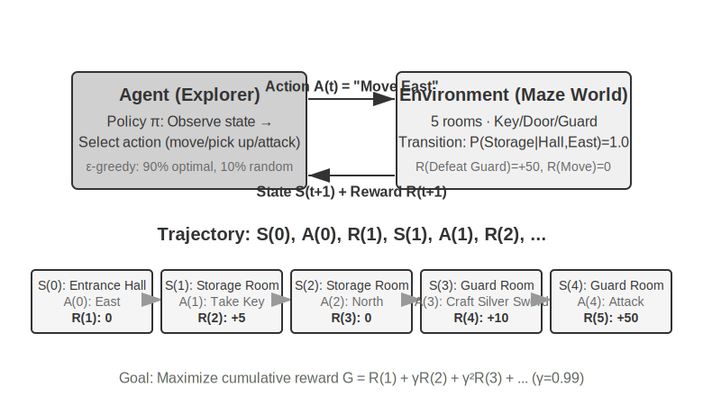

This interaction produces a **trajectory**—a complete record of "state → action → reward → new state → action → reward...". The quality of a policy is ultimately reflected in the quality of the trajectories. A **value function** answers the question: "If I am in this state now and continue acting according to the current policy, how much total reward will I eventually accumulate?" This is like an experienced chess player looking at a position and, without calculating to the end, intuitively estimating the winning probability. (When the "current policy" is replaced by the "optimal policy," we get the optimal value function, which will be used later in this chapter when discussing the Bellman optimality equation.) The boundary between the Agent and the environment follows a simple principle: **anything the Agent cannot arbitrarily change belongs to the environment.**

Two unique features distinguish reinforcement learning from supervised learning (which requires labeled correct answers) and unsupervised learning (which discovers hidden patterns in data): **trial-and-error search** (the Agent must figure out which actions are good on its own, without a teacher directly providing the correct answer) and **delayed reward** (the effect of an action may only become apparent many steps later, e.g., the value of a good chess move is only evident at the end of the game). This also brings about the unique **exploration-exploitation tradeoff**: always taking familiar paths means learning nothing new; always trying randomly means never reaching the goal.

A reinforcement learning system consists of five core elements:

- **Action Space**: Defines the set of all possible actions the Agent can take. Actions can be discrete (e.g., "which move to make" in chess, with a finite number of options) or continuous (e.g., "how many degrees to rotate a joint" for a robot, a continuous value).
- **Policy**: The Agent's behavioral rule, specifying what to do in a given state. A policy can be simple (a lookup table: in state A, execute action X) or complex (a deep neural network).
- **Reward Signal**: The immediate feedback from the environment. However, the Agent's goal is to maximize long-term, not immediate, reward—this distinction is crucial, just as investment should not be judged by today's gains and losses but by long-term returns.
- **Value Function**: Estimates the total cumulative reward obtainable from a given state in the future, helping the Agent make wise decisions even without immediate feedback. One of the most important insights from sixty years of RL research is the central role of value estimation.
- **Environment Model** (optional): Predicts the environment's response to actions. Methods that use an environment model are called **model-based methods** (first learn to predict how the environment changes, then plan accordingly); those without are called **model-free methods** (do not predict the environment, but learn directly from experience).

Table 7-3 compares the key components of various Agent systems, revealing the universality of the Agent concept and helping readers see the difference in action spaces between traditional RL Agents and modern LLM Agents.

**Table 7-3 Comparison of Key Elements in Different Agent Systems**

| Agent Type | Environment | Action Space | Reward Signal |
|---------|------|---------|---------|
| **Newborn Gazelle** | Terrain, gravity, body posture | Continuous high-dimensional (muscle group contractions) | Balance (+), Falling (-) |
| **Vacuum Robot** | Room layout, battery level | Discrete (direction, vacuum, charge) | Cleaned area (+), Battery depleted (-) |
| **Chess Grandmaster** | Board state, time limit | Discrete finite (legal moves) | Win (+1), Loss (-1) |
| **Customer Service Agent** | Conversation history, knowledge base | Open-ended (think, speak, API call) | Problem solved (+), Handling time (-) |
| **Code Assistant Agent** | Requirements document, codebase | Open-ended (think, search, edit, execute) | Test passed (+), Bug introduced (-) |

The table reveals an important insight: the action space of traditional RL Agents (chess, robotics) is closed, while the action space of modern LLM-based Agents (customer service, code assistant) is open-ended and almost unlimited, and they can leverage the special action of "internal thinking" to enhance their capabilities.

### Two Agent Paradigms: From MDP to LLM+RL

The most fundamental difference lies in the action space—MDP assumes the action space is finite and closed (up/down/pick/place), while the action space of an LLM is open-ended, consisting of combinatorially explosive natural language sequences. This difference determines the fundamental divergence between the two paradigms in algorithm design, sample efficiency, and generalization ability. They are elaborated on below.

**Traditional Paradigm: MDP and Q-learning.**

MDP (Markov Decision Process) is the mathematical framework for reinforcement learning, defining core elements such as states, actions, and rewards. Its core assumption is the **Markov property**: the future depends only on the current state, not on the earlier history. For example, in chess, looking only at the current board position is sufficient to determine the optimal move; there is no need to review every previous move. This assumption simplifies the problem but also limits the ability to model historical dependencies.

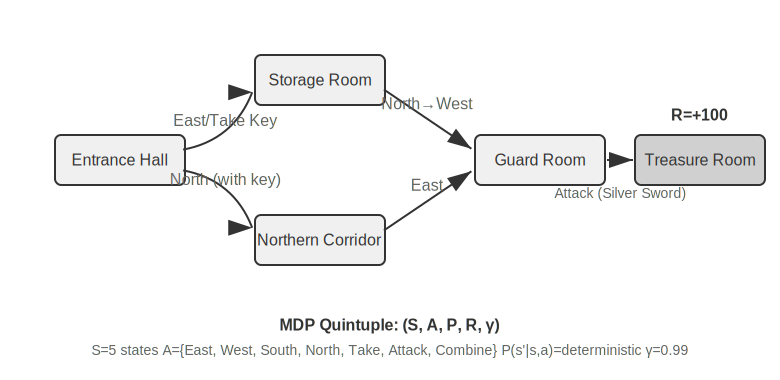

The key feature of a traditional RL Agent is a **closed action space**—all possible actions the Agent can take form a predefined, finite set. **Classic chess Agents** are the most typical example: the 361 possible move positions in Go, though vast, are completely determined and finite; chess, considering the different movement rules of pieces, still has enumerable actions; Atari games have only a few to a dozen discrete actions. **Robotic Agents** represent a continuous but bounded action space: joint angles, velocities, and grip forces are continuous values, but all have clear physical boundaries (maximum rotation angle, maximum torque, speed limits), with dimensions determined by the robot's degrees of freedom.

This closed nature brings computational advantages: all actions can be enumerated and evaluated one by one, facilitating dynamic programming and Monte Carlo tree search, and the action-value function can be approximated using tables or simple functions. However, it also limits expressiveness and generalization. Traditional RL Agents start from scratch, learning purely through trial and error—starting from a random policy, collecting experience, updating the value function or policy, and repeating until convergence.

Within this framework, one of the most fundamental and important algorithms is **Q-learning**. It maintains a value estimate for each "state-action" pair: if you take action *a* in state *s* and then act optimally thereafter, how much total reward can you expect? Intuitively, whether an action is good depends on the immediate reward it brings, plus "how good the next state it leads to is."

Writing this intuition as an equation gives the core recursive relationship of the famous **Bellman equation** in RL textbooks: **The true value of an action = the immediate reward obtained at this step + the maximum future value obtainable from the next state**:

$$Q^*(s, a) = r + \gamma \max_{a'} Q^*(s', a')$$

where $r$ is the immediate reward, $s'$ is the next state reached after executing the action (written in deterministic form for intuition; in a stochastic environment, an expectation over the next state $s'$ is needed), and $\gamma \in [0, 1)$ is the **discount factor**—it determines how much the Agent values the future: the closer $\gamma$ is to 1, the more it values long-term returns; the closer to 0, the more it focuses on the immediate. The "cumulative reward" mentioned repeatedly earlier is precisely the sum of rewards at each step, discounted by $\gamma$: $\sum_{t} \gamma^{t} r_t$. After each action, the algorithm slightly adjusts the old estimate towards the "actually observed outcome"—this paradigm of "correcting an old estimate with a one-step actual result" is called **Temporal-Difference Learning (TD learning)**. After thousands of trials, the estimate gradually approaches the true value.

The following two figures show the exploration process of Q-learning in a grid world and the gradual convergence of Q-values.

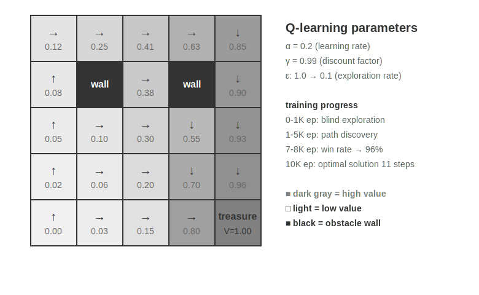

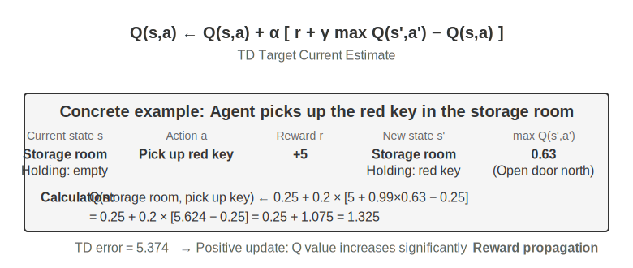

Q-learning is a specific type of **off-policy** method—it can use data generated by any policy (including random exploration) to learn the optimal policy. The strict definitions of on-policy/off-policy and their correspondence in LLM post-training are discussed in the "Comparison of Reinforcement Learning Algorithms" section later.

> **Experiment 7-1 ★: Q-learning Performance in a Treasure Hunt Game**
>
> To verify the characteristics and limitations of Q-learning, we designed a **treasure hunt game environment**. This environment includes several key challenges: **hidden mechanisms** require the Agent to discover the correspondence between keys and doors, weapon effects, and item crafting rules on its own; **multi-step dependencies** mean that completing the task requires the correct sequence of actions (optimal solution: 11 steps); **sparse rewards** mean that only key actions and the final victory yield significant rewards, with most intermediate steps receiving no feedback.
>
> The Q-learning Agent uses standard parameter configurations and an ε-greedy exploration strategy (mostly choosing the current best action, occasionally trying randomly, gradually reducing the proportion of random exploration as training progresses).
>
> The learning curve shows typical characteristics (an episode is one complete game, from start to completion or failure):
> - **First 1000 episodes**: 0% win rate, Q-table has only 124 states, Agent is blindly exploring
> - **First 5000 episodes**: Still no stable victories, Q-table has 133 states
> - **7000-8000 episodes**: Win rate gradually rises from 34% to 96%
> - **10000 episodes**: 100% win rate, Q-table has 145 states, found the 11-step optimal solution
>
> The entire training takes less than 10 seconds (very efficient simulation), but requires nearly 10,000 complete attempts. This demonstrates the core characteristic of Q-learning: it requires a large amount of random exploration to accidentally complete the full path, and the propagation of value signals is very slow, requiring repeated reinforcement. Pure symbolic learning, without prior knowledge, can only brute-force search the state space.
>
> In a game simulator, 10,000 trials take only 10 seconds, a negligible cost. But in real-world Agent scenarios—where each phone call has a cost, each browser operation has a delay, and each wrong decision can have irreversible consequences—10,000 trials are completely unacceptable. This is precisely why modern Agents have turned to LLM-based methods: leveraging knowledge accumulated during pre-training to make effective decisions with minimal interaction.
>
> The fundamental limitations of MDP are threefold: low sample efficiency (requiring massive interaction to learn simple tasks), poor generalization (knowledge learned in one environment is difficult to transfer to another), and inability to leverage prior knowledge (each new task must be learned from scratch). These limitations become particularly pronounced when facing complex state spaces like natural language or high-dimensional vision.
>
**Modern Paradigm: LLM+RL-based Agents.**

Large language models have brought about a new paradigm for Agents, fundamentally changing how Agents are built—especially in the design of the action space.In traditional RL, an agent can only receive feedback by changing the environment: making a move in chess, taking a step in a maze. But LLMs introduce a completely new type of action: internal thinking. Thinking doesn't change the external world, but it can significantly improve the quality of the final action. This shift changes everything: the agent's action space is no longer just "what to do," but also includes "how long to think and what to think about."

The most important innovation is incorporating **Thinking as a special action** into the action space. In traditional RL, agents can only perform external actions that change the environment state (move, attack, pick up); in LLM agents, **internal thinking becomes a core component of the action space**—it doesn't directly change the external environment, has no immediate reward, is almost unlimited in number, and has a relatively low cost.

Traditional RL struggles with this type of action, fundamentally because the exploration space is too large and lacks structure: an agent learning from scratch is like searching for treasure in a desert blindfolded, only able to stumble around randomly. LLMs are different. Through massive text pre-training, they have internalized the rules of human thinking: solving math problems follows "identify conditions → recall formulas → calculate step by step," writing code follows "understand requirements → design structure → implement details." This allows LLM thinking to proceed along structured paths, drastically compressing the search space. Therefore, even without additional RL training, a pre-trained LLM can generate a basic logical Chain of Thought (CoT). This basic logic comes from the vast amount of human thinking processes in the pre-training corpus (math problem solutions, code comments, debate responses, etc.). Through next-token prediction, the model implicitly learns "what the next step of reasoning should look like."

RL post-training then uses external rewards to teach the LLM to use these rules more efficiently for specific tasks. The structure of language itself also provides an implicit internal reward—a logically coherent chain of thought (e.g., "Because we need to convert foreign currency to USD, the first step is to look up the exchange rate") has a high generation probability, while a logically chaotic one (e.g., "Because we need to convert currency, let's first check the weather") has an extremely low probability, naturally guiding the model towards reasonable paths.

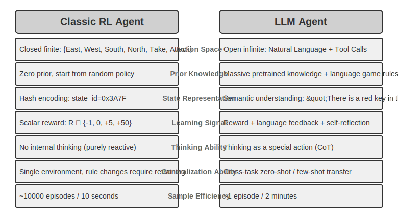

This thinking ability, grounded in the inherent rules of language, enables LLM agents to understand instructions they have never seen before (zero-shot generalization) and master new tasks with very few examples (few-shot adaptation)—a stark contrast to the traditional MDP agent paradigm that requires extensive trial and error. Furthermore, the new paradigm also possesses capabilities like compositional generalization (recombining known concepts to handle new situations), in-context learning (rapid adaptation through prompts and examples), and multimodal understanding (naturally integrating modalities like vision, language, and action). It's important to note that the **effectiveness** of in-context learning (zero-shot generalization, few-shot adaptation) and its **internal mechanism** are two different things—as analyzed in Chapter 2, the attention mechanism works more like retrieval than reasoning, but this doesn't hinder its powerful practical effects in task adaptation.

The evolution from a closed to an open action space reflects a fundamental shift in the AI agent paradigm. Beyond internal thinking, the diversity of tool parameters (natural language queries, program code, complex JSON, multimodal content) makes the actual action space nearly infinite—a code interpreter can theoretically execute any computable task, and a search tool can explore the entire information space of the internet. This brings both new opportunities (agents can handle unprecedented tasks, solve complex problems by combining basic tools) and new challenges (how to define and optimize reward functions in an open environment, how to search efficiently in an infinite action space).

Taking models like Kimi K3, optimized for tool calling and long-chain thinking, as an example, we can see the typical direction of the LLM+RL paradigm: based on large-scale language pre-training, post-training strengthens capabilities in problem decomposition, tool calling, and self-correction. **OpenVLA** (detailed in Chapter 9) showcases the VLA (Vision-Language-Action) architecture paradigm of the LLM era: a vision encoder processes environmental observations, a language model understands instructions and reasons, and an action decoder generates control signals, enabling language-conditioned control and cross-task generalization. It needs to be clarified that OpenVLA itself is trained on nearly a million robot **demonstration trajectories** via imitation learning (behavioral cloning), which is SFT in nature, not RL; the true representative of introducing RL into robotics, using rewards for further optimization on top of such VLA architectures, is SimpleVLA-RL in Experiment 7-13 later in this chapter.

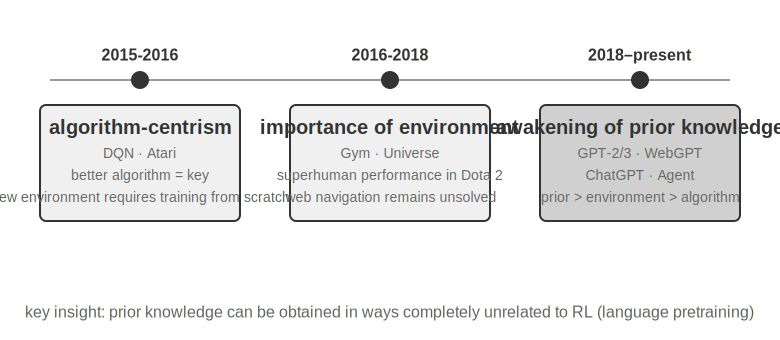

**OpenAI's Exploration Path** (detailed by Shunyu Yao, Assistant Professor at Princeton University and author of the ReAct paper, in "The Second Half") reveals a cognitive evolution. **Phase 1 (2015-2016) Algorithm-Centric**: Believed better algorithms were key, made progress in standard environments like Atari, but had to retrain from scratch for any new environment. **Phase 2 (2016-2018) Importance of Environment**: Gym standardized various tasks, Universe and World of Bits attempted to turn the entire internet into an RL training environment, Dota 2 pursued superhuman performance in specific complex environments. The idea was clear, but general computer use and web navigation remained unbreakable barriers.

**Phase 3 (2018-present) Awakening of Priors**: GPT-2/GPT-3 demonstrated the power of language pre-training, WebGPT and ChatGPT proved these priors could be transformed into practical agents. The most important discovery was: **Priors can be obtained in ways completely unrelated to RL**. This is a counterintuitive truth: for decades, RL researchers' priorities might have been completely reversed—it's not algorithm > environment > prior, but prior > environment > algorithm.

> **Experiment 7-2 ★★: Comparative Study of Traditional RL and LLM Agent**
>
>
> 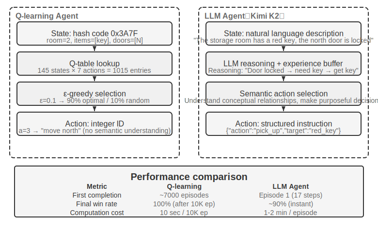
>
>
> Compare Q-learning and an LLM Agent (Kimi K3, maintaining a buffer of up to 50 experiences) in the same treasure hunt game. The results are astonishing: **The LLM Agent completed the game in 18 steps on its first try**.
>
> **Early Stage (Purposeful Exploration)**: Picks up a rusty sword ("A weapon is better than bare hands"), systematically explores the map, deduces "need to find a key" after finding the north gate locked, explores the storeroom, acquires the red key and magic crystal. **Middle Stage (Mechanism Understanding and Proactive Synthesis)**: Understands the "key auto-use" rule and anticipates the rusty sword is insufficient against the guard, proactively synthesizes a silver sword on step 8. **Late Stage (Execution and Error Correction)**: Heads north with the silver sword, defeats the strong guard on step 13, interspersed with one or two ineffective attempts (repeatedly swinging sword/backtracking), finally obtains the dragon treasure on step 18.
>
> This demonstrates a fundamental difference between semantic understanding and symbolic mapping. The LLM Agent understood the conceptual structure of the game; every step had purpose and logical support. For Q-learning, "door," "key," and "sword" are just meaningless symbol combinations, and it can only slowly discover their relationships through extensive statistical learning.
>
> Computational cost presents an interesting paradox: Q-learning runs 10,000 games in 10 seconds, while the LLM Agent takes 1-2 minutes per game. However, in real-world tasks, the time, money, and risk costs per interaction far outweigh pure computational costs, so judging solely by GPU time is unfair. A more critical insight is: The LLM Agent's success isn't due to having a better "learning algorithm," but because it carries vast prior knowledge. When game rules change, Q-learning needs complete retraining, while the LLM Agent can adapt directly through reasoning. This leads to a practical design principle: Traditional RL remains valuable in scenarios with low simulation costs and high repeatability; in real-world scenarios with high interaction costs and a need for rapid adaptation, the sample efficiency of LLM Agents is more practical.
>
As for the respective positioning and synergy of the three learning paradigms—in-context learning, externalized learning, and parametric learning (post-training)—Chapter 1 provides a systematic comparison, and the "Complete Picture" at the end of this chapter will return to this topic. The main thread of this chapter is post-training—writing interaction strategies into model parameters.

## Model Pre-training Basics `[Optional Reading]`

To understand why post-training techniques are effective, one must first understand what pre-training establishes. Post-training (SFT and RL) essentially optimizes within the representation space established by pre-training—the knowledge structure laid down by pre-training determines the ceiling of post-training. Therefore, we examine the core aspects of pre-training through three experiments: training a small-scale language model from scratch, extending visual capabilities, and injecting new language knowledge. The three experiments in this section are supplementary, helping readers build intuition about pre-training (Pretraining, i.e., initial training on large-scale data to teach the model basic language rules and world knowledge)—readers already familiar with the pre-training process can skip them.

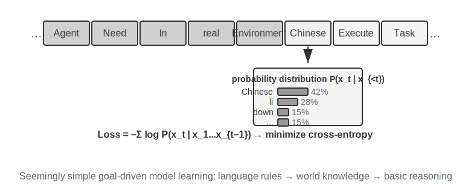

Language model training follows a three-stage process: "tokenization — pre-training — post-training." Tokenization segments text into discrete units. For example, "I like programming" might be tokenized into "I," "like," "program," "ming"—these tokens are the smallest units the model processes for text. The task of pre-training is conceptually simple: show the model the first part of a text segment and have it predict the next token. By comparing its prediction to the correct answer (this difference is called Loss; smaller loss means more accurate prediction), the model continuously adjusts its parameters. After repeated training on massive text data, the model gradually learns language rules, world knowledge, and basic reasoning abilities. After pre-training, the model can generate fluent text, but the output lacks structure and struggles to follow instructions. Post-training, through SFT (training on labeled input-output pairs) and preference optimization (e.g., DPO, teaching the model to generate responses humans prefer), transforms it into a practical assistant.

> **Experiment 7-3 ★★: Training an LLM from Scratch—The Power of Algorithm Improvement**
>
> Using MiniMind 2 (100 million parameters) as a case study, complete the full training process on a consumer-grade GPU. By introducing two algorithmic optimizations (QK Norm and Muon optimizer), convergence speed increases by 3x, and generation quality significantly improves—achieved at a very low cost, total training ~14 hours, cost ~$34.
>
> Effects of each training stage: After pre-training, the model can answer factual questions like "What is the highest mountain in the world?" but the format is non-standard; after SFT, instruction following and output format significantly improve, organizing answers as expected; preference optimization further reduces factual errors and unnatural expressions. The 100-million-parameter model still has obvious limitations (prone to errors on complex problems), but the lesson is: **With a fixed, small budget, algorithmic improvements offer better value than simply scaling up size**.
>
> **Experiment 7-4 ★★: Training Your Own VLM**
>
>
> 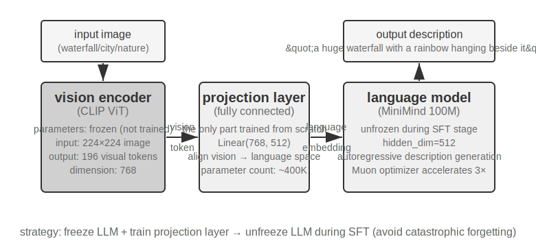
>
>
> VLMs unify visual perception and language understanding within a single model. The core challenge is cross-modal alignment—making "what is seen" correspond to "what is said." The architecture consists of three components: a **Vision Encoder** (e.g., CLIP, parameters frozen) extracts semantic features from images; a **Projection Layer** (lightweight, the only part trained from scratch) acts as a "translator" between visual features and the language model, mapping visual features into a representation space the language model can understand; and a **Language Model** generates descriptive text. Training uses a "freeze LLM + train only projection layer" strategy to avoid Catastrophic Forgetting (forgetting old skills after learning new ones); after pre-training alignment, the LLM is unfrozen, and SFT is performed with high-quality image-description pairs, significantly improving the detail and accuracy of descriptions.
>
> This experiment reveals the basic paradigm for multimodal model training: reusing unimodal pre-training results and achieving cross-modal alignment by training a lightweight projection layer—efficient and scalable, but the projection layer's limited expressiveness can become a bottleneck for deep cross-modal understanding. Extending this same "vision encoder + projection layer + LLM" skeleton one step further, having the model output actions, leads to the VLA (Vision-Language-Action) model detailed in Chapter 9.
>
> **Experiment 7-5 ★★: Continued Pre-training to Learn a New Language**
>
> Using Mistral 7B v0.3 as a base (primarily pre-trained on English, with almost no understanding of Korean), inject Korean capability through continued pre-training on Korean Wikipedia—performing unsupervised training on new language data using a model that has already completed pre-training. The model already possesses general language modeling capabilities and only needs to adapt to the new data distribution, making the cost much lower than training from scratch. A key engineering point is using mixed data (~80% Korean + 20% English) to mitigate catastrophic forgetting: too high a proportion of the target language leads to degradation in the original language, while too low a proportion results in insufficient learning efficiency. Finally, SFT is performed with Korean instruction data to obtain practical Korean conversational ability. The conclusion of this experiment will be used again in the complete picture at the end of this chapter: to make a model remember a large amount of new domain knowledge, rely on continued pre-training, not SFT.
>
The three pre-training experiments collectively reveal a pattern: when budgets are constrained, algorithmic improvements and architectural innovations offer better value than simply scaling up size. More importantly, pre-training endows the model with descriptive knowledge and language modeling capabilities, but lacks structured instruction following and task-oriented behavior—this is precisely the gap that SFT needs to fill.

With the foundational capabilities from pre-training, the next step is to transform the general-purpose model into a practical agent through post-training. The first stage of post-training is Supervised Fine-Tuning (SFT).

## SFT (Supervised Fine-Tuning)

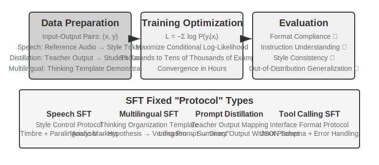

Section 7.1 already thoroughly explained the essence of SFT (changing the data, calculating loss only on the response, "predicting the next word"). This section uses four experiments to see what this mechanism of "writing stable mappings and protocols into parameters" specifically solidifies for different tasks. The core value of SFT is not injecting new knowledge, but **solidifying protocols**: writing mapping relationships, interaction formats, and style norms into parameters, enabling the model to produce outputs that meet expectations during inference without lengthy prompts. Typically, only a few thousand to tens of thousands of high-quality examples are needed to establish basic conversational ability and instruction following.

The price of this efficiency is a strong dependence on the training distribution: SFT tends towards memorization rather than generalization. When encountering situations unseen during training at test time, performance often degrades noticeably. The following experiments will demonstrate this process of "solidifying protocols" from different angles.

> **Experiment 7-6 ★★★: Voice SFT—From "Sound Copying" to "Paralinguistic Modeling" `[Extended Experiment]`**
>
> Using Orpheus (contextual prompt voice cloning) and Sesame (paralinguistic token modeling) as targets, demonstrate how "voice style and expression habits" are written into parameters. The two approaches differ:
>
> - **Orpheus**: Compresses the voice waveform into a token sequence. By concatenating reference audio from the same speaker, the model learns to "speak in this person's voice," achieving cross-sentence timbre consistency.
> - **Sesame**: Abstracts paralinguistic phenomena like laughter and sighs into special tokens like `<laugh>`, `<sigh>`. The model learns to "produce the corresponding sound when seeing the token."
>
> In expressive tasks, SFT solidifies style control protocols and structured expression habits, not factual knowledge or complex reasoning. The key lies in the diversity and annotation quality of the training data. Common failure modes: too few speakers in the training data causing everyone to sound the same; token overfitting (Overfitting, where the model memorizes training sample details and performs worse on new situations) leading to "mechanical laughter."
>
> **Experiment 7-7 ★★★: Multilingual Thinking—Enabling the Model to Think in Any Language `[Extended Experiment]`**
>
> Most thinking models only "think" in English: regardless of the language you use to ask a question, the model's internal chain of thought is almost always in English, because the high-quality thinking demonstrations in the training data are mostly written in English. The goal of this experiment is simple—to enable the model to think in a specified language.
>> The approach is to perform SFT on gpt-oss-20b: add a line `reasoning language: German` (or another language) to the system instruction, then train with reasoning examples in English, Spanish, French, etc. The training data contains **no Chinese at all**, but after training, simply setting the reasoning language to Chinese enables the model to perform complete chain-of-thought reasoning in Chinese—this zero-shot cross-lingual generalization is the most interesting finding of this experiment. Note that this is not the generalization capability of SFT itself. Multilingual pre-training has already established a shared cross-lingual representation space in the model; SFT merely activates this pre-existing cross-lingual ability.

> **Experiment 7-8 ★★: Prompt Distillation—Replicating Usable Capabilities at Lower Cost**

> In practical applications, to make a model perform complex tasks, lengthy system prompts (thousands or even tens of thousands of tokens) are often required, increasing latency and cost with each call. When using reasoning LLMs, internal thinking tokens further amplify the cost. The idea behind prompt distillation is to compress the behavior of a "long prompt + thinking teacher" into a "short prompt/no prompt + non-thinking student." The teacher generates high-quality answers under the full prompt and thinking mode; the training data retains only the user input and final conclusion, discarding the lengthy prompt and intermediate thinking process. The student learns to "directly give the conclusion." After distillation, the student's output quality on the same inputs approaches that of the teacher, while latency and cost are significantly reduced because there is no need to process lengthy prompts and thinking tokens.

> Distillation can be performed along two dimensions: "large to small" (replacing a large model with a medium or small one to balance cost and quality) and "thinking to non-thinking" (folding explicit CoT into implicit parametric knowledge at the same scale, achieving a 20-30x improvement in response speed). These two are not mutually exclusive and are often used together in production environments. It is important to note that distillation inherits the teacher's boundaries—if the teacher has systematic errors on the long tail of the distribution, the student will further hard-code these errors; if the teacher relies on tools to ensure correctness, simple output distillation will lose the robustness provided by tools. Engineering insight: when the product form is stable, the input distribution is predictable, and cost constraints are significant, prompt distillation is an excellent optimization method; during the exploration phase or when the task is not yet finalized, retaining explicit thinking and editable prompt engineering remains the core of rapid experimentation.

> **Experiment 7-9 ★★★: Chain of Thought (CoT) Distillation `[Extended Experiment]`**

> Prompt distillation discards the thinking process; CoT distillation does the opposite: it transfers the **complete thinking trajectory** of a strong teacher model to the student model. CoT distillation on a capable teacher model can recover 70%-80% of the teacher's capability at the same parameter count. For teams that do not aim to push the frontier of state-of-the-art capabilities but seek controllable models, this is the most pragmatic follower strategy. The series of distilled small models open-sourced by DeepSeek-R1 (using R1's thinking trajectories to perform SFT on the Qwen and Llama series) are a representative example of this approach.

> **Background: The "Thinking Wall" Phenomenon.** Some closed-source reasoning models (e.g., OpenAI o-series, Gemini series) generate internal chain-of-thought during reasoning, but what users see is not the original thinking process—for reasons such as preventing distillation, safety, and product experience, providers often rewrite or summarize the CoT before outputting it, hiding the most valuable original thinking process behind the API. This is precisely why this experiment chooses open-source reasoning models as teachers: models like DeepSeek-R1 and QwQ expose the complete chain-of-thought in `<think>` tags, making distillation technically and legally feasible (though one should still confirm the model license's terms regarding distilled products before use).

> **Experiment Design:** A three-step process. Step 1, **Collect Trajectories**: Sample problems from the target task distribution (e.g., math, code), use the open-source teacher model to generate complete "thinking + answer" trajectories, and filter out trajectories with incorrect final answers using a rule-based validator—otherwise, the student will imitate the erroneous thinking process. Step 2, **SFT Training**: Use "problem → `<think>` thinking trajectory `</think>` + final answer" as training pairs to perform standard SFT on a small model (e.g., 7B scale). Step 3, **Comparative Evaluation**: Compare the student model before and after distillation, as well as the teacher model, on the same benchmark to measure the proportion of capability recovered.

> **Acceptance Criteria:** The distilled student model shows significant improvement on math/code benchmarks compared to before distillation, and its thinking trajectories exhibit teacher-like behaviors such as reflection, backtracking, and verification. Also, be aware of the cost of distillation: the student will inherit the teacher's systematic errors and verbose thinking habits (the latter can be further optimized using the AdaptThink approach from Experiment 7-10).

> These four experiments share a common feature—"writing stable mappings and protocols into parameters": voice SFT solidifies style control protocols, multilingual SFT solidifies thinking organization templates, and distillation SFT solidifies the direct mapping from input to output. Their commonality is clear objectives, clear formats, and stable evaluation criteria, allowing SFT to achieve gains with extremely high sample efficiency; however, once the distribution changes, the memorization tendency is exposed as performance degradation. This is the experimental manifestation of the memory-generalization divide discussed in Section 7.1, "The Essential Difference Between SFT and RL."

## When to Choose SFT and When to Choose RL

> Section 7.1 clarified the **essential difference** between SFT and RL. This section answers a more practical question: **Faced with a specific task, which one should be used?** Some conclusions from the decision framework below will be further validated in subsequent RL experiments (Experiment 7-10, Experiment 7-11). Readers can first form a preliminary judgment and then return to cross-reference after reading the RL section.

> 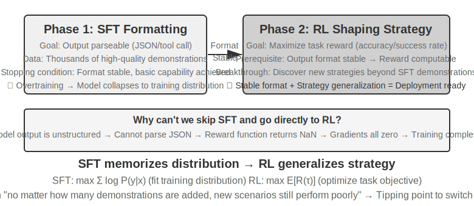

> **SFT is suitable for** scenarios with fixed formats (JSON output, conversation style), high-quality expert demonstrations, and high consistency between training and deployment environments. **Scenarios where RL is necessary** are different: when there are systematic differences between the actual deployment environment and the training environment (e.g., during training, cards J/Q/K are all 10, but during deployment they become 11/12/13—the rules changed; or during training, black suits are used, but during deployment, red suits are encountered—the appearance changed), when optimal strategies need to be explored (expert demonstrations are not necessarily optimal), or when annotation costs are too high to provide demonstrations for every path, RL is needed.

> The most robust strategy is the **"SFT first, then RL"** two-stage pipeline. The primary goal of SFT is not to maximize task performance but to establish **format stability** for the output—ensuring the model can produce parseable JSON and correct tool interface calls. Only after the output format is stable can the RL reward signal be reliably computed. Performing RL directly on a base model without SFT often leads to training failure due to chaotic output formats and incalculable rewards—though this conclusion has boundary conditions: it comes from the setting of a "smaller base model + strict structured output requirements" (as in Experiment 7-11 later). DeepSeek-R1-Zero demonstrated that a sufficiently strong base model can skip SFT and succeed with direct RL, emerging with reflection and long-chain reasoning abilities—at the cost of poor output readability and mixed languages, which is precisely why DeepSeek ultimately added back "cold-start SFT" in R1. R1's round trip from Zero to cold-start is the best example of "form first, spirit second": RL can grow its own "spirit" (strategy and reasoning ability), but "form" (format and readability) is still established quickly and stably by SFT.

> Both have their costs: SFT has high sample efficiency and fast convergence but limited generalization; RL can learn transferable strategies but has low sample efficiency and unstable training. A practical criterion is: when "no matter how many demonstration examples are added, performance on new scenarios still does not improve," it is the critical point to switch to RL—the root of the problem is not the number of demonstrations but the optimization objective of SFT itself.

> In practice, the decision can be made in the following order:

> 1. **First ask: Is post-training needed?** If the problem can be solved through Harness engineering (optimizing prompts, tool design, context management), no model training is needed. Most agent applications fall here.
> 2. **If training is needed: Try SFT first.** Suitable for solidifying output formats (JSON schema, API call format), solidifying protocol knowledge (usage of terms, output format, process habits, i.e., "how to say and do things"), and unifying style (tone, length). But note that SFT is not suitable for injecting large amounts of factual knowledge ("what to know")—that requires continued pre-training or RAG (see the "Complete Picture" at the end of this chapter). SFT is low-cost and quick to show results.
> 3. **When SFT is insufficient: Add RL.** Suitable for scenarios requiring generalization to new situations, exploration of optimal strategies, or when annotation costs are too high. Be sure to first stabilize the output format with SFT before applying RL on top of it.

## Single-Turn Reinforcement Learning: A Comparison of Memory and Generalization

> "Single-turn" means the task is completed in one interaction: the model receives input, produces output, and receives a reward, without needing to maintain state across steps. This simplified setting allows us to focus on the fundamental differences in learning mechanisms between SFT and RL, without the complexity of multi-turn interactions. The single-turn scenario provides clear controlled experimental conditions: the same task, the same base model, the same computational budget, with the only variable being the training method. The first experiment demonstrates how RL learns the meta-strategy of "when to think"; the second experiment uses an arithmetic reasoning card game to systematically quantify "SFT memorizes, RL generalizes."

> Before entering the experiments, let's establish some **minimal intuition** about RL algorithms to understand the terms that appear in subsequent experiments (complete formulas and comparisons are reserved for the "Comparison of Reinforcement Learning Algorithms" section later in this chapter). The RL training in this chapter is mostly based on **policy gradient**: the model generates several responses to the same problem; responses with high rewards have their probability increased, and those with low rewards have their probability decreased—"go more in the direction of high reward, go less in the direction of low reward." To avoid large single updates that could derail the model, the mainstream **PPO** algorithm clips the update magnitude at each step (the "PPO with value network" mentioned in later experiments refers to this; the value network estimates a baseline to compute a finer advantage); another method, **GRPO**, does not train a value network but instead uses "comparison among multiple responses to the same problem" to judge the relative quality of each. Keeping this intuition in mind is sufficient to understand the next two experiments.

> **Experiment 7-10 ★★: AdaptThink—Learning "When Not to Think"**

> Large reasoning models (e.g., OpenAI o1, DeepSeek-R1) generate lengthy chain-of-thought for all problems, causing unnecessary overhead on simple problems. The experiment first validates an intuition: **NoThinking mode** (skipping thinking via `<think></think>`) performs comparably or even better on simple problems; only when facing difficult problems does the advantage of Thinking mode become apparent.

> AdaptThink uses RL to train the model to adaptively choose the mode. Two core components:

> - **Constrained Optimization Objective**: Encourages NoThinking while ensuring overall performance does not degrade.
> - **Importance Sampling Strategy**: Balances Thinking/NoThinking samples to solve the **cold start** problem (Cold Start, here specifically referring to the issue where the initial model almost always chooses Thinking, resulting in very few NoThinking branch samples and making it difficult to learn; this is a different usage context from the "cold-start SFT" with a small number of demonstration examples mentioned earlier for DeepSeek-R1).

> The "importance sampling" mentioned here is a common statistical method—when the sampling distribution is biased towards a certain class of samples, weights are applied to the samples to "correct" the distribution, ensuring that the learning signal fairly covers all classes. This idea is repeatedly used in RL algorithms like PPO and DAPO discussed later in this book.

> Evaluation results: On multiple math benchmarks, response length is reduced by 45%-64%, while accuracy does not decrease and even improves. The model learns to make choices based on problem characteristics: directly answering simple, well-structured problems; retaining the complete chain-of-thought for difficult problems requiring multi-step reasoning; and correctly judging the difficulty of unseen task types.

> Complementary to prompt distillation, this forms a "fast-slow dual system": distillation reduces the proportion of tasks requiring thinking, while AdaptThink optimizes the triggering strategy for the remaining tasks, together maximizing thinking efficiency.

> **Experiment 7-11 ★★: GeneralPoints—A "Memory and Generalization" Comparison in Single-Turn RL**

> 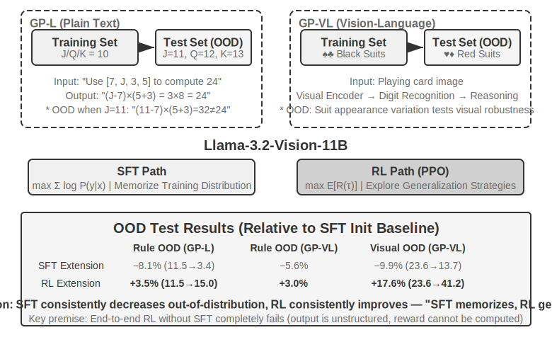

> GeneralPoints is an arithmetic reasoning card game proposed by Chu et al. (2025, "SFT Memorizes, RL Generalizes," arXiv:2501.17161), specifically designed to evaluate model generalization. The task objective is similar to the "24 Game": use the numbers on four cards, through addition, subtraction, multiplication, and division operations, using each number exactly once, to reach the target number 24. The experiment designs two variants: the text-only GP-L and the image-based GP-VL, allowing us to examine rule generalization and visual generalization within the same framework.

> **Rule Variant**: During training, J/Q/K are all counted as 10; during testing, they are counted as 11/12/13 respectively, ensuring the test set contains unseen number combinations (operations involving 11, 12, 13) to strictly evaluate generalization. **Visual Variant**: Training uses black suits (♠♣), testing uses red suits (♥♦), to evaluate robustness to changes in visual appearance. Based on Llama-3.2-Vision-11B, following the standard post-training pipeline: first, SFT initialization to give it basic instruction-following ability; then, with the same computational budget, extend SFT and RL training separately (the RL part uses the PPO algorithm with a value network), train with data using a single rule (J/Q/K=10), and evaluate on in-distribution (ID) and out-of-distribution (OOD) test sets.

> The results clearly reveal the fundamental difference. **Rule OOD**: RL improves by +3.5% on GP-L (11.5%→15.0%), while SFT **decreases** by 8.1% (11.5%→3.4%); on GP-VL, RL improves by +3.0%, while SFT decreases by 5.6%. **Visual OOD**: RL improves by **+17.6%** on GP-VL (23.6%→41.2%), while SFT decreases by 9.9% (23.6%→13.7%).

> Tracking visual recognition accuracy reveals that RL improves the underlying visual encoder through outcome-oriented optimization, and this improvement is highly correlated with overall performance gains; in contrast, SFT overfits to the token patterns in the thinking process, neglecting the learning of visual tokens, leading to a decrease in recognition accuracy.

> The experiment also reveals the necessity of SFT for RL: under the settings of this experiment (a base model of the Llama-3.2-Vision-11B scale, plus strict structured output requirements), performing end-to-end RL directly without SFT completely fails—the base model cannot produce structured outputs, and rewards cannot be calculated at all. Note that this is a conclusion under specific settings, not a universal law: a sufficiently strong base model can skip SFT and succeed with direct RL (see the earlier discussion on DeepSeek-R1-Zero). Another noteworthy finding is that more verification iterations lead to better generalization: 10 iterations +5.99% vs 1 iteration +0.48%, indicating that computational scaling during thinking is key to RL generalization.> Why does SFT performance collapse under distribution shift, while RL performs better? SFT learns a mapping of "given this input, output that answer": during training, J/Q/K are all 10, so the model memorizes the fixed pattern "when encountering J/Q/K, treat them as 10"; during testing, J=11, but the model still calculates it as 10, naturally making errors. RL learns a more general strategy of "what calculation process yields the correct answer": when J becomes 11, the RL model recalculates using the same strategy, rather than applying a memorized answer. This is the essential difference between "memorization" and "generalization."
>
> The core contribution of this experiment is to systematically quantify the phenomenon of "SFT memorizes, RL generalizes," proving that this rule holds in both pure language and vision-language modalities, revealing the synergistic relationship between SFT and RL: SFT provides format stability, while RL breaks through the boundaries of memorization on this basis; both are indispensable. This "form first, spirit later" training paradigm—borrowing a term from Chinese painting, first accurately draw the external form (format, structure), then pursue the inner spirit (generalization, strategy)—lays a methodological foundation for subsequent multi-turn, multi-modal tasks.

## RLHF: From Human Preferences to Reward Models

The previous experiments share a common premise: the tasks have verifiable correctness—whether the formula is right or the format complies, a rule-based verifier can score it. However, the conversational models deployed today behave like "decent, safe assistants" thanks to another, earlier-matured approach: **RLHF** (Reinforcement Learning from Human Feedback). Understanding RLHF is key to understanding where the conversational quality and safety alignment of products like ChatGPT come from, and also a prerequisite for understanding concepts like KL penalty and reward hacking in the algorithms discussed later.

**InstructGPT's Three-Stage Pipeline.** OpenAI's InstructGPT[^ch7-4] established the standard process still in use today:

1. **SFT**: Fine-tune the pre-trained model on human-demonstrated "instruction-response" pairs to establish basic instruction-following ability—this is the content discussed in the earlier "SFT (Supervised Fine-Tuning)" section.
2. **Train a Reward Model (RM)**: For the same prompt, have the model generate multiple responses, and human annotators compare them pairwise, indicating which one they prefer. Train a scoring model using these preference pairs, with the training objective based on the Bradley-Terry model:

   $$\mathcal{L}_{\text{RM}} = -\log \sigma\big(r(x, y_w) - r(x, y_l)\big)$$

   where $y_w$ is the preferred response, $y_l$ is the rejected response, and $\sigma$ is the sigmoid function. The intuition is very simple: **make the RM give a higher score to the preferred response**. The reason for collecting comparisons rather than scores is that it is difficult for humans to consistently give absolute scores ("this response deserves a 7.3" is nearly impossible to label consistently), but judgments of "which is better, A or B" are much more reliable. **Remember the role of the "reward model"—it is a running theme in this chapter**: here, it is a scorer learned from human preferences; when we get to Section 7.10 on reward design, you will see its various forms (ORM that only looks at the final result, PRM that scores step-by-step, generative reward models that provide reasoning in natural language), and a special case—when correctness can be directly determined by rules, the "reward model" simply degenerates into a deterministic piece of code (this is what RLVR, discussed below, is). They all answer the same question: **where does the reward come from?**
3. **Use RM scores for PPO**: Using the RM's score as the reward signal, perform PPO training on the SFT model (the mechanism of PPO is explained in the next section), enabling the model to learn to generate responses that the RM believes "humans would prefer."

**KL Penalty: Don't Stray Too Far from the Starting Point (Explaining KL Divergence Thoroughly).** In RLHF, the reward that the model actually optimizes is usually not the RM score itself, but a penalty term subtracted from it:

$$r = r_{\text{RM}} - \beta \cdot \mathrm{KL}\big(\pi_\theta \,\|\, \pi_{\text{ref}}\big)$$

This single formula raises three common questions from beginners, which we will address one by one.

**(1) What is KL divergence, and where is the penalty applied?** KL divergence (Kullback-Leibler Divergence) measures the difference between two probability distributions: the more similar the distributions, the smaller the KL, reaching 0 when identical; the more different, the larger the KL. The two distributions here are the **current policy** $\pi_\theta$ (the model being trained) and the **reference policy** $\pi_{\text{ref}}$ (the training starting point, usually the SFT model) for the "next token probability distribution" given the same preceding context. $\beta$ controls the penalty strength—it is the `kl_coef` hyperparameter commonly seen in training scripts. In engineering terms, this penalty is **calculated per token and added to the reward** (per-token KL): each time the model generates a token, it compares the probability difference at that position with the reference model; the greater the deviation, the more the reward for that step is penalized. In other words, KL is not a separate loss term, but is **mixed into the reward signal**, which then goes through the advantage calculation of PPO/GRPO—this is the exact point where it acts.

**(2) Why is the direction "current policy first, reference policy second"?** KL divergence is asymmetric, $\mathrm{KL}(P\|Q)\neq\mathrm{KL}(Q\|P)$, so the direction is not arbitrary. Here it is written as $\mathrm{KL}(\pi_\theta\|\pi_{\text{ref}})$—current policy first—which is mathematically called **reverse KL**. It penalizes situations where "$\pi_\theta$ assigns high probability somewhere, while $\pi_{\text{ref}}$ assigns near-zero probability there," i.e., it **penalizes the model for going to places the reference model thinks it shouldn't go**. This is exactly what we want: the reference model (SFT model) represents the safe zone of "speaking naturally and with normal format," and reverse KL keeps the current policy near this safe zone, preventing it from drifting wildly. If we used **forward KL** $\mathrm{KL}(\pi_{\text{ref}}\|\pi_\theta)$ instead, it would penalize patterns that "the reference model has, but the current model misses"—which would force the model to cover all the expression styles of the reference model, which is precisely not the goal of RLHF.

**(3) Why is it designed this way?—The origin of mode-seeking.** Reverse KL has a key characteristic: it is **mode-seeking**. Section 7.1 laid the groundwork for this—reverse KL allows the model to **retain only a few high-reward "modes" and decisively discard the rest**, without having to cover everything equally like SFT's maximum likelihood (mass-covering). In the context of RLHF, this is exactly the effect we want: pick one or two high-scoring response styles recognized by the RM and output them stably, rather than learning all possible responses. This also explains why models after RL are more "decisive" and have lower diversity. The combination of reverse KL's mode-seeking property and keeping the model near the reference distribution is the secret to RLHF's stability.

**(4) What happens without it?** The intuition is simple: **Don't stray too far from the starting point, or the reward model's scores become unreliable.** The RM is trained on the output distribution near the reference policy. Once the model is optimized to a distribution the RM has never seen, the RM's scores become extrapolation without basis, and high scores no longer equal high quality. Therefore, the KL penalty prevents two things simultaneously: **reward hacking** (the model exploiting loopholes in the reward to get high scores without actually doing the task well, see next paragraph) and **distribution collapse** (outputs degenerating into extreme forms like repetition or gibberish). Even in RLVR training with verifiable rewards, KL regularization is often retained to stabilize training (a few works like DAPO and Open-Reasoner-Zero intentionally remove it—note that DeepSeek-R1-Zero's GRPO itself still explicitly includes a KL term).

**Reward Models Can Be "Over-Optimized."** The RM is, after all, just a proxy indicator of human preferences. Goodhart's Law states: when a metric becomes the optimization target, it ceases to be a good metric—pushing the proxy to extremes distorts its correlation with the true objective. OpenAI's research[^ch7-5] systematically measured this **reward model over-optimization** phenomenon: as RL training progresses, the proxy reward (RM score) monotonically increases, while the true quality (human evaluation) first rises and then falls. The model gradually learns not to "answer better," but to "make the RM give a high score"—verbose, ingratiating, seemingly rigorous but empty talk. This is the specific form of reward hacking in the context of RLHF, and KL penalty and early stopping are the most common mitigation methods; the reward hacking problem in the "Common Pitfalls" section at the end of this chapter shares the same origin.

**DPO: Skipping the Explicit Reward Model.** DPO (Direct Preference Optimization)[^ch7-6] starts from the premise: since the combination of "training RM + PPO" ultimately results in "increasing the probability of preferred responses and decreasing that of rejected responses, while not straying too far from the reference model," why not skip the explicit RM and directly turn the preference pairs into a classification loss with an implicit reward? Mathematically, it can be shown that this is equivalent to offline preference optimization with a KL constraint, where the reward model is implicitly embedded within the policy itself. DPO training is as simple as SFT: no online sampling, no value network, no need to maintain a separate RM. The cost is that it is entirely offline—it cannot explore new behaviors beyond the preference data, and its performance ceiling is determined by the quality and coverage of the preference data.

**The Relationship Between RLHF and RLVR.** To summarize, the difference between the two approaches lies in **where the reward comes from**: RLHF's reward comes from a learned RM (backed by human preference data), while **RLVR** (Reinforcement Learning with Verifiable Rewards) uses a rule-based verifier (whether the test is passed, whether the answer is correct). Agent tasks happen to be mostly verifiable—this is precisely why this chapter focuses on RLVR as the main thread. However, it is not a matter of choosing one over the other; models deployed in practice use them in combination: RLHF handles conversational quality and safety alignment, while RLVR handles reasoning and Agent capabilities. The "Evolution of Reward Paradigms" section later discusses generative reward models, which can be seen as the confluence of these two lines—using a trainable reward model to handle open-ended tasks that rules cannot cover.

## Comparison of Reinforcement Learning Algorithms

The previous single-turn experiments demonstrated the generalization advantage of RL, and the previous section introduced the preference optimization approach of RLHF. However, the specific algorithms used in these works vary and are just a subset of many options. Before moving on to more complex multi-turn tasks, it is necessary to systematically review the characteristics and applicable scenarios of mainstream algorithms.

> **First, the most important point, so readers don't get lost in the formulas.** This section lists quite a few algorithm names and formulas, but please remember the second main thread of this chapter: **In the industry, with ready-made RL algorithms (PPO, GRPO, etc.), knowing how to use them and choosing the right one is sufficient; what truly determines success or failure is the data and the environment, not the algorithm itself.** These algorithms are already encapsulated in mature frameworks like veRL and TRL; calling them usually just involves changing a few lines of configuration. Therefore, the goal of this section is not to enable you to derive them, but to help you build a "which algorithm for which scenario" selection map; the formula parts (aimed at training engineers) can be skipped if not understood, without affecting the subsequent reading. The next section will directly explain "why data and environment are more important than algorithms."

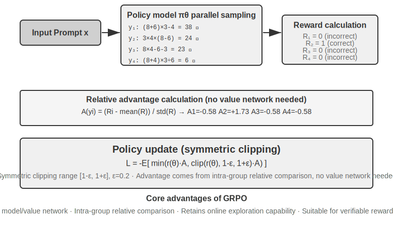

The RL scenario for modern LLM Agents differs fundamentally from traditional RL—Agents need to understand user intent, call tools, generate structured outputs, and engage in long-chain reasoning across multiple dialogue turns. This multi-objective, multi-stage decision-making means that "choosing the right algorithm" has some impact, but far less than the data and environment.

From an implementation perspective, RL algorithms are divided into **online exploration methods** (exploring new strategies through interaction with the environment) and **offline optimization methods** (optimizing based on existing data, more stable and direct). Here, we also provide the strict terminology promised earlier: **On-Policy** methods only use data newly sampled by the current policy itself to update itself; **Off-Policy** methods can use data generated by other policies (or older versions of the policy) for learning (such as Q-learning mentioned earlier). Aligning with the methods discussed in this chapter by this definition: SFT is off-policy imitation learning—the data comes from a teacher or human demonstrations, not the model itself; the standard forms of PPO and GRPO used for LLM training are on-policy—each round uses rollouts newly sampled by the current model (i.e., having the model run through the entire task once, generating a complete trajectory from start to finish) for updates; DPO is offline preference optimization, involving neither online sampling nor strict policy iteration.

These algorithms are mostly built on the same idea of **Policy Gradient**: adjusting the policy parameters $\theta$ in the direction that "increases the expected return." Its most basic form (REINFORCE) is:

$$\nabla_\theta J(\theta) = \mathbb{E}\big[\nabla_\theta \log \pi_\theta(a \mid s)\, G\big]$$

where $\pi_\theta(a\mid s)$ is the policy (probability of choosing action $a$ in state $s$), and $G$ is the cumulative return for this trajectory (or from that step onward)—the higher the return, the more the probability of that action is reinforced. Using the entire trajectory's return $G$ as the weight is unbiased but has high variance; hence, a baseline $b$ is introduced, and the **Advantage** $\hat{A}=G-b$ (how much better this action is than average) is used as the weight to reduce variance. The subsequent PPO and GRPO are essentially two types of improvements on "how to stably estimate and use the advantage $\hat{A}$."

**PPO** uses "clipping" to limit the update magnitude in each step, preventing the policy from straying too far in one go:

$$L^{\text{CLIP}}(\theta) = \mathbb{E}\Big[\min\big(\rho\,\hat{A},\ \operatorname{clip}(\rho,\, 1-\epsilon,\, 1+\epsilon)\,\hat{A}\big)\Big],\quad \rho = \frac{\pi_\theta(a\mid s)}{\pi_{\theta_{\text{old}}}(a\mid s)}$$

where $\rho$ is the probability ratio between the new and old policies, and $\epsilon$ (e.g., 0.2) limits the adjustment range per step; the later-mentioned "Clip-Higher" specifically relaxes the upper bound $1+\epsilon$.

**GRPO** eliminates the value network (an auxiliary neural network additionally trained in PPO to estimate the value function for each step in the trajectory, thereby calculating finer-grained advantages) and instead uses "intra-group relative comparison" to estimate advantages: for the same problem, sample $N$ trajectories to obtain returns $r_1,\dots,r_N$, and define the advantage of each trajectory as its relative performance within the group:

$$\hat{A}_i = \frac{r_i - \operatorname{mean}(r_1,\dots,r_N)}{\operatorname{std}(r_1,\dots,r_N)}$$That is, "positive if better than the group average, negative if worse"—no value network needed. This is precisely why it is cheaper. Note: The formula above omits the KL regularization term; in actual training, the per-token KL penalty introduced in the previous section is typically added to constrain the policy near the reference model.

Table 7-4 summarizes the core characteristics of mainstream methods. When reading, pay attention to distinguishing two things often conflated: **where the reward comes from** (rule verifier, learned reward model, or human preference data) and **which algorithm is used for optimization**. PPO and GRPO are not picky about the reward source—they can connect to either a rule verifier (RLVR) or a reward model (RLHF); their real difference lies in the advantage estimation method (value network vs. group-relative baseline).

Table 7-4 Comparison of Post-Training and Inference-Time Optimization Methods

| Method | Type | Core Idea | Advantage | Disadvantage | Applicable Scenario |
|------|------|---------|------|------|---------|
| **REINFORCE** | Online RL Algorithm | Updates the policy using the final reward of the entire trajectory | Simple to implement | High variance, unstable training | Theoretical baseline; rarely used directly in its original form, but its variants with baselines (RLOO, REINFORCE++, etc.) are among the current mainstream; GRPO is essentially REINFORCE with a group-relative baseline |
| **PPO** | Online RL Algorithm | Limits the update magnitude per step to prevent the policy from "going off track" | Stable; the value network provides finer-grained credit assignment | Requires additional training and storage of a value network; sensitive to hyperparameters | Multi-turn agents, long-trajectory credit assignment |
| **GRPO** | Online RL Algorithm | Samples multiple trajectories for the same problem and compares "which is better" within the group | No value network needed, low cost | Advantage is averaged over the entire response, leading to coarse credit assignment; relies on discriminative rewards within the group | Single-turn/short-trajectory tasks, scenarios with good reward discrimination |
| **DPO** | Offline Preference Optimization | Directly turns preference pairs into a classification loss with an implicit reward | Extremely simple and efficient; no online sampling needed | Cannot explore new policies; limited by the quality and coverage of offline preference data | Scenarios with existing high-quality preference data |
| **KTO** | Offline Preference Optimization | Only needs a "good/bad" label for a single sample | Very low annotation cost | Coarse signal | Scenarios with extremely limited annotation resources |
| **Best-of-N** | Inference-Time Method | Generates N outputs at inference time and selects the best one | No model modification; simple to implement | Inference cost increases multiplicatively; capabilities are not embedded into parameters | Early-stage rapid quality improvement; provides an upper-bound estimate of reward for RL |

Returning to the experiments in this chapter, let's be transparent about the algorithms used in each: GeneralPoints and V-IRL (Experiments 7-11, 7-12) come from the same study and use PPO with a value network; AdaptThink (Experiment 7-10) uses a custom constrained optimization objective with importance sampling; later, ReTool (Experiment 7-15) uses PPO modified based on veRL (training data taken from DAPO-Math-17k, but the optimization algorithm remains PPO); SimpleVLA (Experiment 7-13) and RLVP (Experiment 7-14) are based on GRPO. In multi-turn scenarios, the credit assignment problem is more complex, and different algorithms have their own strengths and weaknesses.

Practical selection path: Have a reliable reward signal and computational resources → GRPO (simple) or PPO (flexible, finer credit assignment for long trajectories); Have high-quality preference data → DPO/KTO (low cost); Early exploration stage → Best-of-N for a quick start.

After looking at this table, you might think, "So which algorithm should I fine-tune?" The answer might be surprising: **In most cases, any of them will do—don't get hung up on the algorithm first.** The next section is dedicated to this topic.

## Data and Environment: More Important Than Algorithms

This is the section I most want you to remember from this chapter, and it is the positive statement of the chapter's second main line. We've spent a fair amount of time on algorithms, but the experience from the front lines of the industry is the opposite: **The importance of algorithms is far less than three more fundamental elements—the fidelity of the simulation environment, the quality of the training data, and the capability of the base model.** You just need to know how to use existing algorithms; what truly creates a gap is how well you handle the environment and data. This echoes the conclusion of Chapter 6 (evaluation and simulation environments are the cornerstone of post-training) and the OpenAI cognitive reversal mentioned in Section 7.2 of this chapter—decades of RL research got the priority wrong; the real order is **prior (base model) > environment > algorithm**.

### Environment: The Training Ground for the Model

The essence of RL is "trial-and-error learning," and trial-and-error requires a **training ground**—this is the simulation environment. The model repeatedly runs tasks in the environment, receives feedback, and adjusts its policy. The **fidelity** of the environment (how closely it resembles the real deployment scenario) directly determines whether the trained policy is usable:

- **If the environment is distorted, the policy will fail.** If the customer service agent in the simulation always responds according to a fixed script, and the error messages don't match the production environment, the model will learn a "test-taking strategy" that only works in the simulation and will fail immediately upon deployment. This is the most common way RL projects fail—not because the algorithm is bad, but because the practice field is not the same as the exam room.
- **Building a high-fidelity environment is often more expensive and difficult than training itself.** An environment that can be massively parallelized, is reproducible, and provides realistic feedback often requires significantly more engineering effort than tuning the model. The tool-calling experiments later in this chapter (AWorld's MCP sandbox, ReTool's code interpreter sandbox) invested heavily in building environments precisely because **real APIs have rate limits, can get accounts banned, have side effects, and simply cannot be used directly for training**—you must first create a stable, controllable, replayable "shadow world."
- **The other half of the environment is the reward function.** The environment must not only simulate "how the world changes" but also determine "whether the action was good or bad"—this is the source of the reward signal. Reward design is part of environment engineering, which will be expanded upon in the next section.

In a nutshell: **Before you start tuning algorithms, ask yourself—does my simulation environment truly resemble the real world?** The answer to this question is far more important than choosing between PPO and GRPO.

### Data: The Most Critical Link, and Quality Trumps Everything

If the environment is the training ground, then **data is the textbook, and it is the most critical link among the three elements.** "Data" here refers to demonstration samples (input-output pairs) in the SFT phase and the task distribution and reward signal in the RL phase. Regardless of the phase, there is one iron rule:

> **Data quality trumps algorithms.** No matter how sophisticated the algorithm, if you feed it dirty data, incomplete data, or data with systematic bias, the learned policy will also be dirty. SFT will solidify the noise and bias in the data into the parameters verbatim; RL will optimize relentlessly towards a biased reward, taking the wrong direction further and further (this is the breeding ground for reward hacking). **Garbage in, garbage out** is fully manifested in post-training.

Furthermore, there is a judgment that many teams haven't realized but is extremely cost-effective:

> **In many scenarios, as long as the SFT data quality is sufficient, you don't need to do RL at all.** RL is expensive and unstable (often tens to hundreds of times the cost of SFT), yet many teams jump straight to it. However, if your task distribution is predictable and you can obtain sufficiently diverse and high-quality demonstration data, a solid SFT often meets the requirements. The truly irreplaceable scenarios for RL are limited (see Section 7.5): the deployment distribution will drift systematically, expert demonstrations are not optimal themselves, or the annotation cost is too high to provide demonstrations for every path. **First, make the SFT data good; then decide if RL is even needed**—this sequence can save you a lot of compute and time.

A compelling industry example is Anthropic. Before 2025, its post-training recipe mainly consisted of two parts: **SFT with massive amounts of high-quality data**, plus **RLAIF** (Reinforcement Learning from AI Feedback in Constitutional AI, Bai et al. 2022, using a "constitution" to guide the model to score its own responses for alignment)—and it **did not heavily rely on RLVR (Reinforcement Learning from Verifiable Rewards), which is now standard for code and reasoning**. Yet, even so, its Coding model quality was already excellent. The reason is largely not the algorithm but the fact that it pushed the data quality for both SFT and RLAIF to the extreme—this confirms the judgment above: **When SFT data is good enough, a simple recipe can train a top-tier model; complex verifiable-reward RL is not necessarily required.** Of course, this doesn't mean RL is useless: Since 2025, Anthropic has significantly increased its investment in RL—on the foundation laid by good data, RL can push the capability ceiling even higher. **Data determines where you can go; RL determines how much higher you can go.**

What does data quality specifically mean? At least three dimensions: **Coverage** (does it cover the various situations encountered during deployment, especially long-tail and edge cases?), **Diversity** (are the speakers, styles, and solutions in the demonstrations rich enough? Otherwise, the model will collapse into a single mode, like "everyone speaking in the same tone" in Experiment 7-6), and **Annotation Accuracy** (is the demonstration answer itself correct? Especially in chain-of-thought distillation, erroneous thought processes will be imitated by the student—hence Experiment 7-9 uses a rule verifier to first filter out trajectories with incorrect answers). The return on investment for these three points is usually far higher than switching to a fancier algorithm.

Chapter 9 will echo this judgment again: In speech recognition, the model's "whether to interrupt" decision keeps oscillating. The root cause is not the model structure but the training labels being annotated from a "god's-eye view"—changing the labels to "only use information available at the decision moment" makes the problem disappear. **Many times, data is more critical than architecture.**

### So, When Does the Algorithm Come In?

This is not to say algorithms are completely unimportant, but their position is later. The reasonable order of effort is: **First, choose a strong base model → then polish the environment and data → finally, make marginal optimizations on algorithms and hyperparameters.** Only when your environment is realistic, your data is good, and your base model is strong will the differences between algorithms become apparent. Only then are questions like "GRPO or PPO, should we use Clip-Higher?" worth tuning seriously. Conversely, chasing algorithms before the environment and data are ready is a classic case of putting the cart before the horse. With this priority in mind, we move to multi-turn tasks—where reward design (the intersection of data and environment) becomes the key to success or failure.

## From Single-Turn to Multi-Turn: Credit Assignment and Reward Design

### The Core Challenge of Multi-Turn Tasks

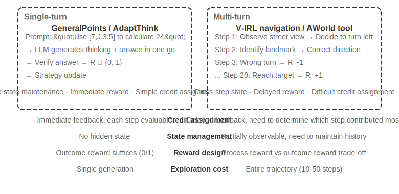

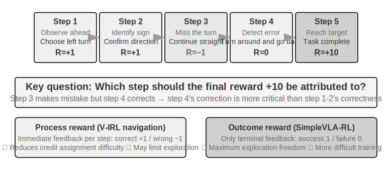

Moving from single-turn to multi-turn involves a qualitative leap in complexity. The policy must not only choose the optimal action for the current step but also consider the future state value; it must not only handle immediate feedback but also perform **Credit Assignment** under delayed rewards—determining which step in a multi-step sequence contributed most to the final outcome. For example, a customer service agent solves a user's problem after 10 turns of dialogue and receives a positive review—but should this positive review be attributed to the precise questioning in turn 2 or the patient explanation in turn 7? Multi-turn also introduces another challenge: **Partial Observability** (the agent cannot obtain the complete state and must construct an implicit state representation from historical observations).

The physical form of the multi-turn interaction discussed here is precisely the ReAct loop described in Chapters 1 and 4—each turn is an iteration of **Think → Act → Observe**, and the reward delay stems from the structural constraint that "the final outcome can only be judged after multiple turns."

### Density and Paradigm of Reward Signals

The reward design discussed in this subsection also applies to single-turn tasks; it is placed in the multi-turn section because the difficulty of credit assignment in multi-turn scenarios elevates "how dense the feedback is and what form it takes" from an option to a decisive factor for success. Reward signals have two design dimensions: **Density** (how often feedback is given—binary/sparse/process reward) and **Representation Form** (what the feedback looks like—scalar/vector/generative).

Before discussing multi-turn reward design, let's systematically outline the design space for reward signals. This is a core topic for RL training and is closely related to the automated evaluation discussed in Chapter 6—**a carefully designed evaluation environment can often be transformed into a high-quality training environment.** However, it's important to distinguish two things: "The evaluation environment can be reused" does not mean "this specific evaluation data can be directly used for training."

Let's look at three examples. **SWE-bench** provides a typical case of this transformation: SWE-Gym is built upon it to construct a trainable task set (problem description as input, patch as supervision signal, test cases providing reward signal)—but the data used for training is the newly constructed task set, while the 500-question evaluation subset **SWE-Bench Verified**, manually curated by OpenAI, must be strictly isolated from the training data. Once mixed into the training set, the evaluation becomes meaningless (this is the tension discussed in Chapter 7's thought question 10). The complete trajectory records of **τ²-bench** (dialogue history, tool calls, state changes) provide valuable data for imitation learning—successful trajectories as positive samples, and failed trajectories, after annotation, as negative samples. The parameterized templates of **AndroidWorld** can generate countless variants in batches, naturally supporting curriculum learning—progressing from simple single-step operations to complex cross-application workflows.

These examples point to the same conclusion: The quality of the reward signal provided by the evaluation environment directly determines the efficiency of RL training—provided that the data used for training is separated from the data used for evaluation.

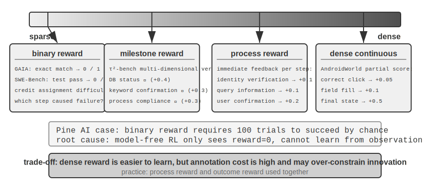

**Applicable Scenarios for Binary Rewards.**

For many tasks, the simplest binary reward (success=1, failure=0) is sufficient. For example, "answering a math problem"—the answer is either right or wrong, with no gray area; or "executing an SQL query"—the returned result either matches the expectation or not. For tasks with clear correct answers, binary rewards are simple and reliable, requiring no more complex design.

The problem arises with open-ended tasks that lack a clear correct answer.

**The Dilemma of Sparse Rewards.**

Take the example of Pine AI making phone calls to handle tasks. Using a binary reward (success = 1, failure = 0) to train an agent to contact Xfinity to change a plan: The first time, it forgets to collect the account number, failure reward = 0; the second time, it forgets the last four digits of the credit card, failure reward = 0; the third time, it misses the billing address, failure reward = 0... It only succeeds by chance after 100 attempts.

The root of the problem, as Silver and Sutton point out in "Welcome to the Era of Experience"[^ch7-8], is that current RL methods can only learn from the final outcome of success or failure but **cannot learn from the rich feedback provided by the environment**. The customer service agent explicitly says, "I need the last four digits of your credit card." A human hears it once and remembers, but RL only sees the final result "failure" and doesn't know why it failed. Worse still: In a 10-step process, even if the first 9 steps are perfect and only the 10th step is wrong, the signal received is just "the entire task failed," with no way to know which specific step went wrong. Advanced techniques like On-Policy Distillation and RLVP (Reinforcement Learning with Verification Path Penalty) later in this chapter are designed to alleviate this dilemma.

**Process Reward** provides immediate feedback for each key step during execution, transforming evaluation from a black box to a white box. For example, in code generation, it can evaluate stages like requirement understanding, code search, solution design, code writing, and test running separately; in customer service scenarios, it can check whether steps like identity verification, information query, confirmation, and payment are correct. However, process rewards face challenges such as high annotation costs and the potential to overly constrain innovation, and in practice, they need to be used synergistically with outcome rewards.

**The Evolution of Reward Paradigms.**

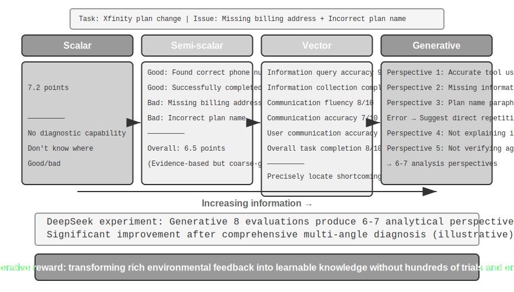DeepSeek's research (Liu et al., 2025) systematically analyzes the differences in learning signals across reward paradigms along the scalar-semi-scalar-generative spectrum. Building on this, this book adds a vector (multi-dimensional) scoring dimension. To intuitively understand the differences between paradigms, we reuse the earlier scenario of Pine AI calling to set up an Xfinity package: This time, the Agent completed the task, but with flaws—it missed the billing address (needs to be added) and misstated the package name, saying "Performance Plus" instead of "Performance Pro" (the following scores are illustrative):

**Scalar Paradigm**: Gives a score of 7.2—no diagnostic capability, no insight into what was done well or poorly. **Semi-Scalar Paradigm**: First analyzes strengths and weaknesses, then gives a score of 6.5—provides a basis, but the information is still limited. **Vector Paradigm (dimension added by this book)**: Scores multiple dimensions separately—Information Query Accuracy 9/10, Information Collection Completeness 6/10, Communication Fluency 8/10, Communication Accuracy 7/10, User Communication Accuracy 10/10, Overall Task Completion 8/10. This is like a medical checkup report, precisely pinpointing the problem ("Information Collection" scored only 6, indicating the prompt for the collection phase should be optimized).

**Generative Paradigm**: Provides a detailed description in natural language, supporting multiple sampling runs for analysis from different perspectives—illustratively, sampling the same execution multiple times for evaluation yields analytical views covering different aspects. Combining these diagnoses for improvement yields far greater benefits than just getting a single score. The real conclusion of the DeepSeek paper is: Generative reward models can continuously improve evaluation quality through inference-time scaling (multiple sampling evaluations then aggregating), surpassing scalar approaches that rely solely on increasing model size on multiple reward model benchmarks. The core value of generative rewards lies in transforming rich environmental feedback into learnable knowledge, enabling the Agent to learn improvement directions from a single failure, rather than requiring hundreds of blind trial-and-error attempts.

From the RLHF perspective, generative reward models can be seen as an evolution of the previously discussed Bradley-Terry discriminative reward model: The discriminative RM only outputs a scalar score (who is higher/lower), while the generative RM generates a judgment with reasoning in natural language, explaining "why it's good, why it's bad." This makes it inherently more transparent and easier to extend to open-ended tasks that are difficult to cover with rules and scalar scores.

Choosing which reward function depends on the task's verification method. If the answer can be automatically verified by code (e.g., math problems, unit tests), binary rewards are the simplest and most direct. If the task has multiple independent quality dimensions (e.g., information accuracy, communication politeness, problem resolution rate in customer service scenarios), use vector rewards for dimension-wise evaluation. If the task is highly open-ended and difficult to break down into dimensions (e.g., creative writing, complex dialogue), use generative rewards to let the evaluation model provide qualitative analysis.

**Training Generative Reward Models.**

How to train a generative reward model? Traditional methods require human experts to evaluate a large number of cases and then have the model imitate them, which is costly, and humans often find it difficult to explain why A is better than B. DeepSeek's method allows the model to autonomously learn evaluation capabilities in three steps:

Step 1: The model automatically generates evaluation principles for specific tasks. For example, when evaluating "helping a user call to change an Xfinity package," the model summarizes: "A good Agent should: 1) Find the correct official customer service channel; 2) Collect complete identity verification information; 3) Accurately convey user needs during the phone call; 4) Avoid fabricating or misstating information; 5) Respond promptly to customer service requests."

Step 2: Evaluate the execution process based on each principle. Continuing the example: Was the correct phone number found? Yes, 1-800-XFINITY is the official customer service. Was information collection complete? No, the billing address was missed. Was the conveyance accurate? There was one error; the package name was stated incorrectly.

Step 3: The system automatically checks the accuracy of the evaluation. For instance, if the model says "the package name was accurately conveyed," but the actual trajectory shows the name was wrong, the system gives negative feedback. If the model accurately identifies the missed billing address, it gives positive feedback. Through repeated practice on thousands of cases, the model gradually learns to formulate reasonable principles for different tasks and make accurate diagnoses.

This method has several key advantages: Strong generalization ability (it learns the meta-capability of "setting standards and making evaluations," not a fixed scoring rubric); the evaluation process is transparent, facilitating bias review (e.g., if the model always considers "long replies" as a strength, it's clear it mistakenly equates length with quality); it supports the co-evolution of the reward model and the policy model, unlike traditional methods where the reward model remains fixed.

### Process Reward vs. Outcome Reward: A Key Choice for Multi-Turn Tasks

Beyond credit assignment and partial observability, multi-turn tasks also face the **long-distance dependency** problem—the impact of early decisions, such as sub-goal setting or tool selection, may only become apparent dozens of steps later. This presents a key choice in reward design: **Process Reward** provides feedback at every step, reducing the difficulty of credit assignment but introducing human design bias, potentially limiting the exploration space. **Outcome Reward** provides feedback only at the end, offering maximum exploration freedom but requiring higher training difficulty and sample demands. By analogy, process reward is like a teacher grading homework problem by problem, allowing the student to quickly know where they went wrong; outcome reward is like only looking at the final exam score, giving the student more freedom to explore learning methods, but feedback comes very late. Reward function design is closely related to the evaluation environment construction discussed in Chapter 6—a high-quality automatic evaluation environment is a prerequisite for RL training.

Terminologically, these two rewards correspond to two types of reward models: **Process Reward Model (PRM)** scores each intermediate step of reasoning or execution. Representative work is OpenAI's "Let's Verify Step by Step" [^ch7-7]—on mathematical reasoning tasks, PRMs trained with step-by-step human annotations significantly outperformed supervision that only looked at the final answer. **Outcome Reward Model (ORM)** only evaluates the final result. The rule-based verifier in RLVR discussed earlier can be seen as a special case of ORM—replacing the "learned scoring model" with deterministic rules.

**Credit Assignment in Practice.** In engineering terms, credit assignment is handled by several specific mechanisms. The discount factor $\gamma$ is typically set directly to 1 in multi-turn LLM RL: tasks only last a few to dozens of turns, and the optimization goal is ultimate success or failure; there's no need to discount rewards for "earlier success." PPO relies on GAE (Generalized Advantage Estimation), intuitively using a value network to estimate "how much better this step is than expected" for each step in the trajectory, making a weighted trade-off between bias and variance. GRPO goes to the other extreme: it treats the entire response as a single action, and the trajectory-level advantage is evenly distributed across all tokens—a precise question in turn 2 and an ineffective pleasantry in turn 7 receive identical credit. This coarse credit assignment is less problematic in short, single-turn tasks but dilutes the learning signal in long-horizon, multi-turn tasks—which is why PPO with a value network remains valuable in multi-turn scenarios. An intermediate approach is turn-level credit assignment: calculating advantages at the "turn" level (e.g., using environmental feedback or process rewards after each turn), which is cheaper than token-level and more fine-grained than trajectory-level, representing a common compromise in current multi-turn Agent RL frameworks.

> **Experiment 7-12 ★★★: V-IRL-VL Spatial Reasoning—Process Reward**
>
> V-IRL (Yang et al., 2024; this experiment follows the aforementioned Chu et al. 2025 study, with the RL algorithm also being PPO with a value network) is an open-world visual navigation environment using real city street views. V-IRL-L uses pure text descriptions, while V-IRL-VL provides a 2×2 grid of street view images (front, back, left, right). Training uses 1000 routes in New York, testing uses 18 routes across nine cities (Milan, New Delhi, London, Hong Kong, etc.) from the V-IRL official benchmark—with vastly different architectural styles, street layouts, and lighting conditions.
>
> **Rule Variant**: Training uses absolute directions (north/east), testing uses relative directions (left/right). **Visual Variant**: Cross-city testing.
>
> Results again validate "SFT memorizes, RL generalizes." Rule OOD: RL improves by +11.0% on V-IRL-L, while SFT **decreases by 79.5%**; on V-IRL-VL, RL improves by +9.3%, SFT decreases by 33.2%. Visual OOD: RL on V-IRL-VL improves from 16.7% to **77.8%** (+61.1%), with end-to-end RL using an open-source model surpassing a strong baseline that relies on careful prompt engineering with a closed-source model; SFT drops to 11.1% (-5.6%).
>
> Process reward played a key role in this experiment. Unlike the single-turn GeneralPoints task, navigation requires feedback at every step: correct action +1, incorrect action -1, landmark recognition error an additional -1.5. This dense feedback reduces the difficulty of long-sequence credit assignment—when the Agent makes a wrong turn at step 5, it receives immediate negative feedback, without waiting until the task ends at step 20 to find out. Combined with a verification retry mechanism (verify_iter=2, allowing two attempts at a single decision point), it further improves sample efficiency and training stability.
>
> Tracking the relationship between visual recognition accuracy and overall performance reveals: RL not only optimizes "decision-making given recognition results" but also improves "visual recognition itself"—the outcome-oriented optimization signal backpropagates to the perception layer, prompting the visual encoder to learn task-relevant feature representations. In contrast, SFT tends to overfit in the reasoning layer, neglecting learning in the perception layer, leading to failure when visual appearance changes.
>
> The synergy between SFT and RL is even more pronounced in multi-turn tasks. Without SFT initialization, RL cannot be effectively trained (the base model cannot produce structured JSON output). However, if SFT is over-trained, leading to severe overfitting, RL also cannot recover out-of-distribution (OOD) performance. This is a delicate balance: SFT should be trained just enough to achieve "stable format and basic capability," without overstaying its welcome.
>
> **Experiment 7-13 ★★★: SimpleVLA-RL—Outcome Reward `[Extended Experiment]`**
>
> VLA (Vision-Language-Action) models unify visual perception, language understanding, and action generation, representing an emerging paradigm in robotic manipulation. It faces two major challenges: scaling SFT requires large-scale human operation trajectories (high collection cost and limited diversity), and models trained on limited scenarios perform poorly when encountering unseen tasks, environments, or objects. Inspired by DeepSeek-R1's significant improvement in step-by-step reasoning through RL, this experiment explores whether RL can similarly enhance VLA's step-by-step action generation. SimpleVLA-RL is built on veRL, using only binary outcome rewards (success/failure), and introduces three exploration enhancement measures: **Dynamic Sampling** filters out groups with all successes or all failures to ensure stable gradients; **Higher Clipping Bounds** [0.8, 1.28] encourage exploration; **Higher Temperature** 1.6 generates diverse trajectories. The combination of the three improves performance by approximately 30% within 300 steps.
>
> It reports a high-level result of **97.6%** on LIBERO (a robotic manipulation task benchmark). Cold-start experiment: with only 1 trajectory per task for SFT (17.3%), adding RL achieves **91.7%** (+74.4 percentage points, a relative improvement of ~430%), strongly demonstrating RL's power under data scarcity.
>
> During training, a "**pushcut**" action emerged—a new action pattern autonomously discovered by RL, never seen in human demonstrations. The standard demonstration path was "approach → grasp → vertical lift → horizontal move → release," while RL discovered a more efficient path: "approach → grasp → keep low → horizontal push → complete," eliminating the lift step, resulting in faster speed and lower precision requirements. This strongly proves that RL can surpass imitation learning to discover superior strategies never conceived by humans.
>
> The framework uses the GRPO algorithm with a dynamic sampling strategy—only retaining tasks with moderate success rates for training, naturally forming a curriculum (easy to hard). Real-time performance relies on **action chunking**: the model generates multiple future actions in one inference pass, executed sequentially by a control thread while the GPU asynchronously generates the next batch in the background. As long as inference time is less than execution time, the robot maintains continuous, smooth motion (a full discussion of action chunking is in Chapter 9, VLA Control Layer).
>
> Generalization capability improvements are seen across multiple dimensions: spatial generalization (strategies trained on specific layouts transfer to different configurations), object generalization (handling unseen object shapes and textures), and goal generalization (adapting to new task goal descriptions).
>
> Comparing with V-IRL-VL reveals the trade-offs of the two reward designs: Outcome rewards provide sparser signals but give the model greater exploration freedom (which is how "pushcut" was discovered); process rewards accelerate convergence through dense feedback but may limit the strategy from breaking out of the demonstration space. Simply put, when the correctness of intermediate steps is easy to define, process rewards are more efficient; when the optimal path is unknown, outcome rewards have more potential.

### Reward the Outcome, Constrain the Process: RLVP and Partial Rewards

Process rewards and outcome rewards address "how dense the feedback should be." But there's a problem none of the previous RL methods have tackled: **Outcome rewards simply cannot express the requirement that "the process must follow the rules"** —and this is precisely what determines whether a real-world Agent can be deployed. This section explains this thoroughly, using the method from the RLVP paper[^ch7-9] (Reinforcement Learning with Verified Penalty). The recipe in one sentence: **reward the outcome, penalize the path**.

**Problem: There is a class of constraints that outcome rewards not only fail to learn but also provide perverse incentives to violate.** Real-world Agents, besides "getting the job done," must adhere to a class of **outcome-neutral constraints**—whether they are followed or not has no necessary connection to task success: do not repeatedly call a user who has explicitly declined, do not act autonomously outside of working hours, do not skip identity verification, do not execute destructive commands like `rm -rf`, do not modify test files just to make tests pass, do not overwrite a file without reading it. The trouble is: **violating these constraints often leads to higher "apparent success rates"**—cutting corners is faster: directly modifying the test file is quicker to pass than actually fixing the bug; skipping verification is quicker to get results than going through the full process. Thus, pure outcome rewards not only fail to learn these constraints but **actively incentivize** the Agent to violate them. In the paper, Agents trained solely with outcome rewards violated the rules in almost every episode.

**Core Insight: Real environments are "asymmetric verifiers."** This is the key to understanding the entire method. In a machine-verifiable environment (terminal, codebase, theorem prover), one thing is **easy** to verify—**whether an action is a bad action** (ran a destructive command, called before preconditions were met), because bad actions have clear, deterministic characteristics. But another thing is **hard** to verify—**whether the Agent is making meaningful progress toward the goal** (this is almost as hard as "solving the task" itself). Since "detecting bad actions" is cheap and reliable, while "judging progress" is expensive and error-prone, the **dense signal** the environment can reliably provide is essentially **"penalties on the path," not "rewards for progress."** This asymmetry determines the shape of the method.

**Approach: In addition to outcome rewards, add a verifiable "path signal."** The total reward is written as two parts:

$$R = O + \beta\cdot\Phi$$

O is the original **outcome reward** (sparse, still the true goal); Φ is the **path signal**, given action-by-action by a **deterministic rule engine**—it is a pure function judgment of "the action + the state before the action," not a learned judge model. Φ has two uses, corresponding to a minus sign and a plus sign:

- **Penalty (−λ)**: For every occurrence of a **machine-verifiable violation action** (destructive command, modifying test file) in the trajectory, deduct λ points from the tokens of that action.- **Compliance Reward / Partial Credit (+μ)**: Each time a verifiable **good action** occurs—satisfying a prerequisite, achieving a subgoal, increasing the number of passed tests, or decreasing the number of goals to prove—add μ points.

The two signals are each normalized separately before being combined, preventing a dense path signal from overwhelming a sparse outcome signal (or vice versa). This mechanism is directly plugged into the PPO/GRPO training loop: it **does not change the optimization algorithm, only reshapes the reward at each step**, allowing the advantage calculation to see right and wrong actions along the way.

**Why it works—a unified explanation: within-group variance.** Recall Section 7.8: GRPO does not train a value network. Instead, it samples a group (G rollouts) for the same prompt and uses the **relative goodness of each rollout compared to the group average** as the advantage. Here's a mathematical fact: **GRPO's advantage is essentially within-group variance**—if every rollout in a group receives **exactly the same reward**, the variance is zero, each rollout's advantage is zero, and the group contributes no gradient, wasting computation.

With outcome-only rewards, this "zero-variance deadlock" inevitably occurs in two scenarios, which happen to be the most common at the **beginning and end of training**:

- **All-fail group (early training)**: The task is too hard; all rollouts in a group fail, O is all 0 → within-group variance is zero → no gradient. Early training consists almost entirely of such groups, wasting a large number of expensive samples.
- **All-pass group (late training)**: The task is nearly learned; all rollouts in a group succeed, O is all 1 → variance is also zero → no gradient.

In other words, **pure outcome rewards are "blind" at both extremes of success rate**. The community's previous approach was to **discard** these zero-variance groups outright (DAPO's dynamic sampling discards prompts where all rollouts are correct or all are wrong). RLVP asks a different question: **Instead of discarding, what dense signals could restore the missing variance here?** The answer becomes immediately clear:

- **A verifiable penalty can always restore variance.** Even if all rollouts in a group fail, they usually differ in *how* they fail—some execute destructive commands, others do not. Adding a penalty immediately creates differences (variance) within the all-fail group, reviving the gradient. Because bad actions are cheap to check, **penalties are the "always reachable" half of the solution**.
- **A verifiable progress reward (Partial Credit) can restore variance only when progress is reachable.** If some rollouts in a group pass two more tests or prove one more lemma, they differ in progress, and +μ can create variance. But if the task is too hard and **every rollout's progress is stuck at zero** (e.g., in software repair, no one can make any hidden test pass), the progress signal is zero everywhere, resulting in zero variance—then it cannot help. So **progress rewards are the "reachability-gated" half of the solution**: in theorem proving, where the "number of goals to prove" gradually decreases, it is reachable and useful; in software repair, where the "proportion of passed tests" is often unreachable, it is useless.

To summarize: **Dense signals are useful only when they can restore the within-group variance missing from outcome rewards**—penalties always satisfy this (bad actions are checkable), while progress rewards satisfy it only when partial success is reachable. The paper therefore calls penalties the "universally available half" and progress rewards the "conditional half."

**Use Case 1: Penalizing paths for deployability—four design principles.** Using Φ as a penalty to teach an agent to follow constraints, there are four principles validated by ablation, each addressing a specific pitfall:

1. **Penalize only verifiable "actions," never "lack of progress."** The target of a penalty must be a specific, machine-detectable bad action (e.g., running `rm -rf`, calling someone without meeting a prerequisite), not "no progress at this step." Because "doing nothing" is the easiest way to avoid a "no progress" penalty—this would directly teach the agent to do nothing.
2. **Outcome rewards are always the primary driver; penalties cannot be optimized alone.** There is a fatal **inaction trap**: with only penalties and no outcome rewards, the optimal strategy is "do nothing"—zero violations, but also zero success. Paper ablations show that pure penalties cause success rates to **collapse to zero on every random seed**. Outcome rewards must provide the "pull" to complete the task, while penalties only guide *how* to do it.
3. **Pair each penalty (−λ) with a corresponding compliance reward (+μ).** Deduct points for "modifying test files," but also reward the compliant action of "actually fixing the bug to make it pass naturally"—give the agent a way out, not just a blockade. Ablations show that removing this paired compliance reward significantly slows down and destabilizes the learning of compliant behavior.
4. **Compliant paths must be reachable, and penalty targets must be un-gameable.** Use a few scripted demonstrations to first show the agent "how to follow the rules" (otherwise it might never explore compliant actions, and +μ would never be used). At the same time, the judgment of "what counts as a violation" must use specific, deterministic checks, not a learned "compliance score" judge—otherwise, the problem of gaming just shifts from the policy to the judge.

**Use Case 2: Rewarding reachable progress for sample efficiency (Partial Credit).** By repurposing the same +μ from a "compliance reward" to a "progress reward," it shifts from "constraining the process" to "accelerating learning": in all-fail groups, as long as progress is reachable, +μ can turn a zero-gradient deadlock into an effective gradient, allowing the model to achieve the same capability with fewer expensive interactions. The paper conducts comparisons in theorem proving (miniF2F) and software repair, concluding that **the key variable is reachability, not whether the signal itself is "dense"**: in theorem proving, each proven step genuinely reduces the number of goals to prove, progress is reachable, and dense progress rewards significantly accelerate convergence (and are more stable, with less divergence). In software repair, however, often an entire batch of rollouts cannot pass a single test, progress is unreachable, and in this case, sticking with pure outcome rewards is better. Reachability can be diagnosed before training by measuring within-group variance using a small number of rollouts from the base model.

**Relationship with RLVR (clarifying a common point of confusion).** RLVP and the RLVR (Reinforcement Learning with Verifiable Rewards) repeatedly mentioned in this chapter differ by only one letter, which neatly highlights their complementarity: **RLVR verifies outcomes; RLVP additionally verifies processes.** Combining the two yields a training signal that both focuses on "getting the job done" and "doing it properly"—exactly what is needed for an agent that can be safely deployed.

> **Experiment 7-14 ★★★: RLVP—Rewarding Outcomes, Penalizing Paths `[Extended Experiment]`**
>
> **Experiment Goal**: Verify whether "outcome rewards + verifiable path signals" can, without sacrificing task success rate, on the one hand reduce constraint violations (penalty usage) and on the other hand improve sample efficiency (partial credit usage).
>
> **Technical Approach**: On top of GRPO, add two signals—outcome reward O (whether the task is completed) and path signal Φ (deduct points for each machine-detectable violation action in the trajectory, add points for each corresponding compliant/progress action). Normalize each separately and combine as R = O + β·Φ. Test environments include TerminalBench (terminal operations, violations like executing destructive commands) and miniF2F (formal theorem proving, examining sample efficiency).
>
> **Control Group**: Standard GRPO using only outcome rewards.
>
> **Expected Observations**: On TerminalBench (Qwen3-4B, 5 random seeds), the number of violations per episode drops from 3.71 with pure outcome rewards to 0.66 (about a 6x reduction), while task success rate remains roughly within noise range—indicating that "compliance" is almost free, and the agent actually performs more effective actions, not just "doing less to make fewer mistakes." On miniF2F algebra problems (progress reachable), the number of iterations needed to reach 0.9 success rate drops from 7.0 to 4.4 (4B model), with an even larger gap on larger models (30B: 8.5 → 5.4, and pure outcome rewards diverge on some seeds). On a chained file operation task, the proportion of "all-fail groups" (wasted samples that learn nothing) drops from 65% to 8%. As a counterexample, in a software repair setting where progress is unreachable, an entire batch of rollouts often cannot pass a single test, the dense progress reward is zero everywhere and provides no benefit—confirming that "reachability is the threshold."

## RL for Learning Tool Calling

In the preceding multi-round experiments, the agent's action space was limited to built-in operations like moving and observing. Real-world agents also need to call various external tools—search engines, code interpreters, document parsers, etc.—which introduces new challenges for RL training.

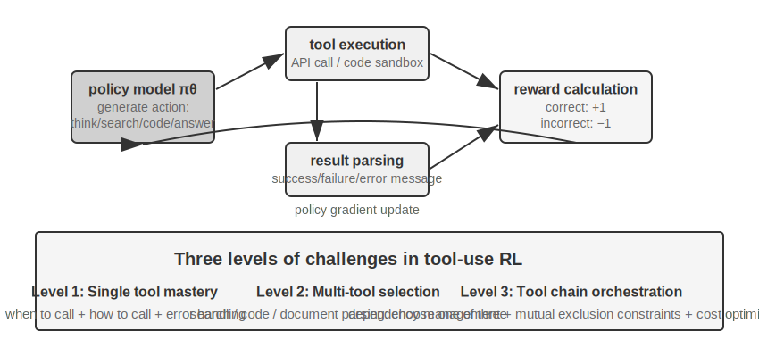

Tool use extends the agent's capability boundary from "model's own reasoning" to "calling external systems for collaboration," making it a key step toward practical agents. From a difficulty gradient perspective, RL training for tool use faces three levels of challenges. The first level is learning to use a single tool—understanding input/output specifications, mastering the timing of calls, and handling error feedback. The second level is making choices within a multi-tool ecosystem—facing dozens of tools, deciding when to search, when to execute code, and when to parse documents. The third level is tool chain orchestration—discovering dependencies between tools, identifying mutually exclusive constraints, and optimizing cost efficiency.

There are currently two active lines of research around agent RL for tool calling. One is **retrieval augmentation**: represented by Search-R1 (Jin et al., 2025), which uses RL to train the model to autonomously decide when to initiate a search during the thinking process and to use the returned results to continue reasoning, rather than following a fixed RAG pipeline. The other is **software engineering**: represented by training environments like SWE-Gym, which perform multi-round RL on coding agents in real codebases, allowing the model to iteratively edit, run, and fix code. A common challenge for both lines is long-term credit assignment (attributing a final success to a decision made dozens of steps earlier) and environment engineering (building stable, reproducible, and massively parallelizable training environments).

Tool RL also has an unavoidable engineering detail: **loss masking for environment feedback tokens**. A tool call trajectory contains both tokens generated by the model itself (thinking, tool call parameters) and tokens returned by the environment (code interpreter output, search results, customer service replies). The latter are not generated by the policy but are given by the environment—if they are included in the policy gradient, the model would be trained to "predict what the sandbox will output," which deviates from the optimization objective and makes training unstable. The standard practice is to mask the environment feedback tokens when computing the loss, backpropagating gradients only for the tokens generated by the model. This is one of the core technical points of ReTool (masking gradients for feedback tokens inside `<interpreter>` tags), and it is what Search-R1 refers to as "masking retrieved tokens to stabilize training." Major training frameworks like veRL and AWorld have this mechanism built-in.

> **Experiment 7-15 ★★★: ReTool—Code Interpreter Enhanced Math Problem Solving**
>
>
> 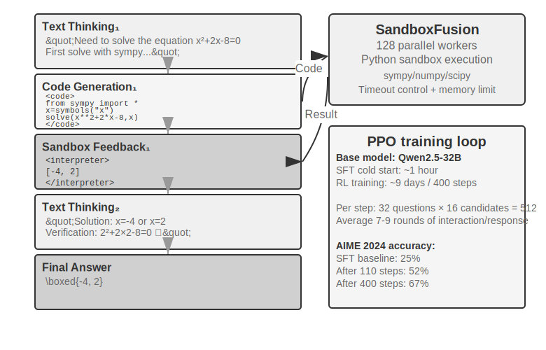
>
>
> Pure text thinking is prone to cumulative errors in precise numerical calculations, symbolic operations, or complex equation solving (e.g., ten consecutive multiplication steps, each potentially wrong). Code interpreters provide precise verification through an executable interface. ReTool integrates the real-time execution of a code interpreter into the RL thinking loop, allowing the model to autonomously learn when and how to use the tool under the guidance of result feedback.
>
> Training is divided into two stages. SFT warm-up (about 1 hour) converts pure text reasoning data into code-augmented trajectories, establishing basic tool calling patterns. RL training (PPO based on modified veRL, training data from DAPO-Math-17k, about 9 days for 400 steps) optimizes the policy through rollouts interleaved with real-time code execution: the model generates code containing `<code>` tags, the sandbox executes it and wraps the result in `<interpreter>` tags for feedback, the model continues generating, forming a mixed reasoning sequence of "text 1 + code 1 + feedback 1 + ... + answer." Each training step generates 512 responses (32 questions × 16 candidates), with an average of 7-9 interaction rounds per response, and total token processing grows from an initial 25M to 40M.
>
> ReTool itself uses standard PPO and does not modify the optimization algorithm. However, its training data comes from the DAPO team's DAPO-Math-17k, so we take this opportunity to introduce the recently popular **DAPO** algorithm (Yu et al., 2025). It makes four improvements over standard PPO, with the core goal of preventing the model from prematurely converging to a single strategy (only solving problems in one way):
>
> - **Clip-Higher (Relaxing the exploration upper bound)**: Standard PPO limits the magnitude of policy changes per training step—too large a change can destabilize training. But too strict a limit makes the model "afraid to try new paths." Clip-Higher moderately relaxes this limit: when the model accidentally discovers a clearly better path, it is allowed to adjust more boldly toward it, thereby encouraging exploration.
> - **Token-Level Policy Gradient Loss (Equal weight for each token)**: The original GRPO normalizes the loss at the sample level—first averaging within each response by the number of tokens, then averaging across samples—which dilutes each token in a long response by `1/|o_i|`: high-quality long chains of thought receive insufficient reward, and verbose repetition receives insufficient penalty. DAPO's Token-Level Policy Gradient Loss removes this sample-level averaging and instead normalizes uniformly across all tokens in the entire batch, giving each token equal weight; the direct consequence is that long responses receive a gradient contribution commensurate with their length.
> - **Dynamic Sampling (Intelligent allocation of compute)**: Dynamically adjust the number of samples per question during training—reduce sampling for simple questions the model can already solve stably (further training yields little benefit), and increase sampling for questions in the "learnable range" with success rates between 20% and 80% (these are the most informative), concentrating compute on the most valuable data.
> - **Overlong Reward Shaping (Penalizing verbose responses)**: Apply a soft penalty to excessively long responses. When the model generates a very long thinking process without answering better, the system reduces its reward score, guiding it to learn more concise and efficient thinking.
>
> Back to ReTool. On AIME 2024, training based on Qwen2.5-32B-Instruct achieved an accuracy improvement from an initial ~25% to 52% at the 110-step intermediate checkpoint (Best-of-30 reached 85%); the paper's final result after 400 steps was 67.0%, while the pure text RL baseline after 1080 steps was only 40.0%. The training dynamics numbers in this experiment box are all based on this 32B model configuration.
>
> Emergent capabilities: code self-correction (identifying execution errors and autonomously generating corrected versions), tool use shifting from late-stage verification to early-stage exploration, and improved thinking efficiency (length reduced by 40% while accuracy increased).
>
> The training dynamics for the first 110 steps show a three-phase pattern: early (0-20 steps) rapid learning of basic tool use, accuracy improving by 0.5% per step; middle (20-70 steps) oscillatory exploration, response length increasing from 2500 to a peak of 4700 tokens, with a surge in policy diversity; late (70-110 steps) stable convergence, length dropping to 4400 tokens, performance continuing to improve but with reduced fluctuation.> The fundamental difference in time cost between SFT and RL stems from differing information density: SFT provides a supervisory signal for every token, while RL only gives a success/failure signal per episode. In practice, the time per step increases with response length, and a few extremely long responses can significantly prolong the entire training cycle.
>
> **Experiment 7-16 ★★★: AWorld-train — Learning to Use Tools in a Sandbox**
>
>
> 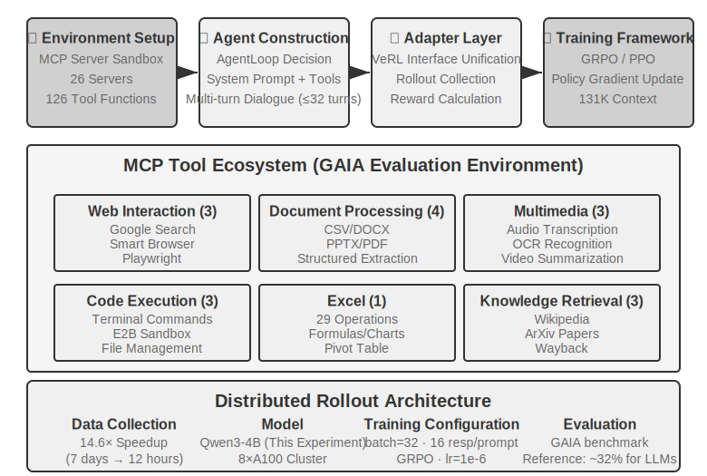
>
>
> GAIA is one of the most challenging Agent evaluation benchmarks. Even large-parameter models trained at scale may only achieve around 32%, still significantly behind top-scoring systems. This experiment uses a smaller model (Qwen3-4B), with the primary goal of demonstrating a complete "learning from practice" training pipeline.
>
> The AWorld training environment is an MCP server sandbox, providing 26 servers and 126 tool functions. These cover Web interaction (Google Search, Smart Browser, Playwright), document processing (CSV/DOCX/PPTX/PDF), multimedia processing (audio transcription, OCR, video summarization), code execution (terminal commands, E2B sandbox), Excel processing (29 enterprise-level operations), and knowledge retrieval (Wikipedia, ArXiv, Wayback Machine). Rate limits, service fluctuations, and account bans from real APIs make direct training in a production environment infeasible—building a stable, controllable, and replayable simulation environment is an engineering prerequisite for multi-tool RL training.
>
> The qualitative leap from single-tool to multi-tool lies in this: a single tool only requires deciding "when" and "how" to call it; multi-tool scenarios also require solving "which one to call" and "how to combine them," introducing combinatorial explosion and dependency management complexity—tools have prerequisite dependencies (must search before browsing a specific page), mutual exclusion constraints (some tools cannot be called simultaneously), and cost differences (different APIs have varying quotas and latencies). The policy must plan holistically under these constraints, rather than greedily choosing the locally optimal action.
>
> It should be noted that this experiment is an **open-ended training experiment without baseline results**—a model of Qwen3-4B's scale is unlikely to achieve impressive scores on GAIA. The value of this experiment lies in successfully running the complete "learning from practice" pipeline, not in setting new benchmarks. Acceptable validation criteria and expected observations are: the environment's reset and episode loop (tool calls, feedback, state updates) runs stably without crashes; the average reward curve shows an upward trend during training; tool call success rate improves with training, and the model gradually learns to make more reasonable choices and combinations among multiple tools.

## Cutting-Edge Exploration for Improving Sample Efficiency

The experiments described above have systematically demonstrated the core value of RL in Agent training, but all at a high sample cost. ReTool's RL training time was over 200 times that of SFT (9 days vs. 1 hour), which may be unacceptable in resource-constrained or rapid-iteration scenarios.

The low sample efficiency of RL has multiple causes (high variance, sparse rewards, difficulty in reusing on-policy data). One significant root cause lies in the model-free nature of mainstream policy gradient methods—they do not model environment dynamics (a world model, "what the world will look like after an action is taken"), nor can they easily leverage the rich information contained in a single feedback signal (these two points are related but not identical). The rich feedback returned by the environment after each interaction (error reasons, missing fields, correct procedure hints) is mostly wasted—the earlier section "The Dilemma of Sparse Rewards" analyzed this problem in detail. Consider a scenario of calling customer service: the agent is explicitly told, "I need the last four digits of your credit card to verify your identity," but model-free RL can only learn from the final success/failure signal (reward of 0 or 1). It cannot directly utilize this explicit feedback and must rely on hundreds of random explorations to accidentally try providing the credit card information. A human, upon hearing this feedback, would immediately remember it and proactively prepare it next time.

Addressing this bottleneck, this chapter has actually provided two complementary approaches. One is to **re-transform the wasted information from environment feedback into learnable rewards**—turning explicit, machine-determinable signals like "the agent requires identity verification first," "this command is destructive," or "another step is proven" directly into the reward function. This is the RLVP method discussed in Section 7.10 (especially its use of partial rewards for "rewardable progress," which can salvage wasted samples from completely failed groups). The other approach, which this section will formally develop, is to **make the training signal denser at every step**: instead of only receiving a single success/failure scalar at the end of the task, provide guidance at every point along the trajectory. This is On-Policy Distillation.

### On-Policy Distillation: Combining the Strengths of SFT and RL

On-Policy Distillation, systematically proposed and popularized by Thinking Machines Lab in 2025[^ch7-10], has become a very mainstream method in post-training and deserves a dedicated explanation. To understand what problem it solves, let's first look at a critical weakness of both SFT and RL—it neatly combines the advantages of both.

**SFT's Weakness: Learner-Sampler Mismatch.** SFT's training data is generated by a "sampler" (a teacher model or human expert), and the "learner" (the model being trained) merely passively imitates these **correct paths**. The problem is that when the learner acts on its own, it inevitably makes mistakes and enters **off-distribution states** never seen in the training data. It has never learned how to recover from these states back to the correct path, so small errors accumulate into large ones—like a student who only memorized the correct answers and has no idea how to recover if a single intermediate step is wrong. The root cause is that the distribution of "who is acting" during training (the teacher) differs from the distribution during deployment (the student itself).

**RL's Weakness: Signals are Too Sparse.** RL lets the student act on its own (on-policy), solving the distribution mismatch. However, each trajectory only yields a single success/failure scalar at the end. How to correct each intermediate step must be reverse-engineered through hundreds or thousands of trial-and-error attempts.

**On-Policy Distillation combines the strengths of both: it lets the student generate its own trajectories (On-Policy, solving distribution mismatch) while a stronger teacher model provides a dense signal for every token the student generates (Dense Signal, solving signal sparsity).** A one-line comparison of the three methods: SFT is "off-policy + dense signal" (has distribution mismatch), RL is "on-policy + sparse signal" (feedback is sparse), and On-Policy Distillation is "**on-policy + dense signal**"—both weaknesses are addressed.

How exactly is the scoring done? The teacher doesn't just judge whether the student's step is correct; it provides the complete probability distribution for the next token at the current position. For example, if the student writes "first query the API, then parse the return value...", the teacher might determine that at this position, "query" should have an 80% probability, "call" 15%, and the remaining 5% for other tokens. The student's learning objective is to make its own predictive distribution at each position as close as possible to the teacher's distribution. Technically, this is achieved by minimizing the **KL divergence** between the two distributions (KL divergence measures the difference between two probability distributions; the smaller it is, the closer they are, and it is zero when identical, as detailed in Section 7.7). Compared to the binary signal of final success/failure, this token-level distribution alignment is denser by more than an order of magnitude.

The results are striking: on tasks like mathematics, achieving equivalent performance requires roughly **1/10** of the training steps needed for pure RL. The advantage is especially pronounced in long-chain reasoning tasks—with the teacher guiding every step, the student quickly learns to correct errors instead of drifting further down a wrong path. It also helps mitigate overfitting: in standard RL, repeatedly training on the same prompt can lead to memorizing the final answer. Here, each trajectory is different, and the teacher provides feedback specific to that trajectory, leading to learning a general strategy rather than specific answers, thus significantly improving data reuse efficiency.

This method is particularly valuable in **multi-turn Agent scenarios**: the success/failure signal appears at the very end, being both sparse and delayed. The token-level teacher distribution perfectly fills the missing guidance for every intermediate step. However, it has a prerequisite that echoes the main theme of this chapter: **a sufficiently realistic simulation environment is necessary for the student to explore freely**—otherwise, when the student enters an off-distribution state that the teacher has also never seen, the teacher's scoring becomes unreliable. The value of On-Policy learning is built upon the premise that "the student is truly exploring the deployment distribution."

The principle that "dense signals outperform sparse signals" had a very clean validation in a pure Agent scenario. Chapter 2, when discussing the status bar, mentioned an Agent's "sense of time"—urgency, persistence, vigilance—which can be instilled at inference time via an instruction manual. However, embedding this sense of rhythm directly into the weights of an 8B small model, without relying on prompts, presents a post-training challenge. The author and collaborators sequentially tried DPO and four RL recipes on this problem. These four RL methods each fell into a failure mode discussed earlier in this chapter: a hard-gated reward was too sparse, most rollouts scored zero, and the within-group advantage was nullified (sparsity); switching to a graded reward made the signal denser, but the proxy metric did not correspond to the actual pass rate (objective misalignment); scoring only the first turn's reply encouraged short, perfunctory answers that performed worse in multi-turn evaluations (rollout shape mismatch); finally, aligning the rollout shape with the evaluation and seeing the training reward start to climb led to the policy collapsing to a single mode within a few steps, which even a 4x stronger KL anchor could not prevent (training collapse). None of the recipes surpassed the SFT ceiling. Switching to On-Policy Distillation—using a frozen Qwen3-32B teacher to provide token-level target distributions on the student's own multi-turn trajectories—led to smooth training convergence, with pass rates under four different conditions all being 23 to 47 percentage points higher than the baseline SFT model trained on the same data[^ch7-11]. Four sparse signals failed in turn, while one dense signal succeeded, reinforcing the chapter's main point: what often bottlenecks post-training is not a cleverly designed reward function, but the insufficient density of the signal itself.

## The Complete Post-Training Landscape and Practical Tips

This chapter started from pre-training's "predict the next word" and has traveled a long path: SFT solidifies format, RL enables generalization, multi-turn tasks introduce the credit assignment problem, reward design extends from outcome rewards to path signals that "reward outcomes and constrain processes," and tool use brings combinatorial explosion. A common thread runs through these experiments—what a model learns depends on what the training signal teaches it; and the quality of the signal is primarily determined by the data and environment, not the algorithm.

**Synergistic Paradigm**: The earlier section (GeneralPoints experiment summary) used the Chinese painting principle of "form first, spirit second" to summarize this paradigm—SFT is used until "format is stable and basic capabilities are present," and then RL shapes the strategy on this foundation. They operate on different levels: SFT solidifies protocols and structures (JSON format, dialogue templates, tool interfaces), while RL optimizes strategy and generalization (arithmetic rules, spatial reasoning, action sequences). The key balance: excessive SFT training can cause the model to collapse onto the training distribution, limiting the optimization space for RL.

The following **common pitfalls** are worth noting; recognizing these problems is often more valuable for avoiding wasted resources than mastering technical details:

1.  **Over-reliance on post-training to memorize facts**—Use RAG for factual knowledge management (dynamically updatable, traceable sources, not forgotten during training). Post-training should focus on "how to use knowledge."
2.  **Introducing RL before format is stable**—If the model cannot reliably produce basic JSON (parsing failure rate > 20%), RL training will completely fail. SFT must come first.
3.  **Poorly designed reward functions leading to reward hacking**—The model learns to exploit loopholes in the reward to get high scores without truly completing the task (e.g., generating long, meaningless text just for length). Evaluate the final objective, not intermediate metrics.
4.  **Neglecting simulation fidelity**—If the simulation is too simplistic (customer service always responds in a fixed pattern) or the environment response is unrealistic (error messages differ from the production environment), the trained policy will completely fail in real-world scenarios. The cost of building a high-fidelity simulation environment may exceed the training cost itself.
5.  **Over-training leading to decreased generalization**—When training loss continues to decrease but validation set performance worsens, the model is memorizing training details. SFT is particularly prone to this; early stopping remains crucial. Over-optimization in RL can also lead to policy overfitting to the current task distribution.
6.  **Value function collapse and insufficient exploration**—Inaccurate value estimation in PPO can bias advantage calculation, manifesting as severe oscillations in the training curve. Too low a temperature or insufficient randomness can trap the Agent in a local optimum.
7.  **Underestimating the computational cost of RL**—Tasks that perform well with SFT may require 10-100 times the training time when switched to RL. If the test distribution is highly consistent with the training distribution, SFT may be sufficient.
8.  **Low-quality training data**—SFT will directly learn noise and bias in the data, solidifying errors into parameters. While RL might discover better strategies through exploration, if the reward model has systematic biases, it will optimize in the wrong direction.

Core principle: **Before investing large-scale resources, validate key assumptions with small-scale experiments**—test if SFT can stabilize format with a small amount of data, verify if RL can converge in a simplified environment, and check with a small sample if the reward function reflects the true objective. Failing fast is more acceptable than failing at scale.

**Synergy with RAG/ICL**: Post-training, externalized learning, and in-context learning constitute three dimensions of Agent capability. They are not mutually exclusive alternatives but three adjustable "knobs" acting on model parameters, external knowledge, and conditional information at inference time, respectively. The value of ICL lies in its "zero-parameter-change" immediate control—using a few examples or explicit rules to quickly shape behavior, making it the preferred choice for the exploration phase. However, as the number of examples increases, latency and cost grow rapidly. The value of RAG lies in "externalizing facts and evidence"—providing dynamically updatable external knowledge and traceable sources without changing parameters, naturally suppressing hallucinations and meeting audit/compliance requirements. The value of post-training lies in "writing behavior and style into parameters"—stabilizing tone, format, and tool usage habits, significantly improving consistency. A special note: SFT/RL struggle to accurately memorize large amounts of factual knowledge. If the model must master domain facts, continuous pre-training is required (cost is much higher than SFT and requires carefully designed data ratios). Therefore, memorizing facts is better suited for RAG.

The most common and robust practice is: use RAG for the precise memorization and interpretability of "factual knowledge," delegate "behavior and structure" to post-training for solidification; use ICL with more capable models for rapid strategy iteration, and then internalize stable behaviors into parameters via post-training. Post-training can also achieve model distillation—distilling the capabilities of a high-capability large model into a smaller, lower-cost model.

## Chapter Summary

The essence of model post-training is writing interaction strategies into parameters.

SFT and RL are not competitors but sequential stages: SFT first stabilizes the output format (otherwise, RL's reward signal cannot even be computed), and then RL learns to generalize on this foundation. "SFT memorizes, RL generalizes" is not just a slogan but a measurable phenomenon.
There are also two judgments that run through the entire chapter and are more worth remembering than any algorithm. First, **data and environment are more important than algorithms**: you can use off-the-shelf RL algorithms; what truly creates a gap is the fidelity of the simulation environment and the quality of the training data—in many scenarios, if the SFT data quality is sufficient, you may not even need RL. Second, **the current main bottleneck of RL is sample efficiency**: On-Policy Distillation, which makes the signal denser at every step, and RLVP (Verification-guided RL with Path Penalties), which transforms wasted environment feedback into learnable signals ("reward outcomes, penalize paths," using partial rewards for reachable progress to salvage samples from completely failed groups), are currently the two most promising directions. Their commonality remains the same—transforming information that already exists in the environment and data but is wasted by pure outcome rewards, back into something the model can learn.

[^ch7-1]: Schulman, John and Thinking Machines Lab, “LoRA Without Regret” , 2025.[^ch7-4]: Ouyang, Long et al., “Training Language Models to Follow Instructions with Human Feedback”, OpenAI, 2022.
[^ch7-5]: Gao, Leo, John Schulman, and Jacob Hilton, “Scaling Laws for Reward Model Overoptimization”, OpenAI, 2023.
[^ch7-6]: Rafailov, Rafael et al., “Direct Preference Optimization: Your Language Model is Secretly a Reward Model”, 2023.
[^ch7-7]: Lightman, Hunter et al., “Let's Verify Step by Step”, OpenAI, 2023.
[^ch7-8]: Silver, David and Richard S. Sutton, “Welcome to the Era of Experience”, 2025.
[^ch7-9]: The path penalty design, four principles, and experimental data in this section are from Li, Bojie and Noah Shi, “RLVP: Penalize the Path, Reward the Outcome”, 2026. arXiv:2607.07435.
[^ch7-10]: The method and experiments for On-Policy Distillation are from Thinking Machines Lab, “On-Policy Distillation”, 2025.
[^ch7-11]: This set of post-training comparisons for Agent time perception—the failure modes of DPO and four RL methods, and the breakthrough of On-Policy Distillation—are from Li, Bojie and Noah Shi, “Agents That Sense Physical Time: Urgency, Persistence, and Vigilance as Missing Controls for LLM Agents”, 2026. https://01.me/research/physical-time-agent

Post-training solves the problem of "how to make the model smarter," but model weight update cycles are measured in weeks, while in reality, API launches and deprecations, user demand evolution, and business rule changes happen every day. The next chapter will explore a complementary evolutionary path—one that does not modify model weights, but instead enables the Agent to autonomously build a tool library and knowledge base through externalized learning, achieving continuous capability expansion.

## Exercises

1. ★★ Catastrophic forgetting—where fine-tuning for a specific task destroys the model's original general capabilities (e.g., general tool calling)—is particularly troublesome in Agent scenarios. Compared to full-parameter fine-tuning, LoRA freezes the base weights and carries a lower risk of forgetting, but it is not immune. What strategies can further mitigate capability forgetting during fine-tuning?
2. ★★ Post-training solidifies capabilities into model weights ("muscle memory"), while in-context learning places knowledge in the input during inference. However, some capabilities (e.g., domain knowledge) can be learned either through post-training or provided via few-shot examples. What criteria would you use to decide which path a given capability should take?
3. ★★ Model distillation allows a small model to learn the behavior of a large model. By capability level, the models being distilled can be roughly divided into three tiers—**Chat models** (single-turn dialogue, direct answers), **Reasoning models** (generating long chains of thought before answering), and **Agentic models** (multi-turn tool calls, interacting with the environment). What are the different challenges in distilling each of these three types of models? (Hint: Start with "what exactly is being distilled"—is it the style of the output, the complete reasoning trace, or the decision-making strategy for interacting with the environment; which tokens in the trace should be learned and which are environmental returns that should not be learned; and how late and how sparse the success/failure signals are.)
4. ★★★ In multi-turn Agent interactions, the credit assignment problem is more severe than in single-turn scenarios—a final success or failure is difficult to attribute to a decision made in turn 3 versus turn 7. How would you design a reward allocation strategy?
5. ★★★ Post-training, externalized learning, and in-context learning constitute three dimensions of Agent capability. If you have a fixed budget (e.g., $10,000) to improve the performance of a customer service Agent, how would you allocate the budget among these three dimensions? What factors would your decision depend on?
6. ★★★ Autonomous model learning, without a clear reward function and with scarce samples, is considered by some to be the ultimate goal of post-training. How far are current RL training methods from this goal? Where do you think the next breakthrough is most likely to come from?
7. ★★ This chapter points out that the cost of LoRA fine-tuning is not high. So, is it possible to train a dedicated LoRA for each user (or each client company), writing user memory or enterprise knowledge into the parameters, rather than storing it in an external knowledge base as in Chapter 3? In what scenarios would "writing memory into parameters" have an advantage over "storing memory in a knowledge base"? And in what scenarios would it be counterproductive?
8. ★★★ On-Policy Distillation relies on a stronger teacher model to supervise the student. However, OpenAI's Weak-to-Strong Generalization research proposed a counterintuitive finding: the supervisory signal from a weak model can sometimes unlock latent but unactivated capabilities in a strong model. If this idea is applied to Agent training, could it achieve a "small model teaches large model" reverse distillation?
9. ★★ A Process Reward Model (PRM) evaluates each reasoning step, while an Outcome Reward Model (ORM) only looks at the final result. But which is more worthy of reward: "a correct process leading to a wrong result" or "a wrong process luckily leading to a correct result"? In the multi-step tool-calling scenario of an Agent, how would you weigh these?
10. ★★★ The evaluation datasets discussed in this chapter (e.g., SWE-Bench Verified, τ²-bench, AndroidWorld) can be used for both evaluation and post-training. However, if an evaluation set is used for training, it is no longer an independent evaluation set—does this violate the fundamental principle that training and test sets must be separated? The dynamic parameter generation of τ²-bench and the parameterized templates of AndroidWorld alleviate this problem to some extent, but the template structure itself remains fixed. How can we find a balance between fully leveraging the training value of evaluation data and maintaining evaluation independence?
11. ★★★ This chapter proposes a "form first, substance later" training paradigm: stop SFT once "the format is stable and basic capabilities are present," then switch to RL. But in practice, how do you determine when SFT is "enough" and it's time to switch?
12. ★★★ The training dynamics of ReTool show (see Experiment 7-15) that a small number of very long responses can significantly lengthen the entire training cycle—most rollouts in a batch are already generated, but you have to wait for those few longest responses to finish, during which GPU utilization on the cluster is very low. How can resource utilization be improved in training clusters for such long-tail response scenarios?
