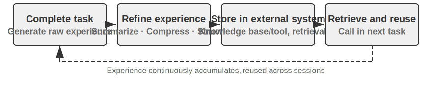
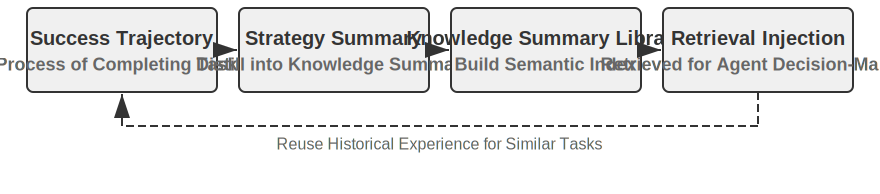
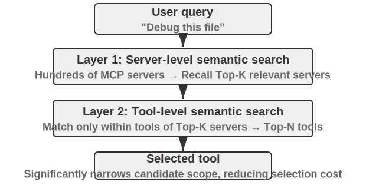
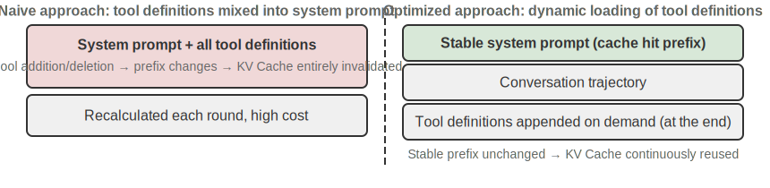
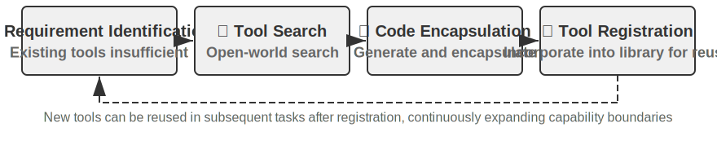
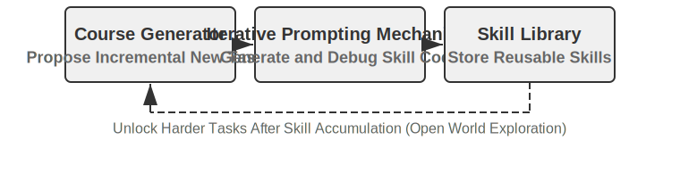
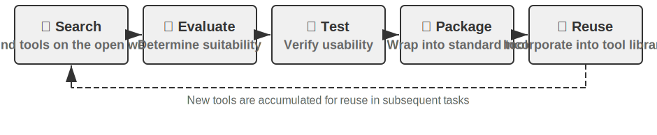

# Agent Self-Evolution

The previous chapters built the Agent's capability system from different dimensions. Chapter 2 on context engineering laid the foundation for information management (including on-demand loading via the Skills mechanism); Chapter 3 on knowledge bases and user memory achieved cross-session knowledge persistence; Chapter 5 demonstrated how a Coding Agent can accumulate experience through the file system; and Chapter 7 on reinforcement learning post-training solidified strategies into model parameters. These techniques each have their own focus, but they all point to the same question: **How can an Agent continuously improve?**

Even the most cutting-edge models, when faced with a specific company's refund process, a particular carrier's sales script, or the calling convention of an obscure API, are as clueless as a fresh hire on their first day. Modifying model weights requires massive amounts of data and compute, with update cycles measured in weeks; meanwhile, in the real world, new APIs go live, old services are decommissioned, and user needs are constantly changing. An Agent needs a lighter-weight, more immediate evolution mechanism—one that can continuously expand its own capability boundaries without changing the model parameters.

This chapter explores exactly that mechanism: **Agent Self-Evolution**. Self-evolution is externalized learning, encompassing two dimensions—distilling knowledge from experience, and proactively discovering and creating new tools. The core idea is to separate knowledge and processes from model parameters and transient context, externalizing them into persistent, retrievable, and reusable external resources—tool libraries and knowledge bases. This is not a replacement for post-training, but a complement: post-training addresses "how to make the model smarter," while self-evolution addresses "how to make the Agent more capable."

## Why Agents Don't Learn Automatically

The previous section discussed real-world needs. But there is a more fundamental question: **If the context window could be infinitely long, and we stuffed all the conversations and tool call results an Agent has ever experienced into it, would it automatically learn everything?**

The answer is no, and the reason lies in the attention mechanism discussed in Chapter 2. This is the theoretical starting point of this chapter, and after several chapters, it's worth a brief review.

Chapter 2 repeatedly emphasized: **The internal mechanism of in-context learning is more like retrieval than reasoning.** Attention excels at "looking up"—"What cat is in the 37th cage?"—a direct hit; but it is not good at "inductive statistics" in a single forward pass—"How many black cats are there in 100 cages?" The latter requires traversing all records and maintaining a counting state, which is essentially thinking, not retrieval. In other words, if you dump raw experience into the context, the model can "remember" it, but it won't automatically "distill" it into reusable patterns. Even if the context were truly infinite, this gap would still exist: the information is there, but no one performs the compression step from "specific records" to "general patterns" for the model. Moreover, as Chapter 2's "context decay" revealed, the longer the context and the more noise it contains, the more diluted the attention becomes, making it harder to retrieve key information—an infinite context does not bring automatic learning; it causes retrieval quality to steadily decline. Karpathy's insight can be read in reverse: the model's "poor memory" is a feature, not a bug; it forces us to actively and explicitly perform knowledge distillation, rather than expecting the model to figure out patterns from lengthy histories on its own. In short: **Learning does not happen automatically; it must be explicitly designed**—and that is the very reason for this chapter's existence.

And "explicitly designed learning" doesn't just appear in Chapter 8. The previous chapters have already laid several foundations, although most of them serve the immediate needs **within a single session** or **across adjacent sessions**: Chapter 2's **context compression**, which uses an extra LLM call to "swap" bloated raw records for computed conclusions, compensating for the missing "distillation" half of attention; Chapter 2's **Agent status bar**, which deterministically maintains key conclusions in the context through code, is the other side of the same coin; Chapter 3's **user memory** has already pushed "learning" across sessions—the Agent accumulates understanding of the user over multiple conversations, becoming more accurate through offline organization.

The user memory in Chapter 3 is itself a form of learning, but what it distills is **information** about "who the user is" (preferences, facts, habits). Chapter 8 aims to fill the other, more long-term half: distilling problem-solving strategies, operational procedures, failure lessons, and even entirely new tools discovered during exploration into persistent, retrievable, and reusable **capabilities**, so that the Agent doesn't just "remember more," but becomes "increasingly capable." This type of learning is more long-term and requires the Agent to **proactively** initiate it, hence it deserves a dedicated chapter—starting with a macro-level positioning below.

## Three Learning Paradigms and the Positioning of Self-Evolution

The three paradigms introduced in Chapter 1 (Figure 1-1) are used here only for positioning comparison. **Post-training** modifies model weights, solidifying "experience" into "muscle memory" through RL, offering high success rates and low latency, but with high update costs and long cycles (detailed in Chapter 7); **In-Context Learning (ICL)** provides demonstration examples in the prompt for temporary adaptation, with low cost and quick results, but it disappears when the session ends (see Chapters 1 and 2); **Externalized Learning** is the path most easily overlooked by developers—distilling knowledge into files, knowledge bases, and tools outside the model, which is persistent, interpretable, and modifiable at any time. The three are synergistic, not competitive: factual knowledge goes to RAG (see Chapter 3) and externalized storage, stable behaviors and formats are solidified by post-training, and current transient information is handled by in-context learning.

This chapter focuses on the path that **does not change model weights**—externalized learning, which corresponds to the two dimensions mentioned at the beginning of the chapter: externalizing experience into knowledge and Skills, and externalizing capabilities into tools. (This should be distinguished from Chapter 5's "Code Creating Code: Agent Bootstrapping," which is about Agents creating systems similar to themselves; this chapter is about capability growth without changing weights. Chapter 3 solves "how to store and retrieve" knowledge bases; this chapter solves "who fills and updates them"—how the Agent proactively accumulates experience.)

Why is it needed? Consider a negative scenario. Suppose a customer service Agent handles a certain bank's refund process for the first time: after 15 minutes of exploration—making 3 phone calls, trying 2 different scripts—it finally succeeds. If it lacks externalized learning capability, the next time it encounters an identical request, it will have to spend another 15 minutes going through the same exploration from scratch; the accumulated experience from this session will be lost when it ends. The key is the word "autonomous": it's not a human engineer preparing documentation for the Agent, but the Agent itself summarizing experience, building tools, and updating the knowledge base while completing tasks—just like a veteran customer service representative organizing scattered refund rules into a handbook that can be consulted at any time and updated autonomously based on new situations. The core philosophy is: instead of expecting the model to remember everything, use extra computation after task completion to summarize, compress, and structure the experience, then store it in a persistent, retrievable external system. Compared to parameter learning, this method can quickly distill interpretable, verifiable, and modifiable knowledge without expensive training; compared to in-context learning, it avoids inefficient retrieval from vast amounts of raw information through active distillation and structured organization, achieving cross-session persistence.

More importantly, externalized learning elevates the Agent's learning capability from "remembering information" to "building capabilities": it can not only summarize experience into general knowledge and store it in a knowledge base for future retrieval (the RAPTOR tree-based summarization introduced in Chapter 3's RAG section is also applicable to the layer-by-layer distillation of experience—from specific operation records to rules, and then to principles), but also encapsulate repetitive operational procedures into precisely executable tools, forming a continuously growing skill library. For example, when a customer service Agent helps a client with a refund, it might learn three different types of things. The first is a specific rule—"Company A's refund requires verifying the last four digits of the credit card"—this is factual knowledge, stored in the knowledge base; the second is a general tool—"Use X API to automatically query order status"—this is a stable, reusable sequence of operations, best distilled into a code tool; the third is a job manual—"The complete Skill for the refund process"—involving strategic judgment and frequently changing business rules, better suited for a Skill document. Table 8-1 summarizes these three products of externalized learning.

Table 8-1 Three Products of Externalized Learning

| Product Form | Content Carried | Example | Usage Method |
|------|------|------|------|
| Knowledge Base Entry | Facts and rules | "This bank requires the branch address" | Semantic search or `grep` exact retrieval |
| Dedicated Code Tool | Repeatable operational procedures | "API call sequence for querying account balance" | Solidified as code, called via parameters |
| Skill Document | Complex but frequently changing work strategies | "Best practices for handling insurance claims" | Natural language document, loaded on demand |

There is a simple rule of thumb for deciding which form to use: **Store purely factual information in the knowledge base; write frequently used, parameter-rich procedures as code (tools); and write frequently changing, strategy-involving processes as documents (Skills).** The latter two fall under "tool generation"—a higher-order form of externalized learning that externalizes not only "knowledge" but also "processes" into code, shifting from "rethinking every time" to "generate once, reuse many times," much like writing an automation script after manually deploying a server for the first time. Chapter 4 has already discussed the framework for choosing between dedicated tools and Skills in detail.
## Why Agents Should Learn from Experience: From "Smart" to "Skilled"

The "veteran customer service representative" who organized scattered rules into a handbook highlights the key transition from "smart" to "skilled": the gap is often not that the model isn't smart enough, but that many business processes and domain knowledge are dynamic, non-public, and cannot be solved by merely improving the general capabilities of the base model—these are problems that depend on "experience." What an Agent learns from experience is precisely this type of knowledge: that unsubscribing from a certain service requires filling out a specific form rather than making a futile phone call; summarizing the eligibility conditions for a certain promotion (e.g., veterans or customers with over two years of tenure); judging whether there is room for negotiation on a broadband quote from a specific carrier in a specific region. Similarly, a Coding Agent is unaware of a project's unique code conventions and deployment processes, and a browser Agent doesn't know a particular website's anti-scraping strategies or layout changes—these are all real-time domain knowledge not present in pre-training data.

## Learning from Experience

Having understood the "why," the next question is "how." The engineering practice of externalized learning begins with "recording and reusing successful experiences." The following two experiments demonstrate two complementary approaches to experience accumulation: one distills high-level strategies into retrievable knowledge summaries (akin to "problem-solving notes"), and the other solidifies specific operational sequences into replayable automation tools (akin to "operation recordings").

Table 8-2 categorizes experience learning mechanisms by layer to help readers understand the relationships between knowledge distillation, knowledge organization, knowledge application, and engineering support.

Table 8-2 Layers of Agent Experience Learning Mechanisms

| Layer | Mechanism | Problem Solved |
|------|------|-------------|
| Knowledge Distillation | Strategy Summary, Workflow Recording, Failure Reflection | Extract reusable knowledge from successful and failed experiences |
| Knowledge Organization | Skills, Sleep Consolidation | Structure and index knowledge for storage |
| Knowledge Application | System Prompt Optimization | Inject knowledge into the Agent's behavior pattern |
| Engineering Support | Cross-Session Continuation | Enable long tasks to execute persistently |

These four layers are interwoven in the subsequent content—Strategy Summary, Workflow Recording, and Learning from Failure (Knowledge Distillation) naturally transition into Skills and Sleep Consolidation (Knowledge Organization), followed by System Prompt Optimization (Knowledge Application), and finally concluding with Cross-Session Continuation for long tasks (Engineering Support).

> **Experiment 8-1 ★★: Learning from Successful Experience: Strategy Summary**
>
> The `gaia-experience` project is a typical implementation of the "Strategy Summary" idea. A strategy summary condenses a successful problem-solving process into a structured experience note—recording "what methods were used, what pitfalls were encountered, and what the key steps were"—so that it can be directly referenced when encountering similar problems in the future.
>
> Not every run trajectory is worth distilling into experience; the criterion is **transferability**: can the lesson learned from the current task be reused in similar future tasks? Fixes that are only valid for a specific input should not enter long-term memory.
>
> This experiment uses two key infrastructures. The **AWorld framework** is an open-source execution and evaluation environment specifically designed for AI Agents, providing a standardized set of tools (browser, file system, code interpreter, etc.) and an automated evaluation pipeline—think of it as an "exam room" for Agents. **GAIA** is a highly challenging benchmark that evaluates general-purpose AI Agent capabilities through complex, multi-step problems requiring human-like intelligence—for example, "find specific information on a website, process it with code, and calculate the answer," often requiring the combined use of a browser, file manager, code interpreter, and complex logical reasoning.
>
> The core innovation is adding a complete "learning-application" loop to the Agent within the AWorld framework. In **Learning Mode**, whenever the Agent successfully completes a GAIA task, the system automatically captures its complete action trajectory and uses an LLM to "reflect" and "summarize" it, generating a structured experience summary. This summary not only contains the final answer but also distills the core method, key insights, and effective tool sequences used to solve the problem. These experiences are vectorized and stored in a knowledge base. In **Apply Experience Mode**, when the Agent receives a new task, it first performs a semantic search in the experience knowledge base to find the most similar historical success cases, and injects these experiences as "success examples" into the system prompt to guide decision-making. Experiments have shown this significantly improves the efficiency and success rate of solving new problems—the more tasks the Agent solves, the richer its accumulated experience, and the stronger its capabilities become, forming a positive feedback loop of self-evolution.
>
> **Experiment 8-2 ★★: Learning from Repetitive Tasks: Workflow Recording and Replay**
>
> The `browser-use-rpa` project is an excellent example of the "Workflow Recording" idea. The concept of workflow recording is similar to Excel's "macro recording" feature: you record the steps during the first manual operation, and then you can automatically repeat them with a single "playback" click. The problem this project solves is very practical: many repetitive operations performed in the browser (e.g., sending a report email, querying information on a specific website), although the specific parameters vary each time (e.g., recipient, search keyword), have a fixed core operational flow. Having the Agent start from scratch every time, using an expensive multimodal LLM to "rediscover" this flow, is a huge waste of resources—it essentially relies solely on in-context learning without externalizing successful experiences into reusable tools. The project's core is an extreme comparative experiment on efficiency and cost.
>
> In the **Learning Phase**, the Agent performs the task for the first time, completing the operation through the multimodal LLM's observe-think-act cycle, just like a human. Each time the LLM decides to execute an action, the system extracts the precise positioning information of the target element from the browser-use framework's history: the webpage is rendered as a DOM tree (Document Object Model) in the browser, where each button, input field, and link is a node; XPath (XML Path Language) points to a specific node using a path-like syntax such as `/html/body/div[2]/button[1]`. The action is recorded as a structured step: action type (click, input, etc.), XPath of the target element, action parameters, and post-execution verification information (e.g., whether the page URL changed, whether the expected element appeared). After the task is successful, the LLM generates a semantic label (e.g., "Send Email") and a description (e.g., "recipient field, subject field, content field, send button"), which are stored in the knowledge base along with the step sequence, forming a parameterized "workflow" entry.> In the **Replay Phase**, when a new task arrives, the system checks for a matching existing workflow using both semantic similarity (embedding vectors) and key element checks. If a match is found, it executes the steps at high speed: it uses Playwright's (an open-source browser automation library) waiting mechanism (`page.locator(xpath).wait_for(state='visible', timeout=15000)`) to ensure elements are loaded; parameterized templates (e.g., "Enter `{{email}}` in the recipient field") extract actual parameter values from the current task instructions via a lightweight LLM call, without requiring full visual reasoning. If a step fails (element not found, wait timeout), it indicates the webpage structure may have changed. The workflow is then marked as "potentially outdated," and the system falls back to learning mode, re-completing the task through LLM reasoning and generating a new workflow to replace the old one.

> **Acceptance Scenario**: Sending an email in the Gmail web interface.
>
> - First Execution (Learning Phase): "Send an email to test@example.com with subject 'Test Email' and body 'This is a test email.'" Observe how the Agent uses a multimodal LLM to identify the "Compose" button, recipient input field, subject and body input fields, and the "Send" button. Record the operation steps, time taken, and number of LLM calls.
> - Repeated Execution (Replay Phase): "Send an email to another@example.com with subject 'Follow-up Test' and body 'Second test email.'" The system identifies the matching workflow, extracts the new parameter values, and directly replays the operations without requiring LLM visual reasoning. The time taken and number of calls should be significantly reduced.
> - Knowledge Update: Simulate a webpage redesign (modify the HTML structure so the XPath of a certain button changes), and verify that the Agent can detect the workflow failure, fall back to learning mode, and regenerate a workflow to update the knowledge base.
>
> Expected observations: Task execution speed during the replay phase is significantly improved (by several times), LLM call costs are drastically reduced, and the success rate is more stable.

Workflow recording is not an isolated engineering trick; it is backed by a more general methodology. Voyager, an open-world Agent architecture proposed by the NVIDIA team (detailed later), systematizes the "explore-consolidate" cycle in the Minecraft virtual world: **Execute task → Verify success → Store the successful action sequence in a skill library → Retrieve and reuse when encountering similar tasks**. Experiment 8-2 is precisely the application of this approach to browser automation—the learning phase corresponds to "exploration," the workflow knowledge base corresponds to the "skill library," and replay and fallback on failure correspond to "retrieval and reuse" and continuous improvement.

Experiment 8-2 also exposes the two most fragile links in "record-replay." Handling these cleanly makes the mechanism truly reliable[^preact]. The first link is **when to trust the replay**. A more robust approach is to compile a successful action sequence into a small **state machine program**: each state comes with a "verification predicate" (a UI pattern that must hold true on the current real screen). During replay, **before each action, the predicate is checked against the live screen**—"look first, then act." If a predicate fails or an action errors out, control is handed back to the full Agent to start over, and the new trajectory is compiled into a program again. Because replay requires zero model calls, cached repetitive tasks can be 8.5–13 times faster. The second link is **don't store bad programs**: immediately after compilation, reset the environment and replay from scratch. Use a built-in benchmark evaluator to confirm "this actually got the job done" before allowing it into the library—this "pre-storage verification" blocks programs that "cover 100% of the replay steps but didn't actually accomplish the task" (e.g., the entire flow is completed and Save is clicked, but a certain field is actually empty). Without this gate, the program library degrades as faulty programs accumulate. This boils down to a clean principle: **Procedural memory also needs a verification gate, otherwise the self-improvement cycle will corrupt**—this is the strict version of "detect workflow failure, fall back and relearn" in Experiment 8-2.

[^preact]: The complete mechanism of compiling successful trajectories into state machine programs with verification predicates and setting a "pre-storage verification" gate is detailed in Li, Bojie. *PreAct: Computer-Using Agents that Get Faster on Repeated Tasks.* arXiv:2606.17929, 2026.

### Learning from Failure

Strategy summaries and workflow recording both extract experience from **successful trajectories**—Experiment 8-1 only triggers reflection and summarization after a task succeeds. But failure experiences are equally valuable, and often carry more information: a single failure definitively rules out one path, whereas success is often just one of many viable paths. Failure experiences typically crystallize into two forms: **Error Pattern Libraries** (recording "under what circumstances using what method fails, and what the failure signal is") and **Negative Rules** ("Don't use method X for Y anymore"—e.g., "Don't use the phone call method to cancel a subscription with this carrier; the phone channel has no authority to handle it").

The representative work in this direction is Reflexion (Shinn et al., 2023)[^reflexion-2023]: After a task fails, the Agent reflects on the cause of failure in natural language (e.g., "I should have verified my identity in the third step instead of directly submitting the form") and stores the reflection text in episodic memory. When attempting a similar task next time, these reflections are read as additional context, thus avoiding repeating the same mistakes. The entire process does not update any model parameters—Reflexion is a classic example of "evolution without changing weights"; this language-carried reflection carries far more information than a scalar reward, a point that will be expanded upon later when discussing system prompt learning. Another important outlet for failure experience is the system prompt: the automatic optimization of system prompts discussed later in this chapter is precisely about writing negative rules extracted from failure cases (e.g., "Never transfer to a human agent due to policy disputes") into the system prompt, making them behavioral constraints effective for all subsequent tasks.

[^reflexion-2023]: Shinn, N., et al. *Reflexion: Language Agents with Verbal Reinforcement Learning.* arXiv:2303.11366, 2023.

### Skills: Externalizing Domain Knowledge into Structured Capabilities

The two mechanisms discussed earlier respectively consolidate experience on "how to think" and "how to do." The Skills mechanism takes a third path—systematically refining domain operational knowledge into structured capability modules that can be loaded on demand. Think of a Skill as a "job manual": a new employee doesn't need to figure everything out from scratch; they can start working after reading the manual. Chapter 2 discussed in detail the Progressive Disclosure mechanism of Skills (metadata → core process → details) and their compatibility design with KV Cache. This section focuses on the philosophy of knowledge externalization behind Skills and their automated generation.

The core value of Skills lies in carrying knowledge in human-readable text: they are quick to update (no model retraining needed), auditable (human experts can directly modify and improve them), and transferable (usable across different models or systems). Essentially, Skills transform domain knowledge trapped in unstructured documents into a structured form easily utilized by Agents—allowing Agents to leverage knowledge through general search and reasoning capabilities, rather than hardcoding knowledge into code logic.

Going further, Anthropic's Skill Creator[^ch8-1] is a meta-capability that can create other Skills. It guides the Agent to refine domain operational knowledge into structured Skills through observation, learning, and summarization. When asked to create a Skill for a specific domain, the Agent first understands the specific usage scenarios through dialogue with the user, then analyzes each scenario to identify reusable resources, and finally creates a complete Skill package containing a standard directory structure, scripts, references, assets, and a main `SKILL.md` document. Skill Creator enables the knowledge transformation process itself to be completed by the Agent, realizing a bootstrapping cycle of knowledge accumulation: Agents can not only use Skills but also create them.

[^ch8-1]: Anthropic, "Skill Creator", 2025. https://github.com/anthropics/skills/blob/main/skill-creator/SKILL.md

Claude Code's `CLAUDE.md` mechanism demonstrates a similar capability: upon first encountering a code repository, it proactively reads the entire codebase to generate a project guide containing core information like architecture design, coding standards, and testing methods, which it continuously references and updates during subsequent development. This automated Skill generation mechanism means the expansion of an Agent's capabilities is no longer limited by the availability and knowledge coverage of human experts—when an Agent enters a new domain, it can learn through autonomous exploration, build operational guides, and solidify them as Skills, achieving a transition from "relying on pre-programmed knowledge" to "learning and accumulating knowledge through practice."

From the perspective of "experience consolidation," the specific forms of tool generation can be further divided into dedicated code tools and Skills + general executors. The principles for choosing between the two were given earlier, with a complete framework in Chapter 4, so they won't be repeated here. Applied to this section's scenario: operations with complex parameters and frequent calls are solidified as code tools (e.g., Voyager's skill library in Minecraft, parameterized scripts generated from browser workflow recording), while strategic, volatile business rules are written as Skill documents (e.g., Claude Code's `CLAUDE.md`). Real-world systems often use a hybrid of both forms.

### Sleep Learning: Autonomous Evolution of User Memory

The experiential learning mechanisms discussed earlier—strategy summaries, workflow recording, Skill generation—all occur during task execution or immediate post-task refinement. But human learning has another crucial component: **memory consolidation during sleep**. Chapter 2 used this analogy when discussing context compression—the brain processes the day's sensory input into compact long-term memory; this analogy applies not only to context compression within a single session but also extends to cross-session experience management: fragmented experiences gained during the day are reorganized, deduplicated, and integrated with existing knowledge networks during sleep, transforming into more compact, easily retrievable long-term memory.

The most typical object of this offline consolidation is the Agent's memory of **the user themselves**—who you are, your preferences, facts you've mentioned. A common misconception needs clarification here: what Agents like Claude Code organize during "sleep" is primarily **user memory**, not shared knowledge bases. Knowledge bases (RAG from Chapter 3) carry domain documents unrelated to specific users, typically batch-loaded via offline pipelines with little change; user memory, on the other hand, is the model of "getting to know you better" accumulated piecemeal across conversations—it is precisely this that requires repeated "sleep consolidation." The Claude Code and Hermes introduced next in this section both store this type of user memory, focusing on **how they evolve autonomously**.

Let's also clarify the division of labor with Chapter 3: Chapter 3 covered "how to store and how to query" user memory, and also introduced the consolidation **algorithms** for the memory storage layer (clustering summaries, conflict versioning, etc.), so those won't be repeated here. This section focuses on **engineering and evolution issues**—when to consolidate, who consolidates, and in what form to crystallize, so that memory becomes more accurate with use.

**Claude Code: Storing User Memory in Markdown.** Claude Code stores user memory directly as human-readable Markdown files: each memory is a small file with metadata (frontmatter), recording only one fact, with an index file (`MEMORY.md`) providing a summary navigation. The benefits of this form are clear—quick to update (just modify the file, no model retraining needed), auditable (users can directly open and modify), and transferable (usable across different models or systems).

But beyond "recording," "organizing" is also needed. Claude Code engineers the cognitive metaphor of sleep consolidation into a periodically running background memory consolidation mechanism. (The following description is based on public version behavior and community analysis, not an official definition.) The core design idea is: **experience accumulation and memory consolidation are two independent processes that should not occur within the same time window**—Agents also need dedicated "review time." Specifically, when two gating conditions are met (a certain time interval has passed since the last consolidation, and enough new sessions have accumulated during that period), the system launches an independent sub-agent in the background to perform a four-stage consolidation: **Orient** (read the existing memory index to understand the overall knowledge landscape), **Gather** (search recent sessions for new information worth persisting and detect facts contradicting existing memory), **Consolidate** (merge new signals into existing topic files rather than creating near-duplicate entries, convert relative dates to absolute dates, delete old facts that have been disproven), and **Prune & Index** (control index size, remove outdated pointers).

The most important design decision of this mechanism is: memory consolidation is not performed during user interaction but is completed asynchronously in the background, completely transparent to the user. Dual gating and distributed locks ensure concurrent instances don't trigger consolidation repeatedly, with automatic rollback on failure and retry next time; the consolidation sub-agent's permissions are strictly limited to the memory directory. From a broader perspective, it represents the evolution of user memory management from "recording without organizing" to a complete lifecycle of "record—consolidate—prune." Without regular consolidation, the memory repository degrades into a low signal-to-noise information dump, hindering retrieval quality; regular "sleep consolidation" keeps the memory repository compact, consistent, and easy to navigate, just as a human expert's knowledge is not an infinite accumulation of facts but a structured understanding refined through repeated organization.

**Hermes: Making Autonomous Learning a Resident Service.** Nous Research's open-source Hermes (2026) pushes this approach further: it is a daemon process resident on the user's own machine, continuously accumulating memory and evolving autonomously across sessions. Its memory is divided into four layers[^hermes]: **Prompt Memory** (`MEMORY.md` and `USER.md`, injected at session start, deliberately limited to a few thousand characters to "force" the Agent to prioritize), **Session Retrieval** (using SQLite full-text index FTS5 for historical sessions, retrieved fragments are first summarized by an LLM before injection, bringing in only parts relevant to the current task), **Skill Library** (procedural memory, using progressive disclosure, loading only skill names and summaries by default), and an optional **Honcho User Modeling Layer** (passively tracks preferences, communication style, and domain knowledge in the background, portraying "how the user and Agent co-evolve" across sessions). When a task meets specific conditions (e.g., more than five tool calls, recovery from an error, receiving user correction, or successfully completing a non-trivial workflow), Hermes automatically solidifies the experience into a reusable skill, preferentially updating it incrementally via patches rather than rewriting the entire document. Claude Code and Hermes represent the mainstream form of autonomous user memory evolution today—both use human-readable Markdown/text as the carrier.

[^hermes]: Nous Research, *Hermes: A Self-Improving Personal Agent*, 2026. https://hermes-agent.nousresearch.com/docs/

### Automatic Optimization of System Prompts

Returning to the main thread of system prompts: the mechanisms in the previous sections all consolidate experience and memory outside the model—knowledge bases, workflows, Skill files, user memory. But there is another, more direct carrier of experience—the system prompt itself.Andrej Karpathy argues that a significant learning paradigm is missing from current LLM training: "System Prompt Learning." Pre-training acquires knowledge, and fine-tuning cultivates habitual behaviors; both involve changing model parameters. However, much of human learning resembles updating a "system prompt"—when we figure something out after encountering a problem, we explicitly write it down for ourselves, like "Next time I encounter this type of problem, I should try this method first."

Karpathy points out that LLMs are like the protagonist in the movie *Memento*—they wake up each time without remembering what happened before, and we haven't given them a notebook to record things. After reading Claude's system prompt (approximately 17,000 words, varying by version), he found it contains numerous general problem-solving strategies, such as: "If asked to count words, letters, and characters, Claude should think step-by-step before answering, explicitly counting by assigning a number to each letter." This addresses problems like "How many 'r's are in 'strawberry'?"

Karpathy believes this type of knowledge shouldn't be hand-crafted by humans but should come from system prompt learning. It shares similarities with reinforcement learning—both use failure cases to improve future behavior. However, their learning algorithms differ: system prompt learning directly modifies the system prompt text, while reinforcement learning adjusts model parameters via gradient descent. The former has significantly higher data efficiency due to the difference in the "dimensionality" of the feedback channel. This is Karpathy's critique of **outcome-based reinforcement learning**: a single scalar outcome reward (e.g., "correct/incorrect") has far less information bandwidth than a full natural language post-mortem ("You should have verified the ID first before proceeding with the refund process"). Consequently, from the same failure, system prompt learning can absorb far more information than a single bit of "correct/incorrect."

The author believes the essence of system prompt learning is to clarify rule boundaries through edge cases. Most rules work well in typical scenarios; the real challenge lies in gray areas—"Transfer to a human agent when the user's request exceeds your capabilities" sounds clear, but does "user dissatisfaction with policy" count as exceeding capabilities? What about user requests for exceptions? These edge cases define the true meaning of the rules.

Compared to reinforcement learning, which requires repeated trial and error on massive data to adjust weights, system prompt learning can learn quickly from a single or a few edge cases. Upon encountering a failure case, a clear rule can be immediately added to the system prompt without needing to collect thousands of similar samples for fine-tuning. This learning is not only data-efficient but also fully interpretable—every rule is written in plain text, auditable, modifiable, and deletable. As edge cases accumulate, the system prompt gradually evolves into a detailed "problem-solving handbook," much like an expert continuously refining their notes on the job.

How to automate this? The key is introducing a Coding Agent. System prompts and tool descriptions are themselves documents and code, scattered across multiple files. When an edge case is discovered, the Coding Agent can: (1) read and understand the existing system prompt, analyze the rule structure and the failure context; (2) generate precise code-level diffs, specifying which file and location to modify and what changes to make; (3) maintain consistency, ensuring new rules don't introduce contradictions or redundancy. Final review authority remains with human experts, who examine these diffs to determine their reasonableness.

Automated prompt optimization is not just Karpathy's idea; it's a well-established research area in academia. DSPy[^dspy-2023] treats prompts as optimizable parameters of a program: developers only declare "what goes in and what comes out" for each module, and the framework automatically searches for example combinations and instruction phrasing on an evaluation set, transforming prompt engineering from manual debugging to systematic optimization. OPRO[^opro-2023] lets the LLM itself act as the optimizer: using historical prompts and their scores as context, the model iteratively proposes better rewrites, outperforming human-designed prompts on tasks like mathematical reasoning. GEPA[^gepa-2025], proposed in 2025, goes further: it performs natural language reflection on failure trajectories, evolves prompts accordingly, and maintains a Pareto frontier among multiple candidates (i.e., a set of candidates, each with unique strengths, where none can be fully surpassed by another, rather than keeping only a single "optimal" solution) to preserve complementary optimization directions—outperforming GRPO fine-tuning (introduced in Chapter 7) on multiple tasks while requiring one to two orders of magnitude fewer samples. GEPA is precisely what this section calls "system prompt learning," and its empirical results support the earlier judgment about feedback information volume.

[^dspy-2023]: Khattab, O., et al. *DSPy: Compiling Declarative Language Model Calls into Self-Improving Pipelines.* arXiv:2310.03714, 2023.

[^opro-2023]: Yang, C., et al. *Large Language Models as Optimizers.* arXiv:2309.03409, 2023.

[^gepa-2025]: Agrawal, L. A., et al. *GEPA: Reflective Prompt Evolution Can Outperform Reinforcement Learning.* arXiv:2507.19457, 2025.

These automated frameworks differ from the "Coding Agent generates diffs + human review" approach in three aspects. First, offline vs. online: automated frameworks typically perform batch optimization on offline evaluation sets, while the diff approach evolves incrementally with edge cases in the production environment. Second, with or without human oversight: automated frameworks rewrite end-to-end automatically, which is efficient but may produce "weird" phrasing that overfits the evaluation set; the diff approach retains human review, making each rule interpretable and accountable, better suited for high-risk scenarios like customer service. Third, the need for an evaluation set: DSPy, OPRO, and GEPA all rely on scored task sets to drive the search, while the diff approach only needs a single failure case plus a piece of human feedback. In practice, they can complement each other: use automated frameworks for batch optimization of initial prompts, then use the diff approach for continuous evolution after deployment.

> **Experiment 8-3 ★★: Automatic Optimization of System Prompts**
>
> **Experiment Goal**: Implement an automated system prompt learning mechanism based on human feedback.
>
> **Technical Approach**: Design a system prompt learning workflow based on the tau-bench airline customer service scenario. The initial Agent's human transfer rule is "Transfer only when the request cannot be handled within your action scope." Evaluation reveals the Agent over-transfers—immediately transferring to a human upon encountering a policy dispute instead of trying to explain the policy to the user. Human expert feedback indicates that policy disputes should be handled by patiently explaining the policy, not by transferring. The Coding Agent reads the system prompt file, locates the relevant rule, and generates a precise modification: clarifying the transfer boundary as "user explicitly requests a human agent + emergency safety situations," adding a negative rule "never transfer due to a policy dispute," and implementing code-level changes.
>
> **Control Group**: Manually tuned system prompts (without the automated optimization process).
>
> **Expected Observation/Acceptance Criteria**: The optimized system prompts show no performance degradation on the original retained task set (new rules do not break existing correct behaviors), while accuracy improves on the set of edge cases that trigger over-transfer—i.e., for policy disputes, the agent no longer immediately transfers but first attempts to explain the policy.

### Cross-Session Continuation of Long Tasks (Engineering Support Appendix)

Strictly speaking, this section discusses not an experience distillation mechanism, but the **engineering support** for self-evolution (corresponding to the "Engineering Support" layer in Table 8-2): applying the "externalization" concept to **task state management**, allowing both "learned" experiences and "partially completed work" to persist across sessions. This is consistent with the Coding Agent workflow from Chapter 5 and is placed in this chapter because it relies on the same core technique—writing state outside the model. Many tasks (e.g., building a complete application from scratch) far exceed the context window of a single session. Even with context compression enabled, two types of problems persist: trying to complete the entire application within a single session exhausts the context first; or, completing only part of it, the next session cannot accurately restore progress and prematurely judges the task as complete.

A more stable approach is to decompose long tasks into two roles: an **Initializer Agent** and a **Coding Agent**—similar to a project manager first breaking down tasks and writing a checklist, then an engineer completing items on the list. The Initializer Agent runs only once in the first round, generating a structured feature list (e.g., `feature-list.json`), an initialization script, an initial git commit, and a progress file (e.g., `progress.json`), turning the task into a persistent file system state. Subsequent sessions are executed by the Coding Agent in a loop: each time, it restores the context from the progress file and git log, locates the current feature to be implemented, implements it and runs tests, updates the `passes` field in the progress file, commits the code, and exits. The key constraints are: progress is stored in files, not in the context; the feature list uses JSON instead of Markdown (structured formats are more stable for model reading and writing); the task is considered complete only when all features have `passes: true`. This way, even if a crash occurs midway, the task can continue directly from the state in the file system—once a task exceeds half an hour, crash recovery is not an option but a necessity.

## Proactive Tool Discovery

The previous sections discussed learning from successful experiences. However, all these mechanisms have a prerequisite: the Agent must first have the appropriate tools to complete the task. When the number of available tools grows from a dozen to hundreds or thousands, a new problem arises—how to efficiently find the needed tool from a vast library? This section first briefly reviews existing tool discovery methods (retrieval-based pre-filtering, proactive declaration, hierarchical matching), then introduces the more recent and lighter Skills progressive disclosure approach.

### Existing Tool Discovery Methods

The traditional approach is to inject the schemas of all tools into the system prompt at once, but this quickly fails when the number of tools reaches the thousands: the context becomes clogged with "tool manuals," and the model's selection accuracy declines. Retrieval-based pre-filtering (discussed in Chapter 4), which first screens a batch of candidate tools based on semantic similarity, alleviates this problem but has an inherent limitation—it performs **one-time** matching based on the user's initial query. A seemingly simple request like "Debug the file" might actually involve a multi-step, cross-domain tool chain including file access, code analysis, and command execution, making it impossible to foresee all requirements at the start of the task.

**From Passive Selection to Proactive Discovery.** A more advanced approach is to transform the Agent from a passive recipient to an active discoverer: when it realizes a capability gap during execution, it proactively declares "what capability I need" in natural language, and the system dynamically matches and injects the tool. MCP-Zero[^mcp-zero-2025] is a representative work—no tool schemas are pre-loaded in the system prompt; the Agent generates structured request blocks in its thinking (e.g., "GitHub server: search repositories and return metadata"), and the system performs two-level semantic routing (server-level → tool-level) from thousands of candidates to match and inject. The paper reports saving approximately 98% of tokens compared to full injection on about 2800 tools. A more common engineering equivalent is to keep only a few basic tools (web search, code interpreter) plus a "tool search tool" in the system prompt, allowing the Agent to describe its needs in natural language to retrieve and load tools—Anthropic's Tool Search Tool provided in the Claude API is an example. The commonality is "Agent declares the gap, system injects on demand."

[^mcp-zero-2025]: Fei, X., et al. *MCP-Zero: Active Tool Discovery for Autonomous LLM Agents.* arXiv:2506.01056, 2025.

**Hierarchical Matching and Degradation.** The key to efficient matching lies in the hierarchical organization of tools itself. In protocols like MCP, tools are grouped by **server** (similar to apps on a phone, each providing a set of related functions). Thus, matching can be done in two layers: first, locate relevant servers based on capability descriptions; then, match specific tools within the server. This reduces the search space from "thousands of tools" to "dozens of servers × dozens of tools per server," saving computational power and reducing cross-domain semantic confusion. Engineering-wise, this relies on an offline-built, incrementally updatable embedding index. If the similarity scores of candidates from both layers fall below a threshold, it should explicitly return "not found," prompting the Agent to rewrite the requirement and retry, implement it manually using basic tools, or even create a new tool (see next section).

**Dynamic Loading and KV Cache.** Proactive discovery comes with a subtle engineering cost: dynamically loading tools **invalidates the KV Cache**—if the tool list is placed in the system prompt, loading a new tool invalidates the entire cache. The solution is consistent with the discussion on Skill injection position in Chapter 2: append the variable part (the complete schema of the new tool) as a user message at the end of the conversation, keeping the system prompt prefix stable and the KV Cache fully reusable, while maintaining only a brief list of tool names in the Agent's status bar. However, a prerequisite must be noted: in mainstream function-calling APIs, the valid tool set is determined by the request's `tools` parameter; the model cannot call a tool that "only appears in the conversation text but not in the `tools` parameter." Therefore, this pattern relies on specialized support from the framework or API (e.g., the aforementioned Tool Search Tool). Additionally, the dynamic tool environment demands higher model capability—weaker models struggle to understand the non-standard position of "tool definitions appearing in the middle of the context" and are prone to generating illegal call formats (e.g., mismatched JSON brackets, missing parameters), often requiring specialized training via reinforcement learning (see Chapter 7 for details).

It's clear that while this entire mechanism of "proactive declaration—semantic matching—dynamic injection" is effective, it is quite cumbersome from an engineering perspective: maintaining an offline embedding index, handling KV Cache invalidation, relying on specific API support, and performing specialized training for weaker models. Their common prerequisite is treating each tool as a **formal definition for the model**, requiring registration, retrieval, and injection. The Skills mechanism in the next section takes a lighter approach.

> **Experiment 8-4 ★★★: Proactive Tool Discovery**
>
> This experiment validates the significant value of proactive tool discovery for small-parameter models through comparison. Use the Qwen3-4B model to access 120+ tools from the previously built MCP server.
>
> **Experiment Setup**: Prepare a set of tasks requiring cross-domain tool collaboration, for example:
> - "Query the latest stock price of Apple Inc., search for related news to analyze the reasons" (requires Yahoo Finance + Web Search)
> - "Search arXiv for the latest papers on transformers, download the top three papers" (requires arXiv Search + File Download)
> - "Analyze the contributor statistics of a GitHub repository, generate a visualization report" (requires GitHub + Code Interpreter)
>
> **Control Group**: Inject the complete schemas of all 120+ tools into the system prompt at once (over 50K tokens). The 4B model's instruction-following ability severely degrades with such a long context, exhibiting typical problems: when faced with "query stock price," it might incorrectly select Web Search instead of the specialized Yahoo Finance tool, or "forget" certain tools in the list, leading to task failure.> **Experiment Group**: Implement the hybrid scheme described earlier (MCP-Zero's proactive discovery concept + tool-search-tool implementation): (1) The system prompt retains only the `web_search`, `code_interpreter`, and `discover_tools` meta-tools; (2) `discover_tools` accepts natural language requests (e.g., "I need the ability to query stock prices"), returns 3-5 candidate tools with complete schemas via embedding vector similarity matching; (3) New tool definitions are appended to the conversation history (as a user message), and the Agent status bar updates the tool name list; (4) Guide the model to proactively call `discover_tools` when encountering capability gaps.
>
> **Expected Observations**: Significant improvement in accuracy and task completion rate. Proactive tool discovery not only helps capable LLMs handle scenarios with thousands of tools but also keeps smaller-parameter models usable in scenarios with hundreds of tools.

### Skills: Turning Tool Discovery into "On-Demand Reference"

A more recent line of thought comes from the Skills mechanism. Chapter 2 introduced Skills' **Progressive Disclosure** from a context engineering perspective; here, we view it as a tool discovery paradigm—its main difference from the previous section is that it no longer requires the "embedding index + semantic matching" infrastructure.

**Not one-time full exposure, but layer-by-layer lookup.** Protocols like MCP tend to present the complete schema of tools to the model all at once (either full injection or pre-filtered via retrieval), whereas Skills does the opposite: when the Agent starts, it only sees a thin catalog—each skill's `name` and `description` (totaling a few hundred tokens). Only when the **current context** truly requires a certain capability does the model read the corresponding sub-skill, and then follow references within it to the next layer, reading specific scripts or sub-documents. "Discovery" is driven by the model's actual needs within the context, not by a one-time pre-matching of the initial query at the start of the task.

**Like consulting a reference book or Wikipedia.** This is closer to how humans use reference materials: no one reads an entire reference book or the whole Wikipedia from the first page to the last; instead, they follow the index and table of contents, looking up one entry at a time precisely as needed. The detailed definitions of tools don't need to reside in the context permanently; you look up what you need when you need it. Compared to the previous section, the Agent uses general file-reading capabilities (`grep`, reading files) to browse the skill directory, eliminating the need to maintain a vector index or model "tool discovery" as a special semantic retrieval task—this is a more modern and less cumbersome approach to tool discovery.

**After loading Skills, what about the KV Cache?** The KV Cache optimization in the previous section was designed for "traditional tool definitions"—appending the schema to the end of the conversation to keep the system prefix unchanged. The Skills scenario has a similar issue: loading a sub-skill essentially inserts content into the context, and the same "injection position" method from Chapter 2 can be used to place it at the end and reuse the prefix. However, Skills has a new characteristic: the same set of skills is loaded repeatedly and at different positions (across sessions, across users). If each time it has to be prefilled from scratch along with the conversation history, the cost is significant. The "editable, composable KV Cache" introduced at the end of Chapter 2 is designed for this: **pre-compile and cache** the KV representation of each skill once, then use RoPE relocation to "paste" it into any context position, concatenating it at a cost of O(L) instead of O(L²); if a skill's content has minor changes (e.g., a field update), it can be incrementally corrected like an "errata note" without recalculating the entire segment[^prog-kv]. This way, a skill evolves from "a piece of text that needs to be prefilled each time" into "a reusable, composable cache object"—the repeated loading caused by progressive disclosure won't offset the saved tokens with increased latency.

[^prog-kv]: The complete method for upgrading skills, tool definitions, etc., into reusable, composable cache objects can be found in Li, Bojie. *Models Take Notes at Prefill: KV Cache Can Be Editable and Composable.* arXiv:2606.17107, 2026 (introduced in Chapter 2).

## From Tool User to Tool Creator

Proactive tool discovery solves the problem of "finding the right tool from existing ones." Next, we discuss a further capability: what happens when the required tool simply doesn't exist? How can an Agent autonomously discover and create new tools?

### The Fundamental Limitation of Predefined Tool Sets

Current AI Agent systems are mostly built on an implicit assumption: a sufficiently complete tool set can be predefined to handle the vast majority of tasks. This might hold in closed domains—a dedicated customer service Agent might only need a dozen tools. But if we aim to build a truly general-purpose Agent, this assumption is overly optimistic.

The fundamental difficulty lies in the fact that the number of tools needed in the real world is nearly infinite and cannot be enumerated in advance; even if a similar tool exists in the library, its interface and parameters often don't perfectly match the current need, leading to inefficiency or errors; not to mention the vast number of useful services that don't exist as Agent-friendly standard interfaces, requiring manual development for each adaptation. Ultimately, **the predefined paradigm locks the Agent's capability boundary within the foresight and preparation of human engineers**.

### From Predefinition to Self-Evolution

Breaking through this limitation requires a fundamental shift: **elevating the Agent from a tool user to a tool creator**. The Agent no longer passively waits for humans to prepare tools but actively seeks, learns, adapts, and creates tools from the open world based on task requirements—this is the second dimension of self-evolution mentioned at the beginning of this chapter: transforming from a tool user into a tool creator.

The core idea is to endow the Agent with minimal foundational capabilities as a starting point, allowing it to autonomously expand its capability boundaries through interaction with the environment and utilization of external resources. As proposed in the Alita paper [^alita-2025]—"Minimal Predefinition, Maximal Self-Evolution": a small set of carefully designed foundational tools provides the basic ability to interact with the world, while the self-evolution mechanism grants unlimited expansion potential on this foundation.

[^alita-2025]: Qiu, J., et al. *Alita: Generalist Agent Enabling Scalable Agentic Reasoning with Minimal Predefinition and Maximal Self-Evolution.* arXiv:2505.20286, 2025.

Self-evolution does not negate the value of predefined tools but constructs a hierarchical capability system.

The key to this paradigm shift is turning the global open-source ecosystem into a resource pool available to the Agent—when encountering a new task, instead of waiting for humans to prepare tools, it directly searches for the library that best matches the need, writing glue code to connect them when necessary. Tools that have been used are accumulated, and when a similar task arises next time, they can be called directly without reinventing the wheel.

### Agent Autonomously Finds and Executes Tools from the Web

MCP (Model Context Protocol, detailed in Chapter 4) is the standard protocol for Agents to discover and call tools—it can be understood as the "communication specification for a tool marketplace," through which the Agent browses available tools, understands input/output formats, and reliably initiates calls. Take the Alita system as an example to see a specific task: "In a YouTube 360 VR video released in March 2018, narrated by the voice actor for Gollum from *The Lord of the Rings*, what number does the narrator mention directly after first showing a dinosaur?" This task requires a specific domain capability—extracting and analyzing video content. The Agent won't report "cannot complete" but will initiate a multi-stage self-evolution process:

1. **MCP Brainstorming Stage**: Analyze the task requirements, identifying the need for a "YouTube video subtitle scraper." The specific implementation involves having the LLM analyze the task requirements and generate a set of candidate tool descriptions (e.g., "a tool that can fetch YouTube subtitles"), then search the MCP server registry for matching existing servers or mark them as needing to be created.
2. **Web Agent Execution Stage**: Search open-source repositories, finding the Python library youtube-transcript-api (GitHub: jdepoix/youtube-transcript-api).
3. **Manager Agent Synthesis Stage**: Visit the GitHub repository, read the README and code examples, understand the core API, and deduce the environment configuration and code framework.
4. **Manager Agent Execution Stage**: Encapsulate the learned knowledge into a tool conforming to the MCP protocol, extract the target video's subtitles, analyze the content, and find the answer "100000000."

The newly created tool is saved to the tool library, ready for direct reuse when encountering similar video analysis tasks in the future.

### Agent Writes Code to Generate New Tools

Integrating existing tools from the open-source ecosystem is the first mode, but not all needs have ready-made solutions. The Agent must also demonstrate a second capability: **writing code from scratch to create new tools**.

As defined at the beginning of this chapter, tool generation is a higher-order form of externalized learning—here, we go a step further by also externalizing the "process" into precisely executable code tools.

The key difference here lies in the **destination of the code**: in traditional Agent systems, code execution is one-off—the Python interpreter runs a script to complete the current task, and then the code is discarded. In the self-evolution paradigm, however, the Agent writes code with the purpose of **creating reusable, modular tools** that are persistently saved in the tool library, no longer relying on the model's temporary context or parametric memory. This has two benefits: experience no longer disappears with the end of a session but accumulates permanently; code tools have deterministic, testable behavior, which is far more reliable than having the model re-think the solution each time.

The creation process itself follows the conventional rhythm of software engineering—from requirements specification and interface design, to algorithm selection and implementation, to testing and validation, and finally generating a schema conforming to the MCP protocol and registering it in the tool library. Compared to human engineers, Agents are more prone to errors in requirement understanding, debugging intuition, and boundary condition specification. Therefore, production systems typically allocate the most computational power to the testing and validation phase, using extensive automated tests to compensate for the uncertainty in the preceding steps.

### Voyager: An Agent Continuously Learning in a Virtual World

We've discussed how Agents can autonomously discover and create tools. Voyager pushes this concept to its extreme within the Minecraft virtual world: it not only uses tools but also creates a reusable skill library from successful experiences, truly achieving "the more you use it, the better it gets" self-evolution.

Voyager is a typical practice of externalized learning in an open world. This Minecraft Agent achieves continuous learning and self-evolution by distilling each successful experience into executable code tools and externalizing them.

Its architecture embodies three key elements:

**Automatic Curriculum Generator** proposes the next exploration goal (e.g., "find iron ore," "craft an iron pickaxe") based on the Agent's current state, mastered skills, and surrounding environment. The goal lies within the Agent's "zone of proximal development"—neither too simple nor too difficult, similar to level design in games, progressing step by step.

**Skill Library** is the core mechanism. After successfully completing a new task, the action sequence is distilled into executable code and persistently stored. Skills are hierarchical and composable—for example, "craft a wooden pickaxe" calls upon foundational skills like "chop a tree" and "craft wooden planks." When facing a new task, retrieving and combining existing skills allows for a quick solution without requiring the LLM to think from scratch each time.

**Iterative Prompting Mechanism** is responsible for the continuous improvement of skills. Upon failure, feedback is collected (environmental observations, error messages, self-verification results), integrated into the LLM prompt to guide the generation of improved code, and iterated repeatedly until stable.

Voyager explores autonomously in Minecraft, and its skill library grows continuously: the paper reports that it unlocks key technology tree milestones (wood, stone, iron, diamond) significantly faster, discovering 3.3 times more unique items than baseline methods. The essence of this continuous learning capability is achieving a leap from "temporary adaptation" to "permanent accumulation" through externalized learning—every successful exploration is transformed into a reusable code tool. It demonstrates the feasibility of this paradigm, providing a complete methodological blueprint for building self-evolving Agents in the real world—the following experiment applies it to a real-world tool discovery scenario.

> **Experiment 8-5 ★★★: Agent Finds Tools from the Web to Achieve Self-Evolution**
>
>
> 
>
>
> **Basic Tool Configuration**: Only `web_search`, `read_webpage`, `code_interpreter`, `create_tool`, `search_tools`. No domain-specific predefined tools.
>
> **Task One: YouTube Video Content Understanding**—"In a YouTube 360 VR video released in March 2018, narrated by the voice actor for Gollum from *The Lord of the Rings*, what number does the narrator mention directly after first showing a dinosaur?" Expected Process: The Agent analyzes the task, identifies the need for the ability to extract YouTube subtitles; finds the youtube-transcript-api library and its GitHub repository via search; reads the README and documentation to understand the installation method and interface; tests the library using the code interpreter; writes wrapper code to package the subtitle extraction functionality as a standard tool; uses the new tool to extract the target video's subtitles and analyze the content. Success Criterion: Output the correct answer "100000000."
>
> **Task Two: Real-Time Financial Data Query**—"As of today, what is the latest stock price of NVIDIA (NVDA)? What is the percentage change compared to one week ago?" Expected Process: The Agent identifies the need for real-time stock data capabilities; searches for available financial data APIs (yfinance, Alpha Vantage, etc.); evaluates multiple options based on ease of use, need for API keys, and data completeness; selects the most suitable option and creates a query tool. If a certain API requires registration that cannot be completed automatically, the Agent should switch to a backup plan rather than hallucinating or giving up directly.
>
> Verify Tool Reuse: When executing a similar type of task again, the Agent should directly retrieve the already created tool from the tool library, rather than going through the search and creation process again.
>
> **Challenges and Difficulties**: Search precision (may find unsuitable libraries or outdated information), documentation understanding (some open-source projects have incomplete documentation, requiring synthesis from multiple sources), environment configuration (some libraries have complex dependencies or system requirements), error recovery (the first attempt may fail, requiring the Agent to debug and correct), hallucination control (must work based on actual search results and documentation, cannot assume the existence of a library or the usage of an API out of thin air).

### Continuous Accumulation of Three-Layer Capabilities

Continuous learning is manifested at three levels:

- **Tool Level**: Successfully created tools are saved to the tool library. New tools can be built upon existing ones, forming a hierarchical system. For example, after having a "get stock price" tool, a "portfolio analysis" tool can be constructed on this foundation.- **Knowledge Level**: Each tool creation is accompanied by knowledge accumulation. The agent gradually learns which open-source libraries are suitable for which tasks, which APIs do not require key applications, and which libraries frequently have compatibility issues with the system environment. This knowledge can be extracted as heuristic rules or case libraries and deposited into the knowledge base (storage and retrieval mechanisms are detailed in Chapter 3) to guide future tool creation.
- **Strategy Level**: Through repeated practice, the agent gradually improves its self-evolution strategy—initially, it may select the wrong library, write overly complex logic, or miss critical edge cases. However, through feedback from failures and successes, it progressively learns to more accurately assess open-source project quality, implement functionality more concisely, and design tests more comprehensively. This meta-learning enables the agent's self-evolution capability to evolve itself. In the short term, system prompts and Skill deposition are used to accumulate such meta-experience; in the long term, once stable, it can be solidified into weights via reinforcement learning (see Chapter 7)—the latter goes beyond the scope of this chapter, which focuses on "not modifying weights."

The first two levels are direct applications of externalized learning—tools are deposited into the tool library (this chapter), and knowledge is deposited into the knowledge base (Chapter 3). The strategy level demonstrates the relay division of labor between externalized learning and post-training: first, use interpretable and modifiable external carriers for rapid iteration, and once the strategy stabilizes, consider solidifying it into parameters (Chapter 7).

### Safety Boundaries of Self-Evolution

Self-evolution endows agents with powerful capability expansion potential but also introduces unique safety risks.

**Supply Chain Attack** is the most direct threat: when an agent autonomously searches for and installs open-source libraries from the internet, malicious PyPI or npm packages may be automatically downloaded and executed. This is akin to letting a new employee freely download software from the internet—without constraints, it's easy to fall victim. Mitigation measures include running tools in a sandbox environment and performing automatic security scans on newly created tools.

**Capability Drift** is a more insidious risk: the strategies and tools accumulated by an agent through continuous learning may gradually deviate from the designer's original intent, especially in long-running scenarios lacking human supervision. Countermeasures include setting a whitelist of allowed tool types, limiting the growth scope of the tool library, and conducting periodic manual reviews of new tools.

**Tool Quality Degradation** also requires attention: automatically generated tools, if lacking sufficient testing, may produce erroneous results in edge cases, and these errors can propagate to subsequent tasks through tool reuse—a buggy tool called repeatedly is far more harmful than a one-time inference error.

**Memory and Experience Poisoning** is the most intrinsic attack surface of the self-writing mechanism. Content the agent encounters during task execution—web page text, tool outputs—may contain maliciously injected instructions (prompt injection, detailed in Chapters 2 and 4). If this content is deposited as "experience" into long-term memory or Skills without review, the attack transitions from one-time to persistent: contaminated entries remain effective across sessions, affecting subsequent tasks each time they are retrieved. Compared to in-session prompt injection, this attack is more insidious and harder to eliminate—the victim is not a single response but the agent's "knowledge" itself. Mitigation measures operate on three levels: **Pre-write review and source tagging** (record which task and information source each experience comes from, and perform injection detection on content from untrusted sources before storage); **Experience and instruction channel isolation** (retrieved experiences are injected into context as "reference materials" rather than "commands," explicitly informing the model that experience content lacks directive authority); **Injection detection during retrieval** (perform lightweight injection pattern scanning on retrieved experience entries, downgrading usage or raising alerts when suspicious content is found). Knowledge freshness and poison defense are two sides of the same coin: freshness combats natural knowledge obsolescence, while poison defense combats malicious knowledge contamination—both require the experience library to have source tracing and elimination mechanisms. (How the knowledge freshness mechanism detects and eliminates outdated experiences is left as an extension of Thought Question 4.)

> **Experiment 8-6 ★★★: Design an Evaluation Dataset for Self-Evolving Agents**
>
> The preceding experiments demonstrate how agents learn from experience, discover tools, and create tools. But how do we evaluate these self-evolution capabilities? This requires specially designed evaluation datasets—ones that test both tool discovery and creation abilities while avoiding simple memorization of fixed tool usage patterns.
>
> Construct 20 tool-requiring tasks across different domains (multimedia processing, financial data, scientific computing, geographic information, social media, IoT device control, etc.). **Task descriptions should only state the goal without hinting at tool names**—for example, "Get the subtitles of a YouTube video" rather than "Use youtube-transcript-api," or "Query real-time cryptocurrency price trends" rather than "Use the CoinGecko API"—ensuring the agent must genuinely search for or create tools. The basic tool set typically includes: web search, web page reading, code interpreter, and tool creation and registration.
>
> Design a four-layer hierarchical validation:
>
> 1. **Task Correctness**: Subtitle content is accurate, financial data matches reality
> 2. **Tool Discovery Effectiveness**: Analyze search keywords, visited web pages, and selected libraries to judge
> 3. **Tool Creation Quality**: Error handling, parameter validation, documentation completeness, scored by LLM-as-a-Judge using a Rubric
> 4. **Tool Reuse Capability**: Whether the second execution of a similar task directly retrieves the created tool instead of repeating the search
>
> Prepare reference solutions (recommended open-source libraries and typical API examples) and known pitfalls (deprecated libraries, APIs requiring paid registration, etc.) for each task.

## Chapter Summary

This chapter systematically explores the methodology for agents to continuously expand their capabilities without modifying model weights—self-evolution.

Building on Chapters 1 and 7, this chapter first clarifies the positioning of self-evolution among three learning paradigms—post-training solidifies parameters (detailed in Chapter 7, referenced here only for comparison), in-context learning handles temporary adaptation, and this chapter focuses on the evolution path without modifying model weights: externalized learning and its extensions—then delves into its engineering practice.

The chapter unfolds around two dimensions of self-evolution. One dimension is knowledge precipitation from experience: strategy summaries distill decision-making wisdom, workflow recording solidifies operational procedures, Reflexion-style reflection precipitates failure lessons, Skills structure domain knowledge, and system prompt optimization extracts rules from edge cases—collectively forming an accumulation mechanism of "getting better with practice." The other dimension is proactively breaking tool boundaries: from actively discovering existing tools, to searching the web and integrating existing libraries, to writing new tools from scratch, the agent transitions from a tool user to a tool creator, with Voyager providing a complete blueprint for this paradigm in open worlds.

At this point, we have completed the full discussion of the agent's core capability system—from context engineering, tool design, code generation, evaluation methodology, model post-training, to self-evolution. The next two chapters will shift perspective to cutting-edge applications. The next chapter will explore how agents move from pure text input/output to multimodal perception and real-time interaction: voice dialogue, Computer Use (GUI automation), and robotic manipulation. These scenarios share two core challenges—multimodality and real-time performance—which drive the fundamental evolution of agent architectures from serial pipelines to end-to-end models.

## Thought Questions

1. ★★ The ability of agents to autonomously search for and integrate open-source libraries (self-evolution) is extremely powerful but also introduces supply chain security risks. A malicious PyPI package could be automatically installed and executed by the agent. How would you mitigate this risk?
2. ★★ Voyager-style experience learning allows agents to encode successful tool usage patterns into reusable Skills. However, as the Skill library grows, retrieving the correct Skill itself becomes a new challenge. Does this constitute a recursive problem—does an agent need a "Skill Retrieval Agent" to manage its own Skills?
3. ★★ This chapter raises the "tool explosion" problem—the agent's selection accuracy decreases when facing thousands of tools. Besides active tool discovery, what other solutions exist? You can refer to strategies human experts use when faced with a large number of available tools.
4. ★★★ Externalized learning encodes successful experiences into strategy summaries or workflow scripts. But the definition of "success" may change over time (e.g., business rule updates). Outdated experiences are not only useless but potentially harmful. What kind of "knowledge freshness" mechanism would you design to detect and eliminate outdated experiences?
5. ★★★ Workflow recording converts successful operation sequences into replayable automation tools. However, APIs update and UIs change, causing recorded workflows to become invalid over time. How can workflows be made to automatically repair themselves when the environment changes, or at least avoid hallucinating that the task is complete when errors occur?
6. ★★★ The three learning paradigms (post-training, in-context learning, externalized learning) correspond to three knowledge carriers: model parameters, context windows, and external storage. If there is a business rule that urgently needs to go live, which method should be used? If a customer service bot's responses are too verbose, which method should be used? If you want the generated PPT style to closely match the company's existing PPT style, which method should be used? Are these technical choices related to the capabilities of the currently used model?
7. ★★ When an agent searches for tools on the internet, how does it determine whether an open-source library is "good to use"? Can the agent learn to evaluate the quality of open-source projects on its own?
8. ★★ This chapter positions agent self-evolution as a path to "become stronger without modifying parameters." However, Chapter 7 points out that improvements at the strategy level ultimately require reinforcement learning to solidify. Where is the boundary between these two paths—what kind of capability improvements are suitable for externalization, and what kind are suitable for writing into parameters?
