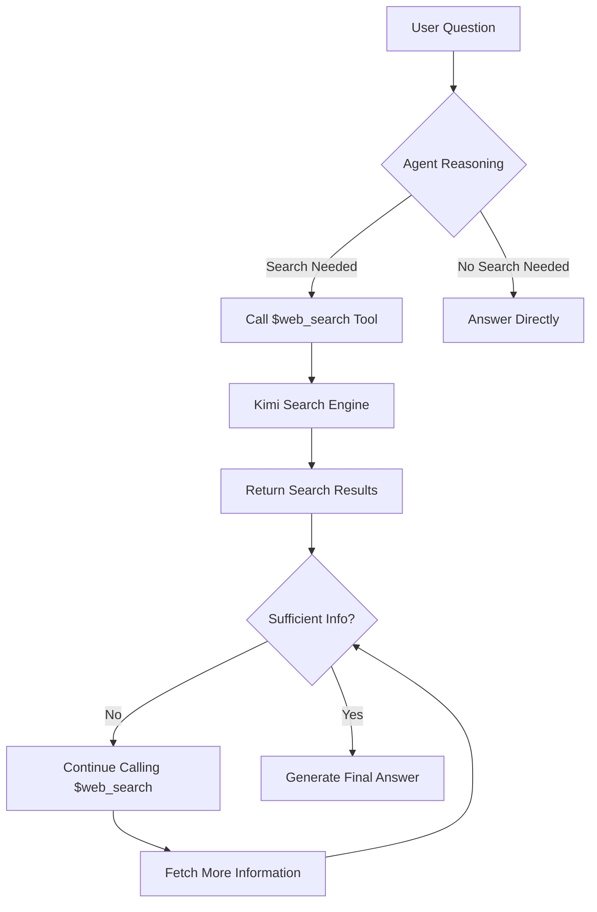

# Kimi Web Search Agent 🔍

A smart search Agent based on the Kimi API that understands user questions, automatically performs web searches, and summarizes answers.

## 📋 Project Overview

This project implements an autonomous AI Agent that leverages Kimi (Moonshot AI)'s built-in Web search tools (search and crawl) to:

- 🤔 **Intelligent Understanding**: Analyze user questions and identify key information needs
- 🔍 **Automatic Search**: Use Kimi's built-in $web_search tool to fetch real-time web information
- 🔄 **Iterative Search**: Call the search tool multiple times to gather more comprehensive information
- 📝 **Smart Summarization**: Synthesize information from multiple sources to generate accurate, thorough answers

## 🏗️ Architecture Design



## 🚀 Quick Start

### 1. Install Dependencies

```bash
pip install -r requirements.txt
```

### 2. Configure API Key

Obtain an API Key from the [Moonshot AI Platform](https://platform.moonshot.ai/), then set the environment variable:

```bash
export MOONSHOT_API_KEY='your-api-key-here'
```

Or create a `.env` file:

```env
MOONSHOT_API_KEY=your-api-key-here
```

**Note**: For backward compatibility, the system also supports the `KIMI_API_KEY` environment variable.

**General Fallback (OpenRouter)**: If neither `MOONSHOT_API_KEY` nor `KIMI_API_KEY` is set, but
`OPENROUTER_API_KEY` is set, requests will automatically be routed through OpenRouter using
`OPENROUTER_MODEL` (default `openai/gpt-5.6-luna`). **Important Limitation**: Kimi's built-in
`$web_search` tool is a Moonshot-specific capability and is unavailable on OpenRouter—therefore,
in fallback mode, the model answers based solely on its own knowledge, **without real-time web search**.
For true web search, use the Moonshot primary key.

### 3. Run the Agent

`main.py` provides a full command-line interface (Chinese help). View all parameters:

```bash
python main.py --help
```

| Parameter | Description | Default |
|-----------|-------------|---------|
| `query` | Question to ask (positional argument); omit to enter interactive mode | None |
| `--provider` | Search backend: `kimi` (calls built-in `$web_search`, requires API Key) / `offline-demo` (offline example trace) | `kimi` |
| `--model` | Model name | `kimi-k3` |
| `--max-steps` | Maximum ReAct iterations | `5` |
| `--base-url` | API base URL | `https://api.moonshot.cn/v1` |
| `--api-key` | Kimi API Key (reads environment variable by default) | Environment variable |
| `--output`, `-o` | Save question, ReAct trace, and answer as JSON | None |
| `--quiet` | Do not print ReAct trace in real time | Print |

**Offline Demo of ReAct Loop** (no API Key needed, replays example trace, visually demonstrates the "Think → Act → Observe" cycle):
```bash
python main.py --provider offline-demo
```

**Interactive Mode** (continuous conversation):
```bash
python main.py
```

**Single Question/Answer** (prints thought/action/observation trace step by step at runtime):
```bash
python main.py "Who won the 2024 Nobel Prize in Physics?"
python main.py "Bitcoin current price" --max-steps 3 --output result.json
```

**Quick Experience** (guided interaction):
```bash
python quickstart.py
```

**Advanced Examples**:
```bash
python examples.py
```

> 💡 At runtime, the **ReAct trace** is printed in real time: 💭 Thought → 🔧 Action (calling `$web_search`) → 👀 Observation (search results) → ✅ Final Answer, corresponding to the "Think → Act → Observe" loop covered in this chapter. `agent.get_trace()` retrieves the structured trace, and `--output` saves it as JSON.

## 📖 Usage Examples

### Basic Usage

```python
from agent import WebSearchAgent
from config import Config

# Create Agent
agent = WebSearchAgent(api_key=Config.get_api_key())

# Ask a question and get an answer
question = "What are the new features in Python 3.12?"
answer = agent.search_and_answer(question)
print(answer)
```

### Advanced Features

Run the advanced examples:

```bash
python examples.py
```

Includes the following features:
- 📦 **Batch Search**: Search multiple questions simultaneously
- 🎯 **Contextual Search**: Provide background information for more precise searches
- ⚖️ **Comparative Search**: Search and compare multiple items
- ✅ **Fact Check**: Verify the truthfulness of statements
- 📚 **Research Assistant**: Deep research on a topic

## 🛠️ Core Components

### `agent.py` - Core Agent Implementation
- `WebSearchAgent`: The main Agent class
- `search_and_answer()`: Main method that executes the ReAct loop and generates an answer
- `get_trace()`: Returns the structured ReAct trace from the last run (thought/action/observation/final answer)
- `_chat()`: Interacts with the Kimi API for conversation
- `_get_system_prompt()`: Gets the system prompt defining Agent behavior
- `_get_tools()`: Defines available tools ($web_search)
- `search_impl()`: Abstraction layer for search implementation, facilitating extension
- `format_trace_step()`: Renders a single trace step as readable text
- `run_offline_demo()`: Offline replay of example traces, demonstrating the ReAct loop without an API Key

### `config.py` - Configuration Management
- API configuration
- Model selection
- Search parameter settings

### `main.py` - Main Program Entry
- `build_parser()`: argparse command-line interface (Chinese help, see `--help`)
- `run_interactive_mode()`: Interactive conversation mode
- `run_single_question()`: Single question/answer mode
- Offline demo mode (`--provider offline-demo`) and JSON result output (`--output`)
- Session management

### `quickstart.py` - Quick Experience Script
- `demo_search()`: Demonstrates search functionality
- `interactive_mode()`: Simplified interactive mode
- Colorful output and user guidance
- API Key configuration check

### `examples.py` - Advanced Examples
- `AdvancedWebSearchAgent`: Agent class with extended functionality
- `batch_search()`: Batch process multiple questions
- `search_with_context()`: Search with context
- `comparative_search()`: Compare multiple items
- `fact_check()`: Fact verification functionality
- `example_research_assistant()`: Deep research example

## 🔧 Configuration Options

| Configuration Item | Description | Default |
|--------------------|-------------|---------|
| `MOONSHOT_API_KEY` | Moonshot AI API Key | Required |
| `KIMI_API_KEY` | Legacy API Key variable name (backward compatible) | Optional |
| `KIMI_BASE_URL` | API base URL | `https://api.moonshot.cn/v1` |
| `DEFAULT_MODEL` | Default model | `kimi-k3` |
| `MAX_SEARCH_ITERATIONS` | Maximum search iterations (set in Config) | 5 |
| `SEARCH_TIMEOUT` | Search timeout (seconds) | 30 |
| `temperature` | Controls creativity of generated content | 0.6 |

## 📊 Technical Features

### Core Technology
- **Kimi API**: Uses Moonshot AI's latest Kimi K3 model (kimi-k3, a reasoning model with native web search)
- **Built-in Tool Calling**: Leverages Kimi's `$web_search` built-in function
- **Iterative Search**: Supports multiple search rounds until sufficient information is obtained (up to 5 iterations)
- **Context Management**: Maintains complete conversation history, supporting continuous dialogue
- **Temperature Control**: Supports adjusting the creativity of generated content (temperature parameter)

### Advantages
- ✅ **Real-time Information**: Fetches the latest web information
- ✅ **Intelligent Understanding**: Understands user intent for precise searching
- ✅ **Structured Output**: Generates well-organized answers
- ✅ **Extensibility**: Easy to add new features and tools

## 📝 Development Plan

- [ ] Add asynchronous search support (using aiohttp)
- [ ] Implement search result caching mechanism
- [ ] Support more search backends (via search_impl extension)
- [ ] Support multilingual search
- [ ] Add search result quality scoring
- [ ] Implement search history recording
- [ ] Integrate retry mechanism (using tenacity)
- [ ] Optimize context management for long conversations

## 📄 License

MIT License

## 🔗 Related Links

- [Kimi API Documentation](https://platform.moonshot.ai/docs)
- [Web Search Tool Documentation](https://platform.moonshot.ai/docs/guide/use-web-search)
- [Moonshot AI Platform](https://platform.moonshot.ai/)

## ⚠️ Notes

1. **API Limits**: Please be aware of Kimi API call limits and quotas
2. **Search Quality**: Search result quality depends on Kimi's search capabilities
3. **Response Time**: Web searches may take some time; please be patient
4. **Content Accuracy**: The Agent strives to provide accurate information, but it is recommended to verify important information

## 💡 Usage Tips

1. **Be Specific**: Provide clear, specific questions for better answers
2. **Provide Context**: Offer background information when necessary to help the Agent understand
3. **Iterate**: If the answer is unsatisfactory, provide more details and ask again
4. **Set Expectations**: The Agent answers based on search results and may not be able to answer all questions

---

**Author**: AI Agent Practical Training Camp  
**Version**: 1.0.0  
**Updated**: 2024
