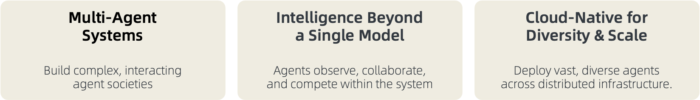
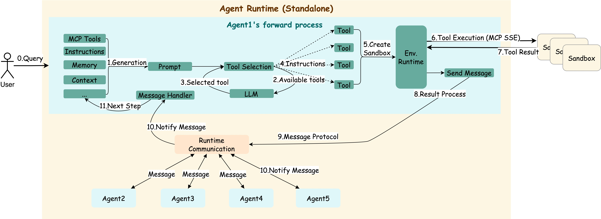
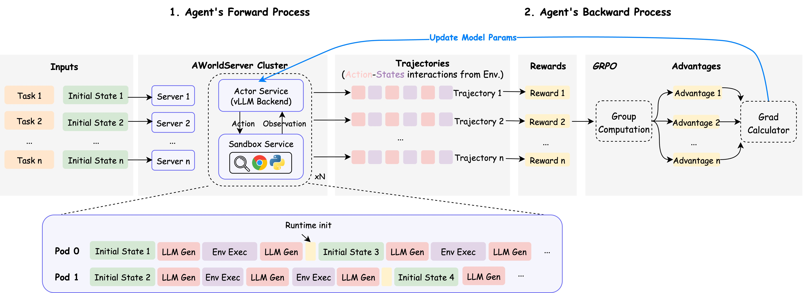
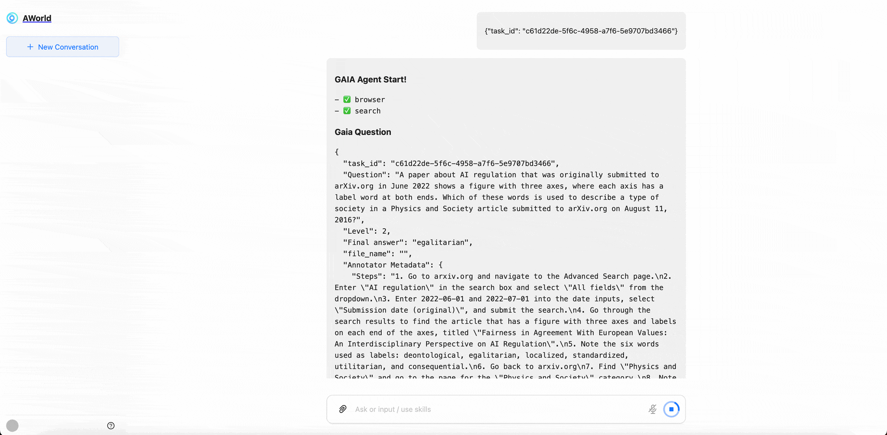

from examples.for_test import topology<div align="center">

# AWorld: A Diverse Runtime Environment for Agent Self-Evolution

</div>

<h4 align="center">

*"Self-awareness: The hardest problem isn't overcoming limitations, but discovering your own."*

[![Twitter Follow][twitter-image]][twitter-url]
[![WeChat QR Code][wechat-image]][wechat-url]
[![Discord][discord-image]][discord-url]
[![License: MIT][license-image]][license-url]
[![DeepWiki][deepwiki-image]][deepwiki-url]
[![arXiv][arxiv-image]][arxiv-url]
[![Tutorial][tutorial-image]][tutorial-url]
<!-- [![arXiv][arxiv-image]][arxiv-url] -->

</h4>

<h4 align="center">

[English](./README.md) |
[Quick Start](#quick-start) |
[Architecture Design](#architecture-design-principles) |
[Use Cases](#use-cases) |
[Contribution Guide](#contribution-guide) |
[Appendix](#appendix)

</h4>



**AWorld (Agent World)** is a next-generation framework designed for large-scale agent self-improvement. Through the features described above, we enable AI agents to continuously evolve by learning from knowledge and experience across diverse environments. With AWorld, you can:

1. **Build Workflows**: Design and implement automated task sequences [Docs](https://inclusionai.github.io/AWorld/Quickstart/workflow_construction/)

2. **Build Agents**: Create intelligent AI agents with MCP tools [Docs](https://inclusionai.github.io/AWorld/Quickstart/agent_construction/)

3. **Build Multi-Agent Systems (MAS)**: Orchestrate collaborative agent ecosystems [Docs](https://inclusionai.github.io/AWorld/Quickstart/multi-agent_system_construction/)

4. **Train Agents Efficiently**: Enable MAS to self-evolve and optimize across various environments

---
**Swarm Intelligence** 🚀

Showcasing state-of-the-art results of swarm intelligence across different domains. Welcome to join our ongoing projects!

| **Category** | **Achievement** | **Performance** | **Core Innovation** | **Date** |
|:-------------|:----------------|:----------------|:-------------------|:----------|
| **🤖 Agent** | **GAIA Benchmark Excellence** [![][GAIA]](https://huggingface.co/spaces/gaia-benchmark/leaderboard) | Pass@1: **67.89**, Pass@3: **83.49** (109 tasks) [![][Code]](./examples/gaia/README_GUARD.md)  | Multi-agent system stability and orchestration [![][Paper]](https://arxiv.org/abs/2508.09889) | 2025/08/06 |
| **🧠 Reasoning** | **IMO 2025 Problem Solving** [![][IMO]](https://www.imo-official.org/year_info.aspx?year=2025) | Solved 5/6 problems within 6 hours [![][Code]](examples/imo/README.md) | Multi-agent collaboration surpasses single model | 2025/07/25 |

<details>
<summary style="font-size: 1.2em;font-weight: bold;"> 🌏 View Ongoing Projects </summary>

| **Category** | **Achievement** | **Status** | **Expected Impact** |
|:-------------|:----------------|:-----------|:-------------------|
| **🖼️ Multimodal** | Leading OS/web interaction | In Progress | Visual reasoning and environment understanding |
| **💻 Programming** | Leading installation, coding, testing, debugging capabilities | In Progress | Automated software engineering capabilities |
| **🔧 Tool Use** | Leading multi-turn function calling | Coming Soon | Real-world impact |

</details>

---

**Self-Improvement, Beyond Swarm Intelligence** 🌱

`Agents` can operate in various `environments`, collect positive and negative `experiences`, and learn through `training`.

<table style="width: 100%; border-collapse: collapse; table-layout: fixed;">
  <thead>
    <tr>
      <th style="width: 20%; text-align: left; border-bottom: 2px solid #ddd; padding: 8px;">Agent</th>
      <th style="width: 20%; text-align: left; border-bottom: 2px solid #ddd; padding: 8px;">Environment</th>
      <th style="width: 20%; text-align: left; border-bottom: 2px solid #ddd; padding: 8px;">Experience</th>
      <th style="width: 25%; text-align: left; border-bottom: 2px solid #ddd; padding: 8px;">Training</th>
      <th style="width: 15%; text-align: left; border-bottom: 2px solid #ddd; padding: 8px;">Code</th>
    </tr>
  </thead>
  <tbody>
    <tr>
      <td style="padding: 8px; vertical-align: top;">GAIA Agent</td>
      <td style="padding: 8px; vertical-align: top;">
        Terminal, Code, Search, Playwright, and 4 additional tools
      </td>
      <td style="padding: 8px; vertical-align: top;">
        Collected from 165 samples in the GAIA validation dataset <br>
        <a href="https://huggingface.co/datasets/gaia-benchmark/GAIA/tree/main/2023/validation" target="_blank" style="text-decoration: none;">
          
        </a>
      </td>
      <td style="padding: 8px; vertical-align: top;">
        Rollout, reward computation, and gradient updates via GRPO
      </td>
      <td style="padding: 8px; vertical-align: top;">
        3 lines of code
         <br>
            <a href="./train/README_zh.md" target="_blank" style="text-decoration: none;">
            
        </a>
      </td>
    </tr>
  </tbody>
</table>

---

# Quick Start
## Prerequisites
> [!TIP]
> Python>=3.11
```bash
git clone https://github.com/inclusionAI/AWorld && cd AWorld

pip install .
```
## Hello World Example
We introduce the concepts of `Agent` and `Runners` to help you get started quickly.

For parallel task execution, please refer to the [Parallel Run Example](examples/parallel_run/README.md).

```python
from aworld.agents.llm_agent import Agent
from aworld.runner import Runners

summarizer = Agent(
    name="Summary Agent", 
    system_prompt="You specialize at summarizing.",
)

result = Runners.sync_run(
    input="Tell me a succinct history about the universe", 
    agent=summarizer,
)
```

We also introduce the `Swarm` concept for building agent teams.
```python
from aworld.agents.llm_agent import Agent
from aworld.runner import Runners
from aworld.core.agent.swarm import Swarm

researcher = Agent(
    name="Research Agent", 
    system_prompt="You specialize at researching.",
)
summarizer = Agent(
    name="Summary Agent", 
    system_prompt="You specialize at summarizing.",
)
# Create an agent group with a collaborative workflow (multi-agent)
group = Swarm(topology=[(researcher, summarizer)])

result = Runners.sync_run(
    input="Tell me a complete history about the universe", 
    swarm=group,
)
```

Finally, run your own agent or team
```bash
# Set LLM credentials
export LLM_MODEL_NAME="gpt-4"
export LLM_API_KEY="your-api-key-here"
export LLM_BASE_URL="https://api.openai.com/v1"

# Run
python /path/to/agents/or/teams
```

<details>
<summary style="font-size: 1.2em;font-weight: bold;"> 🌏 Click to view advanced usage </summary>

### Explicitly Passing AgentConfig
```python
from aworld.agents.llm_agent import Agent
from aworld.runner import Runners
from aworld.config.conf import AgentConfig
from aworld.core.agent.swarm import Swarm

gpt_conf = AgentConfig(
    llm_provider="openai",
    llm_model_name="gpt-4o",
    llm_api_key="<OPENAI_API_KEY>",
    llm_temperature=0.1,
)
openrouter_conf = AgentConfig(
    llm_provider="openai",
    llm_model_name="google/gemini-2.5-pro",
    llm_api_key="<OPENROUTER_API_KEY>",
    llm_base_url="https://openrouter.ai/api/v1"
    llm_temperature=0.1,
)

researcher = Agent(
    name="Research Agent", 
    conf=gpt_conf,
    system_prompt="You specialize at researching.",
)
summarizer = Agent(
    name="Summary Agent", 
    conf=openrouter_conf,
    system_prompt="You specialize at summarizing.",
)
# Create an agent group with a collaborative workflow (multi-agent)group = Swarm(topology=[(researcher, summarizer)])

result = Runners.sync_run(
    input="Tell me a complete history about the universe", 
    swarm=group,
)
```

### Agent Equipped with MCP Tools
```python
from aworld.agents.llm_agent import Agent
from aworld.runner import Runners

mcp_config = {
    "mcpServers": {
        "GorillaFileSystem": {
            "type": "stdio",
            "command": "python",
            "args": ["examples/BFCL/mcp_tools/gorilla_file_system.py"],
        },
    }
}

file_sys = Agent(
    name="file_sys_agent",
    system_prompt=(
        "You are a helpful agent to use "
        "the standard file system to perform file operations."
    ),
    mcp_servers=mcp_config.get("mcpServers", []).keys(),
    mcp_config=mcp_config,
)

result = Runners.sync_run(
    input=(
        "use mcp tools in the GorillaFileSystem server "
        "to perform file operations: "
        "write the content 'AWorld' into "
        "the hello_world.py file with a new line "
        "and keep the original content of the file. "
        "Make sure the new and old "
        "content are all in the file; "
        "and display the content of the file"
    ),
    agent=file_sys,
)
```

### Agent with Integrated Memory
It is recommended to use `MemoryFactory` to initialize and access Memory instances.

```python
from aworld.memory.main import MemoryFactory
from aworld.core.memory import MemoryConfig, MemoryLLMConfig

# Simple initialization
memory = MemoryFactory.instance()

# Initialize with LLM configuration
MemoryFactory.init(
    config=MemoryConfig(
        provider="aworld",
        llm_config=MemoryLLMConfig(
            provider="openai",
            model_name=os.environ["LLM_MODEL_NAME"],
            api_key=os.environ["LLM_API_KEY"],
            base_url=os.environ["LLM_BASE_URL"]
        )
    )
)
memory = MemoryFactory.instance()
```

`MemoryConfig` allows you to integrate different embedding models and vector databases.
```python
import os

from aworld.core.memory import MemoryConfig, MemoryLLMConfig, EmbeddingsConfig, VectorDBConfig

MemoryFactory.init(
    config=MemoryConfig(
        provider="aworld",
        llm_config=MemoryLLMConfig(
            provider="openai",
            model_name=os.environ["LLM_MODEL_NAME"],
            api_key=os.environ["LLM_API_KEY"],
            base_url=os.environ["LLM_BASE_URL"]
        ),
        embedding_config=EmbeddingsConfig(
            provider="ollama", # or huggingface, openai, etc.
            base_url="http://localhost:11434",
            model_name="nomic-embed-text"
        ),
        vector_store_config=VectorDBConfig(
            provider="chroma",
            config={
                "chroma_data_path": "./chroma_db",
                "collection_name": "aworld",
            }
        )
    )
)
```

### Multi-Agent System
We demonstrate a classic topology: `Leader-Executor`.
```python
"""
Leader-Executor Topology:
 ┌───── plan ───┐     
exec1         exec2

Each agent communicates with a single supervisory agent,
commonly known as the Leader-Executor topology,
also referred to as the Team topology in AWorld.
We can use this topology to implement ReAct and Plan-Execute paradigms.
"""
from aworld.agents.llm_agent import Agent
from aworld.core.agent.swarm import Swarm, GraphBuildType

plan = Agent(name="plan", conf=agent_conf)
exec1 = Agent(name="exec1", conf=agent_conf)
exec2 = Agent(name="exec2", conf=agent_conf)
swarm = Swarm(topology=[(plan, exec1), (plan, exec2)], build_type=GraphBuildType.TEAM)
```

</details>

# Architecture Design Principles
<!-- AWorld is a versatile multi-agent framework designed to facilitate collaborative interactions and self-improvement among agents.  -->

AWorld provides a comprehensive environment that supports diverse applications such as `product prototype validation`, `foundation model training`, and the design of `multi-agent systems (MAS)` through meta-learning.

The framework is designed to be highly adaptable, enabling researchers and developers to explore and innovate across multiple domains, thereby advancing the capabilities and applications of multi-agent systems.

## Concepts and Framework
| Concept | Description |
| :-------------------------------------- | ------------ |
| [`agent`](./aworld/core/agent/base.py)  | Defines base classes, descriptions, output parsing, and multi-agent collaboration (swarm) logic for defining, managing, and orchestrating agents within the AWorld system. |
| [`runner`](./aworld/runners)            | Contains runner classes that manage the agent execution loop within an environment, handling episode replay and parallel training/evaluation workflows.   |
| [`task`](./aworld/core/task.py)         | Defines the base Task class that encapsulates environment goals, necessary tools, and termination conditions for agent interaction.  |
| [`swarm`](./aworld/core/agent/swarm.py) | Implements the SwarmAgent class that manages multi-agent coordination and emergent behavior through decentralized strategies. |
| [`sandbox`](./aworld/sandbox)           | Provides a controlled runtime with configurable scenarios for rapid prototyping and validation of agent behavior. |
| [`tools`](./aworld/tools)               | Offers a flexible framework for tool definition, adaptation, and execution in agent-environment interactions within the AWorld system. |
| [`context`](./aworld/core/context)      | Provides a comprehensive context management system for AWorld agents, supporting full state tracking, configuration management, prompt optimization, multi-task state handling, and dynamic prompt templates throughout the agent lifecycle.  |
| [`memory`](./aworld/memory)             | Implements a scalable memory system for agents, supporting short-term and long-term memory, summarization, retrieval, embedding, and integration.|
| [`trace`](./aworld/trace)               | Provides an observable tracing framework for AWorld, supporting distributed tracing, context propagation, span management, and integration with popular frameworks and protocols to monitor and analyze agent, tool, and task execution.|

> 💡 Check the [examples](./examples/) directory to explore diverse AWorld applications.


## Features
| Agent Building         | Topology Orchestration      | Environment                    |
|:---------------------------|:----------------------------|:-------------------------------|
| ✅ Integrated MCP Services | ✅ Encapsulated Runtime  | ✅ Runtime State Management  |
| ✅ Multi-Model Providers   | ✅ Flexible MAS Patterns | ✅ High Concurrency Support  |
| ✅ Customization Options   | ✅ Clear State Tracking   | ✅ Distributed Training      |


## Forward Process


Here is the forward instruction for collecting BFCL forward trajectories: [`Tutorial`](./examples/BFCL/README.md).


## Reverse Process

> During training, **AWorld's distributed environment** is used for action-state replay demonstrations.



Here are instructions for training using AWorld with various frameworks (such as AReal, Verl, and Swift). [`Tutorial`](./train/README.md).

# 🧩 Technical Report
This section showcases research papers developed using AWorld, demonstrating its ability to incubate cutting-edge multi-agent systems that advance the development of Artificial General Intelligence (AGI).

#### Multi-Agent System (MAS) Meta-Learning

1. **Profile-Aware Maneuvering: A Dynamic Multi-Agent System for Robust GAIA Problem Solving by AWorld.** arxiv, 2025. [Paper](https://arxiv.org/abs/2508.09889), [Code](https://github.com/inclusionAI/AWorld/blob/main/examples/gaia/README_GUARD.md)

    *Zhitian Xie, Qintong Wu, Chengyue Yu, Chenyi Zhuang, Jinjie Gu*

#### Model Training

1. **AWorld: Orchestrating the Training Recipe for Agentic AI.** arxiv, 2025. [Paper](https://arxiv.org/abs/2508.20404), [Code](https://github.com/inclusionAI/AWorld/tree/main/train), [Model](https://huggingface.co/inclusionAI/Qwen3-32B-AWorld)

    *Chengyue Yu, Siyuan Lu, Chenyi Zhuang, Dong Wang, Qintong Wu, etc.*

2. **FunReason: Enhancing Large Language Models' Function Calling via Self-Refinement Multiscale Loss and Automated Data Refinement.** arxiv, 2025. [Paper](https://arxiv.org/abs/2505.20192), [Model](https://huggingface.co/Bingguang/FunReason)    *Bingguang Hao, Maolin Wang, Zengzhuang Xu, Cunyin Peng, etc.*

3. **Exploring Superior Function Calls via Reinforcement Learning.** arxiv, 2025. [Paper](https://arxiv.org/abs/2508.05118), [Code](https://github.com/BingguangHao/RLFC)

    *Bingguang Hao, Maolin Wang, Zengzhuang Xu, Yicheng Chen, etc.*

4. **RAG-R1 : Incentivize the Search and Reasoning Capabilities of LLMs through Multi-query Parallelism.** arxiv, 2025. [Paper](https://arxiv.org/abs/2507.02962), [Code](https://github.com/inclusionAI/AgenticLearning), [Model](https://huggingface.co/collections/endertzw/rag-r1-68481d7694b3fca8b809aa29)

    *Zhiwen Tan, Jiaming Huang, Qintong Wu, Hongxuan Zhang, Chenyi Zhuang, Jinjie Gu*

5. **V2P: From Background Suppression to Center Peaking for Robust GUI Grounding Task.** arxiv, 2025. [Paper](https://arxiv.org/abs/2508.13634), [Code](https://github.com/inclusionAI/AgenticLearning/tree/main/V2P)

    *Jikai Chen, Long Chen, Dong Wang, Leilei Gan, Chenyi Zhuang, Jinjie Gu*

# Contribution Guide
We warmly welcome developers to join us in building and improving AWorld! Whether you are interested in enhancing the framework, fixing bugs, or adding new features, your contributions are valuable to us.

For academic citations or to contact us, please use the following BibTeX entry:

```bibtex
@misc{yu2025aworldorchestratingtrainingrecipe,
      title={AWorld: Orchestrating the Training Recipe for Agentic AI}, 
      author={Chengyue Yu and Siyuan Lu and Chenyi Zhuang and Dong Wang and Qintong Wu and Zongyue Li and Runsheng Gan and Chunfeng Wang and Siqi Hou and Gaochi Huang and Wenlong Yan and Lifeng Hong and Aohui Xue and Yanfeng Wang and Jinjie Gu and David Tsai and Tao Lin},
      year={2025},
      eprint={2508.20404},
      archivePrefix={arXiv},
      primaryClass={cs.AI},
      url={https://arxiv.org/abs/2508.20404}, 
}
```

# Star History


# Appendix
Web Client Usage


Your project structure should look like this:
```text
agent-project-root-dir/
    agent_deploy/
      my_first_agent/
        __init__.py
        agent.py
```

Create the project folder.

```shell
mkdir my-aworld-project && cd my-aworld-project # project-root-dir
mkdir -p agent_deploy/my_first_agent
```

#### Step 1: Define Your Agent

Create your first agent in `agent_deploy/my_first_agent`:

`__init__.py`: Create an empty `__init__.py` file.

```shell
cd agent_deploy/my_first_agent
touch __init__.py
```

`agent.py`: Define your agent logic:

```python
import logging
import os
from aworld.cmd.data_model import BaseAWorldAgent, ChatCompletionRequest
from aworld.config.conf import AgentConfig, TaskConfig
from aworld.agents.llm_agent import Agent
from aworld.core.task import Task
from aworld.runner import Runners

logger = logging.getLogger(__name__)

class AWorldAgent(BaseAWorldAgent):
    def __init__(self, *args, **kwargs):
        super().__init__(*args, **kwargs)

    def name(self):
        return "My First Agent"

    def description(self):
        return "A helpful assistant that can answer questions and help with tasks"

    async def run(self, prompt: str = None, request: ChatCompletionRequest = None):
        # Load LLM configuration from environment variables
        agent_config = AgentConfig(
            llm_provider=os.getenv("LLM_PROVIDER", "openai"),
            llm_model_name=os.getenv("LLM_MODEL_NAME", "gpt-4"),
            llm_api_key=os.getenv("LLM_API_KEY"),
            llm_base_url=os.getenv("LLM_BASE_URL"),
            llm_temperature=float(os.getenv("LLM_TEMPERATURE", "0.7"))
        )

        # Validate required configuration
        if not agent_config.llm_model_name or not agent_config.llm_api_key:
            raise ValueError("LLM_MODEL_NAME and LLM_API_KEY must be set!")

        # Optional: Configure MCP tools for enhanced capabilities
        mcp_config = {
            "mcpServers": {
                "amap-mcp": {
                    "type": "sse",
                    "url": "https://mcp.example.com/sse?key=YOUR_API_KEY", # Replace Your API Key
                    "timeout": 30,
                    "sse_read_timeout": 300
                }
            }
        }

        # Create the agent instance
        agent = Agent(
            conf=agent_config,
            name="My First Agent",
            system_prompt="""You are a helpful AI assistant. Your goal is to:
            - Answer questions accurately and helpfully
            - Provide clear, step-by-step guidance when needed
            - Be friendly and professional in your responses""",
            mcp_servers=["amap-mcp"],
            mcp_config=mcp_config
        )

        # Extract user input
        user_input = prompt or (request.messages[-1].content if request else "")
        
        # Create and execute task
        task = Task(
            input=user_input,
            agent=agent,
            conf=TaskConfig(max_steps=5),
            session_id=getattr(request, 'session_id', None)
        )

        # Stream the agent's response
        async for output in Runners.streamed_run_task(task).stream_events():
            yield output
```

#### Step 2: Run the Agent

Set environment variables:

```shell
# Navigate back to the project root directory
cd ${agent-project-root-dir}

# Set your LLM credentials
export LLM_MODEL_NAME="gpt-4"
export LLM_API_KEY="your-api-key-here"
export LLM_BASE_URL="https://api.openai.com/v1"  # Optional for OpenAI
```

Start your agent:
```shell
# Option 1: Start with Web UI
aworld web
# Then open http://localhost:8000 in your browser

# Option 2: Start REST API (for integration)
aworld api
# Then visit http://localhost:8000/docs to view the API documentation
```

Success! Your agent is now running and ready to chat!

---
<!-- resource section start -->
<!-- image links -->
[arxiv-image]: https://img.shields.io/badge/Paper-arXiv-B31B1B?style=for-the-badge&logo=arxiv&logoColor=white
[blog-image]: https://img.shields.io/badge/Blog-Coming%20Soon-FF5722?style=for-the-badge&logo=blogger&logoColor=white
[deepwiki-image]: https://img.shields.io/badge/DeepWiki-Explore-blueviolet?style=for-the-badge&logo=wikipedia&logoColor=white
[discord-image]: https://img.shields.io/badge/Discord-Join%20us-blue?style=for-the-badge&logo=discord&logoColor=white
[github-code-image]: https://img.shields.io/badge/Code-GitHub-181717?style=for-the-badge&logo=github&logoColor=white[huggingface-dataset-image]: https://img.shields.io/badge/Dataset-Coming%20Soon-007ACC?style=for-the-badge&logo=dataset&logoColor=white
[huggingface-model-image]: https://img.shields.io/badge/Model-Hugging%20Face-FF6B6B?style=for-the-badge&logo=huggingface&logoColor=white
[license-image]: https://img.shields.io/badge/License-MIT-yellow?style=for-the-badge
[twitter-image]: https://img.shields.io/badge/Twitter-Follow%20us-1DA1F2?style=for-the-badge&logo=twitter&logoColor=white
[wechat-image]: https://img.shields.io/badge/WeChat-Add%20us-green?style=for-the-badge&logo=wechat&logoColor=white
[tutorial-image]: https://img.shields.io/badge/Tutorial-Get%20Started-FF6B35?style=for-the-badge&logo=book&logoColor=white


<!-- aworld links -->
[deepwiki-url]: https://deepwiki.com/inclusionAI/AWorld
[discord-url]: https://discord.gg/b4Asj2ynMw
[license-url]: https://opensource.org/licenses/MIT
[twitter-url]: https://x.com/InclusionAI666
[wechat-url]: https://raw.githubusercontent.com/inclusionAI/AWorld/main/readme_assets/aworld_wechat.png
[arxiv-url]: https://arxiv.org/abs/2508.20404
[tutorial-url]: https://inclusionai.github.io/AWorld/

<!-- funreason links -->
[funreason-code-url]: https://github.com/BingguangHao/FunReason
[funreason-model-url]: https://huggingface.co/Bingguang/FunReason
[funreason-paper-url]: https://arxiv.org/pdf/2505.20192
<!-- [funreason-dataset-url]: https://github.com/BingguangHao/FunReason -->
<!-- [funreason-blog-url]: https://github.com/BingguangHao/FunReason -->

<!-- deepsearch links -->
[deepsearch-code-url]: https://github.com/inclusionAI/AgenticLearning
[deepsearch-dataset-url]: https://github.com/inclusionAI/AgenticLearning
[deepsearch-model-url]: https://huggingface.co/collections/endertzw/rag-r1-68481d7694b3fca8b809aa29
[deepsearch-paper-url]: https://arxiv.org/abs/2507.02962

<!-- badge -->
[MAS]: https://img.shields.io/badge/Mutli--Agent-System-EEE1CE
[IMO]: https://img.shields.io/badge/IMO-299D8F
[BFCL]: https://img.shields.io/badge/BFCL-8AB07D
[GAIA]: https://img.shields.io/badge/GAIA-E66F51
[Runtime]: https://img.shields.io/badge/AWorld-Runtime-287271
[Leaderboard]: https://img.shields.io/badge/Leaderboard-FFE6B7
[Benchmark]: https://img.shields.io/badge/Benchmark-FFE6B7
[Cloud-Native]: https://img.shields.io/badge/Cloud--Native-B19CD7
[Code]: https://img.shields.io/badge/Code-FF6B6B
[Paper]: https://img.shields.io/badge/Paper-4ECDC4


<!-- resource section end -->
