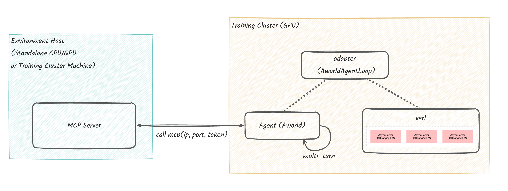

<div align="center">

# AWorld Train

*Provides a framework-agnostic adapter layer, runnable examples, and common utilities for connecting agents built with AWorld to external RL/training frameworks*

[![License: MIT][license-image]][license-url]

</div>

---

AWorld Train serves as a bridge between the AWorld agent ecosystem and various external training frameworks (such as reinforcement learning libraries). It is designed to be framework-agnostic, allowing you to use AWorld agents with your preferred training environment.

The diagram below illustrates the overall architecture and interaction between the environment and the training cluster:




## Environment Setup

First, you need to set up the environment where the agent tools will run.

Choose a machine (it can also be the training machine).

Recommended machine specifications:
- For capacity planning, allocate approximately **2C4G** per concurrent worker process.
- Example: For 8 concurrent workers, plan for **~16C32G**.

```bash
# Clone the AWorld repository
git clone git@github.com:inclusionAI/AWorld.git
cd /path/to/AWorld
cp ./env/gaia-mcp-server/mcp_servers/.env_template ./env/gaia-mcp-server/mcp_servers/.env
```
Edit `./env/gaia-mcp-server/mcp_servers/.env` to configure tokens for any tools that require authentication.

```.env
JINA_API_KEY=<YOUR_JINA_API_KEY>
TAVILY_API_KEY=<YOUR_TAVILY_API_KEY>
GOOGLE_API_KEY=<YOUR_GOOGLE_API_KEY>
GOOGLE_CSE_ID=<YOUR_GOOGLE_CSE_ID>
DATALAB_API_KEY=<YOUR_DATALAB_API_KEY>
E2B_API_KEY=<YOUR_E2B_API_KEY>

MCP_LLM_BASE_URL=<YOUR_MCP_LLM_BASE_URL>
MCP_LLM_MODEL_NAME=<YOUR_MCP_LLM_MODEL_NAME>
MCP_LLM_API_KEY=<YOUR_MCP_LLM_API_KEY>

BROWSERUSE_LLM_BASE_URL=${MCP_LLM_BASE_URL}
BROWSERUSE_LLM_MODEL_NAME=${MCP_LLM_MODEL_NAME}
BROWSERUSE_LLM_API_KEY=${MCP_LLM_API_KEY}
CODE_LLM_BASE_URL=${MCP_LLM_BASE_URL}
CODE_LLM_MODEL_NAME=${MCP_LLM_MODEL_NAME}
CODE_LLM_API_KEY=${MCP_LLM_API_KEY}
THINK_LLM_BASE_URL=${MCP_LLM_BASE_URL}
THINK_LLM_MODEL_NAME=${MCP_LLM_MODEL_NAME}
THINK_LLM_API_KEY=${MCP_LLM_API_KEY}
GUARD_LLM_BASE_URL=${MCP_LLM_BASE_URL}
GUARD_LLM_MODEL_NAME=${MCP_LLM_MODEL_NAME}
GUARD_LLM_API_KEY=${MCP_LLM_API_KEY}
AUDIO_LLM_BASE_URL=${MCP_LLM_BASE_URL}
AUDIO_LLM_MODEL_NAME=${MCP_LLM_MODEL_NAME}
AUDIO_LLM_API_KEY=${MCP_LLM_API_KEY}
IMAGE_LLM_BASE_URL=${MCP_LLM_BASE_URL}
IMAGE_LLM_MODEL_NAME=${MCP_LLM_MODEL_NAME}
IMAGE_LLM_API_KEY=${MCP_LLM_API_KEY}
VIDEO_LLM_BASE_URL=${MCP_LLM_BASE_URL}
VIDEO_LLM_MODEL_NAME=${MCP_LLM_MODEL_NAME}
VIDEO_LLM_API_KEY=${MCP_LLM_API_KEY}
```

Next, run the startup script to launch the MCP server locally:

```bash
cd /path/to/Aworld
# The --docker_dir parameter specifies the Docker directory corresponding to the env to be built
# e.g., --docker_dir=gaia-mcp-server
python -m env.train_env --docker_dir=gaia-mcp-server
```

Once the MCP server starts successfully, it will output connection details:
```bash
  {
      "ip": "1xx.1xx.x.xx",
      "port": 8000,
      "token": "eyJhbGciOi...rYmQ"
  }
```
You will need the `ip`, `port`, and `token` from this output to configure the agent on the training machine in the next step.

For instructions on deploying the environment on Kubernetes, refer to [`../env/README.md`](../env/README.md).

## Training Cluster Setup

### 1. Create an Agent or Agent Swarm
Now, on the training cluster machine, you must make the MCP service credentials available to your agent. Use the `ip`, `port`, and `token` from the [Environment Setup](#environment-setup) section and export them as environment variables or add them to a `.env` file:
```bash
# Export as environment variables
# Replace <ip>, <port>, and <token> with the ip, port, and token from the environment setup
export MCP_SERVER_URL=http://<ip>:<port>/mcp
export MCP_SERVER_TOKEN=<token>

# Or add them to a .env file
# echo "MCP_SERVER_URL=http://<ip>:<port>/mcp" >> .env
# echo "MCP_SERVER_TOKEN=<token>" >> .env
```

Then install `aworld` and the reinforcement learning framework:

```bash
# Python>=3.10 is recommended.

# Install AWorld
pip install aworld

# Install framework-specific dependencies (using VeRL as an example)
pip install verl==0.5.0
```

With the connection details configured, you can define your agent within the chosen training framework. For VeRL, this is done by implementing a custom `AgentLoop`.

For example, `GaiaAgentLoop` inherits from `AworldAgentLoop` and implements the `build_agents` method.

```python
from aworld.agents.llm_agent import Agent
from aworld.config import AgentConfig

from train.adapter.verl.aworld_agent_loop import AworldAgentLoop
from train.adapter.verl.common import get_agent_tool_env_and_servers

class GaiaAgentLoop(AworldAgentLoop):
    def build_agents(self):
        # Get environment configuration and server details.
        # Note: The MCP server must be running (environment setup), and
        # the MCP_SERVER_URL/MCP_SERVER_TOKEN environment variables must be set.
        gaia_env_config, gaia_env_servers = get_agent_tool_env_and_servers()

        return Agent(
            conf=AgentConfig(
                # Get the dynamic LLM service address from the service manager.
                # The LLM service is started within VeRL.
                llm_base_url=self.get_llm_server_address(),
                llm_model_name=self.get_llm_server_model_name(),
            ),
            name="gaia_super_agent",
            system_prompt="Your system prompt",

            # Agent's MCP tool configuration
            mcp_config=gaia_env_config,
            mcp_servers=gaia_env_servers,
        )
```

### 2. Run Training
Before running training, specify your custom `AgentLoop` in `agent.yaml`:

```yaml
# In agent.yaml
- name: gaia_agent
  _target_: train.examples.train_gaia_with_aworld_verl.custom_agent_loop.GaiaAgentLoop
```

Finally, run the training script. This script is typically a `run.sh` file based on the VeRL example.
```bash
bash run.sh
```
This script handles the AgentLoop orchestrated by VeRL, the reward calculation function, and the training workflow.
For parameter settings in `run.sh`, refer to the [VeRL documentation](https://verl.readthedocs.io/en/latest/examples/config.html).

A complete, runnable example, including a customized `run.sh` script for `GaiaAgentLoop`, can be found in [`./examples/train_gaia_with_aworld_verl/`](./examples/train_gaia_with_aworld_verl/).

## Advanced Tutorial

### How to Create a Complex Multi-Agent Swarm
Beyond a single agent, you can also train a multi-agent swarm. Simply have your `build_agents` method (or equivalent setup function) return a `Swarm` object instead of a single `Agent` object. AWorld and the training adapter will handle the rest.

```python
# In your custom AgentLoop
def build_agents(self, ...) -> Union[Agent, Swarm]:
    # ... create multiple agents
    agent_to_be_train = Agent(
      conf=AgentConfig(
          # For the agent to be trained, llm_base_url and llm_model_name are obtained from the service started by VeRL
          llm_base_url=self.get_llm_server_address(),
          llm_model_name=self.get_llm_server_model_name(),
      ),
    )

    plan_agent = Agent(
      conf=AgentConfig(
          # Provide a ready-to-use OpenAI-compatible LLM service address, model name, and api_key
          llm_base_url="",
          llm_model_name="",
          llm_api_key=""
      ),
    )
    
    exe_agent = Agent(
      conf=AgentConfig(
          # Provide a ready-to-use OpenAI-compatible LLM service address, model name, and api_key
          llm_base_url="",
          llm_model_name="",
          llm_api_key=""
      ),
    )
    
    sum_agent = Agent(
      conf=AgentConfig(
          # Provide a ready-to-use OpenAI-compatible LLM service address, model name, and api_key
          llm_base_url="",
          llm_model_name="",
          llm_api_key=""
      ),
    )

    # Return a Swarm composed of the agents defined above
    return Swarm(
        agent_to_be_train, plan_agent, exe_agent, sum_agent,
        # ... other Swarm configurations
    )
```

### How to Integrate Other Training Frameworks
AWorld Train is designed to be extensible. To add support for a new training framework (e.g., "Swift"), you typically need to:

1.  **Create a New Adapter**: Inside the `train/adapter/` directory, create a new folder for your framework (e.g., `swift/`).
2.  **Implement Core Logic**: Create a main class (e.g., `AworldAgentTrainer`) that inherits from a base class of the target framework. This class will be responsible for:
    *   Receiving tasks or observations from the framework's environment.    *   Run the AWorld agent (`Runners.sync_run(input=input, agent=agent)`) to obtain an action.
    *   Return the agent's response to the framework.
    *   Process rewards and updates.
3.  **Create an Example**: Add a new example in the `train/examples/` directory to demonstrate how to use the new adapter.

You can refer to the existing `verl` adapter (`train/adapter/verl/`) as a reference implementation.

---

<div align="center">

**AWorld Train** — Quickly integrate your AWorld agent with mainstream training frameworks

[license-image]: https://img.shields.io/badge/License-MIT-yellow.svg
[license-url]: https://opensource.org/licenses/MIT

</div>
